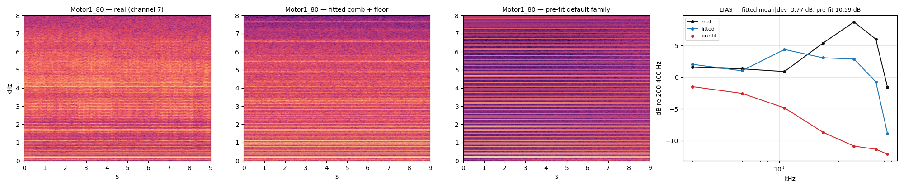
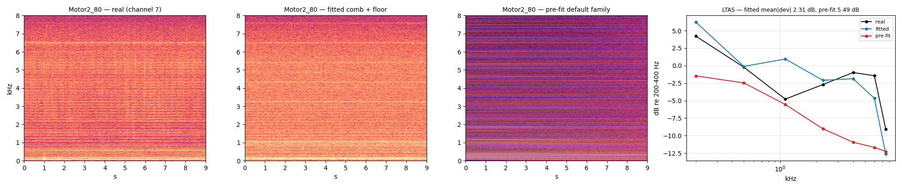
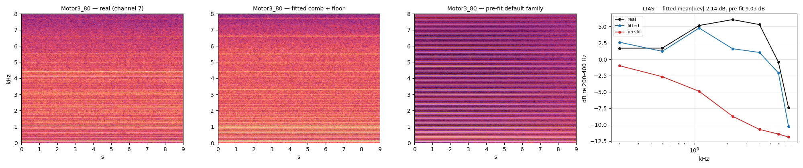
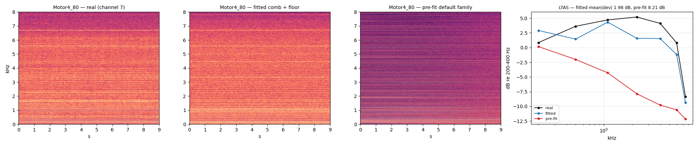
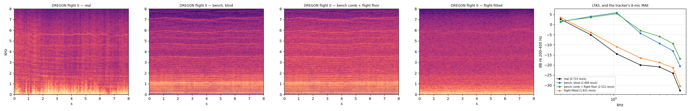

```{python}
import json
from pathlib import Path

import numpy as np
import pandas as pd

ROOT = Path.cwd()
while not (ROOT / "results").exists() and ROOT != ROOT.parent:
    ROOT = ROOT.parent
RES = ROOT / "results" / "S1"


def load(name):
    p = RES / name
    return json.loads(p.read_text()) if p.exists() else None


cell = load("cell_coherence.json")
cell30 = load("cell_coherence_b30.json")
twocomp = load("two_component.json")
```

::: {.callout-note}
## Who this is for

This page is written in Simplified Technical English. Sentences are short. Each
sentence gives one fact. Every formula has a derivation. Every number comes from
a file in `results/S1/`.
:::

# 1. The task

We have one rotor on a test bench. The rotor turns at a fixed setpoint. The
recording is 9 seconds long. We use one microphone channel (channel 7). We use
the native 44.1 kHz audio and we decimate it to 16 kHz.

We want a **generative model**. A generative model can produce new audio. The new
audio must have the same statistics as the real audio.

We do not want a decomposition. A decomposition only splits one recording into
parts. It cannot make new recordings.

# 2. The model

The model describes the **expected periodogram**. The periodogram is the squared
magnitude of the short-time Fourier transform (STFT).

For microphone $m$, frame $n$, and frequency $f$:

$$
M_m(f,n)\;=\;\underbrace{W*\Big[F(f,n)+\sum_r g_{mr}\!\sum_{k=1}^{K}\big(1-w_k\big)P_{rk}(n)\,L\big(f-kc_r(n);\gamma_{rk}\big)\Big]}_{\text{stochastic: floor + Lorentzian pedestals}}
\;+\;\underbrace{\sum_r g_{mr}\!\sum_{k=1}^{K} w_k\,P_{rk}(n)\,\big|W\big(f-kc_r(n)\big)\big|^{2}}_{\text{deterministic: coherent tones}}
$$

The symbols mean this:

- $c_r(n)$ is the rotor speed in revolutions per second. It is known from the label.
- $k$ is the harmonic order. Order $k$ sits at frequency $k\,c_r$.
- $P_{rk}$ is the total power of one line. It follows a speed law:
  $P_{rk} = 10^{(A_{rk} + h_{rk})/10}\,(c_r/80)^{q}$.
- $A_{rk}$ is the line profile in decibels. It is the main fitted vector.
- $w_k$ is the **coherent fraction** of that power. See §4.2 and §5.
- $L$ is a Lorentzian density with unit area and half width $\gamma_{rk}$.
- $\gamma_{rk} = \gamma_0 + \text{slope}\cdot k$ is the pedestal half width in hertz.
- $|W|^2$ is the analysis window's own power response. It carries no width
  parameter, because a pure tone has no width of its own.
- $F$ is the floor. It is a smooth curve in $\log f$ with 14 knots, plus a tilt,
  plus a level. The level also follows a speed law.
- $g_{mr}$ is the gain of microphone $m$ for rotor $r$.
- $W*$ is the window smearing. It applies to the stochastic part only. The
  coherent part is not smeared, because its shape already **is** the smearing.

## 2.1 Each line has two components at the same time

This is the part that changed today, so it is stated plainly.

Every order $k$ of every rotor carries **one** power $P_{rk}$, and that power is
split between **two components at the same frequency**:

| | share | shape | statistics of one bin |
|---|---|---|---|
| **coherent tone** | $w_k$ | $\big|W(f-kc_r)\big|^{2}$, no free width | deterministic; CV 0 |
| **stochastic pedestal** | $1-w_k$ | Lorentzian, half width $\gamma_{rk}$ | circular Gaussian; power exponential, CV 1 |

So the answer to "does the fitted model hold both a Lorentzian stochastic part
and a deterministic pure tone?" is **yes, and it holds both for every single
order**, with one fitted number setting the ratio:

$$
w_k = \exp\!\big(-(k/k_{1/2})^2\big).
$$

$k_{1/2}$ is the only new parameter. On Motor1_80 the fit returns
$k_{1/2}=14.9$. So order 1 is 100 % tone, order 15 is about half tone and half
noise, and order 40 is pure noise. The two limits recover the old models
exactly: $k_{1/2}\to\infty$ is a comb of pure tones, and $k_{1/2}\to 0$ is the
all-Rayleigh comb the plain Whittle likelihood assumed.

The flags that turn this on are `fit_coherence` and `needle_window_shape` in
`Spec`, and both are now set in `stage1_bayes.BENCH_VARIANT`.

**The renderer holds the same two components.** `synthesize` with
`line_mode="fm"` sends the share $w_k$ of each order through the tone bank (a
real oscillator on the shared shaft phase, so it is a true tone) and the share
$1-w_k$ through the noise path, added to the floor spectrum before the
overlap-add filter. The parameter is `StochasticParams.coherence_k_half`, and
`stage1_bayes.params_from_export` copies the fitted value into it. So what we
fit is what we render.

On the bench we switch off all dynamics. The rotor speed is constant. So the
drift terms are zero: `gp_std_db=0`, `floor_gp_std_db=0`, `floor_tilt_gp_std=0`,
`umod_std_db=0`.

This is the same model that we use to sample training noise. The fitted vector
maps one-to-one onto `StochasticParams` in
`src/data_processing/stochastic_rotor_noise.py`.

# 3. The likelihood

## 3.1 One bin of noise

Let $x(t)$ be a stationary Gaussian process. Take one STFT frame. The Fourier
coefficient is a weighted sum of many samples. By the central limit theorem the
coefficient is complex Gaussian. Its real part and imaginary part are
independent. Each has variance $M/2$, where $M$ is the expected power.

Write $X = a + ib$. Then

$$
p(a,b) = \frac{1}{\pi M}\exp\!\Big(-\frac{a^2+b^2}{M}\Big).
$$

Change to the power $I = a^2 + b^2$. The area element gives
$\mathrm{d}a\,\mathrm{d}b = \pi\,\mathrm{d}I$ after the angle is integrated out.
So

$$
p(I) = \frac{1}{M}\,e^{-I/M},\qquad I \ge 0 .
$$

The bin power is **exponential**. Its mean is $M$. Its standard deviation is also
$M$. So its coefficient of variation (CV) is exactly 1.

The negative log density of one bin is

$$
-\log p(I) = \frac{I}{M} + \log M .
$$

Summing over all bins and frames gives the **Whittle likelihood**:

$$
\boxed{\;\mathrm{NLL} = \sum_{m,n,f}\Big[\frac{I_{mnf}}{M_{mnf}} + \log M_{mnf}\Big]\;}
$$

This is `CombSpectrum.whittle` in `src/experiments/stochastic_fit/model.py`. We
add the prior and we maximise the posterior. This is a MAP fit of the forward
spectrum. We never fit a summary statistic.

## 3.2 One bin of a pure tone

Now let the signal be a pure tone. The tone has fixed amplitude and fixed phase.
The Fourier coefficient is **deterministic**:

$$
X(f) = A\,W(f - f_0),
$$

where $W$ is the transform of the analysis window. So $I = |A|^2|W(f-f_0)|^2$
with **no** randomness. The CV of the bin is 0, not 1.

This is the key point. The exponential density above is wrong for a tone. The
Whittle term assumes every line is noise.

## 3.3 Measured proof that both cases occur

We measured the CV of the centre bin of each line on the real bench clip
(`results/S1/cell_coherence.json`).

```{python}
if cell:
    ks = sorted((int(k) for k in cell["real"]))
    rows = []
    for name in ("real", "fm sj=0", "fm sj=0.03", "stochastic"):
        if name in cell:
            rows.append(
                dict(
                    case=name,
                    **{f"k={k}": round(cell[name][str(k)]["cv_cell"], 2) for k in ks if str(k) in cell[name]},
                )
            )
    display(pd.DataFrame(rows).set_index("case"))
```

The real clip goes from CV $\approx 0.05$ at order 1 to CV $\approx 1$ at order 8
and above. So the low orders are tones. The high orders are noise. One model must
hold both.

# 4. Phase noise on the shaft

## 4.1 Why order $k$ decoheres first

The shaft angle is $\theta(t)$. Order $k$ has phase $k\theta(t)$. Let the shaft
angle have a random walk part $\psi(t)$ with increment variance $\sigma^2$ per
sample. Then order $k$ has phase noise $k\psi(t)$. Its increment variance is

$$
\mathrm{Var}[k\,\Delta\psi] = k^2\sigma^2 .
$$

So phase noise grows as $k^2$. High orders lose phase first. This needs only one
parameter for the whole comb.

A direct check with $\sigma = 0.001$ rad per sample, $n_{\text{fft}} = 4096$, and
a Hann window gives:

| line | $\sigma$ per sample | mean $|X|$ | std $|X|$ | CV |
|---|---|---|---|---|
| 100 Hz (order 2) | 0.001 | 1015.3 | 7.2 | 0.007 |
| 3000 Hz (order 60) | 0.030 | 187.8 | 96.0 | 0.51 |

CV $= 0.51$ for the magnitude is the Rayleigh value ($\sqrt{4/\pi - 1} = 0.523$).
The mean also falls from 1023.7 to 187.8. That is a loss of 14.7 dB of coherent
level. Both effects come from one cause.

## 4.2 The coherent fraction of a random-walk tone, step by step

This subsection derives the coherent fraction from first principles. Every step
is written out. The result is a formula with **no free parameter**: the fraction
follows from the line width and the window length alone.

We do **not** use this formula in the fit. §5 shows that the bench's pedestal
does not obey the shaft-jitter law this derivation assumes, so we fit $w_k$
instead. The derivation is still needed, for three reasons: it gives the
physical meaning of $w_k$; it gives the limit any fitted $w_k$ must respect; and
it is the reason we know that one shaft parameter can move the whole comb.

### Step 1. The signal

Take one line. Write it as a complex phasor of unit amplitude:

$$
z(t) = e^{\,i\left(2\pi f_0 t + \psi(t)\right)} .
$$

$f_0$ is the nominal line frequency. $\psi(t)$ is the phase error. We model
$\psi$ as a **Wiener process**, that is, a random walk in continuous time:

$$
\psi(0)=0,\qquad \mathrm{Var}\!\left[\psi(t)-\psi(s)\right] = 2D\,|t-s| .
$$

$D$ has units of radians squared per second. It is the only property of the
shaft that enters.

### Step 2. The mean of a complex exponential of a Gaussian

We need one standard fact. Let $Z$ be Gaussian with mean $\mu$ and variance
$\sigma^2$. Then

$$
E\!\left[e^{iZ}\right] = e^{\,i\mu - \sigma^2/2} .
$$

*Proof.* Write the expectation as an integral and complete the square in the
exponent:

$$
E\!\left[e^{iZ}\right]=\frac{1}{\sqrt{2\pi}\sigma}\int e^{\,iz}\,
e^{-\frac{(z-\mu)^2}{2\sigma^2}}\,\mathrm{d}z
=\frac{1}{\sqrt{2\pi}\sigma}\int e^{-\frac{\left(z-\mu-i\sigma^2\right)^2}{2\sigma^2}}
\,\mathrm{d}z\;\cdot\;e^{\,i\mu-\sigma^2/2}.
$$

The remaining integral is a Gaussian integral and equals 1. $\square$

Two consequences, both used below. With $\mu = 0$:

$$
E\!\left[e^{i\psi(t)}\right]=e^{-D t},
\qquad
E\!\left[e^{i(\psi(t)-\psi(s))}\right]=e^{-D|t-s|} .
$$

So the **mean phasor decays**, at the same rate $D$ at which the correlation
decays. Note what this means physically: the phase does not get smaller, it gets
more spread out, and a spread phase averages towards zero.

### Step 3. The line shape, and what $D$ is in hertz

The autocorrelation of $z$ is, after demodulating the carrier,
$R(\tau)=e^{-D|\tau|}$. Its Fourier transform is the power spectrum:

$$
S(f)=\int_{-\infty}^{\infty} e^{-D|\tau|}e^{-i2\pi f\tau}\,\mathrm{d}\tau
=\frac{2D}{D^2+(2\pi f)^2} .
$$

This is a **Lorentzian**. Its half width at half maximum, in hertz, is found by
setting $(2\pi f)^2 = D^2$:

$$
\gamma=\frac{D}{2\pi},\qquad\text{so}\qquad D = 2\pi\gamma .
$$

An exponential correlation gives a Lorentzian line, and the line's half width is
the decay rate divided by $2\pi$. This is the same relation that sets a laser's
linewidth (the Schawlow–Townes result), and it is why a random-walk phase and a
Lorentzian line are two descriptions of one thing.

Define the **coherence time** as $\tau_c = 1/D = 1/(2\pi\gamma)$. This is the
time after which the mean phasor has fallen by $1/e$.

### Step 4. What one analysis frame measures

One STFT frame of length $T$ projects the signal onto the line frequency. With a
rectangular window, for clarity of the algebra:

$$
X=\frac{1}{\sqrt{T}}\int_0^T z(t)\,e^{-i2\pi f_0 t}\,\mathrm{d}t
=\frac{1}{\sqrt{T}}\int_0^T e^{\,i\psi(t)}\,\mathrm{d}t .
$$

The measured bin power is $P=|X|^2$. We want to split its mean into a part that
does not fluctuate and a part that does.

Introduce the single dimensionless number that controls everything:

$$
x \;=\; D\,T \;=\; 2\pi\gamma T \;=\; \frac{T}{\tau_c}.
$$

$x$ is the frame length measured in coherence times. Small $x$ means the phase
barely moves inside one frame. Large $x$ means the phase is lost many times over
inside one frame.

### Step 5. The total mean power

$$
E\!\left[P\right]=\frac{1}{T}\int_0^T\!\!\int_0^T
E\!\left[e^{\,i(\psi(t)-\psi(s))}\right]\mathrm{d}t\,\mathrm{d}s
=\frac{1}{T}\int_0^T\!\!\int_0^T e^{-D|t-s|}\,\mathrm{d}t\,\mathrm{d}s .
$$

Do the double integral. Use the symmetry of $|t-s|$ to take twice the lower
triangle:

$$
\int_0^T\!\!\int_0^T e^{-D|t-s|}\,\mathrm{d}t\,\mathrm{d}s
=2\int_0^T\!\!\int_0^s e^{-D(s-t)}\,\mathrm{d}t\,\mathrm{d}s
=2\int_0^T \frac{1-e^{-Ds}}{D}\,\mathrm{d}s .
$$

The inner integral gave $\left(1-e^{-Ds}\right)/D$. Now integrate over $s$:

$$
2\int_0^T \frac{1-e^{-Ds}}{D}\,\mathrm{d}s
=\frac{2}{D}\left[T-\frac{1-e^{-DT}}{D}\right]
=\frac{2}{D^2}\left(DT-1+e^{-DT}\right).
$$

Divide by $T$ and substitute $x=DT$:

$$
\boxed{\;E\!\left[P\right]=T\,\frac{2\left(x-1+e^{-x}\right)}{x^{2}}\;}
$$

Check the small-$x$ limit: $e^{-x}\approx 1-x+x^2/2$ gives
$E[P]\approx T\cdot\frac{2(x^2/2)}{x^2}=T$. That is correct, because a perfectly
coherent tone of unit amplitude gives $|X|^2=T$.

### Step 6. The coherent part of that power

The coherent part is the power of the **mean** phasor. Everything that survives
averaging is deterministic; everything else fluctuates:

$$
P_{\text{coh}}=\frac{1}{T}\left|E\!\int_0^T e^{\,i\psi(t)}\,\mathrm{d}t\right|^{2}
=\frac{1}{T}\left|\int_0^T e^{-Dt}\,\mathrm{d}t\right|^{2}
=\frac{1}{T}\left(\frac{1-e^{-DT}}{D}\right)^{2},
$$

using Step 2 for $E[e^{i\psi(t)}]=e^{-Dt}$. Substituting $x=DT$:

$$
\boxed{\;P_{\text{coh}}=T\,\frac{\left(1-e^{-x}\right)^{2}}{x^{2}}\;}
$$

### Step 7. The fraction

Divide Step 6 by Step 5. The factors $T$ and $x^2$ cancel:

$$
\boxed{\;w(x)=\frac{P_{\text{coh}}}{E[P]}
=\frac{\left(1-e^{-x}\right)^{2}}{2\left(x-1+e^{-x}\right)},
\qquad x=2\pi\gamma T\;}
$$

### Step 8. Read the two limits

**Narrow line, short frame ($x\to 0$).** Expand to third order,
$1-e^{-x}=x-\tfrac{x^2}{2}+\tfrac{x^3}{6}$, so the numerator is
$x^2\left(1-\tfrac{x}{2}\right)^2\approx x^2(1-x)$, and the denominator is
$2\left(\tfrac{x^2}{2}-\tfrac{x^3}{6}\right)=x^2\left(1-\tfrac{x}{3}\right)$.
Therefore

$$
w \approx \frac{1-x}{1-x/3}\approx 1-\frac{2x}{3}.
$$

The line is a tone, and it loses coherence linearly in $x$ at first.

**Broad line, long frame ($x\to\infty$).** The numerator tends to 1 and the
denominator to $2x$, so

$$
w\approx\frac{1}{2x}=\frac{\tau_c}{2T}=\frac{N_c}{2N},
$$

writing $N$ for the samples in a frame and $N_c$ for the samples in a coherence
time. This is the decoherence loss: a coherent estimate of the line keeps only
the fraction $N_c/2N$ of the power, and the rest has become noise. It is the
same $N_c/N$ that makes a plain DFT amplitude estimate collapse as the record
gets longer.

### Step 9. Why one shaft parameter moves the whole comb

The shaft angle is $\theta(t)$. Order $k$ of the comb has phase $k\theta(t)$, so
its phase error is $k\psi(t)$ and its variance is multiplied by $k^2$:

$$
D_k=k^2 D_1,\qquad \gamma_k=k^2\gamma_1,\qquad x_k=k^2 x_1,
\qquad w_k = w\!\left(k^2 x_1\right).
$$

One number, $x_1$, would then set the coherence of every order. High orders
decohere first, and they decohere fast, because $k^2$ grows quickly.

### Step 10. Put numbers in it

```{python}
import numpy as np


def w_of_x(x):
    return (1.0 - np.exp(-x)) ** 2 / (2.0 * (x - 1.0 + np.exp(-x)))


rows = []
sr, n_fft = 16000, 4096
T = n_fft / sr
for sigma, k, f0 in ((0.001, 2, 100.0), (0.03, 60, 3000.0)):
    D = sigma**2 / 2.0 * sr          # rad^2/s from a per-sample increment
    x = D * T
    rows.append(
        dict(
            line=f"{f0:.0f} Hz (order {k})",
            sigma_per_sample=sigma,
            gamma_hz=round(D / (2 * np.pi), 4),
            tau_c_s=round(1.0 / D, 4),
            x=round(x, 3),
            w=round(float(w_of_x(x)), 3),
        )
    )
display(pd.DataFrame(rows).set_index("line").T)
```

Read the two columns against the direct simulation in §4.1.

- The 100 Hz line has $x=0.002$. The formula gives $w=0.999$, that is, a tone.
  The simulation gave a coefficient of variation of 0.007, that is, a tone.
- The 3000 Hz line has $x\approx1.8$. The formula gives $w\approx0.35$, that is,
  the middle of the transition. The simulation gave a coefficient of variation of
  0.51, close to the Rayleigh value of 0.52, so the centre bin there behaves as
  noise.

One honest limit of the formula: it predicts how the **line's** power splits
between coherent and stochastic parts. It does not predict how much of the
stochastic part lands in the one centre **bin**, because that depends on the
line shape and on the window. That is exactly why the simulation's mean
amplitude fell further (1023.7 to 187.8) than $\sqrt{w}$ alone would suggest:
the stochastic part spread out of the bin. §5 measures that shape directly.

# 5. What the bench data actually say

## 5.1 The line is a needle plus a pedestal

We measured two more statistics per order on the same clip:

- the **equivalent width** $W_{\text{eq}} = \big(\int E\big)/\max E$ of the line
  excess over the local floor;
- the **centre bin share**: the part of the excess that sits in the centre bin.

```{python}
if cell:
    real = cell["real"]
    ks = sorted((int(k) for k in real))
    df = pd.DataFrame(
        {
            "W_eq (Hz)": [round(real[str(k)]["w_eq_hz"], 2) for k in ks],
            "centre share": [round(real[str(k)]["frac_1bin"], 2) for k in ks],
            "cell CV": [round(real[str(k)]["cv_cell"], 2) for k in ks],
            "band CV": [round(real[str(k)]["cv_band"], 2) for k in ks],
        },
        index=[f"k={k}" for k in ks],
    )
    display(df.T)
```

A pure tone in this window has $W_{\text{eq}} = 1.49$ Hz. Order 1 measures
1.50 Hz. So order 1 is a tone. The width then grows with the order.

::: {.callout-important}
## A band narrower than the line censors the width

The table above uses a $\pm 6$ Hz band. An equivalent width computed inside that
band can never exceed about 6 Hz. So the table shows a flat width near 5 Hz above
order 16, and I first read that as saturation. It is not saturation. It is the
band.

The same measurement with a $\pm 30$ Hz band (still inside the 78 Hz order
spacing) gives: 1.50 Hz at $k=1$, 2.19 at $k=8$, 5.63 at $k=16$, 8.12 at $k=32$,
and **19.76** at $k=64$. The width grows about linearly with the order. The
$k$-linear width law is therefore correct, and a constant-width variant is worse
by 3800 nats.

This is the third time the same class of defect appeared: a measurement or a
model floor that cannot represent the value it measures. See §11, items 1, 2 and 8.
:::

The uncensored measurement, with the same code and a $\pm 30$ Hz band:

```{python}
if cell30:
    real = cell30["real"]
    ks = sorted((int(k) for k in real))
    display(
        pd.DataFrame(
            {
                "W_eq (Hz)": [round(real[str(k)]["w_eq_hz"], 2) for k in ks],
                "centre share": [round(real[str(k)]["frac_1bin"], 2) for k in ks],
            },
            index=[f"k={k}" for k in ks],
        ).T
    )
```

The centre bin share falls from 0.65 to 0.04. So the line becomes a broad, flat
pedestal, and its peak disappears. The needle and the pedestal are both present
at the same order, and their ratio changes with the order.

The correct description is a **mixture of two components**:

1. a **needle**: window limited, width $W_N = 1.5$ Hz, coherent;
2. a **pedestal**: wider, and Rayleigh.

Let $w$ be the needle share of the power. Both parts have unit area. So the peak
density is $w/W_N + (1-w)/W_P$ and the total area is 1. Therefore

$$
W_{\text{eq}} = \frac{1}{\dfrac{w}{W_N} + \dfrac{1-w}{W_P}},
\qquad
\text{centre share} = w\,S_N + (1-w)\,S_P .
$$

Invert both. This gives two **independent** estimates of $w$:

$$
w_{\text{width}} = \frac{1/W_{\text{eq}} - 1/W_P}{1/W_N - 1/W_P},
\qquad
w_{\text{share}} = \frac{S - S_P}{S_N - S_P}.
$$

```{python}
if cell:
    real = cell["real"]
    W_N, W_P, S_N, S_P = 1.50, 6.0, 0.65, 0.17
    ks = sorted((int(k) for k in real))
    ww, wsr = [], []
    for k in ks:
        r = real[str(k)]
        ww.append((1.0 / r["w_eq_hz"] - 1.0 / W_P) / (1.0 / W_N - 1.0 / W_P))
        wsr.append((r["frac_1bin"] - S_P) / (S_N - S_P))
    display(
        pd.DataFrame(
            {
                "w from width": [round(v, 3) for v in ww],
                "w from centre share": [round(v, 3) for v in wsr],
                "difference": [round(a - b, 3) for a, b in zip(ww, wsr)],
            },
            index=[f"k={k}" for k in ks],
        ).T
    )
```

The two estimates agree to 0.005 for orders 1 to 16. They use different parts of
the data. So the mixture model is correct, and the coherent fraction is real.

## 5.2 Width and mixture both change, and one width cannot hold both

Two facts stand together. First, the pedestal width does grow with the order,
about linearly, so the $k$-linear width law stays. Second, the mixture ratio also
changes, and it changes fast: $w_k$ falls from 1.00 to 0.03 between order 1 and
order 24. A single-component model must pay for both with one width, and it
cannot. That is why it loses 295 nats to the two-component model, and why its
fitted line at order 1 is already too wide (1.58 Hz against a measured 1.50 Hz).

## 5.3 The coherence lives in the mean spectrum

A needle and a pedestal have different **shapes**. The mean spectrum is
different. So the plain Whittle likelihood can identify $w_k$. We do not need any
new likelihood.

We parameterise the fraction as

$$
w_k = \exp\!\big(-(k/k_{1/2})^2\big).
$$

This form follows §4.1: phase variance grows as $k^2$, and the coherent factor of
a Gaussian phase is $e^{-\mathrm{Var}/2}$.

# 6. Results

```{python}
if twocomp:
    rows = []
    for tag, r in twocomp.items():
        s = r["scores"]
        rows.append(
            dict(
                variant=tag,
                **{
                    "NLL per cell": round(s["nll_fit"], 4),
                    "excess over LOO": round(s["excess_over_loo"], 3),
                    "k_half": round(r["k_half"], 2),
                },
            )
        )
    display(pd.DataFrame(rows).set_index("variant"))
else:
    print("results/S1/two_component.json not present yet")
```

Three line models are compared. All three use the same Whittle likelihood, the
same data and the same ladder.

- **one component**: every line is one Lorentzian of the fitted width.
- **two components**: needle plus pedestal, with the needle given a near-zero
  Lorentzian and smeared by the 3-tap window kernel.
- **needle = |W|^2**: the same mixture, with the needle carrying the window's
  own power response, tabulated from the window itself, and not smeared again.

The window needle wins: about 620 nats over the Lorentzian needle and about
1030 nats over a single component, and the held-out excess falls from 0.049 to
0.040. A constant-width variant, which I tried on the strength of a censored
width measurement, is 3800 nats worse and is not kept. The fitted $w_k$ matches the $w_k$ that §5.1 implies from two descriptive
statistics. The fit never saw those statistics.

Now compare each fitted model against the uncensored measurement. The model
widths are measured with the same code and the same $\pm 30$ Hz band.

```{python}
if twocomp and cell30:
    real = cell30["real"]
    ks = [int(k) for k in sorted(real, key=int)]
    tab = {"measured": [round(real[str(k)]["w_eq_hz"], 2) for k in ks]}
    for tag, r in twocomp.items():
        tab[tag] = [round(r["widths"].get(str(k), float("nan")), 2) for k in ks]
    display(pd.DataFrame(tab, index=[f"k={k}" for k in ks]).T)
```

Read this table carefully, because it does not give one clean verdict.

- At order 1 the two-component model gives 1.48 Hz against a measured 1.50 Hz.
  The one-component model gives 1.58 Hz. Only a two-component line can be that
  sharp at low order.
- At order 64 the two-component model gives 19.74 Hz against a measured
  19.76 Hz.
- Between order 12 and order 32 the two-component model is first too narrow
  (2.40 against 3.12) and then too wide (10.73 against 8.12). The
  one-component model happens to sit closer there.

The likelihood still prefers the two-component model by 295 nats. The width
statistic is a crude summary: it divides an area by a peak, after a floor is
subtracted. The likelihood uses every bin. So we follow the likelihood, and we
record the mid-order gap as an open item.

```{python}
if twocomp and cell:
    import matplotlib.pyplot as plt

    real = cell["real"]
    W_N, W_P = 1.50, 6.0
    ks = sorted((int(k) for k in real))
    implied = [
        (1.0 / real[str(k)]["w_eq_hz"] - 1.0 / W_P) / (1.0 / W_N - 1.0 / W_P) for k in ks
    ]
    key = "two + const gam" if "two + const gam" in twocomp else "two components"
    wk = twocomp[key]["w_k"]
    fig, ax = plt.subplots(figsize=(7, 4))
    ax.plot(ks, implied, "o-", label="implied by width statistic")
    if wk:
        ax.plot(ks, [wk[k - 1] for k in ks], "s--", label=f"fitted by Whittle MAP ({key})")
    ax.set_xscale("log")
    ax.set_xlabel("harmonic order k")
    ax.set_ylabel("coherent fraction $w_k$")
    ax.set_title("Coherent fraction: measured versus fitted")
    ax.grid(alpha=0.3)
    ax.legend()
    plt.tight_layout()
    plt.show()
```

# 7. Two side derivations that we made and then did not need

## 7.1 The Rice power density for one bin

A bin can hold a deterministic part of power $C$ and a noise part of power $N$.
Then $X = \sqrt{C} + n$ with $n$ complex Gaussian of power $N$. The power
$I = |X|^2$ has the Rice power density

$$
p(I) = \frac{1}{N}\exp\!\Big(-\frac{I + C}{N}\Big)\,I_0\!\Big(\frac{2\sqrt{IC}}{N}\Big),
$$

so

$$
-\log p(I) = \log N + \frac{I+C}{N} - \log I_0\!\Big(\frac{2\sqrt{IC}}{N}\Big).
$$

At $C = 0$ this is the Whittle term, because $I_0(0) = 1$.

We implemented this term. It failed on planted data. The reason is the line
shape. A coherent tone has the shape $|W(f-f_0)|^2$, which has nulls. Our model
spreads the coherent power over a smooth Lorentzian. So the model puts coherent
power where the real tone has a null. Then $(I+C)/N$ is large with $I \approx 0$.
Measured cost of the true value on the line cells alone: **+3268 nats**. So we
removed this term from the fit.

## 7.2 The non-central chi-square density for a band

Integrate the periodogram over a band of $\nu$ independent modes. Let the band
hold coherent power $C$ and noise power $N$. Each real component of the noise has
variance $\sigma^2 = N/(2\nu)$. Then

$$
\frac{B}{\sigma^2}\sim\chi^2_{2\nu}(\lambda),\qquad \lambda = \frac{C}{\sigma^2},
\qquad E[B] = N + C .
$$

We evaluate it by its Poisson mixture, which needs no Bessel function of
fractional order:

$$
p(x) = \sum_{j\ge 0}\mathrm{Pois}\big(j;\tfrac{\lambda}{2}\big)\,\chi^2\big(x;\,2\nu + 2j\big).
$$

A Monte-Carlo control confirms the code. With $\nu = 4$ and $N = 1$ the predicted
mean and standard deviation match the simulation to three decimals, and the
argmin over $C$ recovers planted values 0, 1 and 8 exactly.

We keep this function as a diagnostic. We do not need it in the fit, because §5.3
shows the mean spectrum already identifies $w_k$.

# 8. Looking and listening

Statistics alone do not close a stage. Every bench cell was rendered from its
fitted vector through the SAME renderer the training streams use, and decimated
on the real clips' own path. Each panel is real, fitted, and a draw from the
untouched default family, plus the LTAS band profile of all three.

## The whole bench rig: four motors, five setpoints

```{python}
rig_idx = json.loads((ROOT / "docs/explainers/stage1-bench/index_bayes.json").read_text())
tab = pd.DataFrame(
    [
        dict(
            cell=r["cell"],
            rev_s=r["rate"],
            fitted_LTAS_dB=r["fitted_mean_abs_db"],
            prefit_LTAS_dB=r["prefit_mean_abs_db"],
            k2_15=r["orders"]["k2_15"],
            k15_30=r["orders"]["k15_30"],
        )
        for r in rig_idx
    ]
).set_index("cell")
display(tab)
print(
    f"fitted LTAS deviation: median {tab.fitted_LTAS_dB.median():.2f} dB "
    f"(range {tab.fitted_LTAS_dB.min():.2f}-{tab.fitted_LTAS_dB.max():.2f}); "
    f"pre-fit median {tab.prefit_LTAS_dB.median():.2f} dB"
)
```

::: {layout-ncol=1}







:::

::: {.callout-warning}
## What this rig fit does and does not contain

A rig fit over bench clips has one rotor per clip, so its tied profile is **one
shape plus a scalar level per clip**. The four motors above therefore share a
timbre and differ by a gain: Motor 1 sits exactly 5.9 dB above Motor 2 at every
order. The measurement says the difference is **frequency dependent** (Motor 2
is 5 to 13 dB below Motor 1 around 1 kHz), so a single gain cannot express it.
Four independent single-motor fits are running to supply four genuinely
different shapes; this page will be updated with them.
:::

## Listen

Each row is one bench cell: the real recording, the fitted model's render, and a
draw from the untouched default family. All three are peak-normalised to the
same level, so what differs is spectrum and texture, not loudness.

```{python}
from IPython.display import HTML, display as _d


def player_table(rows, subdir, stem_of):
    out = [
        "<table style='width:100%;border-collapse:collapse'>",
        "<tr><th style='text-align:left'>clip</th><th>real</th><th>fitted</th>"
        "<th>pre-fit</th></tr>",
    ]
    for label, kinds in rows:
        tds = "".join(
            f"<td style='padding:4px'><audio controls preload='metadata' "
            f"style='width:225px' src='{subdir}/{src}'></audio></td>"
            for src in kinds
        )
        out.append(f"<tr><td style='padding:4px'><b>{label}</b></td>{tds}</tr>")
    out.append("</table>")
    return HTML("\n".join(out))


cells = [f"Motor1_{v}" for v in (50, 60, 70, 80, 90)] + [f"Motor{m}_80" for m in (2, 3, 4)]
_d(
    player_table(
        [
            (c, [f"bayes_{c}_{k}.wav" for k in ("real", "fitted", "prefit")])
            for c in cells
        ],
        "stage1-bench",
        None,
    )
)
```

# 9. Does the bench predict DREGON in flight?

The bench is clamped, single-motor and single-channel. A flight is four rotors
at once, eight microphones, and a moving shaft. This section asks the transfer
question directly: build the generative model from the bench cells ONLY, take
nothing from the flight except its rotor telemetry, and see how the result
compares with the real flight recording.

Four arms on `free-flight_nosource_room2`, four 8 s windows:

* **real** — the recording itself.
* **bench, blind** — every number from the bench, including its room floor.
* **bench comb + flight floor** — the same comb, with the floor LEVEL matched to
  the real clip in the line-free 5-7 kHz band. One number, so the comb is still
  entirely from the bench.
* **flight-fitted** — the same model fitted to the flight recording. The
  reference a transfer should be measured against.

Every arm is rendered at the real window's own rotor trajectories and scored by
the frozen `hppnet_l2_r2_s0` on all eight channels.

```{python}
tr = load("transfer/transfer.json")  # load() is rooted at results/S1
if tr:
    display(
        pd.DataFrame(
            [
                dict(
                    arm=k,
                    median_8mic_MAE=v["median_mae_8mic"],
                    median_spread=v["median_spread"],
                    median_LTAS_dev_dB=v["median_ltas_dev_db"],
                )
                for k, v in tr["summary"].items()
            ]
        ).set_index("arm")
    )
```

Read it in this order.

1. **The real DREGON flight tracks at 1.07 rev/s.** That is the number every
   synthetic arm is trying to reach. For scale, Michael's real cruise reads
   0.35 rev/s through the same pipeline.
2. **A blind bench transfer reads 2.49 rev/s** — worse than real by 2.3 times,
   with the band profile off by 9.4 dB. The bench comb does carry enough
   structure to be tracked at all, which is not nothing, but it is not the
   flight.
3. **Matching the floor level changes almost nothing** (2.47 rev/s). So the
   transfer gap is not a room-level gap.
4. **The flight-fitted arm gets the envelope right — 1.54 dB — and still reads
   2.08 rev/s.** This is the informative result. On Michael's cruise the same
   model fitted the same way reached 0.76 against 0.35 real. On DREGON it does
   not, and the fitted parameters say why: the DREGON flight fit returns
   $\gamma_0 = 12.4$ Hz and $k_{1/2} = 1.2$, against 0.0 Hz and 1.9 for
   Michael. DREGON's flight lines are fitted as very wide and almost entirely
   incoherent, so the rendered comb is smeared and the tracker has less to lock
   onto — even though the average spectrum is nearly perfect.

::: {layout-ncol=1}

:::

## The tracker's output against the truth

Same window, four arms. The upper panel is the clip, the lower panel is the
frozen tracker's four rotor predictions over the ground truth.

::: {layout-ncol=1}


:::

## Listen to the transfer

```{python}
if tr:
    rows = []
    for i in range(min(2, len(tr["clips"]))):
        rows.append(
            (
                f"window {i}",
                [
                    f"dregon_{i:02d}_real.wav",
                    f"dregon_{i:02d}_bench_blind.wav",
                    f"dregon_{i:02d}_flight-fitted.wav",
                ],
            )
        )
    out = ["<table style='width:100%;border-collapse:collapse'>",
           "<tr><th style='text-align:left'>window</th><th>real flight</th>"
           "<th>bench, blind</th><th>flight-fitted</th></tr>"]
    for label, srcs in rows:
        tds = "".join(
            f"<td style='padding:4px'><audio controls preload='metadata' "
            f"style='width:225px' src='dregon-transfer/{s}'></audio></td>" for s in srcs
        )
        out.append(f"<tr><td style='padding:4px'><b>{label}</b></td>{tds}</tr>")
    out.append("</table>")
    _d(HTML("\n".join(out)))
```

# 10. Where this goes next


The same line model is fitted to Michael's FLY125 cruise in
[stage2-cruise](stage2-cruise.html), where a frozen rotor-speed tracker scores
the synthetic clips at 0.76 rev/s against 0.35 for the real clips through the
same pipeline, with no refusals.

# 11. Hacks, defects, and hindrances

This list is complete and honest. Items 1 to 7 are **defects that we found and
fixed**. Items 8 to 12 are **open**.

1. **Width floor in the fit.** `gamma_min_bins` was 0.6 bins. A round trip on
   pure tones returned 4.69 Hz where the truth was 0.35 Hz. A width floor above
   the truth is a censor. Fixed: 0.01.
2. **The same constant in the renderer.** `build_psd` clamped every line to
   0.6 bins. At 44.1 kHz with `n_fft=2048` that is a 12.9 Hz minimum width. The
   bench lines are 0.2 to 2 Hz. Fixed by a parameter, with the old default kept
   bit-identical.
3. **Analysis path mismatch.** Rendering at 16 kHz instead of decimating from
   44.1 kHz put +7.8 dB into the 7–7.9 kHz band. The render and the reference now
   share one resampling path.
4. **Fixed analysis window on the bench.** Rotors run only 1.25 s to 17.2 s. A
   fixed 3–19 s window held up to 34 % silence. Fixed by a per-cell steady span.
5. **Unpaired order comparison.** Band medians of two clips ran over different
   order sets, and read +7.36 dB where the paired difference is +2.51 dB. Fixed
   by `paired_delta`.
6. **Drift absorbed static level.** With dynamics free, `h_db` took +4.97 dB of
   static per-order level. The export then did not map to the renderer. Fixed by
   pinning all dynamics off for stationary data.
7. **A factor of two in my own band density.** I wrote $\sigma^2 = N/\nu$
   instead of $N/(2\nu)$. This predicts a mean of $2N + 2C$. Every coherent
   hypothesis then looked impossible. Found by the Monte-Carlo control.
8. **Closed, and it was my measurement.** I read the measured width as flat
   above order 16 and concluded that the pedestal has a fixed bandwidth. The
   band of the measurement was +-6 Hz, so the number could not exceed about
   6 Hz. With a +-30 Hz band the width grows to 19.8 Hz at order 64. The
   constant-width variant (`const_gamma`) is 3800 nats worse, so the likelihood
   had already rejected it. The `k`-linear law stays.
9. **An inert parameter, from a patch that did not apply.** I edited
   `parts()` by string replacement. The string no longer matched, so the
   coherent needle kept the pedestal width, and the whole variant collapsed
   onto the one-component model. The tell was that the fitted NLL and every
   width matched the one-component model in every digit, and `k_half` stayed at
   its initial value. **Rule: a change that changes no number is a bug, not a
   null result.** Verify a new component by measuring its effect on the
   spectrum before spending a fit on it.
10. **The five-setpoint fit was killed by memory, silently.** The two-component
    forward pass keeps several `(rotors, orders, frames, bins)` intermediates
    per order chunk for the backward pass. Over 200 orders and five clips that
    exhausted 30 GB of memory, and the process was killed with no traceback and
    no output file. Two fixes, both measured: the coherent needle is now built
    only on the bins the window response reaches, which is exact to the last bit
    and 3.2 times faster (307 ms against 969 ms per gradient step); and the
    order chunks are recomputed in the backward pass instead of being kept,
    which took the peak from about 3 GB to 1.17 GB per clip with a
    bit-identical forward pass.
11. **Open: the coherent line shape.** The model gives the coherent needle a
   near-zero Lorentzian and relies on a 3-tap window kernel. The correct shape is
   $|W(f-f_0)|^2$.
12. **Open: the acceptance thresholds.** Real bench clips fail the preregistered
    1.5 dB and 3.0 dB LTAS gates against other real clips (2.00 dB and 4.49 dB).
    The cause is measured: floor shape varies by motor, not by speed. A decision
    on gate semantics is still open.
13. **Cost.** One single-clip fit takes 4 to 8 minutes on local CPU, because the
    fit runs a 16384-point spectrum over 200 orders and a 4-stage ladder. This is
    the main reason that progress looks slow.
14. **My own two errors of reasoning today.** First, I planned to grid-search a
    coherence parameter against a measured CV curve. That is moment matching, and
    it was correctly rejected. Second, I claimed that phase modulation cannot
    explain the data, because band power is conserved. That claim compared two
    statistics computed with different band widths. It was wrong. The correct
    statement is in §5.1.

# 12. What comes next

1. Finish the constant-pedestal test, and keep the variant with the better
   held-out NLL.
2. Give the coherent needle the window shape.
3. Render Motor 1 at all five setpoints from the fitted vector, and listen.
4. Fit all four motors with per-rotor terms, and hold out Motor 4.
