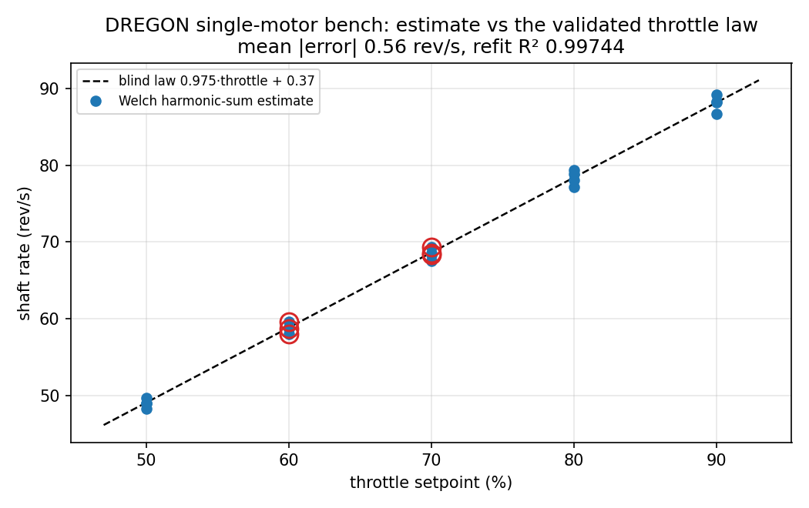
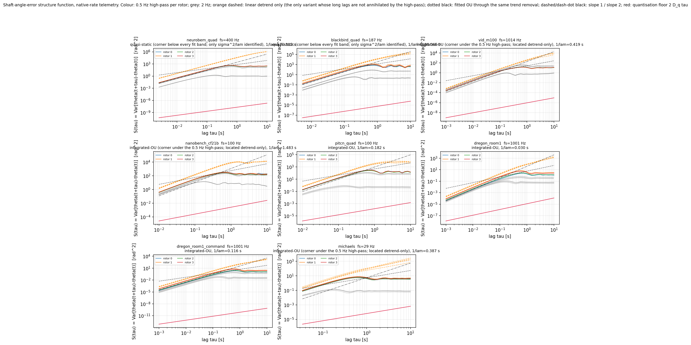
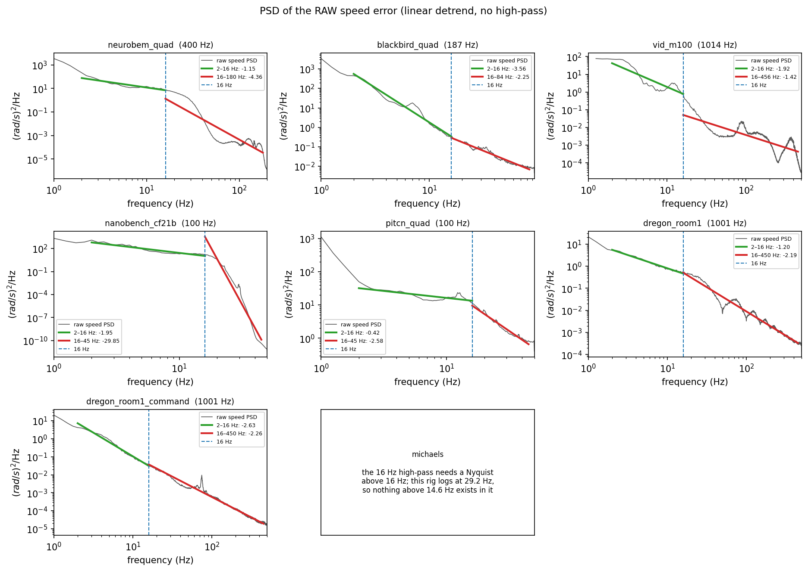
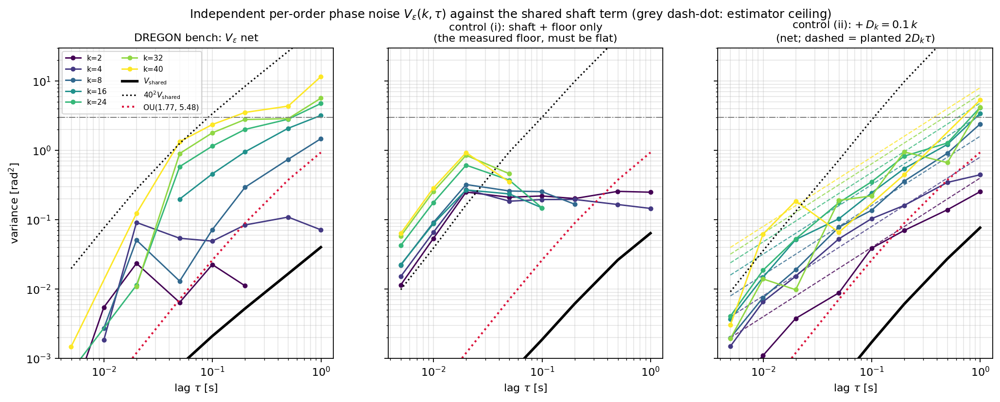
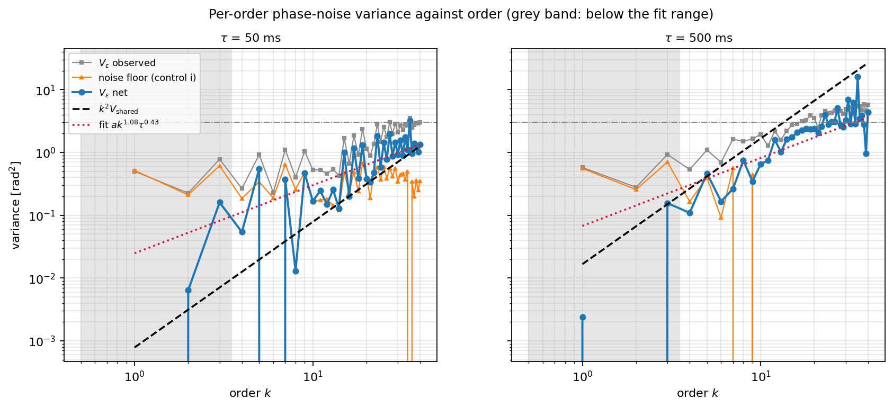
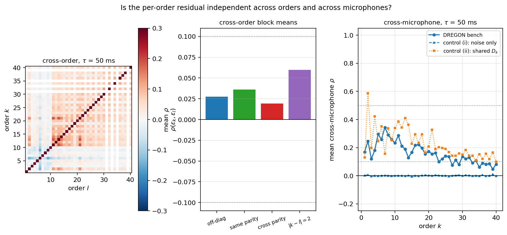
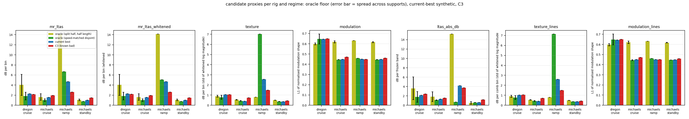

```{=html}
<style>
/* Break long tokens only INSIDE code spans — rig ids, recording ids, digests.
   Breaking ordinary words gives "recorde d" in a narrow column. */
table td code, table th code, li code { overflow-wrap: anywhere; }
table { font-size: 0.9em; }
table td, table th { hyphens: none; }
.column-page table { font-size: 0.86em; }
</style>
```

::: {.callout-note}
## Status

The proposal on this page was **approved on 2026-09-17**, with every open
decision taken as proposed; the nine decisions are listed in the
[decisions section](#decisions-for-the-reviewer) at the end of this page. The
fitting rounds are now running (R1 of a cap of 5). Every number on
this page comes from a committed artefact, and every table names its file.
The files are `docs/experiments/revised-phase-campaign.qmd`,
`docs/experiments/revised-phase-handoff-2026-09-13.qmd`,
`results/noise_v2/survey/findings.md`, `results/noise_v2/shaft/findings.md`,
`results/noise_v2/residual/findings.md` and
`results/noise_v2/criteria/findings.md`.

The campaign record is `docs/experiments/noise-model-v2.md`.
:::

# Summary

1. Model v2 keeps the harmonic structure of C4 and changes three things: the
   shaft term, the priors, and the fitting machinery. The shaft term splits in
   two: a fitted label-residual OU below the label band, and a fixed bounded
   wobble above it.
2. C3 failed on DREGON with a fitted per-harmonic diffusion
   `D = 844.69 rad²/s`, which is a 134.44 Hz linewidth at every order
   (`revised-phase-campaign.qmd:99-103`). A shaft term cannot do that, so the
   supplied carrier is misplaced and the optimiser blurs the comb.
3. The held-out line shape refutes that fitted value directly. Michael's
   `k = 2` line is narrower than 0.46 Hz, which implies `D < 1.45 rad²/s`;
   the C3 DREGON value predicts 268.9 Hz, which is 7.0 times the whole comb
   isolation bandwidth (`criteria/findings.md:63-87`). The same statistic also
   measures **label precision**: the line is sought inside `±0.5 Hz` of the
   position the label predicts, so a label error `δ` displaces harmonic `k` by
   `k·δ` and the tolerance at `T = 4.096 s` is `0.12/k` rev/s. Michael's
   `k = 2` holds it on 95 % of cells, `k = 8` on 23 %, DREGON `k = 1` on 31 %.
4. The speed error is **one** Ornstein-Uhlenbeck process, at every frequency.
   Seven of eight telemetry rigs prefer a Lorentzian speed spectrum over a
   flat one, by `ΔAIC(OU − white) = -2.0e4 … -1.1e6`; the eighth is Michael's
   29 Hz log, whose corner sits above its own band. The identified corner is
   `λ = 0.674-14.4 s⁻¹` on the five rigs that have one, which contains the
   fixed `λ_ref = 6` of C2/C3 — but the spread reaches a factor of 77 once the
   trend removal is varied, so `λ` is bracketed and not pinned
   (`shaft/findings.md`). Its `f⁻²` tail continues **above** the label band:
   the residual a 31.25 Hz label cannot carry is red on all 7 rigs that can
   see it, with `ρ(50 ms) = 0.12-0.60` against a filtered-white null of
   `0.002-0.047` (`residual/findings.md`). The phase error is therefore
   integrated-OU and never Wiener, and above the label band it is a bounded
   wobble of rms `0.003-0.055 rad` at `k = 1`, scaling as `k`. The
   `k²`-scaling Lorentzian core that the acoustic fit needs is **label
   error**, not rotor physics.
   The DREGON single-motor bench, the one label-free instrument, measures that
   term directly on 12 of 12 recordings: `σ_ν = 1.77 rad/s`, `λ = 5.48 s⁻¹`,
   `D_θ = 0.599 rad²/s` — `λ` lands on `λ_ref = 6`, and `D_θ` is 1400 times
   below C3's fitted `D`.
5. The corpus survey adds **135 fit points** over **18 rig/condition cells**
   from six corpora, published as `noise-v2-bench-points@00f32a1210d6`
   (`survey/findings.md:206-237`). Two corrections after review produced them:
   AVQ is constant-throttle ego-noise and not free flight, and a multi-rotor
   rig is gated on line evidence instead of the single-comb 3 dB margin. The
   estimator is validated against the DREGON throttle law to 0.555 rev/s mean
   absolute error, unchanged, and the four-rotor control on the same rig now
   resolves four rotors at 64.6-69.6 rev/s against its law value of 68.6.
6. The proposed fit window is `T = 1.024 s`, periodic Hann, 50 % overlap. The
   binding number is the carrier drift: `T_max(k = 2) = 0.95 s` at the p95
   slope on Michael's standby (`criteria/findings.md:135-157`).
7. The proposed spectrogram proxy is `ltas_abs_db`, the frozen absolute-level
   band LTAS error. Its `σ` response is 1.81 dB on Michael's cruise against 0.03-0.40 dB for
   every rival, and its degradation branch is monotone (`ρ = +1.00 / +0.90`)
   (`criteria/findings.md:288-311`).
8. Both new thresholds are gap-closure fractions against a speed-matched
   real-vs-real oracle. The proxy gate is 1.979 / 1.220 dB on DREGON and
   Michael's cruise at closure `≥ 0.70`, or 2.108 / 1.309 dB at `≥ 0.50`, and
   the current best arm fails both options
   (`criteria/findings.md:337-353`). The likelihood gate has the same form but
   no absolute value yet: its composite table cost 2 h 31 min locally, could
   not be sent to the cluster, and was not computed.
9. The round plan is five rounds: Pyro parity, shaft prior, rig hierarchy, one
   named fix, then simplification. The primary HPPNet criterion carries over
   unchanged.
10. Decided at review: DREGON is fitted on the bench (total periodogram) and
    validated on the four-motor static recording; flight fits use the
    front-end STFT; the shaft is one OU process; the flat `D` is replaced by
    an independent per-order phase process measured on the bench, retained
    **order-conditionally** — the long-lag study found a ceiling only at
    `k = 4` and `k = 8` (`τ_c` 2.15 s and 1.12 s), while `k = 2` was still
    growing at 5 s
    (`results/noise_v2/rounds/round1/fits/findings.md:222-224`). The path
    term is **per microphone**, shared across rotors and `∝ f`; it has no
    positive evidence and is a named candidate, not fitted in R1. All nine
    open choices were approved as proposed on 2026-09-17; section
    [Decisions (approved 2026-09-17)](#decisions-for-the-reviewer) lists
    them.

# Where the last campaign stopped

## The four rounds

::: {.column-page}

| Round | Change | DREGON (cruise) | Michael's (FLY124) | Verdict | Cause |
|---|---|---|---|---|---|
| C1 | moments-first (`λ`, `σ`, `D`) + carrier path + clip bias | — | — | rejected at planted preflight | planted `λ/σ = 6/6` recovered `1.2709e9 / 1439.2`: the moment estimator is unidentified with four near-coincident rotors |
| C2 | `λ_ref = 6` fixed; Stage 1 marginal expected-periodogram (Adam 120), Stage 2 conditional carrier MAP (Adam 40) | PIT MAE 9.3477 vs target 1.8971; composite `Δ = -11474.55` but upper bound `+6214.00`; LTAS 2.4231 vs 2.1362 dB | ratio 4.1619 (standby 105.14, ramp 0.4394, cruise 1.2316) | FAIL | the carrier recovery and bias stage moves the comb; standby is broken |
| C3 | same physics; floor and power initialisation repaired, order ladder 16/48/`K` | PIT MAE 69.3114; composite upper `+6414.08`; LTAS 2.4338 dB | MAE 1.8938 vs 3.0267 (ratio 0.6257), composite and LTAS pass | FAIL (DREGON) | the DREGON fit gives `D = 844.69 rad²/s = 134.44 Hz` linewidth at every order: the comb is blurred |
| C4 | fixed carriers (no recovery), L-BFGS marginal, DREGON raw vs refined labels | not run | not run | — | implemented, never submitted |

: Rounds C1 to C4. Numbers from `docs/experiments/revised-phase-campaign.qmd:47-103` and `docs/experiments/revised-phase-handoff-2026-09-13.qmd:137-142`. C4 has no numerical ledger: the handoff stops after implementation and no remote job was submitted (`revised-phase-handoff-2026-09-13.qmd:23-24,209-215`).

:::

## The DREGON blurred-comb reading

A per-harmonic diffusion `D` that is the same at every order cannot come from
the shaft. A shaft term scales as `k²`. 134.44 Hz is also far above any
physical linewidth. One mechanism widens every line by the same amount: a
**misplaced carrier**. DREGON room 2 carries the flight-controller *command*
(`motors_command`), not the measured speed, so the supplied carrier differs
from the shaft by the motor response — a lag and a bias. Under a
mean-prediction (Whittle-type) risk a misplaced narrow line costs more than a
blurred one, so the optimiser blurs the comb.

This reading is a hypothesis, not a proof. Marginal spectra cannot separate an
OU contribution from a residual diffusion
(`docs/explainers/bench-fit-revised-phase-model.qmd:462-464,652-655`).

Section [Shaft-phase prior from telemetry](#shaft-phase-prior-from-telemetry)
sharpens it into a quantitative statement: an OU speed error leaves a bounded
wobble above the label band and no diffusion at all, so `D = 845 rad²/s` is a
command carrier misplaced by more than the line width, and the whole
`k²`-scaling Lorentzian core is label error.

The C2 fix was to recover the carrier. It failed for its own reasons, and the
user decision "carriers are fixed" closes it. Two things are left.

1. The refined DREGON labels (`rps_refined`), which are acoustics-derived.
2. A model whose shaft term is honest about the **label chain**. What the model
   must describe is the residual `true shaft − supplied carrier`. Its
   statistics depend on the label — command, sample-and-hold measured, or
   refined — and not on controller physics alone.

Michael's C3 pass shows that the model family is adequate when the carrier is
right. The user judged the staged Adam schedule of C2/C3 too heuristic. C4
already moved to L-BFGS on the marginal objective. Model v2 keeps one
objective and one optimiser.

## The primary criterion, carried over verbatim

> Primary criterion carried over verbatim: frozen `hppnet_l2_r2_s0` best
> checkpoint (digest `6e50e025…`), synthetic rendered on the REAL carrier of
> the same DREGON room2 cruise supports / FLY124 supports; DREGON:
> `E_new ≤ E_real + 0.70·(E_best − E_real) = 1.897 rev/s` with the one-sided
> 95 % recording-level interval excluding no improvement; Michael's:
> regime-mean ratio `≤ 1.05` against `3.027 rev/s`.

The calibration behind those numbers is
`E_real = 1.2187080817581784 rev/s` and
`E_best synth = 2.1877858830655468 rev/s`, which give the target
`1.897062542673336 rev/s`
(`revised-phase-campaign.qmd:341-351`). Michael's frozen primary is not a
closure: the best baseline regime means are standby 0.3171, ramp 8.0071 and
cruise 0.7558 rev/s, and the equal-regime mean is 3.026661398168452 rev/s
(same file). The checkpoint digest in full is
`6e50e025ba40df055412ae5d59c2f7a54a23acc0d61c788ab3871fb9fd2877b1`
(`revised-phase-handoff-2026-09-13.qmd:116-133`).

# Corpus survey

The survey asks one question: which drone-noise recording can become a **fit
point** — a stationary window with one known speed per rotor. Scripts are
`scripts/noise_v2_bench_speed.py` and `scripts/noise_v2_corpus_survey.py`.
Numbers are in `results/noise_v2/survey/{survey.json,survey_table.md}` and the
narrative is `results/noise_v2/survey/findings.md`.

::: {.callout-important}
## Corrected after review

Two readings in the first version of this page were wrong. Both are corrected
below, and both changed the counts.

**1. AVQ is not free flight.** The first pass rejected it by type without
reading its specification table. That table (QMUL, column `Type` = EO, column
`Drone` = constant) marks four sequences as ego-noise only at a **constant
throttle**: S1 seq1 50 % (120 s), S1 seq2 100 % (120 s), S1 seq3 150 % (40 s),
S2 seq1 100 % (210 s). One throttle per recording and no manoeuvre is the
bench-class definition used here, so AVQ is **usable**. Read in consecutive
30 s windows it gives 78.0 / 97.8 / 111.4 rev/s for 50 / 100 / 150 %, which is
monotone in the table's own throttle column, and **6 fit points over 2 cells**
(`survey/findings.md:174-204`).

**2. The 3 dB margin was the wrong gate for a multi-rotor rig.** The margin
scores the accepted comb against the best rival comb. It collapses by
construction once four combs diverge at high order: the tonal energy per rotor
falls, the broadband floor is four times higher, and no single comb is
distinguished. The margin then measures rotor count, not readability. Measured
on one rig at one throttle: one motor at 70 % scores 15.3-17.8 dB of comb
score with 5.6-9.8 dB of margin, and four motors on the same rig at the same
throttle score **6.4 dB** with 0.77 dB of margin
(`survey/findings.md:90-96`). Four-rotor static rigs were rejected on that
number alone. They are now judged on **line evidence**.
:::

## The gate

**Single-rotor rig, unchanged.** Margin `≥ 3 dB` over the best rival comb, the
two disjoint window halves inside 1 rev/s, window `≥ 8 s`.

**Multi-rotor rig, new.** All three of

- `f̄`, the mean comb rate, stable to `≤ 1 rev/s` between the two window
  halves;
- a peak `≥ 6 dB` over the band's local median inside `k·f̄ ± 6 %` at
  **`≥ 3` orders** of the line comb, consecutive or not;
- window `≥ 8 s`

(`survey/findings.md:74-84`). The margin is still computed and stored for
every reading. It is no longer gated on for a multi-rotor rig.

The per-rotor split reads the same lines. Inside `k·f̄ ± 6 %`, up to four
peaks 6 dB over the local median become rate candidates `peak/k`; a candidate
becomes a **resolved rotor** when it repeats within 0.3 rev/s at `≥ 3` orders.
The split runs on the **line comb** — the comb with a tooth at every order,
which on a two-bladed rotor is the blade-pass line and not the shaft rate
(`survey/findings.md:60-72`).

::: {.column-screen-inset}

:::

Neither cheaper repair works. Excluding the `±6 %` neighbourhood of the
candidate — which stops one rotor of a rig being scored against another — moved
the limiting rival on 44 of 240 multi-rotor readings (median gain 0.556 dB,
max 2.33 dB) and flipped one verdict. A `--family-max 8` counterfactual, 43
`m/n` ratios instead of 11, flipped none and left the SPCUP static median
margin at +0.04 dB (`survey/findings.md:98-107`).

## Validation

**The four-rotor control on the DREGON bench.** `motor_allMotors_70` is now
usable and resolves **four rotors at 64.65 / 67.66 / 68.74 / 69.57 rev/s**
(mean 67.66, spread 4.92) against the single-motor throttle law's 68.6 rev/s
at 70 %. Line evidence: peaks at 27 orders of the line comb, halves agreeing
to 0.8 rev/s. The first pass read three rotors from one order and rejected the
recording (`survey/findings.md:136-142`).

**The DREGON single-motor law is untouched.** The law is
`rate = 0.975 · throttle + 0.37 rev/s`. 20 of 20 recordings are usable, with
mean absolute error **0.5552 rev/s**, maximum 1.42 and RMS 0.703; an
independent refit of the survey's own readings gives slope 0.97577, intercept
0.2395 rev/s and `R² = 0.997444`. Every one of those numbers is identical to
the first pass, because single-rotor mode is untouched by the gate change
(`survey/findings.md:129-134`). That makes the comparison a regression test
rather than a coincidence.

::: {.column-page}

:::

**DroneAudioSet against the paper's stated lines** (arXiv:2510.15383, Fig. 7).

| cell | n | median rev/s | 2f (Hz) | paper (Hz) | error |
|---|---|---|---|---|---|
| `drone1` low | 17 | 84.96 | 169.9 | 168 (`D_large` low) | +1.1 % |
| `drone1` high | 25 | 118.68 | 237.4 | 235 (`D_large` high) | +1.0 % |
| `drone2` high | 28 | 126.03 | 252.1 | 259 (`D_small` high) | -2.7 % |
| `drone2` low | 28 | 105.83 | 211.7 | 156 (`D_small` low) | **+35.7 %** |

: Cell medians over the fit points and the blade-pass line they imply. Source: `results/noise_v2/survey/findings.md:156-172`.

Three of four cells match to `≤ 2.7 %`, now on 17-28 readings per cell against
1-22 in the first pass. That keeps both conclusions: `drone1` is `D_large`
(DJI F450) and `drone2` is `D_small` (DJI F330), and the paper's marked
"fundamental" is the blade-pass line at twice the shaft rate. `drone2` low is
the one real disagreement with the published figure.

**SPCUP19 AGH against the accepted blind readings**: 7 of 8 usable, unchanged.
Six agree to `≤ 0.27 rev/s` (mean absolute error 0.148 rev/s). Take 1 reads
132.30 against 66.33 rev/s, a factor 1.995, which the blind campaign had
already flagged; take 4 is refused by the single-rotor margin rule at 1.62 dB
(`survey/findings.md:144-147`).

**KAIST rotating machine**, the out-of-domain control: 0 of 5 usable,
unchanged. It is a single-rotor corpus, so it exercises the unchanged 3 dB
gate and does not falsify the new one. The falsification checks for the new
gate are the four-rotor control above and the cell-median consistency check
below (`survey/findings.md:149-154`).

## Verdict per corpus

::: {.column-page}

| corpus | read | usable, pass 1 | usable, now | verdict |
|---|---|---|---|---|
| DREGON bench (single motor + all-motors) | 21 | 20 | **21** | USABLE |
| SPCUP19 AGH single rotors | 8 | 7 | 7 | USABLE |
| DroneAudioSet (drone-only) | 168 | 50 | **98** | PARTLY USABLE |
| SPCUP19 static / hover (4 rigs) | 18 | 0 | **7** | PARTLY USABLE |
| SPCUP19 ChuMS propeller rig (16 s window) | 9 | 1 | **2** | PARTLY USABLE |
| AVQ constant-throttle ego-noise | 16 windows | — | **9** | USABLE |
| KAIST rotating machine | 5 | 0 | 0 | CONTROL ONLY |
| `drone_audio` (`yes_drone`) | 24 | 0 | 0 | REJECTED (1.02 s clips) |
| `zenodo_drone_noises` | 7 | 1 | 4 | REJECTED (no rig identity) |
| DronePrint / MAVD / DroneNoise DB / ESC-50 | — | — | — | REJECTED (access or type) |

: Usable readings per corpus, first pass against this pass. Full table with locations, licences and per-recording reasons: `results/noise_v2/survey/survey_table.md`. Counts: `results/noise_v2/survey/findings.md:206-226`; the corpus-level verdict strings in `survey.json` are the script's own constants and still read REJECTED for the SPCUP static family.

:::

**Totals: 276 readings, 148 usable, 135 fit points over 18 rig/condition
cells** — against 79 usable, 73 fit points and 11 cells in the first pass.

Rejections, 128 readings: 70 DroneAudioSet (lines at fewer than 3 orders,
mostly the `M_up` mic group above the airframe), 24 `drone_audio` clips (1.02 s
against the 8 s rule), 11 SPCUP static, 7 ChuMS, 7 AVQ windows, 5 KAIST (the
control), 3 `zenodo` (no rig identity), 1 SPCUP AGH take
(`survey/findings.md:254-258`).

The ChuMS package stays a discovery. The published SPCUP19 frames expose it as
216 unlabelled arrays. `UAV_rotor_recordings.mat` in fact holds 9 runs of
73-75 s on 8 calibrated microphones, with their positions in the file and a
per-microphone OASPL of 88.9-98.4 dB, at 1, 2 or 3 propellers with three
repeats each. No RPM is recorded anywhere in it. It is read with a **16 s**
window, because its propeller speeds drift and the 30 s multi-rotor window
smears the lines: `3prop_repeat2` gives no line cluster at 30 s against three
resolved propellers at 77.08 / 77.52 / 78.07 rev/s at 16 s
(`survey/findings.md:248-252`).

## What the fit points are

**135 fit points** over **18 rig/condition cells**, points each
(`survey/findings.md:228-237`):

- `dregon_mikrokopter_single_motor` at 50/60/70/80/90 % — 4 each, 20 total;
- `dregon_mikrokopter_quad` at 70 % — 1, the four-rotor control;
- `spcup_AGH` single rotor — 7; `spcup_AGH` stationary — 5;
- `spcup_Diagonal_Unloading` stationary — 1; `spcup_Idea_ssu` stationary — 1;
- `spcup_ChuMS_2prop_bench` — 1; `spcup_ChuMS_3prop_bench` — 1;
- `daset_drone1` low/high — 16 + 23; `daset_drone2` low/high — 27 + 26;
- `avq_quadrotor` at 50 % — 2; at 100 % — 4.

The published tolerance is `max(half-to-half difference, 0.5·df, 0.25) rev/s`,
median 0.25 rev/s over the 135 points. Nine usable readings sat at a factor
0.48-0.52 of their own cell median — a factor-2 failure on that recording, not
a different speed — and were dropped, so 148 usable readings become 135 fit
points (`survey/findings.md:260-266`).

::: {.column-screen-inset}

:::

How many rotors each point resolves:

| rotor rates resolved | 1 | 2 | 3 | 4 |
|---|---|---|---|---|
| fit points | 76 | 42 | 10 | 7 |

: Resolved rotor rates per fit point, over the 135 points. 99 of the 135 carry `multiplicity_unresolved`: at least two rotors coincide within 0.3 rev/s, and `speed_rev_s` repeats `f̄` for them. The first pass resolved at most three rotors and never four. Source: `src/data_processing/noise_v2_bench_points.json`, `survey.json:corpora[].stats.n_resolved_by_rig`, narrative `survey/findings.md:268-275`.

Said plainly: most four-rotor points carry a **mean rate plus a partial
split**, not four independent speeds. That is what the v2 likelihood is built
for. A bench point with four rotors enters with **four constant carriers as
fit parameters**, initialised from the split, so the per-rotor offsets are
fitted rather than assumed.

The dataset is published as **`noise-v2-bench-points@00f32a1210d6`**
(`dload.lock:55`, full digest
`00f32a1210d656ad0ebe60b70ddd6a60a3d204be4b07a79cc02f857dd3d1a159`; 135
samples, 14 shards, 1.9 GiB as reported by `dload pull`; manifest
`src/data_processing/noise_v2_bench_points.json`, generator `noise_v2_bench` in
`src/data_processing/derivations.py`). It supersedes the first pass's
`@8f49bb0f77d3` (73 points, 11 cells) and the margin-gated second pass
`@0dc685bf949a` (78 points); neither is pinned any more
(`docs/data-catalog.md`). Every point carries the stationary audio at its
native rate with every channel kept, `meta.rig`, `meta.corpus`,
`meta.speed_rev_s` (one entry per rotor: the resolved rates first, then `f̄`
for the rotors the split could not separate), `meta.resolved_mask`,
`meta.speed_source`, `meta.speed_tolerance`, `label.n_rotors_resolved`,
`label.multiplicity_unresolved`, and the source recording id and offset. The
labels are estimator output, so the committed manifest is hashed into the
derivation spec. A re-estimation mints a new dataset identity instead of
republishing different labels.

::: {.callout-warning}
## Three limits to carry into the model work

1. **18 cells are not 18 rigs.** Five are the same DREGON motor at five
   throttles. The genuinely distinct rigs are the MikroKopter (single motor and
   four motors), two DJI airframes at two throttles each, the AGH quadrotor
   (single rotor and stationary), two more SPCUP team rigs, the Dotterel
   propeller rig at 2 and 3 propellers, and the AVQ quadrotor at two settings.
2. **The new quantity costs octave certainty.** 37 of the 148 usable readings
   carry `octave_unresolved`, and 9 factor-2 failures had to be removed by the
   cell median. That check only works where a cell holds `≥ 3` readings, which
   the SPCUP stationary and ChuMS cells do not. Treat those as the weakest
   cells, and read `meta.octave_unresolved` before using a label.
3. **No new corpus adds telemetry.** Every extra point is an estimate with a
   0.25 rev/s median tolerance, and none carries a speed track. Use the points
   for rig-to-rig transfer of the noise parameters, and not for anything that
   needs a speed trajectory (`survey/findings.md:277-293`).
:::

# Shaft-phase prior from telemetry

Source: `results/noise_v2/shaft/findings.md`, numbers
`results/noise_v2/shaft/shaft.json`, script
`scripts/noise_v2_shaft_phase.py`. The study asks one question: what does the
shaft actually do, at the rates a renderer must generate?

## The model under test

The phase variance of order `k` at lag `τ` is

$$V_k(\tau)=k^2\,V_\theta(\tau)+2D_k\tau,
\qquad
V_\theta(\tau)=2\sigma_\nu^2\left[\frac{\tau}{\lambda}-\frac{1-e^{-\lambda\tau}}{\lambda^2}\right].$$

Two families sit inside that form.

- **Integrated OU.** The speed error `ν` is correlated over `1/λ`.
  `V_θ(τ) ≈ σ_ν²τ²` for `τ ≪ 1/λ`, which is a smooth drift, and
  `V_θ(τ) ≈ 2(σ_ν²/λ)τ` for `τ ≫ 1/λ`, which is diffusion with
  `D_θ = σ_ν²/λ`.
- **Wiener.** The speed error is white, so `V_θ` is linear in `τ` at every
  lag.

The integrated-OU curve has local log-log slope 1.5 at `λτ = 2.1491`. That is
how a measured lag becomes a `λ`.

The line shape follows. Per order `k` the model predicts a Lorentzian core of
width `k²D_θ/2π` inside `|Δf| ≪ λ/2π` — 0.11-0.44 Hz on the identified rigs
and 2.3 Hz on DREGON room 1 — with Gaussian shoulders of width `kσ_ν/2π`.

## Verdict per rig

::: {.column-page}

| rig | instrument | verdict | `σ_ν` (rad/s) | `λ` (s⁻¹) | corner (Hz) | `D_θ` (rad²/s) | ΔAIC(OU−white) | `D_q/D_θ` |
|---|---|---|---|---|---|---|---|---|
| `neurobem_quad` | telemetry 400 Hz | quasi-static: corner below every fit band, only `σ²/λ` identified | — | — | — | — | -1.08e6 | 2.6e-15 |
| `blackbird_quad` | telemetry 187 Hz | quasi-static: corner below every fit band, only `σ²/λ` identified | — | — | — | — | -2.00e4 | 1.4e-7 |
| `vid_m100` | telemetry 1014 Hz | **integrated OU** | 33.1 | 2.39 | 0.380 | 467 | -1.53e5 | 1.0e-9 |
| `nanobench_cf21b` | telemetry 100 Hz | **integrated OU** | 144 | 0.674 | 0.107 | 3.08e4 | -3.33e4 | 4.1e-8 |
| `pitcn_quad` | telemetry 100 Hz | **integrated OU** | 80.4 | 2.74 | 0.435 | 2.44e3 | -6.59e4 | 3.1e-8 |
| `dregon_room1` (`motors_measured`) | telemetry 1001 Hz | **integrated OU** | 8.82 | 14.4 | 2.30 | 5.60 | -3.79e5 | 1.1e-6 |
| `dregon_room1_command` (aux) | telemetry 1001 Hz | **integrated OU** | 8.01 | 2.84 | 0.452 | 22.2 | -4.44e5 | 1.7e-12 |
| `michaels` | telemetry 29 Hz | **Wiener**: the speed error is white inside its 0.5-11.7 Hz band | — | — | 27.5 (outside the band) | 0.0256 | +736 | 0.0 |

: Verdict per rig, from `results/noise_v2/shaft/findings.md:9-31` with the parameters of `shaft.json:telemetry.<rig>.verdict`. `σ_ν`, `λ` and `D_θ` are printed only where the fitted Lorentzian corner falls inside the fit band. Each row uses the study's selected trend removal for that rig — linear detrend per segment on the five integrated-OU rigs. `D_q/D_θ` is the quantisation ratio. The command track is auxiliary: it is a command, not a speed measurement.

:::

::: {.column-screen-inset}

:::

::: {.column-screen-inset}

:::

Four findings hold across the corpus.

1. **The speed error is not white, except on the one rig that cannot see it.**
   `ΔAIC(OU − white)` runs from `-2.0e4` to `-1.1e6` on the seven rigs that
   log fast enough, so each prefers a Lorentzian speed spectrum over a flat
   one and its phase is integrated-OU. Michael's 29 Hz log is the exception:
   its fitted corner, 27.5 Hz, sits above its own 11.7 Hz band, so inside the
   band the speed error is white and `ΔAIC = +736` votes Wiener.
2. **`λ` is bracketed, not pinned.** On the study's selected trend removal the
   identified corner is `λ = 0.674-14.4 s⁻¹`, at 0.107-2.30 Hz. The declared
   `λ_ref = 6 s⁻¹` of C2/C3 sits inside that range, so the old value was a
   reasonable guess and it is not refuted. It is also not confirmed: the next
   subsection shows the spread reaching a factor of 50 once the trend removal
   is varied.
3. **Two rigs identify no corner at all.** `neurobem` and `blackbird` are
   quasi-static: the corner falls below every fit band, so only `σ²/λ` is
   identified and `λ` is a ridge coordinate.
4. **No diffusive tail is an artefact.** `D_q/D_θ ≤ 1.1e-6` everywhere, where
   `D_q = (2π·step)² / (24·f_update)` is the diffusion a white rounding error
   of the measured ladder step would produce at the observed update rate.

One instrument caveat stays attached to DREGON. `motors_measured` holds its
value for 95.4 % of native samples and changes at 46.4 Hz, so its spectrum
above that rate is its own staircase and not rotor dynamics. The same check is
reported per rig in `shaft.json` (`quantisation.held_fraction`,
`quantisation.update_rate_hz`).

## Trend removal changes the answer

There are two ways to turn this data into a `λ`, and they disagree. The study
prints both and warns against one of them
(`results/noise_v2/shaft/findings.md:68-114`).

**Do not read `λ` from the slope-1.5 crossing.** `τ(slope 1.5)` is read off the
structure function of the **filtered** series. That series saturates at about
`1/(2πf_hp)`, so the crossing moves with the high-pass and is not a
filter-free property of the rig. Pooled over rotors it reads 0.135-0.349 s
under the 0.5 Hz high-pass, 0.024-0.083 s under the 2 Hz high-pass, and
0.61-3.41 s with a linear detrend only. The first of those three would give
`λ = 6.16-16.0 s⁻¹`, which does contain `λ_ref = 6` — and that agreement is
partly the filter corner talking, not the rig.

**Read `λ` from the fitted corner instead.** Both rival models are multiplied
by the known `|H|⁴` power response of the zero-phase high-pass before fitting,
so the filter sits in the model and not in the answer. DREGON room 1 is the
illustration: its fitted `λ` is 4.78 s⁻¹ under the 16 Hz high-pass, 33.1 under
0.5 Hz, 51.9 under 2 Hz and 14.4 with a linear detrend, and the corner is
inside the band for the last three. Across every rig and variant whose corner
lands in band the fitted `λ` spans 0.674 to 51.9 s⁻¹, a factor of 77.

**What that settles.** `λ_ref = 6 s⁻¹` is inside the measured spread, so C2/C3
were not wrong to use it. The spread is also far too wide to justify fixing
`λ` at one number for every rig. The honest conclusion is the one v2 acts on:
**give `λ` a broad measured prior and let the data move it**, per rig and per
label chain.

## Above the label band: is the speed error white?

A label carried at 31.25 Hz holds nothing above 15.625 Hz, so a renderer has
to generate that part itself. The question is whether it can generate it as
white noise.

The method is three steps
(`results/noise_v2/residual/findings.md`, script
`scripts/noise_v2_residual_acf.py`). High-pass the logged speed at 16 Hz with
a zero-phase order-4 Butterworth, which keeps exactly what a 31.25 Hz label
cannot carry. Compare the autocorrelation of that residual against a **null**:
white noise of the same length through the same filter, averaged over 8 draws,
because a high-pass makes even white noise look correlated. Measure the slope
of the raw speed PSD above 16 Hz, where white noise would be flat.

::: {.column-screen-inset}

| rig | fs (Hz) | `ν_res` rms (rad/s) | ρ(1 sample) | ρ(10 ms) | ρ(50 ms) | 1/e lag (ms) | slope 16-fs/2 | slope 2-16 | verdict |
|---|---|---|---|---|---|---|---|---|---|
| `neurobem_quad` | 400.0 | 6.11 | +0.936 | +0.169 | +0.328 | 8.4 | -4.36 | -1.14 | red |
| `blackbird_quad` | 187.0 | 1.72 | +0.385 | -0.109 | +0.131 | 5.5 | -2.23 | -3.55 | red |
| `vid_m100` | 1014.2 | 1.63 | +0.798 | +0.239 | +0.203 | 3.7 | -1.50 | -1.95 | red |
| `nanobench_cf21b` | 100.0 | 5.52 | +0.440 | +0.440 | +0.603 | 10.7 | -29.85 | -1.96 | red |
| `pitcn_quad` | 100.0 | 8.41 | -0.048 | -0.048 | +0.274 | 6.0 | -2.56 | -0.42 | red |
| `dregon_room1` | 1001.0 | 2.64 | +0.907 | -0.057 | +0.124 | 5.3 | -2.19 | -1.19 | red |
| `dregon_room1_command` | 1001.0 | 0.66 | +0.899 | -0.062 | +0.124 | 4.5 | -2.26 | -2.68 | red |
| `michaels` | 29.2 | — | — | — | — | — | — | — | n/a |

: The residual above the label band, per rig. `slope 2-16` is the band the label does carry and is shown for contrast. The autocorrelation is unbiased, pooled over segments and averaged over rotors; the rms values are averaged over rotors in quadrature. Source: `results/noise_v2/residual/findings.md:15-26`, data `results/noise_v2/residual/residual.json`.

:::

::: {.column-screen-inset}

:::

::: {.column-screen-inset}

:::

**The answer is no.** On every rig whose Nyquist sits above 16 Hz the residual
is correlated. The PSD keeps falling above the band edge, at `≈ f⁻²` on the
four rigs that measure the shaft (slopes -1.50 to -2.56). The autocorrelation
at 50 ms is +0.12 to +0.60, against a filtered-white null of 0.002 to 0.047 at
the same lag (`residual.json:rigs.*.null_filtered_white`). The curve also
swings negative, down to -0.91 at the worst rig against -0.44 for the deepest
null, and crosses zero between 8.6 and 14.3 ms: the residual **rings** at the
edge of the label band. It then dies — by 100 ms every rig is inside
`|ρ| ≤ 0.05`.

**So there is one process, not two.** The speed error is a single
Ornstein-Uhlenbeck process with a Lorentzian PSD, corner
`λ = 0.674-14.4 s⁻¹`, whose `f⁻²` tail simply continues above the label band;
the phase error is therefore integrated-OU at every frequency, and never
Wiener. Above the label band that phase error is a bounded wobble of rms
**0.003-0.055 rad at `k = 1`**, scaling as `k` — 0.09 to 1.65 rad at
`k = 30` — which a renderer must generate as filtered noise with that PSD and
cannot read from the label
(`residual/findings.md:36-88`).

Three instrument caveats, one line each.

- `neurobem` (-4.36) and `nanobench` (-29.85) are steeper than -3, which is
  the logger's own reconstruction roll-off and not the shaft.
- DREGON `motors_measured` is logged near 1 kHz but only changes near 45 Hz,
  so above 16 Hz it is the staircase of a sample-and-hold.
- Michael's logs at 29.2 Hz, so nothing above 14.6 Hz exists in it and the rig
  cannot answer the question at all.

## Against the C3 fitted values

| rig | C3 `σ` (rad/s) | C3 `σ²/λ_ref` (rad²/s) | C3 `D` (rad²/s) | bench acoustics `D_θ` (rad²/s) | label-residual `D_θ` bound (rad²/s) | above-band wobble `Var θ_res` (rad²) |
|---|---|---|---|---|---|---|
| DREGON airframe | 3.1012 | 1.603 | 844.69 | **0.599** measured (IQR 0.38-0.66) | ≤ 0.105 (`motors_measured`), ≤ 0.0052 (command) | 4.29e-4, bounded |
| Michael's M100 | 4.2072 | 2.950 | 1.6308 | — (FLY125 saturates, 0/4 identified) | 0.0256 measured in band; `≤ 0.0014` from its own label residual | — (29 Hz log has no 16 Hz band) |

: C3 values from `docs/experiments/revised-phase-handoff-2026-09-13.qmd:139-142`, at the fixed `λ_ref = 6 s⁻¹`. Bench acoustics from `shaft.json:acoustics.dregon_bench`; the label-residual bound and the above-band wobble from `results/noise_v2/shaft/findings.md:44-61` (`shaft.json:label_band`). The corpus-wide label-residual bound is `D_θ ≤ 0.41 rad²/s` and `Var θ_res = 2.5e-5` to `6.8e-3 rad²`. On Michael's the study measures `D_θ = 0.0256 rad²/s` in band, which is `σ = 0.392 rad/s` at `λ_ref = 6` against C3's fitted 4.21 — a factor 10.7 (`shaft/findings.md:70-73`).

The comparison is the whole argument. C3's DREGON `σ²/λ_ref = 1.603 rad²/s` is
**2.7 times** the bench's label-free measurement of the same quantity
(0.599 rad²/s) and **15 times** DREGON's own label-residual bound of
0.105 rad²/s. Its `D = 844.69 rad²/s` is **1400 times** the bench value and
8000 times the label-residual bound. Nothing measured anywhere in the campaign
— the label-free bench shaft term, the bounded above-band wobble at
`6.8e-3 rad²`, or the label-chain leak bounded at 0.41 rad²/s — can produce
those numbers. The room-2 command-against-shaft error is the remaining
explanation, and the refined label is the remedy.

Michael's rig points the same way, with a smaller gap. C3 fits
`D = 1.6308 rad²/s` there against a measured in-band `D_θ = 0.0256`, a factor
64, and a fitted `σ = 4.21 rad/s` against 0.392 at the same `λ_ref`, a factor
10.7. The held-out line shape independently allows `D < 1.45` on that rig, so
the C3 Michael's fit sits just outside a bound that its DREGON twin misses by
three orders. The same model family, with the right carrier, is close.

That also settles what the `k²`-scaling Lorentzian core of C2/C3 was fitting.
It was **label error** — Michael's 29 Hz sample-and-hold, and DREGON room 2's
command-against-shaft motor response, which sits below 16 Hz and is exactly
what a refined label removes. It was not rotor physics. Model v2 therefore
fits the shaft on the bench, where there is no label, and treats a flight fit
that lands in the label-residual regime (`λ` above ~30 s⁻¹) as a diagnosis of
the label chain.

## The acoustics: the bench measures the shaft term directly

The DREGON single-motor bench is the only instrument in the campaign with **no
label at all**: one clamped motor, one throttle, and nothing but the sound. It
identifies the shaft term on **12 of 12 recordings**, integrated-OU on every
one of them by AIC (`results/noise_v2/shaft/findings.md:39`).

| quantity | median | interquartile | full range over 12 recordings |
|---|---|---|---|
| `σ_ν` (rad/s) | **1.77** | 1.39-1.93 | 0.23-3.20 |
| `λ` (s⁻¹) | **5.48** | 3.25-8.29 | 0.31-16.2 |
| `D_θ` (rad²/s) | **0.599** | 0.38-0.66 | 0.018-2.81 |

: The bench shaft term, from `shaft.json:acoustics.dregon_bench`. The two ends of each full range are `motor_Motor4_70` and `motor_Motor4_90`; the interquartile band is the honest width. This is a filter-free measurement: the acoustic estimator has no high-pass, so none of the trend-removal ambiguity of the telemetry applies to it.

Two readings follow at once.

1. **`λ = 5.48 s⁻¹` lands on `λ_ref = 6`.** The value C2/C3 assumed is what the
   one label-free instrument measures, to 9 %. The telemetry could only
   bracket it.
2. **C3's fitted `σ = 3.101 rad/s` is 1.75 times the bench median.** The model
   family is close on this rig once the carrier is out of the way.

::: {.callout-important}
## Two instruments, one verdict on C3's DREGON `D`

Two independent instruments refute C3's DREGON `D = 844.69 rad²/s` by three to
four orders of magnitude. In the **frequency domain** that `D` predicts a
268.9 Hz half-power width against a 38.5 Hz isolation band, while the measured
core is unresolved at every window up to 4.096 s — intrinsic width
`< 0.46 Hz`, per-harmonic `D < 1.45 rad²/s` on Michael's cruise. In the **time
domain** the DREGON single-motor bench gives `D_θ = 0.38-0.66 rad²/s`
(median 0.599) with `σ_ν = 1.4-1.9 rad/s` (median 1.77) and
`λ = 3.3-8.3 s⁻¹` (median 5.48).

The two bounds are not the same quantity, and both matter. The line width
bounds the `k`-independent **per-harmonic** `D`; `V_k/k²` bounds the **shaft**
`D_θ`. The observed broadening is the sum of the two, so each instrument caps
one term of that sum, and C3's single fitted `D` is far above either cap.
:::

**`D_k` and its `k` exponent remain unidentified**, on both rigs. The fitted
`2D_kτ` at the shortest lag is 1.32 times the measured `V` of the same order,
so `D_k` is absorbing model error rather than measuring diffusion, and the
planted control independently returns a planted `D_k ∝ k` as flat — fitted
log-log slope `-5.74` against a true `+1`
(`shaft.json:acoustics.dregon_bench.verdict`, `shaft.json:planted_control`).
Read `σ_ν`, `λ` and `D_θ` from this instrument; do not read `D_k` from it. A
`k`-independent `D` therefore has no measurement behind it; v2 drops it as a
parameter (section [Model v2](#model-v2)).

Michael's FLY125 cruise still saturates: 3 of its 4 rotors exceed 0.15 rad² at
the shortest usable lag and 0 of 4 are identified
(`shaft.json:acoustics.michaels_fly125.verdict`). That is consistent with the
line-shape bound `D < 1.45 rad²/s` on the same rig, but it adds no number of
its own. The cause is bandwidth: one harmonic cannot be separated from its
neighbours faster than one shaft revolution, so the acoustic lag grid starts at
the frame rate of a 6-revolution window, and on Michael's the saturation
happens below that first usable lag.

::: {.callout-warning}
## The bench numbers carry a measured systematic

The planted control plants `σ_ν = 0.4 rad/s`, `λ = 6 s⁻¹` and
`D_k ∝ k` at 22 dB SNR and refits them. The estimator recovers `σ_ν` at
**1.26×**, `λ` at **3.07×** and `D_θ` at **0.52×**
(`shaft.json:planted_control`). De-biasing the bench medians by those factors
gives `σ_ν ≈ 1.4 rad/s` (1.1-1.8), `λ ≈ 1.8-5.5 s⁻¹` and
`D_θ ≈ 0.6-1.2 rad²/s`. The true `λ` may therefore sit up to three times below
the fitted 5.48, and even that pessimistic end is within a factor of 3 of
`λ_ref = 6`. The de-biased bands are what the v2 priors use, not the raw fits.
:::

::: {.column-screen-inset}

:::

::: {.column-page}

:::

## Per-order decoherence, measured on the bench {#per-order-decoherence-measured-on-the-bench}

Source: `results/noise_v2/decoherence/findings.md` and `decoherence.json`,
produced by `scripts/noise_v2_order_decoherence.py` (12 DREGON single-motor
recordings `motor_Motor{1-4}_{70,80,90}`, 8 microphones, orders 1-40).

The question: do the harmonics of one rotor move in lockstep? The earlier
probes (`docs/experiments/vk-decomposition.md`, coherence probe 2026-08-14;
`docs/experiments/stochastic-fit.md`, coherent share per order) said no, as a
correlation. This measurement gives the size.

Method. Each order is demodulated with one refined constant carrier
(`utils.demod`), the phase increment over lag `τ` is formed per order and
microphone, and the increments are split as `Δφ_k = k·Δθ + ε_k`: the shared
part `Δθ` is the weighted least-squares slope over the orders `k ≤ 10`, the
residual `ε_k` is what is left at every order. The variance of `ε_k` is read
from the circular mean of the de-rotated increment phasor (unwrapped phase
slips at high orders), the leakage of the shaft estimate `k²·Var[e]` is
measured from three disjoint order groups and subtracted, and the motor's
running window (~11 s of each 25 s file) is detected from the level track.

| k | `V_ε(50 ms)` [rad²] | `V_ε(500 ms)` [rad²] | `Var[kΔθ](50 ms)` [rad²] | ratio at 50 ms |
|---|---|---|---|---|
| 4 | 0.054 | 0.11 | 0.013 | 4.3 |
| 10 | 0.17 | 0.65 | 0.079 | 2.1 |
| 20 | 0.38 | 2.4 | 0.31 | 1.2 |
| 30 | 0.93 | 3.3 | 0.71 | 1.3 |
| 40 | 1.3 | 4.3 | 1.26 | 1.1 |

: Independent per-order phase variance against the shared shaft part, pooled over the 12 recordings (`decoherence/findings.md` § "The numbers"; full table there for k = 1-40).

::: {.column-screen-inset}

:::

::: {.column-screen-inset}

:::

::: {.column-page}

:::

How to read the figure. The increment over lag `τ` is the angle of
`z_k(t+τ)·conj(z_k(t))`, always inside `(−π, π]`: rotations are never counted,
and the variance is `−2 ln|⟨e^{iΔφ}⟩|`, the circular spread. That is the
quantity a spectrum depends on, and it has a hard ceiling: once the phase has
wandered by more than about a radian over the lag, the increments are uniform
on the circle and the estimate saturates near 3 rad² (grey dash-dot line).
Points at the ceiling mean "decorrelated over this lag", not a value.

Findings, as the panels show them.

1. **Low orders show nothing beyond shaft and noise.** `k = 2, 4` on the bench
   sit flat at 0.05-0.1 rad², the same as control (i), whose flat level is the
   microphone-noise phase floor at that SNR (it does not grow with lag; the
   rise below 20 ms is the low-pass filter's own correlation).
2. **High orders decohere.** `k ≥ 16` on the bench rises with lag like control
   (ii), from 0.1-0.5 rad² at 50 ms to the ceiling by 0.5-1 s, far above the
   shaft term (`k²·V_θ`, dotted) and the noise floor. Order 8 is in between.
   The harmonics of one rotor do not keep a fixed phase relation over 0.1-1 s.
3. **The residual is independent across orders**: mean off-diagonal
   correlation 0.03 over 630 order pairs at 50 ms, no odd/even block. Odd
   orders carry 2-4× the variance of their even neighbours where both are
   measurable.
4. **Mostly source-side**: cross-microphone correlation 0.21, against 0.00 for
   the noise-only control and 0.30 for a term fully shared across
   microphones.
5. **The shaft term is smaller than first fitted.** The shared part alone gives
   `V_θ(50 ms) = 7.9e-4`, `V_θ(500 ms) = 0.017 rad²`, i.e. `σ_ν ≈ 0.45 rad/s`
   at `λ = 5.5` (0.31-0.65 across recordings). The earlier bench fit of
   `σ_ν = 1.77` had absorbed the per-order wander into the shaft.

The pooled power law `V_ε = 0.09·k^1.08·τ^0.43` (CI `a` 0.05-0.38, `p`
0.64-1.44, `q` 0.36-0.74) is a fit across the flat low-order regime and the
growing high-order regime, so its exponents average two behaviours; the
`k`-scaling and the lag law of the growing regime alone are squeezed between
the noise floor at low `k` and the ceiling at high `k` and are not pinned by
this data.

Controls, all through the identical pipeline: a render with only a shared
integrated-OU shaft and a white floor returns the analytic SNR floor (0.96×,
flat in `τ`, no `k²` shape); a planted independent `D_k = 0.1·k` Wiener is
recovered at 0.67× with exponents `p = 0.85`, `q = 1.09`; a null render
differenced against a second realisation returns 1 resolvable cell against 91
for the bench.

What it means for the model: at `k ≳ 16` the harmonics of one rotor wander
independently of each other and of the shaft over 0.1-1 s, at levels that
dominate the shaft term. The model needs an **independent per-order phase
process**, growing in `k` and in lag; its functional form (OU with a ceiling,
random walk with a `k`-dependent rate, or a two-timescale process) and its
exact `k`-scaling are **not** fixed by this measurement. The working form in
section [Model v2](#model-v2) is an OU driven `∝ k^{1/2}` with
`1/λ_ε ≈ 0.3-1 s`, one pair `(σ_ε, λ_ε)` per parity, chosen as the simplest
process with a ceiling; R1 fits the form on the bench, with the lag range
extended to 1-5 s on the 31 s `motor_Motor1_70` recording and the 30-120 s
survey bench points.

# Likelihood and window

Source: `results/noise_v2/criteria/findings.md` and
`results/noise_v2/criteria/likelihood.json`, produced by
`scripts/noise_v2_likelihood_window.py`. The measurement uses held-out
supports only: the five DREGON room-2 cruise scoring windows of
`docs/revised-phase-baseline-manifest-v2.json` with carriers `motors_command`
and `rps_refined`, and the five FLY124 windows the frozen evaluator resolves
with carrier `rps`. Every guarded training support is excluded, widened by the
hashed 1.024 s training guard (`criteria/findings.md:12-33`).

## What the line statistic measures: label precision

The statistic is built like this. Harmonic `k` of rotor `r` is demodulated
with the **label's** own integrated phase `2πk∫f_r dt`. The complex baseband
is Welch-averaged at `T = 4.096 s`, so its bins are 0.24 Hz wide. The "line"
is the largest bin inside `±2` bins — `±0.49 Hz` — of the position the label
predicts, which is 0 Hz after demodulation. The "floor" is the median PSD over
`0.5B ≤ |f| ≤ B`, which is 19-38 Hz away on the DREGON cruise comb
(`likelihood.json:lineshape.front_end`,
`scripts/noise_v2_likelihood_window.py:508-518`).

The quantity is therefore **label precision per order and per window**. A
label that is off by `δ` rev/s puts harmonic `k` at `k·δ` Hz from the centre
of the search box. The peak keeps its full prominence over the floor while it
stays inside one bin,

$$k\,\delta<\frac{1}{2T}=0.12\ \text{Hz}\quad\text{at }T=4.096\ \text{s},$$

and it leaves the box altogether above `k·δ = 0.49 Hz`. That has to hold for
the whole 4 s. On Michael's `k = 2` the tolerance is 0.06 rev/s, and 95 % of
cells meet it. At `k = 8` it is 0.015 rev/s, and 23 % do. At `k ≥ 16` none do.
On DREGON the label meets 0.12 rev/s at `k = 1` on 31 % of cells.

::: {.column-page}

| rig / label | k=1 | k=2 | k=4 | k=8 | k=16 | k=32 |
|---|---|---|---|---|---|---|
| `dregon` / `motors_command` | 0.31 (6.4) | 0.06 (4.3) | 0.03 (3.5) | 0.00 (2.7) | 0.00 (2.7) | 0.00 (1.8) |
| `dregon` / `rps_refined` | 0.28 (7.1) | 0.03 (4.2) | 0.03 (3.6) | 0.00 (1.9) | 0.00 (2.7) | 0.00 (1.8) |
| `michaels` / `rps` | 0.33 (4.7) | **0.95** (24.4) | **0.85** (13.6) | 0.23 (7.6) | 0.00 (3.3) | 0.00 (2.3) |

: Label precision: fraction of cells with the line inside `±0.5 Hz` of the label at `T = 4.096 s`, with the median line SNR in dB in brackets. A cell is one (support, rotor, mic) triple — 32 per order on DREGON, 40 on Michael's — and it counts when the peak inside the box clears the preregistered 10 dB gate over the floor. Source: `likelihood.json:lineshape.cells`; medians and gate fractions in `results/noise_v2/criteria/findings.md:39-51`.

:::

The mid- and high-order lines are real. They stand out as horizontal bands
well above 1 kHz in the NFFT-2048 log spectrogram of the same DREGON cruise
support, at 7.81 Hz bins
(`noise-model-v2-plan/criteria_proxy_spectrogram.png`). What the table reports
at high `k` is that the label does not locate them to 0.12 Hz over 4 s, so the
demodulated peak lands off centre and the prominence is spent on the wrong
bins. The displacement is `k·δ`, and a **fixed-carrier** model has to absorb
it. C3 absorbed it on DREGON by widening every line instead: `D = 844.69
rad²/s`, a 134.44 Hz linewidth at every order.

The two DREGON carriers are indistinguishable for this purpose. At `k = 1`,
`motors_command` gives 6.4 dB of median line SNR and `rps_refined` 7.1 dB, and
the half-power widths agree to 0.13 Hz at every window. **A line-shape
criterion cannot argue for or against the refined label.**

::: {.callout-important}
## Read the DREGON row as an instrument limit too

The four DREGON rotors run within a few rev/s of each other, so the per-rotor
isolation band is only `B = f_r/2 = 38.5 Hz` wide. At `k ≥ 2` that band
already contains the neighbouring rotors' lines of the same order: the spacing
between two rotors' `k`-th harmonics is `k·Δf_r`, and it passes 38.5 Hz while
`k` is still small. So the low DREGON fractions carry two statements at once.
The label does not place the harmonic inside `±0.5 Hz`, **and** this
demodulation cannot separate one rotor's harmonic from its neighbours' at
those orders. The second one is a property of the instrument, not of the
recording. Which DREGON orders the v2 fit should use is a reviewer decision,
not a settled fact.
:::

::: {.column-page}

:::

## The line core is unresolved at every window up to 4.096 s

| T (s) | 1.44/T (Hz) | `michaels` k=2 (Hz) | `michaels` k=4 (Hz) | `dregon` k=1 (Hz) |
|---|---|---|---|---|
| 0.128 | 11.25 | 10.12 | 11.60 | 12.32 |
| 0.256 | 5.63 | 5.27 | 6.67 | 7.00 |
| 0.512 | 2.81 | 2.77 | 4.18 | 3.77 |
| 1.024 | 1.41 | 1.46 | 2.02 | 2.36 |
| 2.048 | 0.70 | 0.83 | 1.17 | 1.21 |
| 4.096 | 0.35 | 0.46 | 0.69 | 0.50 |

: Median half-power width against the periodic Hann resolution 1.44/T. Source: `results/noise_v2/criteria/findings.md:63-75`.

The measured width tracks `1.44/T` over a factor of 32 in window length. The
line's own half-power width is therefore **below 0.46 Hz on Michael's
`k = 2`**, and every measurement is window-limited rather than line-limited.

A per-harmonic Wiener phase of diffusion `D` gives a Lorentzian of full
half-power width `D/π` Hz. `< 0.46 Hz` implies `D < 1.45 rad²/s`. That
brackets the C3 Michael's fit (`D = 1.6308`, predicted width 0.52 Hz) and
**refutes the C3 DREGON fit** (`D = 844.69`, predicted width 268.9 Hz)
wherever a line is visible at all. 269 Hz is 7.0 times the whole isolation
bandwidth `B = f_r/2 = 38.5 Hz` of the DREGON cruise comb
(`criteria/findings.md:81-87`).

The excess power is a narrow core on a **broad pedestal**. The power share
inside ±2 bins on Michael's `k = 2` is 1.00 / 0.73 / 0.39 / 0.38 / 0.34 / 0.28
at `T = 0.128 … 4.096 s`. Above `T = 0.512 s` the share is flat at 0.28-0.39,
so the remaining 61-72 % is a genuine pedestal inside `|f| ≤ B` and not window
leakage — leakage would keep shrinking with `T`. The same quantity falls
1.00 → 0.23 at `k = 4` and 1.00 → 0.20 at `k = 8`. The pedestal share grows
with order, which is the signature the `k·θ_r` term predicts: a `k`-scaled
broadening on top of a `k`-independent core (`criteria/findings.md:89-101`).

::: {.column-page}

:::

## Window invariance

`window_invariance_l1` is the L1 distance between the normalised line shape at
`T` and at `2T`, rebinned onto the coarser grid, in `[0, 2]`. The median over
gated Michael's `k = 2` cells is 0.43 / 0.56 / 0.45 / 0.57 / 0.53 / 0.65 at
`T = 0.128 … 4.096 s`. The split-half null — the same statistic between two
disjoint halves of the same material at the same `T` — is 0.16 / 0.28 / 0.28 /
0.40 / 0.62 / 0.95.

The excess `L1 − null` is **+0.27 / +0.28 / +0.17 / +0.17 / −0.10 / −0.29**.
The shape still changes when the window doubles, up to about 1 s. Above about
2 s the change is no longer larger than estimator noise. The null is computed
on half the material, so it is biased upward and the excess is a conservative
lower bound. The statistic is dominated by Welch variance, not by resolution,
and it must not be used as a gate on its own (`criteria/findings.md:103-117`).

## The non-stationarity time scale per rig

| band | `dregon` (s) | `michaels` (s) | resolution limit (s) |
|---|---|---|---|
| comb isolation `±B` | 0.011-0.026 | 0.017-0.034 | 0.013 (DREGON), 0.013-0.032 (Michael's) |

: Amplitude-envelope autocorrelation 1/e time of the band-limited complex line, medians over supports, rotors and mics. Source: `results/noise_v2/criteria/findings.md:119-133`, data `likelihood.json:lineshape.envelope`.

At the comb's own isolation bandwidth the medians sit **at** the resolution
limit `1/(2B)`. The honest statement is that within `|f| ≤ B` the line
amplitude is not resolved as slow by that band. It is not that the envelope is
11 ms fast. The p75 and maximum reach 0.13-2.56 s on Michael's, so some cells
do carry a slow envelope. **The envelope does not bind the window.**

The carrier itself binds it. With `|df_r/dt|` measured on a 0.1 s-smoothed
track, harmonic `k` drifts past the window's own resolution above

$$T_{\max}(k)=\sqrt{\frac{1.44}{k\,|df_r/dt|}}.$$

On the Michael's standby support the median slope is 0.230 rev/s per s, the
p95 is 0.801 and the maximum is 2.14. That gives
`T_max(k = 2) = 1.77 s` at the median and **0.95 s at the p95**
(`criteria/findings.md:135-141`).

Read the same rule the other way round. At a fixed window `T` the orders that
stay inside the window's own resolution are

$$k_{\max}(T)=\frac{1.44}{T^2\,|df_r/dt|}.$$

| label chain | drift (rev/s per s) | `k_max` at 1.024 s | `k_max` at 4.096 s | `T_max(k = 2)` (s) |
|---|---|---|---|---|
| Michael's `rps`, standby, median | 0.230 | 6.0 | 0.37 | 1.77 |
| Michael's `rps`, standby, p95 | 0.801 | 1.7 | 0.11 | 0.95 |
| Michael's `rps`, standby, max | 2.14 | 0.6 | 0.04 | 0.58 |

: `k_max(T)` per label chain, from the drift slopes of `criteria/findings.md:135-141`. The committed `likelihood.json` does not carry the `carrier_drift` block that `criteria/findings.md:136` names, so only these three slopes are quotable and DREGON has none. DREGON's label precision is read from the pass fractions above instead.

The standby support is the worst of the five. At `T = 4.096 s` even its median
slope gives `k_max < 2`, while the `k = 2` line is held on 95 % of Michael's
cells pooled over standby, ramp and cruise. Read `k_max` as a per-support
bound and not as a corpus number.

## Composite risk per arm per NFFT: not computed

Three arms were to run through the evaluator's own primitives
(`revised_eval.marginal_frame_nll` / `FrameScore` / `composite_score`), band
30-7900 Hz, all 8 mics, `hop = NFFT/16`:

- `oracle_np` — `M` is the Welch mean periodogram of a speed-matched disjoint
  real segment of the same recording at the same NFFT. No model, no carrier.
- `current_best` — the legacy stage-2 export the frozen evaluator selects.
- `c3` — `revised_phase.predict_spectrum(mode='prior')` of the round-3 export
  (DREGON `D = 844.69`, `σ = 3.1012`; Michael's `D = 1.6308`, `σ = 4.2072`).

**The table does not exist. The stage cost more than its budget and it could
not be sent to the cluster** (`criteria/findings.md:159-205`). Locally,
`predict_spectrum` costs 97.7 s per 4 s DREGON clip at NFFT 16384 / hop 1024,
89.1 s at 4096/256 and 79 s at 2048/128 — about 20 s of model time per
audio-second per setting. The declared grid is 60 audio-seconds × 3 settings,
about 75 min of `predict_spectrum` plus 15 min of `predicted_m`; the run
reached 2 h 31 min under CPU contention and was stopped before it wrote.
`omnirun` ships the git revision only, and the C3 exports under
`.worktrees/**` plus `results/S2/cruise_8clip_refined.json` and `standby.json`
are gitignored, so both submitted jobs (`nv2-criteria-like-e0991b`,
`nv2-criteria-proxy-40fc74`) failed with `FileNotFoundError` on the C3 export.

The stage is implemented, smoke-tested end to end and idempotent. Track those
four artefacts and the table follows from one command:

```
omnirun submit --backend uni-cpu --gpus 0 --time 4h --cpus 8 --mem 48 \
  --outputs 'results/noise_v2/**' -- \
  python scripts/noise_v2_likelihood_window.py --stage composite --threads 8
```

`--stage composite` keeps the existing line-shape section of `likelihood.json`
and only adds the composite one. A reduced grid that lands in about 10 minutes
is `--stage composite --supports-per-rig 1 --nffts 2048`. The stage emits, per
(rig, regime, support, arm, NFFT), the score in nats per unique second and per
band cell, the pooled score per (rig, regime, arm, NFFT), and the gap-closure
fraction `(c3 − x) / (c3 − oracle_np)` on both conventions
(`likelihood.json:composite.gap_closure`).

**The window decision does not depend on this table.** It rests on the
line-shape invariance and the carrier-drift numbers above. What the missing
table costs is only the *absolute* value of the likelihood gate.

## The proposed window and threshold

**Window: `T = 1.024 s`, periodic Hann, 50 % overlap.** Four numbers support
it (`criteria/findings.md:143-157`).

1. It is the longest window whose carrier drift stays inside the window's own
   resolution at the p95 slope: `T_max(k = 2) = 0.95 s` at p95, 1.77 s at the
   median.
2. It fits every held-out support. It gives 6 Welch segments on the shortest
   DREGON support (4.0 s), against 2 at `T = 2.048 s` and 1 at
   `T = 4.096 s`.
3. It is past the point where doubling the window still changes the shape
   beyond noise: excess `+0.17` at 1.024 s, negative at 2.048 s.
4. It already collects a gated line on Michael's `k = 2`: median SNR 17.5 dB,
   with 80 % of cells above 10 dB.

`T = 2.048 s` buys 3.2 dB more line SNR (20.7 dB) and would win if only
Michael's mattered. It costs two thirds of the DREGON segment count and sits
above the p95 drift limit.

**Threshold: the frozen composite risk on the held-out supports, as a
gap-closure fraction.** For a quantity where lower is better,

$$\text{closure}=\frac{x_{\text{bad}}-x_{\text{candidate}}}{x_{\text{bad}}-x_{\text{oracle}}},$$

with `x_bad` the C3 arm on the same supports and the same front end, and
`x_oracle` the non-parametric `oracle_np` floor. `closure = 1` reaches the
oracle and `closure = 0` is no better than the known-bad arm. The proposed
fraction is **0.70**, the fraction the DREGON HPPNet gate already uses
(`gates.dregon_gap_fraction = 0.7`), so it introduces no new number.
**Its implied absolute values are not yet known**, because they come from the
composite table that was not computed.

Three things the data does settle about this check
(`criteria/findings.md:366-389`):

- **NFFT 16384.** The line's own half-power width is below 0.46 Hz, which is
  narrower than one bin at every candidate NFFT — the bin widths are 7.81 /
  3.91 / 0.977 Hz at 2048 / 4096 / 16384. Only 16384 puts the core inside a
  couple of bins, so the frozen 16384/1024 front end is the one a
  line-sensitive likelihood needs. 2048 and 4096 smear the core into the floor
  and belong in a robustness check, not in the primary.
- **`T = 1.024 s`** for the line-shape companion measurement.
- **Where the check has signal:** Michael's `k = 2` and `k = 4`, where the
  label holds the line inside `±0.5 Hz` on 95 % and 85 % of cells. On DREGON
  room-2 cruise no order above `k = 1` is held that well at any window between
  0.128 s and 4.096 s, so the DREGON arm of this check has to be a broadband
  or floor statement unless the fit carries a per-rotor carrier offset.

# Spectrogram proxy

Source: `results/noise_v2/criteria/proxy.json`, produced by
`scripts/noise_v2_spectrogram_proxy.py`.

## The oracle must be speed-matched

The first attempt took the earliest legal disjoint segment. On
`free-flight_nosource_room2` that gave a real-vs-real `mr_ltas` of 3.17 dB
against 2.45 dB for the current-best synthetic arm. **The oracle read worse
than the model**, because the synthetic arm is rendered on the scored window's
own carrier while an arbitrary later segment of a moving flight sits at other
rotor speeds and other levels.

The rule is now stated and fixed: among every candidate start on a 0.25 s grid
inside the legal disjoint spans, take the one that minimises the per-rotor
mean-speed mismatch. The achieved mismatches are DREGON 0.397 / 1.725 / 1.488
/ 0.984 / 1.846 rev/s and Michael's 0.020 / 0.047 / 8.286 (ramp) / 0.877 /
0.389 rev/s. The DREGON `free-flight` floor fell from 3.17 to 1.83 dB and the
oracle became a floor. **Any real-vs-real floor must be carrier-matched, and
the achieved mismatch must be reported with it.** The Michael's ramp support
has no speed-matched partner, at 8.29 rev/s mismatch, so its oracle is not
usable.

The split-half oracle is not tighter: 4.05 dB on DREGON cruise and 1.63 dB on
Michael's cruise, against 1.83 and 1.03 dB for the speed-matched disjoint
segment, because each half is only half as long
(`criteria/findings.md:209-233`).

Whitening in the log domain is a proven no-op. Dividing both clips by one
whitener is an additive per-bin constant in the log domain and it cancels
exactly in a difference of logs. Measured:
`max |unwhitened − unfloored-whitened| = 6.7e-15 dB` over all 142 rows. The
floored variant differs only where the floor bites — identical to 0.001 dB on
DREGON cruise, and 0.33-1.63 dB on Michael's standby and ramp, where levels
are low (`criteria/findings.md:235-247`).

::: {.column-page}

:::

## The candidates

`sep` is `(current_best − oracle) / (oracle spread across supports)`. `span`
is the full range of the pooled ladder. `rho` is the Spearman correlation on
the degradation branch, `scale ≥ 1`.

::: {.column-screen-inset}

| candidate | oracle | spread | best | C3 | sep | span(D) | span(σ) | rho(D≥1) | argmin D |
|---|---|---|---|---|---|---|---|---|---|
| `mr_ltas` | 1.827 | 0.766 | 2.302 | 2.179 | 0.62 | **5.481** | 0.063 | **+1.00** | ×1 |
| `ltas_abs_db` | 1.785 | 1.142 | 2.126 | 2.431 | 0.30 | **6.174** | 0.030 | **+1.00** | ×1 |
| `texture` | 0.786 | 0.196 | 1.046 | 1.061 | 1.33 | 0.053 | 0.027 | -0.40 | ×1/30 |
| `modulation` | 0.647 | 0.048 | 0.646 | 0.650 | -0.03 | 0.010 | 0.003 | +0.40 | ×1/30 |
| `texture_lines` | 0.771 | 0.189 | 1.037 | 1.058 | 1.40 | 0.047 | 0.039 | +0.20 | ×1/30 |
| `modulation_lines` | 0.649 | 0.054 | 0.644 | 0.650 | -0.10 | 0.012 | 0.005 | +0.60 | ×1/30 |

: DREGON cruise, 5 supports. Source: `results/noise_v2/criteria/findings.md:258-265`.

| candidate | oracle | spread | cross-rec | best | C3 | sep | span(D) | span(σ) | rho(D≥1) | argmin D |
|---|---|---|---|---|---|---|---|---|---|---|
| `ltas_abs_db` | 1.085 | 0.053 | 1.670 | 1.332 | 1.533 | **4.62** | **1.522** | **1.809** | **+0.90** | ×1/3 |
| `mr_ltas` | 1.030 | 0.259 | 1.254 | 1.554 | 1.956 | 2.02 | 0.135 | 0.370 | 0.00 | ×3 |
| `texture` | 0.428 | 0.035 | 0.434 | 0.404 | 0.735 | -0.67 | 0.397 | 0.398 | -1.00 | ×30 |
| `modulation` | 0.445 | 0.001 | 0.449 | 0.449 | 0.472 | 3.68 | 0.024 | 0.028 | -0.90 | ×30 |
| `texture_lines` | 0.426 | 0.036 | 0.428 | 0.402 | 0.717 | -0.66 | 0.367 | 0.377 | -1.00 | ×30 |
| `modulation_lines` | 0.446 | 0.004 | 0.445 | 0.451 | 0.473 | 1.23 | 0.018 | 0.031 | -0.40 | ×30 |

: Michael's cruise, 2 supports. Source: `results/noise_v2/criteria/findings.md:269-276`. `mr_ltas_whitened` is omitted: it equals `mr_ltas` to 1e-14 dB unfloored and to 0.001 dB floored on cruise.

:::

::: {.column-screen-inset}

:::

The pooled `D` ladder on DREGON cruise, `ltas_abs_db` in dB at
`D × {1/30, 1/10, 1/3, 1, 3, 10, 30}`, is
`8.604, 7.197, 4.899, 2.431, 2.772, 5.661, 7.487` — a clean V with its
minimum exactly at the C3 value and a 6.17 dB dynamic range. The same ladder
for `texture` is `1.008, 1.038, 1.040, 1.061, 1.055, 1.051, 1.061`, a 0.05 dB
range, which is no response at all (`criteria/findings.md:281-286`).

::: {.column-screen-inset}

:::

::: {.column-screen-inset}

:::

## Ranking and the proposal

1. **`ltas_abs_db`** — the frozen absolute-level band LTAS error the campaign
   already gates on. Smallest relative oracle floor on Michael's cruise
   (1.085 dB, spread 0.053), largest separation ratio (4.62), largest ladder
   dynamic range in both parameters (6.17 dB in `D` on DREGON, 1.81 dB in `σ`
   on Michael's), a V-shaped `D` ladder whose minimum sits at the C3 value on
   DREGON and one ladder step below it on Michael's, and a monotone
   degradation branch (`ρ = +1.00 / +0.90`). Its `σ` range on Michael's cruise,
   1.81 dB, is four times the best rival.
2. **`mr_ltas`** — the multi-resolution variant. Best `D` response on DREGON
   (5.48 dB span, `ρ = +1.00`, argmin exactly ×1), but nearly dead on
   Michael's cruise (0.135 dB span, `ρ = 0.00`), and its DREGON oracle spread
   is 0.766 dB, which is 42 % of the floor. Keep it as a secondary.
3. **`texture` / `texture_lines`** — reject. No `D` or `σ` response on DREGON
   (0.05 dB span). On Michael's both fall monotonically as `D` and `σ` grow,
   with the minimum pinned at the ×30 boundary: they prefer ever more
   smearing. The apparent DREGON separation of 1.33-1.40 is a level effect.
4. **`modulation` / `modulation_lines`** — reject. Ranges of 0.010-0.031 on a
   `[0, 2]` scale, inside the numerical noise of the statistic. The DREGON
   separation ratio is -0.03, so the current-best arm sits below the oracle
   floor.

Restricting texture and modulation to the comb bins (346 of 1008 in-band bins
at NFFT 2048) changes nothing. The problem is the statistic, not the band
(`criteria/findings.md:312-315`).

**Proposal: gate on `ltas_abs_db`, mic 0, per rig, on the cruise supports, as
a gap-closure fraction of the C3-to-oracle gap.** Two fractions are worth
putting to the reviewer.

| closure | DREGON cruise gate (dB) | Michael's cruise gate (dB) | current best verdict |
|---|---|---|---|
| **0.70** | `2.431 − 0.70 × 0.646 = 1.979` | `1.533 − 0.70 × 0.448 = 1.220` | fails by 0.147 / 0.112 dB |
| **0.50** | `2.431 − 0.50 × 0.646 = 2.108` | `1.533 − 0.50 × 0.448 = 1.309` | fails by 0.018 / 0.023 dB |

: The two candidate thresholds and their absolute values. The current best arm is 2.126 dB on DREGON cruise and 1.332 dB on Michael's cruise, at closure 0.47 and 0.45. Gaps and closures from `results/noise_v2/criteria/findings.md:329-358`.

`0.70` is the fraction the DREGON HPPNet gate already uses
(`gates.dregon_gap_fraction = 0.7`), so it introduces no new number. `0.50` is
the weakest fraction that still excludes the current best: it sits 0.02-0.03 dB
above where the current best already is. Anything weaker certifies no
improvement — closure `0.40` gives 2.173 and 1.354 dB, which both arms clear
(`criteria/findings.md:355-358`).

| check | rig / regime | oracle | C3 (bad) | current best | closure |
|---|---|---|---|---|---|
| proxy `ltas_abs_db` | `dregon` / cruise | 1.785 | 2.431 | 2.126 | 0.47 |
| proxy `ltas_abs_db` | `michaels` / cruise | 1.085 | 1.533 | 1.332 | 0.45 |
| proxy `mr_ltas` | `dregon` / cruise | 1.827 | 2.179 | 2.302 | **-0.35** |
| proxy `mr_ltas` | `michaels` / cruise | 1.030 | 1.956 | 1.554 | 0.43 |

: Where the current best already sits. Source: `results/noise_v2/criteria/findings.md:329-334`.

Either gate is reachable. The ladder shows 0.95 dB of headroom between the C3
`D` and the DREGON minimum, and 1.52 dB of `D` range plus 1.81 dB of `σ` range
on Michael's, so a correct `(D, σ)` is worth more than the 0.45 dB the
stricter gate asks for.

::: {.callout-warning}
## Read the DREGON proxy gate with its spread

The DREGON oracle spread is 1.142 dB across five supports, which is larger
than the whole C3-to-oracle gap of 0.646 dB. On DREGON this gate is
support-noise limited and must be stated as a five-support mean with the
spread quoted. On Michael's cruise, with a spread of 0.053 dB across two
supports, it is tight (`criteria/findings.md:360-364`).
:::

# Model v2

::: {.callout-important}
## Revised at review (2026-09-16)

The first version of this section split the shaft term into a fitted
"label residual" and a fixed "above-band wobble", and kept a per-harmonic
diffusion `D` with no `k` scaling. The review replaced both. The telemetry
shows **one** OU speed error whose `f⁻²` tail continues above the label band
(section [Above the label band](#above-the-label-band-is-the-speed-error-white)),
so the shaft is one process. No physical phase-noise source is `k`-independent
(path length, mic motion and wake turbulence all give phase `∝ f`), so the flat
`D` is replaced by an **independent per-order phase process measured on the
bench**; a per-microphone path term is named but not fitted. The fit protocol changed with it: DREGON is fitted on the
bench, not in free flight.
:::

Model v2 keeps the harmonic structure of C4. Per rig `g`, rotor `r`, order
`k` and microphone `m`, with the carrier `f_r(t)` **fixed** (a constant per
rotor on the bench; the label in flight):

**Shaft speed error — one OU process, fitted.**

$$d\nu_r=-\lambda\,\nu_r\,dt+\sqrt{2\lambda\sigma_\nu^2}\;dW_r^{(\nu)},
\qquad d\theta_r=\nu_r\,dt.$$

`ν_r` is the shaft angular-speed error in rad/s, `θ_r` its angle error. The
telemetry gives `λ = 0.67–14.4 s⁻¹` (identified rigs). The DREGON bench
acoustics first read `σ_ν ≈ 1.8 rad/s` at `λ ≈ 5.5 s⁻¹`; the per-order
decomposition below shows that fit had absorbed the independent per-order
term into the shaft, and the shared part alone is `σ_ν ≈ 0.45 rad/s`
(0.31-0.65 across recordings at `λ = 5.5`), `V_θ(500 ms) = 0.017 rad²`. The
part of this process above the label band is generated by the renderer as
filtered noise with this PSD; it is not a separate term.

**Path phase — per microphone, shared across rotors, NOT in R1.** A change
of path length `δr_m(t)` at microphone `m` (array vibration, mic motion,
medium near the array) shifts the phase of every harmonic of every rotor that
arrives there by `2πf·δr_m/c`: it is indexed by the **microphone** and shared
across rotors, proportional to frequency, not to `k` alone. The shaft term is
the opposite: indexed by the rotor, shared across microphones. No measurement
in this campaign shows a mic-common, frequency-proportional phase residual
(the 2026-08-14 coherence probe read the arrival term ≈ 0 on DREGON), so
this term is **not fitted in R1**. It is the named candidate for a failure
that shows that signature:

$$d\eta_m=-\lambda_p\,\eta_m\,dt+\sqrt{2\lambda_p\sigma_p^2}\;dW_m^{(p)},
\qquad \text{phase at order } k \text{ of rotor } r:\ 2\pi k f_r\,\eta_m/c .$$

**Per-order decoherence — independent per harmonic, measured on the bench,
fitted.** The harmonics of one rotor do not move in lockstep. The bench
decomposition `Δφ_k = k·Δθ + ε_k` (section
[Per-order decoherence](#per-order-decoherence-measured-on-the-bench))
measures an independent residual with

$$V_\varepsilon(k,\tau)=\operatorname{Var}[\varepsilon_{rk}(t+\tau)-\varepsilon_{rk}(t)]
\approx 0.09\,k^{1.1}\,\tau^{0.43}\ \text{rad}^2\quad(\tau\ \text{in s}),$$

uncorrelated across orders (mean `ρ = 0.03`), mostly shared across
microphones (`ρ = 0.21`, source-side), and larger for odd orders than for
even ones by 2-4×. **What is measured is sub-linear growth up to 500 ms; a
ceiling is not observed** — the lag range ends there because the motor runs
~11 s per recording. Sub-linear growth is what an OU on the phase gives
inside its correlation time, so OU with `1/λ_ε ≈ 0.3-1 s` is the simplest
process that fits; a random walk with a slowly varying rate or a long-memory
process fits the same range without a ceiling. The choice is tested in R1 on
the 31 s `motor_Motor1_70` recording and the 30-120 s survey bench points at
lags of 1-5 s. The working form is the OU, driven with a strength `∝ k`:

$$d\varepsilon_{rk}=-\lambda_\varepsilon\,\varepsilon_{rk}\,dt+\sqrt{2\lambda_\varepsilon}\;\sigma_\varepsilon\,k^{p/2}\,dW_{rk},
\qquad p\approx 1,$$

independent across `(r, k)`, one `(σ_ε, λ_ε)` per parity of `k` in the
simplest form that reproduces the bench (even orders diffusive to 500 ms,
odd orders saturating). Physically it is the blade-passage timing of each
harmonic relative to the shaft angle. This is the C2-C4 per-harmonic term
with the measured `k` scaling and a finite correlation time instead of a
flat Wiener `D`.

**Total phase**

$$\phi_{mrk}(t)=2\pi k\int_0^t f_r(s)\,ds+k\,\theta_r(t)+\varepsilon_{rk}(t)+\alpha_{mrk}\qquad(+\,2\pi k f_r\,\eta_m/c\ \text{if the path term is admitted}).$$

Line powers `P_mrk` (profile vs order and speed), the coloured floor and the
mic gains are unchanged from C4. Initial phases `α_mrk` are independent
uniform, so components add in power.

**Lag equations.** With `V_θ(τ)` the integrated-OU structure function and
`ρ_p(τ) = e^{-λ_p|τ|}` the path-OU autocorrelation,

$$V_\theta(\tau)=2\sigma_\nu^2\left[\frac{|\tau|}{\lambda}-\frac{1-e^{-\lambda|\tau|}}{\lambda^2}\right],
\qquad
R_{rk}(\tau)=\exp\!\left[-\tfrac{k^2}{2}V_\theta(\tau)-\sigma_\varepsilon^2k^{p}\bigl(1-e^{-\lambda_\varepsilon|\tau|}\bigr)\right].$$

Two processes per rotor make the line shape. The shaft factor decays
slowly (`σ_ν = 0.45 rad/s` gives `k²V_θ(500 ms) = 0.017k²`), so on its own
it is a **narrow core** of width `k²D_θ/2π ≈ 0.006k²` Hz — 0.6 Hz at
`k = 10`, under one bin. The per-order factor drops within tens of ms and
then decays slowly (`V_ε(k = 20) = 0.4 rad²` at 50 ms): a correlation with a
fast initial drop and a slow tail transforms to a **broad pedestal under a
narrow peak**, pedestal width `~λ_ε/2π` growing with `k`, peak-to-pedestal
power `e^{−σ_ε²k^p}`. That is the narrow-peak-plus-pedestal of the earlier
two-component fits, now from one process instead of a free coherent fraction
per order; the coherent fraction falling with `k` follows from `V_ε ∝ k`. At
low orders `V_ε` is under the noise floor and the line is a pure narrow peak,
as the bench shows (order 2 coherent, order 20 not). Every width scales with
`k`, which is what makes the high orders the measurement of the dynamics: a
width of one 7.8 Hz bin at `k = 10` is 0.78 Hz at `k = 1`.

## Where and how the rig is fitted

| support | class | carrier | periodogram | orders | fits |
|---|---|---|---|---|---|
| DREGON single-motor bench `motor_Motor{1-4}_{50..90}` | stationary | one constant per recording, fit parameter | **total periodogram** of the stationary segment, no STFT | all | everything: `σ_ν, λ, σ_p, λ_p`, profile, floor, mic gains |
| DREGON `motor_allMotors_70` | stationary, 4 rotors | four constants, initialised from the survey split | total periodogram | all | **validation only**: must reproduce the per-rotor fits (larger widths and uncertain low orders expected) |
| survey bench points (135 / 18 cells) | stationary | 1–4 constants per point | total periodogram | all | per-cell dynamics for the rig population |
| Michael's FLY125 cruise | free flight, label ≈ truth | `rps` label | **front-end STFT** 16 kHz, NFFT 2048, hop 512 | all (`k`-scaling resolves the shaft at high `k`) | dynamics, profile vs speed, floor, mic gains |
| Michael's standby / ramp | free flight | label | — | — | **not fitted**; rendered from the bench dynamics through the trajectory sampler; still scored by the frozen gate |
| DREGON room2 free flight | free flight, label error ~1 Hz std at `k = 70` | `motors_command` | front-end STFT | none (comb frozen from the bench) | **floor only**: level, colour and slow variation of the wind-dominated floor; the comb parameters are frozen from the bench, the carrier is fixed. Evaluation support for HPPNet and LTAS |

: Fit protocol after review. The bench decision is the user's; the window per class is the reasoning of section [Likelihood and window](#likelihood-and-window) as corrected at review.

Why two periodogram types. On a stationary bench record the whole-record
periodogram is the sufficient statistic: finest resolution (0.03 Hz over
30 s), and the Whittle form already carries the per-bin variance. Stationarity
has to be checked at the linewidth scale, not at the survey's 1 rev/s: a drift
of 0.3 rev/s moves order 70 by 21 Hz. The check is the residual frequency of
a high order after demodulation (`utils.demod.residual_frequency`); the fit
uses the longest sub-segment inside ±1 Hz at `k ≈ 70`, or a slow polynomial
carrier inside the periodogram atom. In flight the carrier moves, and a long
window smears order `k` by `k·|df/dt|·T`, which exceeds the intrinsic width at
high `k`; the model predicts that smear (the atom integrates the label's phase),
but a predicted smear carries no information about the width under it. A
front-end STFT keeps the smear below the intrinsic width at high `k` and loses
only widths below one bin.

## What changes against C4

| Element | C2 / C3 / C4 | v2 |
|---|---|---|
| shaft term | one OU speed error, `λ_ref = 6 s⁻¹` fixed | one OU speed error, `(σ_ν, λ)` free with priors from the bench and the telemetry |
| per-harmonic phase | Wiener `ε_rk`, `D_g` with no `k` scaling | independent per-order process `ε_rk` with strength `∝ k^{1/2}` and a 0.1-1 s correlation time (measured on the bench); the per-mic path term is a named candidate, not fitted |
| `D` | free, prior `log D ~ N(0, 2²)`; DREGON fit 844.69 | not a parameter; `< 1.45 rad²/s` kept as a nuisance bound |
| DREGON fit support | free flight, command label | single-motor bench; four-motor static as validation |
| periodogram | NFFT 16384 / hop 1024 on every support | total periodogram on the bench; NFFT 2048 / hop 512 in flight |
| rig coupling | none; hand-set banks for sampling | population Gaussian over rigs, including the survey's 18 bench cells |
| carrier | recovered (C2/C3) or fixed (C4) | fixed; constants on the bench are fit parameters |
| objective | two stages, Adam (C2/C3); L-BFGS marginal (C4) | one objective, one optimiser |
| line power profile, speed law, coloured floor, mic gains | as C4 | unchanged |

: What v2 changes. C2/C3/C4 column from `docs/explainers/bench-fit-revised-phase-model.qmd:292-310` and `src/experiments/stochastic_fit/revised_phase.py:481-487,1763-1767`.

## The priors

C2/C3 put `log σ, log D ~ N(0, 2²)` on the dynamics, which is a statement that
nothing is known (`src/experiments/stochastic_fit/revised_phase.py:481-487`).
Pyro is in v2 to replace that with the measured numbers. Every prior below is
a **proposal**; the shaft numbers come from the bench acoustics and the
telemetry of section
[Shaft-phase prior from telemetry](#shaft-phase-prior-from-telemetry). The
path term has no measurement yet: its prior is wide and stated as such.

| parameter | prior | central 95 % | derived from |
|---|---|---|---|
| `log σ_ν` | `N(ln 0.45, 0.7²)` | 0.11-1.8 rad/s | shared-term bench median 0.45 rad/s (0.31-0.65 across recordings, `decoherence/findings.md`); the upper edge reaches the earlier undecomposed 1.77 |
| `log λ` | `N(ln 5.5, 0.9²)` | 0.94-32 s⁻¹ | bench median 5.48 s⁻¹ (de-biased 1.8-5.5); covers the telemetry corners 0.67-14.4 |
| `D_θ = σ_ν²/λ` | implied | 0.57 rad²/s at the centre | bench median 0.599 (IQR 0.38-0.66, de-biased 0.6-1.2) |
| `σ_p, λ_p` (path, per mic) | not fitted in R1 | — | no evidence of a mic-common frequency-proportional residual; named candidate for a later round |
| `log σ_ε` | `N(ln 0.3, 0.6²)` | 0.09-1.0 rad at `k = 1` | bench fit `a = 0.09 k^1.1 τ^0.43` (`a` CI 0.05-0.38); at `λ_ε ≈ 2 s⁻¹` the saturated variance `σ_ε²k` matches `V_ε(500 ms)` |
| `log λ_ε` | `N(ln 2, 1.0²)` | 0.3-14 s⁻¹ | even orders still diffusive at 500 ms (`q = 0.88`), odd saturating (`q = 0.46`): one pair per parity, or `p` free |
| `p` | fixed 1 | — | bench `p = 1.08` (CI 0.64-1.44) |
| `D` (k-independent floor) | not a parameter | — | bench bound `< 1.45 rad²/s` from the unresolved line core |

: Proposed priors. Sources: `results/noise_v2/shaft/shaft.json` (`acoustics.dregon_bench`, `planted_control`, `label_band`) via `results/noise_v2/shaft/findings.md`; `results/noise_v2/criteria/findings.md:81-87` for the `D` bound. The path-term rows are order-of-magnitude placeholders to be replaced by the R1 bench fit.

Bench points with two to four rotors carry their constant carriers as fit
parameters, initialised from the survey's per-rotor split (coincident rotors
from `f̄`). They are per-point nuisance parameters, not population parameters.

Three consequences of the shaft prior.

1. **`λ_ref = 6 s⁻¹` sits 0.1 prior standard deviations from the centre.** The
   C2/C3 assumption is absorbed as the prior mean; R1 can fix `λ` there for the
   parity test without fighting the prior.
2. **A fit that lands above `λ ≈ 30 s⁻¹` is a diagnosis, not a number.** That
   is the label-residual regime of the telemetry study, which means a label
   chain and not the shaft dominates that arm — the DREGON room-2 situation,
   and the reason DREGON is fitted on the bench.
3. **`D = 844.69 rad²/s` has no parameter to land on.** The only diffusion in
   the model is `k²D_θ`, prior-centred at 0.57 rad²/s.

The rig-level hierarchy replaces today's hand-set banks.
`(log σ_ν, log λ, log σ_ε, log λ_ε, floor shape, profile slope)` for every rig
— DREGON, Michael's, and the survey's 18 bench cells — is drawn from a
population Gaussian with unknown mean and scale. The population posterior is
what the training sampler draws rigs from.

## Deferred, and named

- carrier recovery — closed by the user decision "carriers are fixed";
- heavy tails in the line amplitudes;
- a `k`-independent per-harmonic diffusion (`D`), kept only as a bound;
- separate `(σ_ε, λ_ε)` per order beyond the parity split;
- order-dependent `λ`.

# Model R3: shaft OU plus a free Lorentzian width per line {#model-r3}

::: {.callout-important}
## Proposed after rounds 1–2 (2026-09-18)

Two rounds of fitting the model above showed it is over-parametrised in
exactly one place. The flight window (128 ms of lag) identifies `σ_ν` and the
**product** `σ_ε²λ_ε` and nothing else of the dynamics
(`results/noise_v2/rounds/round1/basin/findings.md`: profiled objective flat
to 0.03 nats/cell over three decades of `λ`, 0.02 over three decades of
`λ_ε`; the even-order term absent, `σ_ε,even = 0.0016`). The bench identifies
`λ` on one converged control and lets it span `10³–10⁵` across restarts on
the rest (`round2/fits/findings.md`). The bench structure functions read as
"shaft only" at `k = 2, 4` and "shaft plus a random walk" at `k ≥ 16`, with
no `k^p` law joining them (`results/noise_v2/decoherence/findings.md`). The
path term was never fitted and has no evidence. R3 therefore keeps the shaft
OU, replaces the per-order OU by **one free Lorentzian width per rotor and
order**, and deletes the rest. Nothing in the harmonic structure, the floor,
the microphone gains, the window or the likelihood changes.
:::

## Generation

Rig with rotors `r = 1..R`, orders `k = 1..K_r` (`K_r` the highest order below
the analysis Nyquist), microphones `m = 1..M`. The carrier `f_r(t)` (rev/s) is
**given**: the window-refined constant on the bench, the telemetry label in
flight. The microphone signal is

$$x_m(t)=\sum_{r=1}^{R}\sum_{k=1}^{K_r} A_{mrk}(t)\cos\phi_{mrk}(t)\;+\;n_m(t),$$

with the phase of line `(r,k)` at microphone `m`

$$\phi_{mrk}(t)=2\pi k\!\int_0^t f_r(s)\,ds\;+\;k\,\theta_r(t)\;+\;\psi_{rk}(t)\;+\;\alpha_{mrk}.$$

**Shaft** (one per rotor, shared by all its orders and all microphones): an
OU speed error `ν_r` (rad/s) integrated into an angle error `θ_r` (rad),

$$d\nu_r=-\lambda\,\nu_r\,dt+\sqrt{2\lambda}\,\sigma_\nu\,dW^{(\nu)}_r,\qquad d\theta_r=\nu_r\,dt,$$

started stationary, `ν_r ~ N(0, σ_ν²)`. Its increment variance is

$$V_\theta(\tau)=2\sigma_\nu^2\left[\frac{|\tau|}{\lambda}-\frac{1-e^{-\lambda|\tau|}}{\lambda^2}\right].$$

**Per-line width** (one per rotor and order, independent across `(r,k)`,
shared across microphones): a Wiener phase

$$d\psi_{rk}=\sqrt{4\pi\gamma_{rk}}\;dW_{rk},\qquad
\operatorname{Var}[\psi_{rk}(t+\tau)-\psi_{rk}(t)]=4\pi\gamma_{rk}|\tau|,$$

so `E e^{iΔψ} = e^{−2πγ_rk|τ|}` and the line is a Lorentzian of half-width at
half-maximum `γ_rk` in Hz. There is no law across `k`: `γ_rk` is a free
non-negative number per line. A line at the resolution limit of its window
has `γ_rk ≈ 1/(2T)`; the shaft term alone is the "no per-order noise" case.

**Amplitude and level.** With `P_rk = 10^{p_rk/10}` the fitted line power of
order `k` of rotor `r` (`p_rk` in dB, the profile),

$$A_{mrk}(t)=\sqrt{2P_{rk}}\;\Bigl(\tfrac{f_r(t)}{f_{\mathrm{ref}}}\Bigr)^{a/2}\;10^{(g_{mr}-\bar g_{\cdot r})/20}\;10^{(G_m-\bar G)/20}\,,$$

`a` the comb's speed exponent (flight only; `a = 0` on the bench, where the
speed is one constant absorbed by `p_rk`), `g_mr` the per-microphone line
gain of rotor `r` (mean-pinned over microphones, so it carries no absolute
level), `G_m` the per-microphone overall gain (mean-pinned). In a
frozen-comb flight fit one extra scalar `c` (dB) is added to every `p_rk`:
the level of a transplanted comb. `α_mrk` is a fixed uniform phase per
`(m,r,k)`, so components add in power.

**Floor.** White noise per microphone shaped by the square root of

$$S_m(f,t)=10^{h_m/10}\;
\Bigl[\tfrac1R\!\sum_r\!\Bigl(\tfrac{f_r(t)}{f_{\mathrm{ref}}}\Bigr)^{b}+s\Bigr]\;
10^{\left(\mu_F+\sum_{j=1}^{14}B_j(f)\,\sigma_B\,(Lz)_j+t_F\log_2(f/f_{t})\right)/10},$$

`μ_F` the floor level (dB), `z` the 14 standard-normal control-point
coordinates of a GP-interpolated spectral shape (`L` its Cholesky factor,
`B_j` the interpolation basis on a log-frequency grid, `σ_B` the fixed shape
scale), `t_F` a tilt in dB/octave about `f_t`, `b` the floor's speed exponent
and `s` its static fraction (flight only; both absent on the bench), `h_m` the
per-microphone floor gain.

**Transfer.** Everything is synthesised on a 64 kHz work grid, anti-aliased
and decimated to 16 kHz; the fit sees the same chain as a fixed power
transfer `H(f)`.

## Likelihood

A **support** is a set of frames `i` of one recording. Bench: one frame, the
whole stationary window (`T = 12–34 s`, one periodogram, bins `1/T`). Flight:
periodic-Hann frames, `N = 2048`, hop 512 at 16 kHz (`T = 128 ms`), pooled
over windows. The observation is the periodogram

$$I_{mif}=\frac{\bigl|\sum_n w_n\,x_m(t_{i,n})\,e^{-2\pi i f n/\mathrm{sr}}\bigr|^2}{\sum_n w_n^2}$$

on the band `30 Hz ≤ f ≤ min(7900, 0.45·sr)` Hz. Its expectation under the
model is, with `w_acf(τ)` the window's autocorrelation,

$$M_{mif}(\Theta)=H(f)\,10^{(G_m-\bar G)/10}\Bigl[\sum_r 10^{(g_{mr}-\bar g_{\cdot r})/10}\,M^{\mathrm{line}}_{rif}+10^{h_m/10}\,M^{\mathrm{floor}}_{if}\Bigr],$$

$$M^{\mathrm{line}}_{rif}=\frac{1}{\sum_n w_n^2}\sum_{|\tau|<T} w_{\mathrm{acf}}(\tau)\sum_k P_{rk}\Bigl(\tfrac{\bar f_{ri}}{f_{\mathrm{ref}}}\Bigr)^{a} R_{rk}(\tau)\cos\!\bigl(2\pi k \bar f_{ri}\tau\bigr)\,e^{-2\pi i f\tau},$$

$$R_{rk}(\tau)=\exp\!\Bigl[-\tfrac{k^2}{2}V_\theta(\tau)-2\pi\gamma_{rk}|\tau|\Bigr],$$

where on the bench `f̄_ri = f_r` and in flight the atom follows the label's
trajectory inside the frame (a chirped atom, as in C4), and `M^floor` is the
windowed transform of the floor autocovariance with the frame's speed
envelope. Lines and floor are independent, so their expected periodograms
add. The fit objective is the composite Whittle risk with a MAP prior,

$$\mathcal L(\Theta)=\sum_i w_i\sum_{m}\sum_{f\in\mathrm{band}}\Bigl[\frac{I_{mif}}{M_{mif}(\Theta)}+\log M_{mif}(\Theta)\Bigr]\;-\;\log p(\Theta),$$

`w_i` the exposure weights of the frozen convention (1 on the bench; in
flight they normalise overlapping frames per unique second). Below 300 Hz the
floor dominates the risk, above it the comb; the comb band is the decisive
one. This objective and the periodogram convention are those of R1–R2 — the
change is only `R_rk`.

## Parameters, with their priors

Symbols as in the formulas; code names as in `noise-v2-fit/1`. LN(m, s):
log-normal with median `m` and log-sd `s`; N(μ, σ): normal.

::: {.column-page}

| symbol | code name | shape | fitted on | R3 prior | why (R1–R2 evidence) |
|---|---|---|---|---|---|
| `σ_ν` (rad/s) | `sigma_nu` | per rotor | bench; flight | bench LN(0.3, 0.7); flight LN(0.3, 0.5) | bench fits 0.16–1.0; flight ran to 5–8 because it was the only width at `k = 1–2` (7.8 Hz bins). With `γ_rk` carrying width, `σ_ν` should sit near the telemetry residual; if it still wants > 2 rad/s that is a model error to report, not a prior to loosen |
| `λ` (s⁻¹) | `lam` | per rotor | bench only | LN(2, 1.0); flight **pinned** to the bench value (DREGON) or 0.5 (Michael's) | unidentified by 128 ms lags; on the bench the converged control gave 14.6 while the long-lag study (`k = 2` still growing at 2 s) says ≲ 0.5 — R3 bench fits with free `γ_rk` decide it, then it is frozen |
| `γ_rk` (Hz) | `gamma_hz` | per rotor × order | bench; flight (Michael's) | LN(`1/(2T)`, 2.0): bench 0.015–0.04 Hz, flight ≈ 4 Hz; `γ ≥ 0` | centre = "unresolved"; 2 log-sd = ×7, so a visible line is free (2σ reaches 50× the resolution) and a line under the floor stays at the resolution instead of wandering. Initialised from each line's measured −3 dB width |
| `p_rk` (dB) | `profile_db` | per rotor × order | bench; flight (Michael's) | line SNR ≥ 2 dB: N(measured, 10); below: N(`μ_F` − 15, 8) | data-driven init lands within 0.4–1.5 dB (`round1/bench_diag/findings.md`); invisible orders parked at the old N(−45, 40) mean formed a 400 Hz pedestal above the floor (R1 `Motor1_70`, `k ≥ 105`) |
| `c` (dB) | `comb_gain_db` | scalar | frozen-comb flight fit (DREGON) | N(0, 20) | the only absolute comb scale of a transplanted comb (`round2/render_dregon/findings.md`); R2 DREGON gave −3.2 |
| `a` | `amp_exp` | scalar | pooled flight | N(2, 1); **pinned at 2** when the pool's speed span `max/min < 1.5` | cruise-only pool gave 10.0 (4 sd) and a 70 dB standby error; the pooled 4.7× span gave 3.9 |
| `b` | `floor_exp` | scalar | pooled flight | LN(2, 0.5); same span pin | R2 DREGON (span < 1.5×) gave 38.8 (4.2 log-sd) |
| `s` | `floor_static_rel` | scalar | pooled flight | LN(2.5e-3, 1.0); same span pin | R2 DREGON gave 17 (4.4 sd); Michael's 2e-3 |
| `μ_F` (dB) | `floor_mean_db` | scalar | all | N(measured band median, 10) | tracks the data within 1 dB; the old sd 40 had no reason |
| `z` | `floor_shape_z` | 14 | all | N(0, 1) each | behaves (±9 on some points) |
| `t_F` (dB/oct) | `floor_tilt_db_oct` | scalar | all | N(0, 5) | −6.2 DREGON, +0.3 Michael's |
| `g_mr` (dB) | `mic_line_gain_db` | mic × rotor, mean-pinned | all | N(0, 6) | ±1–6 dB in every fit |
| `h_m` (dB) | `mic_floor_db` | mic | all | N(0, 6) | same |
| `G_m` (dB) | `gain_all_db` | mic, mean-pinned | all | N(0, 6) | same |
| `f_r` | `carrier_rev_s` | per rotor | **none** | — | frozen at the window-refined value (R2); the R1 carrier site walked 3.8σ onto an 89 Hz interferer |
| `σ_ε, λ_ε` (even/odd), `p` | — | — | — | **removed** | product identified, split flat, even term absent; replaced by `γ_rk` |
| `σ_p, λ_p` (path) | — | — | — | **removed** | never fitted, no evidence |

: R3 parameters. Dynamics per rotor: `2 + K_r` (was 6 shared). Each `γ_rk` is a local one-line problem; the old `(σ_ε, λ_ε)` pair was a global ridge.

:::

## Fit blocks per mode

| mode | free | frozen / pinned |
|---|---|---|
| bench (one recording, one or four rotors) | `σ_ν, λ, γ_rk, p_rk, μ_F, z, t_F, g_mr, h_m, G_m` | `f_r`; `a = b = s = 0` |
| flight, full pool (Michael's) | `σ_ν, γ_rk, p_rk, a, b, s, μ_F, z, t_F, g_mr, h_m, G_m` | `f_r(t)`; `λ = 0.5`; `a, b, s` pinned at their prior medians if the pool spans < 1.5× in speed |
| flight, frozen comb (DREGON) | `σ_ν, c, b, s, μ_F, z, t_F, g_mr, h_m, G_m` | `f_r(t)`; `γ_rk, p_rk` from the four bench fits; `λ` from the bench; `b, s` pinned on the cruise-only pool |

## Identification, and the check that goes with it

Low orders: `γ_rk` returns the resolution floor, the line shape is the shaft's
alone (a core of width `∝ kσ_ν` in the frozen-rate regime), and that is what
pins `σ_ν` and, on 30 s windows, `λ`. High orders: whatever exceeds the `k²`
shaft prediction is `γ_rk`. The two are separated by the `k²` scaling across
orders and by line shape within a line. One degeneracy is possible and is
tested after every bench fit rather than assumed away: in the Brownian limit
of the shaft (`λ|τ| ≫ 1`) its term is also Lorentzian, `∝ k²σ_ν²/λ`, and a
free `γ_rk ∝ k²` could absorb it. **Pass**: the fitted `γ_rk` at `k ≤ 4` sits
at the resolution floor. **Fail**: it ramps as `k²` — then the shaft has been
absorbed and `λ` takes the long-lag pin. The renderer draws `ψ_rk` as a
random walk per line with the fitted `γ_rk`, so a fit that passes this check
renders exactly the lag law it was fitted with.

# Pyro implementation plan

Package `src/experiments/noise_model/` (sandbox), on torch and pyro.

1. **`spectrum.py`** — the expected-periodogram forward model, ported from
   `revised_phase.py` with the math unchanged: moving-frame atom, window
   kernel, coloured floor. Differential test: the same parameters must give
   the same `M_i` as the bespoke code to `1e-6` relative, on one DREGON
   support and one Michael's support.
2. **`model.py`** — a `pyro` model. One `pyro.sample` per rig parameter with
   the priors above, positivity by `LogNormal` under
   `constraints.positive` and no softplus, `pyro.plate("rig")` for the
   hierarchy, and `pyro.factor("whittle", -L_c/T)` with the frozen composite
   temperature `T` per rig. Exposure weights `a_i` follow the evaluator. Bench
   points enter the same plate with a constant carrier and no speed law.
3. **Inference.** R1 MAP uses an `AutoDelta` guide with `PyroLBFGS`, or Adam
   if L-BFGS is absent from the installed version — record which. R2 and later
   use an `AutoGuideList`: `AutoDelta` on the nuisance block (profiles, floor,
   microphones) and `AutoNormal`, or
   `AutoLowRankMultivariateNormal`, on the dynamics block `(λ, σ, D)` and the
   population parameters. NUTS runs only as a check on the dynamics block of
   one rig, on `uni-cpu`.
4. **`render.py`** — the exact discrete-time renderer, contract unchanged.
   Absolute level must be preserved, which means resolving the
   RMS-normalising wrapper. That is the open item the last campaign left: no
   absolute fitted level is publishable until it is resolved
   (`revised-phase-campaign.qmd:37-42,262-277`).
5. **`eval`** — reuse the `revised_eval.py` primitives and add the two new
   checks of the two sections above.
6. **Publication** — fits published as `dload:noise-v2-fits`, holding per-rig
   posterior summaries and the population parameters.

The frozen temperatures are `T = 5.192017220082491` for DREGON and
`T = 15.214066879865468` for Michael's
(`revised-phase-handoff-2026-09-13.qmd:116-133`).

**Cost.** One composite evaluation on DREGON at NFFT 16384 costs what C4
costs; R1 measures it. L-BFGS MAP is about 30 evaluations. SVI is about 2000
steps at one evaluation each.

::: {.callout-important}
## One transport constraint, learned twice

The composite and proxy stages of the criteria study had to run on the laptop.
`omnirun` ships the git revision only, and both the C3 exports (under
`.worktrees/**`) and `results/S2/*.json` are gitignored, so the submitted jobs
died with `FileNotFoundError` on the C3 export
(`criteria/findings.md:401-406`). C4 transport also hit Bottle's
102400-byte JSON POST cap and HTTP 413
(`revised-phase-handoff-2026-09-13.qmd:209-215,267-274`). Any v2 round that
scores the C3 or current-best arm remotely needs those artefacts tracked
first.
:::

# Round plan

The cap is **5 rounds**. Backends are `uni-cpu` and `uni-gpushort`.

::: {.column-page}

| Round | Question | Pass = |
|---|---|---|
| R1 | Pyro model; bench fits (DREGON per rotor plus the 135 survey bench points); four-motor validation; the decoherence lag extension to 1-5 s; Michael's FLY125 cruise fit; the DREGON floor fit; an HPPNet probe | parity test passes; bench parameters and the per-order form reported; the four-motor tolerance frozen; gates scored; round record written |
| R2 | Shaft prior, and the refinements Michael's cruise fit needs | frozen gates |
| R3 | Model R3 ([section](#model-r3)): shaft OU plus a free Lorentzian width per line, measured priors, speed-span pins; bench refits, Michael's pooled refit, DREGON frozen-comb refit with the label-registration check on the five score windows | frozen gates; the low-order `γ_rk` check passes on every bench fit |
| R4 | Fix the one named failure of R1-R3 — one complexity per failure | gates |
| R5 | Simplify the passing incumbent; publish the fits; wire the engine | gates unchanged |

: The five rounds. The gates are the frozen primary criterion of section [Where the last campaign stopped](#where-the-last-campaign-stopped), plus the two new checks proposed above.

:::

# Decisions (approved 2026-09-17) {#decisions-for-the-reviewer}

Every open choice was decided as proposed on 2026-09-17.

Decided earlier at review (2026-09-16), recorded, no longer open: DREGON is
fitted on the single-motor bench and validated on the four-motor static
recording; bench fits use the total periodogram, flight fits the front-end
STFT (NFFT 2048, hop 512); the `T = 1.024 s` window is retired; the shaft is
one OU process; the `k`-independent `D` is replaced by an independent
per-order phase process measured on the bench; the per-microphone path term is
named, not fitted. The DREGON label arm is moot (no free-flight fit).

1. **Per-order term.** Independent per-order OU on the phase, driven
   `∝ k^{1/2}` with `p = 1` fixed and one `(σ_ε, λ_ε)` pair per parity of
   `k`, with the form — ceiling against random walk — tested in R1 by
   extending the lag grid to 1-5 s.
2. **Path term.** Per microphone, shared across rotors and `∝ f`, is a named
   candidate and is not fitted in R1.
3. **Michael's standby and ramp.** Not fitted; rendered through the trajectory
   sampler and still scored.
4. **Spectrogram proxy.** `ltas_abs_db` is the primary quantity and `mr_ltas`
   is reported as a secondary one.
5. **Proxy threshold.** Closure `≥ 0.70`, i.e. 1.979 dB on DREGON cruise and
   1.220 dB on Michael's cruise.
6. **Likelihood gate.** Composite risk below the speed-matched stationary
   oracle on Michael's cruise by a margin frozen in R1 from the parity fit,
   pooled over the cruise supports and reported per band with the comb band
   decisive; DREGON free flight is not gated by the likelihood.
7. **Floor.** The floor is a flight quantity fitted on the flight support with
   the comb frozen from the bench, the band edge is 300 Hz, and the floor
   level is constant per support in R1, with per-frame variation named as a
   later fix.
8. **Bench stationarity rule.** The longest sub-segment where the demodulated
   residual at `k ≈ 70` stays inside ±1 Hz
   (`utils.demod.residual_frequency`).
9. **Four-motor validation tolerance.** Frozen from R1: the per-rotor spread
   of the single-motor fits is reported in R1 and then frozen as the
   criterion.
