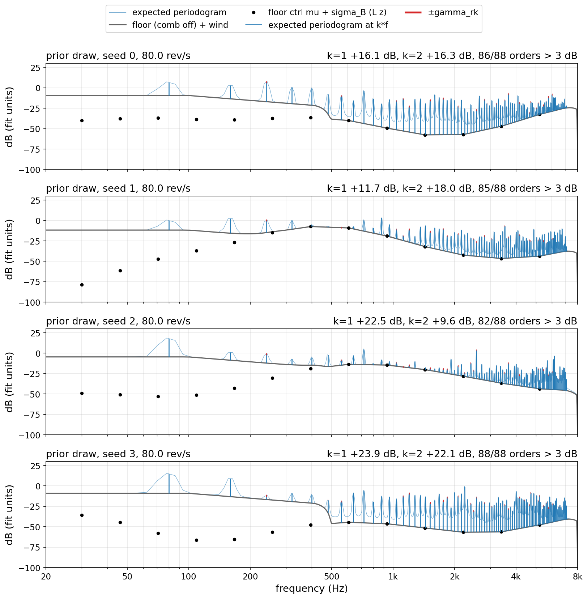
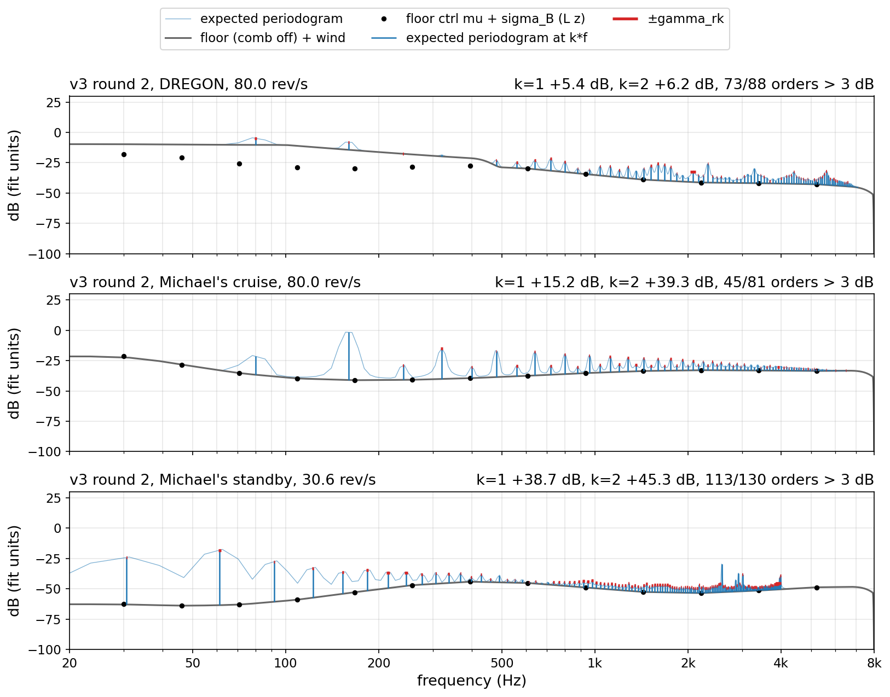
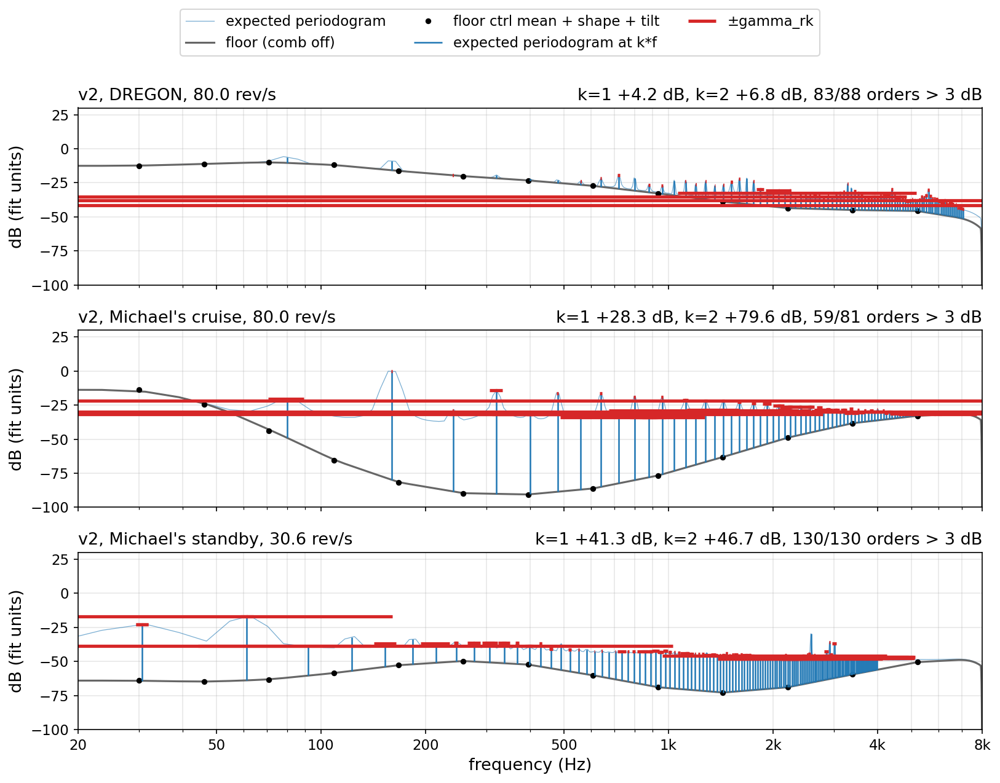

```{=html}
<style>
table td code, table th code, li code { overflow-wrap: anywhere; }
table { font-size: 0.9em; }
table td, table th { hyphens: none; }
</style>
```

```{python}
import json
from pathlib import Path

from IPython.display import Markdown

FD = json.loads(Path("noise-model-v3-latent-runaway/figdata.json").read_text())


def f(v, nd=2):
    s = f"{v:.{nd}f}"
    if float(s) == 0.0:
        s = s.lstrip("-")
    return s.replace("-", "−")


def pct(v):
    return f"{100 * v:.0f} %"
```

::: {.callout-note}
## Status

Discussion page, 2026-09-25. It answers one question from Dmitrii. Nothing
here is fitted. Every number comes from the committed fits. One script
makes every figure: `scripts/noise_v3_latent_runaway_figs.py`. It writes
every plotted number to
`docs/explainers/noise-model-v3-latent-runaway/figdata.json`. The model is
`docs/explainers/noise-model-v3-wander.qmd`. The campaign is
`docs/experiments/noise-model-v3.md`.
:::

# The question

Dmitrii asks two things.

1. How does the fit converge if the per-window latents keep growing?
2. What did the latents eat?

Short answers.

1. Two loops run. The inner loop is one fit. It stops. The outer loop
   changes the prior. It does not stop.
2. The latents eat rig error. Most of it is a static offset. The offset
   is the same in every window. Wander has no such offset.
3. Above 2 kHz the floor latents do a second job. They sink the floor.
   The lines take its power. The data does not ask for this.

# Words

One name per thing. Each name has one meaning on this page.

- **Window.** 8 s of real flight audio. The DREGON pool has five windows.
- **Block.** 0.5 s of one window. One window has 16 blocks.
- **Cell.** One periodogram value: one mic, one frame, one frequency bin.
  The DREGON fit reads 2 499 840 cells.
  <!-- source: fits_r2/dregon_room2_floor__flight_v3.json objective.n_cells -->
- **Rig.** The fitted numbers that all windows share. They include the
  line levels $p_{ik}$ and the line widths. They also include the floor
  shape and the speed laws.
- **Latent.** One number in dB per block of one window. It moves one level
  in that block only.
  - $d_i$: level of rotor $i$. All orders of the rotor move together.
  - $v_{ik}$: level of line $k$ of rotor $i$.
  - $u$: floor level. All frequencies move together.
  - $u_j$: floor colour at control point $j$. There are 14 control points,
    30 Hz to 8 kHz.
- **Leash.** The prior of one latent family. It is an OU process: a
  random walk that is pulled back to zero. $\sigma$ is its standard
  deviation, in dB. $\tau$ is its correlation time, in s.
- **Whittle term.** The data term of the fit. It is a sum over all cells,
  in nats.
- **Posterior variance.** The uncertainty of one fitted latent, in dB².
- **Move.** The change of the Whittle term between two rounds, per cell.
  Unit: nats per cell.
- **Static part.** The mean of a latent over all windows and all blocks.
  It is one offset, the same in every window.
- **Floor part.** The model with every line switched off.
- **Expected periodogram.** The periodogram the model predicts on average.
  One frame, mic mean, latents at zero.

No latent is per mic. $u_j$ is per control point, not per mic. All eight
mics share every latent. One fixed gain per mic divides the data before
the fit.[^defs]

[^defs]: `src/experiments/noise_model/model.py`, `class WindowLatents`:
    "`d` is `(R, B)` (per rotor, shared by its orders), `v` `(R, K, B)` (per
    line), `u` `(B,)` (floor level) and `uj` `(J, B)` (per floor control
    point)". The channel gains: `results/noise_v2/mic_gains/mic_gains.json`,
    applied by `model.flight_batch(channel_gains=…)`.

# 1. Two loops

Two loops run. They are different loops.

```{mermaid}
flowchart TD
  S["Leash: σ and τ per family.<br/>FIXED for the whole fit."] --> R0["Rig step, all latents at zero"]
  R0 --> L["Latent step, rig held"]
  L --> R["Rig step, latents held"]
  R --> Q{"move below 1e-4<br/>nats per cell?"}
  Q -- "no" --> L
  Q -- "yes: the fit stops" --> M["Moment update:<br/>σ̂² = mean square of the latents<br/>+ their posterior variance"]
  M -- "new leash, new fit" --> S
```

**Inner loop.** One fit.

1. Fix the leash. Round 1 uses the measured leash. Round 2 uses the first
   update, `mm1`.[^leash]
2. Fit the rig. Hold every latent at zero.
3. Fit the latents. Hold the rig.
4. Fit the rig. Hold the latents.
5. Compute the move. Below $10^{-4}$ nats per cell, stop. Else go to
   step 3.

**Outer loop.** One moment update.

1. Take the latents of one finished fit.
2. Per family, compute
   $\hat\sigma^2$ = mean square of the latents + their posterior variance.
3. Make $\hat\sigma$ the new leash. Run the inner loop again.
4. Stop when the new $\hat\sigma$ is within 10 % of the old one.

[^leash]: Measured leash: `results/noise_v3/wander/dregon.json`
    (`scripts/noise_v3_measure_wander.py`). First update:
    `results/noise_v3/wander/dregon_mm1.json`. Second update:
    `dregon_mm2.json`. Both from `scripts/noise_v3_moment_update.py`; the
    table is `results/noise_v3/wander/moment_update.md`.

{#fig-a}

The inner loop stops. The prior is fixed. So the latents stop.

Why it stops:

1. The leash does not change inside one fit.
2. So the objective is one fixed function.
3. Each step lowers it. It has a lower bound.
4. So the steps get smaller. The move falls below the stop line.

The numbers:

- Round 1 allows 5 rounds. No restart stops. The last move is about
  $10^{-3}$, ten times the stop line.
  <!-- source: figdata.json moves["r1/dregon_room2_floor/s0..s3"].move[4] = 1.01e-3, 1.03e-3, 9.2e-4, 1.10e-3 -->
- Round 2 allows 20 rounds. All four restarts stop, at rounds 20, 17, 15
  and 17. <!-- source: figdata.json moves["r2/dregon_room2_floor/s*"].rounds_run -->
- Cruise stops at rounds 10–11. Standby stops at rounds 6–8.
  <!-- source: figdata.json moves["r2/michaels_fly125_{cruise,standby}/s*"].rounds_run -->
- Rounds 1–5 of round 2 repeat round 1 within 20 %. The longer leash
  does not speed the loop. More rounds finish it.
  <!-- source: figdata.json moves, ratio r2/r1 per restart, rounds 1-5: max 1.19 (s2, round 5) -->

One fact matters later. The stop rule reads the Whittle move only. It
does not read the prior terms. A step that changes only the priors is
invisible to it.[^stop]

[^stop]: `src/experiments/noise_model/fit.py`, `fit_v3`: "repeating
    (ii)–(iii) until the Whittle term moves by less than
    `optim.tol_nats_per_cell` per cell". Each rig step is an L-BFGS run that
    stops on a relative objective change of $10^{-5}$ (`lbfgs_rtol`). In
    round 2 it stops after 2 iterations in every round. Each latent step
    uses 103–108 evaluations. Source: `optimiser.history` of the round-2
    fit, copied to `figdata.json` `whittle.r2.rig_lbfgs_iters` and
    `whittle.r2.latent_evals`.

# 2. The ladder

The outer loop is different. It changes the leash between fits.

{#fig-b}

Each fit stops. Then we make the leash longer. The latents walk further.
Then we measure the walk. We make the leash longer again.

The numbers, measured → update 1 → update 2:[^ladder]

- DREGON $u_j$: 1.52 → 3.99 → 7.04 dB.
- DREGON $d$: 0.94 → 1.94 → 2.50 dB.
- Cruise $d$: 0.52 → 1.12 → 2.46 dB.
- Cruise $u_j$: 1.63 → 3.63 → 6.19 dB.
- DREGON $v$, orders 9–24: 2.98 → 4.21 → 5.26 dB.
- One family settles: DREGON $v$, orders ≥ 61, 4.72 → 4.96 dB (+5 %).
- One family shrinks: DREGON $u$, 2.48 → 2.12 dB.
- DREGON $v$, orders 1–8, is pinned at 0. Its measured σ is 0.

[^ladder]: `results/noise_v3/wander/{dregon,michaels}{,_mm1,_mm2}.json`,
    copied to `figdata.json` `ladder`; the same numbers are in
    `results/noise_v3/wander/moment_update.md`.

The update is a fixed-point step, $\sigma_{n+1} = g(\sigma_n)$. It stops
only where $g(\sigma) = \sigma$. At every leash tried, $g(\sigma) > \sigma$
for most families. Section 3 shows why.

# 3. What the latents eat

## The tracks

{#fig-c}

Read the $u_j$ panel first.

- At 3 387 Hz, $u_j$ sits far below zero in all five windows.
- Its mean is −8.6 dB in round 1. It is −21.3 dB in round 2.
- The leash is 1.52 dB in round 1. It is 3.99 dB in round 2.
- At 71 Hz and 607 Hz, $u_j$ sits near +5 dB in all five windows.
  <!-- source: figdata.json tracks.r1/r2.uj_pool_mean_db (knots 71, 607, 3387 Hz: r1 4.2, 4.1, -8.6; r2 5.4, 5.3, -21.3); tracks.r1/r2.prior_sigma_db.u_j -->

Wander is an OU process with mean zero. A zero-mean process does not sit
at −21 dB in five flights. This offset is not wander. It is part of the
rig. The rig does not hold it. The latents hold it.

## The static part, per family

Split the mean square of each family into three parts:

1. **Static:** the pool mean per track. The same in every window.
2. **Between windows:** each window mean minus the static part.
3. **Within window:** each block minus its window mean.

```{python}
#| label: tbl-decomp
#| tbl-cap: "Mean square of the fitted latents, split into three parts. rms = root mean square of the recorded block latents (dB). 'rms without static' is what the moment update would see with the static part gone. Measured σ: `results/noise_v3/wander/<rig>.json`. Source: `figdata.json` `static_shares`."
meas = {
    "dregon_room2_floor": FD["ladder"]["dregon"]["steps"]["mm0"]["sigma_db"],
    "michaels_fly125_cruise": FD["ladder"]["michaels"]["steps"]["mm0"]["sigma_db"],
    "michaels_fly125_standby": FD["ladder"]["michaels"]["steps"]["mm0"]["sigma_db"],
}
fam_index = {name: i for i, name in enumerate(FD["ladder"]["dregon"]["families"])}
pool_name = {
    "dregon_room2_floor": "DREGON",
    "michaels_fly125_cruise": "cruise",
    "michaels_fly125_standby": "standby",
}
rows = [
    "| pool | round | family | rms dB | static | between | within | rms without static dB | measured σ dB |",
    "|---|---|---|---:|---:|---:|---:|---:|---:|",
]
for key, rec in FD["static_shares"].items():
    rnd, pool = key.split("/")
    for fam, x in rec["families"].items():
        if pool != "dregon_room2_floor" and fam not in ("d", "u", "u_j"):
            continue
        rows.append(
            f"| {pool_name[pool]} | {rnd[1]} | {fam} | {f(x['rms_db'])} | {pct(x['static_share'])} | "
            f"{pct(x['between_share'])} | {pct(x['within_share'])} | {f(x['rms_without_static_db'])} | "
            f"{f(meas[pool][fam_index[fam]])} |"
        )
Markdown("\n".join(rows))
```

What the table says:

- DREGON $u_j$, round 2: 88 % of its mean square is static.
- Remove the static part. The rms falls from 7.03 to 2.44 dB.
- Cruise $d$, round 2: 73 % static. Cruise $u_j$: 76 % static.
- The moment update counts the static part as wander.
- So a static rig error inflates $\hat\sigma$.
  <!-- source: figdata.json static_shares["r2/dregon_room2_floor"].families.u_j (static_share 0.88, rms 7.03, rms_without_static 2.44); ["r2/michaels_fly125_cruise"].families.d 0.73, u_j 0.76 -->

## Why the rig does not take the static part back

Test it. Move the static part of each family into the rig.

1. Lines: add the static $d_i + v_{ik}$ to the line level $p_{ik}$.
2. Floor: add the static $u + u_j$ to the floor control values.
   Solve for the floor weights $z$ exactly.
3. Subtract the same static part from the latents.
4. Evaluate the Whittle term again. Price the priors again.

The model does not change. The Whittle term is −18 129 671.8 nats before
and after. Only the prior terms change.
<!-- source: figdata.json whittle.ridge_r2.whittle_fit_nats, whittle_moved_nats -->

```{python}
#| label: tbl-ridge
#| tbl-cap: "Round-2 DREGON fit: the static part moved from the latents into the rig. Negative = the objective improves. The Whittle term does not change. For scale: the stop line is 1e-4 nats per cell = 250 nats per round. Source: `figdata.json` `whittle.ridge_r2`."
rt = FD["whittle"]["ridge_r2"]
names = {"d": "$d$", "v": "$v$", "u": "$u$", "uj": "$u_j$"}
rows = [
    "| static part moved | latent prior change | line level prior change | floor weight prior change | total change | floor weight norm |",
    "|---|---:|---:|---:|---:|---:|",
]
for key, lab in names.items():
    x = rt["families"][key]
    rows.append(
        f"| {lab} | {f(x['ou_prior_change_nats'], 1)} | {f(x['profile_prior_change_nats'], 1)} | "
        f"{f(x['z_prior_change_nats'], 1)} | **{f(x['total_change_nats'], 1)}** | {f(x['z_norm_new'])} |"
    )
x = rt["all"]
rows.append(
    f"| all four | {f(x['ou_prior_change_nats'], 1)} | {f(x['profile_prior_change_nats'], 1)} | "
    f"{f(x['z_prior_change_nats'], 1)} | **{f(x['total_change_nats'], 1)}** | {f(x['z_norm_new'])} |"
)
rows.append(f"| as fitted | | | | 0 | {f(rt['z_norm_fit'])} |")
Markdown("\n".join(rows))
```

Two answers come out.

**Lines: the rig is the cheaper home.**

- Moving the static $v$ saves 1 581 nats. Moving $d$ saves 22 nats.
- The inner loop did not find these nats.
- The move has no Whittle part. The stop rule cannot see it.
- Each rig step stops after 2 iterations. 17 rounds do not get there.
  <!-- source: figdata.json whittle.ridge_r2.families.v.total_change_nats -1580.8, .d -21.9; whittle.r2.rig_lbfgs_iters -->

**Floor colour: the latents are the cheaper home.**

- Moving the static $u_j$ costs 13 919 nats.
- The floor weight norm $\|z\|$ goes from 1.80 to 167.6.
- The rig floor prior is smooth across control points. It forbids this
  shape. Only $u_j$ can draw it.
  <!-- source: figdata.json whittle.ridge_r2.families.uj.total_change_nats 13919.0, z_norm_new 167.65, z_norm_fit 1.80 -->

## One window, up close

The widest $u_j$ tracks are in window 3 (updown). Its $u_j$ rms is
8.30 dB. The other four windows have 6.06–6.99 dB.
<!-- source: figdata.json window.uj_rms_per_window_db -->

{#fig-d}

**The gap the data shows.** Compare the data with the zero-latent model.

- The gap is smooth. Its 1/3-octave part has rms 1.28 dB.
- The gap is not on the lines. Bins on lines $k \le 24$ scatter 1.01 dB.
  Other bins scatter 1.01 dB.
- 0.5–1 kHz: the model is 0.8 dB too quiet.
- Above 2 kHz: the model is 1.0–1.6 dB too loud.
- The fitted latents follow the smooth gap: correlation 0.72.
  <!-- source: figdata.json window.verdict: smooth_rms_db 1.28, rough_rms_line_bins_db 1.01, rough_rms_other_bins_db 1.01, bands["500-1000"].gap_db +0.76, bands 2000-7900 gap -1.05..-1.58, corr_latent_vs_smooth_gap 0.72 -->

**The gap is a smooth shape, not lines.** The model is 0.8 dB too quiet
at 0.5–1 kHz. It is 1.0–1.6 dB too loud above 2 kHz.

**What the latents do.** Compare the two floor parts.

| band | data gap dB | total change by the latents dB | floor part change by the latents dB |
|---|---:|---:|---:|
| 0.5–1 kHz | +0.76 | +0.90 | +1.50 |
| 2–3 kHz | −1.25 | −1.04 | −8.21 |
| 3–4.5 kHz | −1.05 | −1.08 | −21.29 |
| 4.5–7.9 kHz | −1.58 | −1.44 | −5.56 |

<!-- source: figdata.json window.verdict.bands[*].gap_db, latent_fill_db, floor_shift_db -->

- At 3–4.5 kHz the latents sink the floor part by 21 dB.
- The total moves by 1.1 dB. The lines carry the power there.
- The floor part touches −69 dB at 3 391 Hz. The data sits near −37 dB.
  <!-- source: figdata.json window.floor_fit_db min -68.7 at 3390.6 Hz; window.data_mean_db mean over 3-4.5 kHz -37.3 -->

So the latents do two jobs.

1. **Job 1.** Fill the smooth gap. About 1 dB.
2. **Job 2.** Swap floor for lines above 2 kHz. Up to 21 dB.

The data does not ask for job 2. The Whittle term reads only the total.
The total barely moves. So the leash alone prices job 2. A longer leash
makes job 2 cheaper. The floor sinks deeper: −8.6 dB in round 1,
−21.3 dB in round 2, at 3 387 Hz. The next update reads the deeper
offset as wider wander. This is the runaway.

# 4. Who ate the low lines

The same estimator runs on five spectra. It uses the fit's own pool.[^est]

[^est]: Per frame and per rotor, take the cells at $-10 \ldots +10$ bins
    from $k f_r$. Average them over frames and mics. Line level = mean of
    the centre 3 cells. Local floor = median of the cells 5–10 bins away.
    Average the dB over the four rotors. The five spectra: the data, the
    v2 fit (`results/noise_v2/rounds/round5/fits/dregon_room2_floor__flight_profile.json`,
    evaluated on its own build), v3 round 1 and round 2 with latents at
    zero, and round 2 with the fitted latents. Source: `figdata.json`
    `profile`. The notebook's trajectory view uses another estimator on
    another trajectory. Its numbers differ.

{#fig-e}

At $k = 1$:

- The data line stands 6.6 dB over its floor. v2: 4.4 dB. v3: 3.5 dB
  (round 1), 3.6 dB (round 2).
- The v3 floor is 2.2 dB too high: −9.8 dB against −12.0 dB.
- The v3 line is 0.8 dB too low: −6.2 dB against −5.4 dB.
- The fitted latents do not help: 3.6 dB. $v$ is pinned at 0 for
  orders 1–8.
  <!-- source: figdata.json profile.{real,v2,r1,r2,r2_fitted_latents}.over_db[0] = 6.55, 4.38, 3.52, 3.58, 3.64; floor_db[0] real -11.95, r2 -9.78; line_db[0] real -5.40, r2 -6.20 -->

The floor is free. The floor rises. The low lines sink into it.

The floor prior is wide: $\sigma_B$ = 17.6 dB in both rounds. The runaway
does not cause this. Round 1 and round 2 agree at $k \le 2$.
<!-- source: fits{,_r2}/dregon_room2_floor__flight_v3.json params.floor.floor_shape_sd_db = 17.6043 both; figdata.json sources.floor_shape_sd_db -->

At orders 11–18 the round-2 rig sits low. Its line is 1.3 dB low. Its
floor is 1.8 dB low. Round 1 is within 0.5 dB. The fitted latents bring
round 2 back. So the round-2 rig leans on its latents. Take the latents
away. Then the round-2 rig loses 100 213 nats against the round-1 rig.
<!-- source: figdata.json profile.{r1,r2,r2_fitted_latents,real}.{line_db,floor_db}, mean over k 11-18 (r2 - real: line -1.26, floor -1.76; r1: -0.09, -0.50; r2 fitted: +0.47, +0.03); whittle.r1.whittle_zero_latents_nats -17783987.5, whittle.r2.whittle_zero_latents_nats -17683773.9 -->

# 5. Is it the mics?

No latent is per mic. But a per-mic effect could still push a shared
latent. Test it. Per block, per control point ≥ 500 Hz, per mic:

1. Residual = data level − zero-latent model level, in the control point's
   band, in dB.
2. Latent = $u + u_j$ at that control point, in dB.

The test uses 5 windows × 16 blocks × 6 control points = 480 points per
mic.

{#fig-f}

- Panel a, as fitted: r = 0.13. The −21 dB at 3 387 Hz has no partner in
  the data. There the latent spans −33 to −11 dB. The residual spans −2.1
  to +5.9 dB.
  <!-- source: figdata.json mics.x_db / mics.y_db (mic mean) at knot 3387.38 Hz -->
- Panel b: remove the static part. Now r = 0.47.
- Panel c: every mic tracks the latent alike, r = 0.31–0.44.
- Panel c: no mic tracks it alone. Each mic minus the mic mean:
  r = −0.19 to +0.14.
- Each mic differs from the mic mean by 1.70 dB (sd). No latent can
  take that. Half of it is a fixed colour per mic and control point.
- The rank test left 1.76 dB per mic above 500 Hz.[^rank] The two agree.
  <!-- source: figdata.json mics: r_common 0.13, r_common_within_knot 0.47, r_per_mic_within_knot 0.31..0.44, r_mic_part_per_mic_within_knot -0.19..0.14, sd_mic_deviation_db 1.70, mic_part_static_share 0.50 -->

The latents do not track the mics. They track the mic-mean residual,
r = 0.47 with the static part removed.

[^rank]: `results/noise_v2/mic_gains/findings.md`, quoted in
    `docs/explainers/noise-model-v3-wander.qmd` §2.5: one gain per mic,
    DREGON bands ≥ 500 Hz, residual 1.76 dB.

# 6. What a rig looks like

Three figures show the rig itself. No data enters them.[^view]

How to read one row:

- All rotors run at one speed. Their lines share one frequency.
- Grey: the floor part. On DREGON it holds the wind below 500 Hz.
- Black dots: the floor control values.
- Blue stems: the expected periodogram at $k f_r$, from the floor part up.
- Thin blue line: the whole expected periodogram.
- Red caps: $\pm\gamma$ of each line. The four rotors are overlaid.
- The y axis is the same in all three figures.

This view reads the model at one speed. Section 4 reads the pool. Their
numbers differ.

[^view]: The parameter view of `notebooks/noise_lab.ipynb`
    ("Parameter view — comb over floor, per rotor"), lifted into
    `notebooks/noise_lab.py` as `param_view` (the numbers) and
    `draw_param_view` (one pane). One 2048-point frame at 16 kHz, so the
    x axis ends at Nyquist, 8 kHz. Line over floor = stem height. The
    orders counted are the ones at or below 8 kHz. Source: `figdata.json`
    `rigs`.

## The prior

{#fig-g}

The prior thinks a rig is a loud comb over a wild floor.[^prior]

- Lines at $k = 1, 2$ stand 9.6–23.9 dB over the floor part.
- 82 to 88 of 88 orders clear 3 dB.
- The floor part at 1 kHz spans −50.7 to −15.4 dB.
- No width reaches 7 Hz. The widest is 6.8 Hz.
  <!-- source: figdata.json rigs.prior.s0..s3: over_k1_db 16.09, 11.75, 22.46, 23.90; over_k2_db 16.35, 17.95, 9.59, 22.08; n_orders_over 86, 85, 82, 88 of 88; floor_at_db["1000"] -50.71, -21.07, -15.41, -47.16; gamma_max_hz 5.91, 5.13, 4.97, 6.79 -->

[^prior]: The laws of `scripts/noise_v3_checks.py prior`
    (`prior_draw`), on the round-2 DREGON fit, `np.random.default_rng(seed)`:
    $\gamma_{rk} \sim$ HalfNormal($3 \cdot 0.01\,k$ Hz),
    $\sigma_\nu \sim$ HalfNormal(0.6 rad/s), line level
    $\sim \mathcal N(\hat p_{rk}, 10\text{ dB})$ about the measured level,
    floor $z \sim \mathcal N(0, I)$ at the measured $\sigma_B$ = 17.6 dB,
    wind $\sim \mathcal N$(measured, its sd). Latents at zero.

## The round-2 fits

{#fig-h}

The fits are weaker combs than the prior.

- DREGON: $k = 1$ stands 5.4 dB over the floor part. $k = 2$: 6.2 dB.
- DREGON: 73 of 88 orders clear 3 dB.
- Michael's lines stand higher: $k = 1$ 15.2 dB (cruise), 38.7 dB
  (standby).
- The widest lines: 42.6 Hz (DREGON), 29.3 Hz (cruise), 86.4 Hz (standby).
  <!-- source: figdata.json rigs.v3_r2.{dregon,cruise,standby}: over_k1_db 5.43, 15.16, 38.74; over_k2_db 6.22; n_orders_over 73/88; gamma_max_hz 42.59, 29.32, 86.39; rps 80, 80, 30.64; span_rev_s standby [20.93, 40.35] -->

## The v2 fits

{#fig-i}

v2 builds its floor out of lines.

- Its widest lines: 16 059 Hz (DREGON), 125 578 Hz (cruise).
- Look halfway between two lines near 1 kHz. v2 cruise sits
  43.0 dB over its floor part there. v3 cruise sits 1.5 dB over.
- The v2 cruise floor part is −74.5 dB at 1 kHz. The wide lines
  fill the gap above it.
- On DREGON the floor parts of v2 and v3 differ by 1.0–3.0 dB.
  <!-- source: figdata.json rigs.v2.{dregon,cruise}.gamma_max_hz 16059.0, 125578.0; rigs.v2.cruise.between_over_floor_db 43.03, rigs.v3_r2.cruise 1.49 (both at 1000 Hz); rigs.v2.cruise.floor_at_db["1000"] -74.55; floor_at_db 100/1000/4000 Hz: v2 dregon -11.48, -33.73, -45.23; v3 dregon -10.45, -35.14, -42.20 -->

```{python}
#| label: tbl-rigs
#| tbl-cap: "Every row of @fig-g, @fig-h and @fig-i. Line over floor = stem height. Orders > 3 dB counts the orders at or below 8 kHz. Floor = the floor part. Between lines = the expected periodogram over the floor part, halfway between the two lines around 1 kHz. Source: `figdata.json` `rigs`."
rg = FD["rigs"]
rig_label = {"dregon": "DREGON", "cruise": "cruise", "standby": "standby"}


def hz(v):
    return f"{v:,.0f}".replace(",", " ") if v >= 100 else f(v, 1)


rows = [
    "| figure | rig | rev/s | $k = 1$ dB | $k = 2$ dB | orders > 3 dB | max γ Hz | floor 100 Hz dB | floor 1 kHz dB | floor 4 kHz dB | between lines dB |",
    "|---|---|---:|---:|---:|---:|---:|---:|---:|---:|---:|",
]
for fig, gen, name in (("G", "prior", "prior, seed {}"), ("H", "v3_r2", "v3 {}"), ("I", "v2", "v2 {}")):
    for key, x in rg[gen].items():
        lab = name.format(key[1:] if gen == "prior" else rig_label[key])
        fl = x["floor_at_db"]
        rows.append(
            f"| {fig} | {lab} | {f(x['rps'], 1)} | {f(x['over_k1_db'], 1)} | {f(x['over_k2_db'], 1)} | "
            f"{x['n_orders_over']}/{x['n_orders_shown']} | {hz(x['gamma_max_hz'])} | {f(fl['100'], 1)} | "
            f"{f(fl['1000'], 1)} | {f(fl['4000'], 1)} | {f(x['between_over_floor_db'], 1)} |"
        )
Markdown("\n".join(rows))
```

## Listen

Now data enters. One real window per rig. Its own rotor track drives the
v2 fit and the round-2 v3 fit. All three clips have the same RMS.[^listen]

- DREGON: `free-flight_nosource_room2`, 50–60 s, 69.9–87.8 rev/s.
- Michael's: `FLY124`, 40–50 s, 67.2–98.4 rev/s.
- No fit saw either window.
<!-- source: figdata.json listen.rigs.dregon: recording free-flight_nosource_room2, offset_s 50.0, seconds 10.0, labels telemetry, rps_min 69.945, rps_max 87.7978; listen.rigs.michaels: recording FLY124, offset_s 40.0, rps_min 67.1837, rps_max 98.4491; listen.level ["window", 0.1], mic 0, seed 0; pools: fits_r2/*.json supports (DREGON free-flight @ audio start + 18 s, 8 s; Michael's FLY125 only) -->

[^listen]: `scripts/noise_v3_latent_runaway_figs.py --listen-only`, with
    the notebook's own calls from `notebooks/noise_lab.py`:
    `trajectory("real", ...)` and `real_clip` (the recording, same window),
    `render_all([V2Fit(rig), V3Fit(rig, round="r2")], seed=0, n_mics=1,
    level=("window", 0.1))`, `line_stats`, `spectrogram_figure`. Mic 0.
    Telemetry labels. RMS 0.1 for every clip. 16 kHz, 16-bit WAV in
    `noise-model-v3-latent-runaway/audio/`. The spectrograms of one figure
    share one colour scale: 45 dB down from the loudest row's 99.5th
    percentile. Line over floor: `line_stats`, the round-4 carrier-aligned
    prominence; "—" means the line does not clear its floor. LTAS distance:
    mean $|\Delta|$ of `revised_eval.absolute_ltas_bands` over its six
    bands from 100 Hz to 7 kHz, clip minus real. On Michael's every rotor
    stays above 65 rev/s, so both pairs render their cruise fit alone. The
    DREGON pool reads 18–26 s of the same flight. Michael's fits read
    `FLY125` only.

```{python}
from IPython.display import HTML

LISTEN_LABELS = {"real": "real recording", "v2": "v2 fit", "v3": "v3 round-2 fit"}


def db_cell(v):
    return "—" if v is None else f(v, 1)


def listen_players(rig):
    """One row per clip, in the figure's row order: the player and its numbers."""
    row = FD["listen"]["rigs"][rig]
    cell = "<td style='padding:4px 10px'>"
    out = [
        "<table style='border-collapse:collapse'>",
        "<tr><th style='text-align:left'>clip</th><th>listen</th>"
        "<th><i>k</i> = 1, dB</th><th><i>k</i> = 2, dB</th><th>LTAS distance, dB</th></tr>",
    ]
    for key, label in LISTEN_LABELS.items():
        c = row["clips"][key]
        k1, k2 = c["line_over_floor_db"][:2]
        dist = db_cell(c.get("ltas_mean_abs_db")) if key != "real" else ""
        out.append(
            f"<tr>{cell}<b>{label}</b></td>{cell}<audio controls preload='metadata' "
            f"src='noise-model-v3-latent-runaway/{c['wav']}'></audio></td>"
            f"{cell}{db_cell(k1)}</td>{cell}{db_cell(k2)}</td>{cell}{dist}</td></tr>"
        )
    out.append("</table>")
    return HTML("\n".join(out))
```

### DREGON

{#fig-j}

```{python}
listen_players("dregon")
```

- Real: $k = 1$ stands 4.4 dB over its floor. $k = 2$: 2.9 dB.
- v2: 5.7 and 7.6 dB. v3: 5.8 and 5.3 dB. Both models' lines stand too high.
- LTAS distance to real: v2 0.5 dB, v3 2.2 dB. v3 is 4.8 dB low at
  0.7–1.5 kHz.
- The real clip pulses below 1.5 kHz. v2 and v3 stay steady. v3 adds a
  lone line near 2.2 kHz.
  <!-- source: figdata.json listen.rigs.dregon.clips.{real,v2,v3}.line_over_floor_db[0:2] = 4.44, 2.89 / 5.65, 7.64 / 5.78, 5.33; .ltas_mean_abs_db v2 0.518, v3 2.160; v3.ltas_dev_db[700-1500 Hz] -4.814; pulses and the 2.2 kHz line: fig_j -->

### Michael's

{#fig-k}

```{python}
listen_players("michaels")
```

- Real: $k = 1$ does not clear its floor. $k = 2$ stands 18.7 dB over it.
- v2: 1.4 and 19.0 dB. v3: 1.6 and 18.1 dB. $k = 2$ matches within
  0.6 dB.
- LTAS distance to real: v2 1.3 dB, v3 2.9 dB. v3 is 7.0 dB too loud at
  5–7 kHz. v2 is 3.4 dB too loud there.
- v3 draws two bright lines near 1.6 and 3 kHz. They dip with rotor 1 at
  2 s. The real clip has no line that strong there.
  <!-- source: figdata.json listen.rigs.michaels.clips.{real,v2,v3}.line_over_floor_db[0:2] = null, 18.68 / 1.45, 19.00 / 1.63, 18.14; .ltas_mean_abs_db v2 1.266, v3 2.934; ltas_dev_db[5000-7000 Hz] v3 +6.981, v2 +3.435; lines: fig_k -->

# 7. What this means

1. The latents do not measure wander.
2. They absorb rig error: 88 % of the round-2 $u_j$ is one static shape.
3. A longer leash never converges: each update deepens the floor swap.
4. The next round holds σ at the measured values.
5. The missing piece: a measured floor level between the lines above 2 kHz.

The evidence for sentence 5. Above 2 kHz nothing tells floor from lines.
So the leash sets the split.

- @fig-d: at 3–4.5 kHz the floor part sinks 21 dB. The total moves
  1.1 dB.
- @fig-f, panel a: the −21 dB has no partner in the data. r = 0.13.
- @tbl-ridge: the rig floor cannot draw the notch. It costs 13 919 nats.
- @fig-c: the notch follows the leash. −8.6 dB at σ 1.52 dB. −21.3 dB at
  σ 3.99 dB.

# Appendix: the reconstruction

The script rebuilds the DREGON pool as the fit CLI built it. It uses five
windows, frame stride 4, 310 frames and the channel gains. It evaluates the
recorded rig and latents with `model.forward`.[^rec]

```{python}
#| label: tbl-whittle
#| tbl-cap: "Whittle term (nats) of the recomputed models on the fit's own pool. Source: `figdata.json` `whittle`."
w = FD["whittle"]
rows = [
    "| fit | recorded | recomputed, fitted latents | recomputed, latents at zero | round 0 (first rig, zero latents) |",
    "|---|---:|---:|---:|---:|",
]
for rnd in ("r1", "r2"):
    x = w[rnd]
    rows.append(
        f"| round {rnd[1]} | {f(x['whittle_recorded_nats'], 1)} | {f(x['whittle_fitted_latents_nats'], 1)} | "
        f"{f(x['whittle_zero_latents_nats'], 1)} | {f(x['whittle_round0_nats'], 1)} |"
    )
Markdown("\n".join(rows))
```

[^rec]: The recomputed Whittle term is 351–352 nats above the recorded
    one: $1.4 \times 10^{-4}$ nats per cell. The fits ran on a GPU. This
    page runs on a CPU. The cause is not traced. No figure depends on it.
