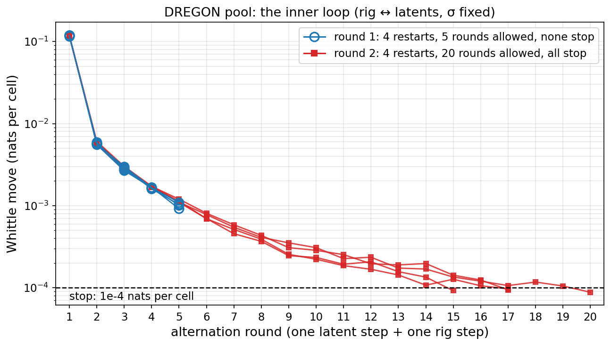
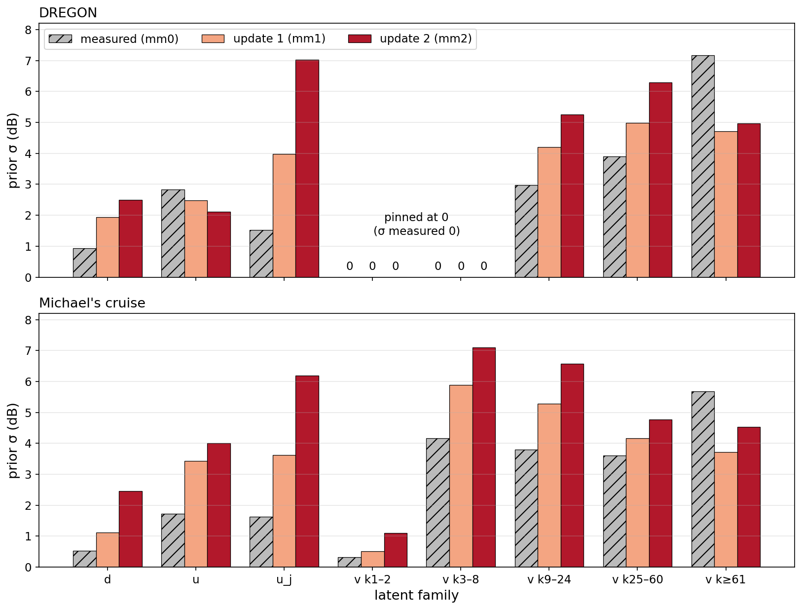
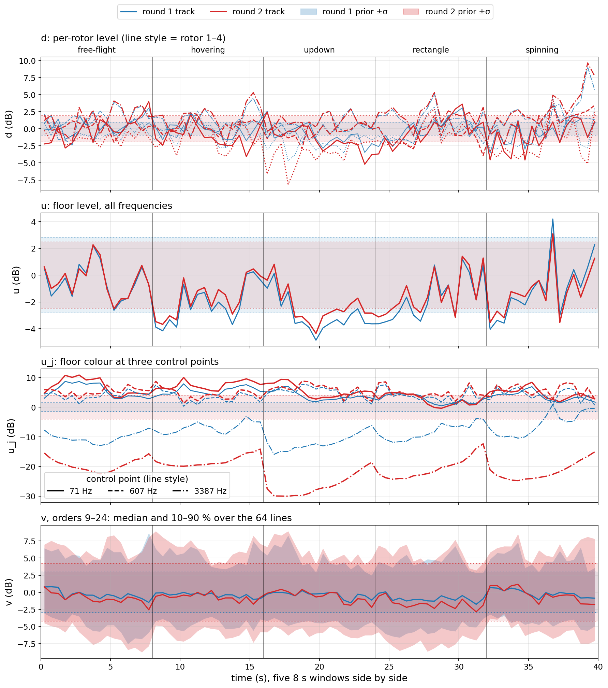
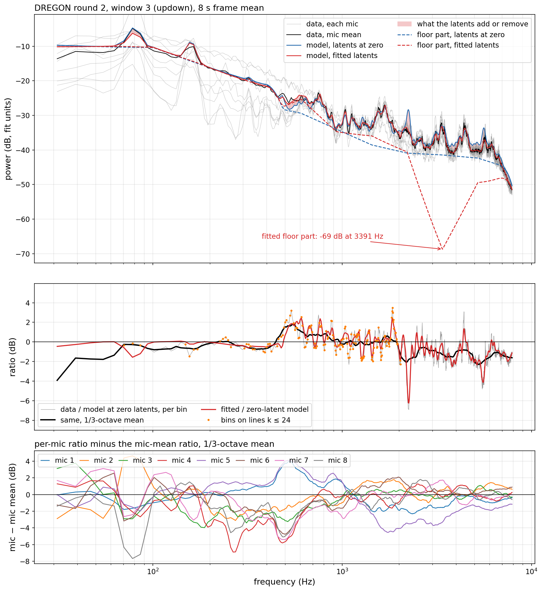
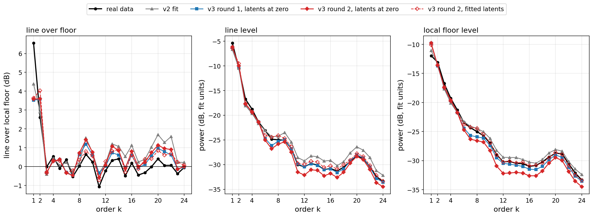
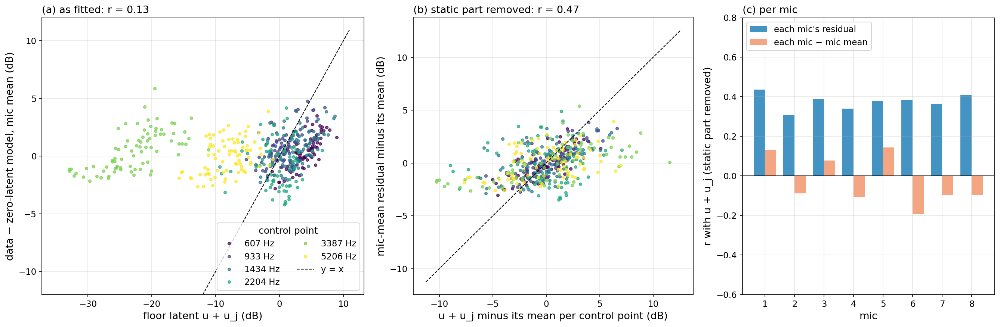
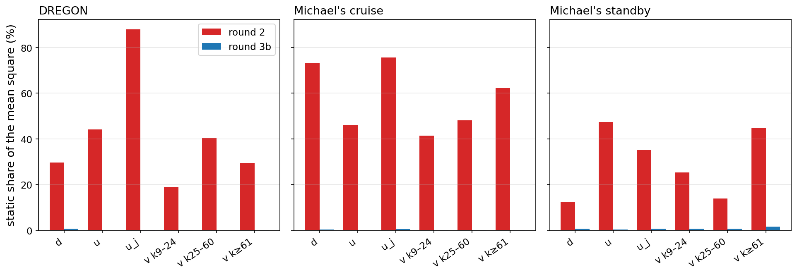

```{=html}
<style>
table td code, table th code, li code { overflow-wrap: anywhere; }
table { font-size: 0.9em; }
table td, table th { hyphens: none; }
</style>
```

```{python}
import json
from pathlib import Path

from IPython.display import Markdown

FD = json.loads(Path("noise-model-v3-latent-runaway/figdata.json").read_text())


def f(v, nd=2):
    s = f"{v:.{nd}f}"
    if float(s) == 0.0:
        s = s.lstrip("-")
    return s.replace("-", "−")


def pct(v):
    return f"{100 * v:.0f} %"
```

::: {.callout-note}
## Status

Discussion page, 2026-09-25. It answers one question from Dmitrii. §8
adds round 3 (2026-09-26). Since 2026-09-26 round 3b is the page's v3:
§ 6 shows it, and § 6 adds the legacy rigs. § 9 asks why the legacy hard
arm wins. Nothing here is fitted. Every number comes from the committed
fits. One script makes every figure of §§ 1–8:
`scripts/noise_v3_latent_runaway_figs.py`. It writes every plotted number
to `docs/explainers/noise-model-v3-latent-runaway/figdata.json`. The model
is `docs/explainers/noise-model-v3-wander.qmd`. The campaign is
`docs/experiments/noise-model-v3.md`.
:::

# The question

Dmitrii asks two things.

1. How does the fit converge if the per-window latents keep growing?
2. What did the latents eat?

Short answers.

1. Two loops run. The inner loop is one fit. It stops. The outer loop
   changes the prior. It does not stop.
2. The latents eat rig error. Most of it is a static offset. The offset
   is the same in every window. Wander has no such offset.
3. Above 2 kHz the floor latents do a second job. They sink the floor.
   The lines take its power. The data does not ask for this.

# Words

One name per thing. Each name has one meaning on this page.

- **Window.** 8 s of real flight audio. The DREGON pool has five windows.
- **Block.** 0.5 s of one window. One window has 16 blocks.
- **Cell.** One periodogram value: one mic, one frame, one frequency bin.
  The DREGON fit reads 2 499 840 cells.
  <!-- source: fits_r2/dregon_room2_floor__flight_v3.json objective.n_cells -->
- **Rig.** The fitted numbers that all windows share. They include the
  line levels $p_{ik}$ and the line widths. They also include the floor
  shape and the speed laws.
- **Latent.** One number in dB per block of one window. It moves one level
  in that block only.
  - $d_i$: level of rotor $i$. All orders of the rotor move together.
  - $v_{ik}$: level of line $k$ of rotor $i$.
  - $u$: floor level. All frequencies move together.
  - $u_j$: floor colour at control point $j$. There are 14 control points,
    30 Hz to 8 kHz.
- **Leash.** The prior of one latent family. It is an OU process: a
  random walk that is pulled back to zero. $\sigma$ is its standard
  deviation, in dB. $\tau$ is its correlation time, in s.
- **Whittle term.** The data term of the fit. It is a sum over all cells,
  in nats.
- **Posterior variance.** The uncertainty of one fitted latent, in dB².
- **Move.** The change of the Whittle term between two rounds, per cell.
  Unit: nats per cell.
- **Static part.** The mean of a latent over all windows and all blocks.
  It is one offset, the same in every window.
- **Floor part.** The model with every line switched off.
- **Expected periodogram.** The periodogram the model predicts on average.
  One frame, mic mean, latents at zero.

- **Legacy model.** The hand-written noise model of the `rig_easy` /
  `rig_hard` arms: `src/data_processing/stochastic_rotor_noise.py`.
- **Anchor fit.** One stage-2 fit of the legacy model to one real clip.
  Two anchors, one DREGON and one Michael's, hold both legacy banks.
- **Bank.** 2 048 rigs, drawn offline. A training window draws one entry.
  The legacy hard bank spreads its rigs along the path between the two
  anchors.
- **Arm.** One training run: one noise stream, one model.

No latent is per mic. $u_j$ is per control point, not per mic. All eight
mics share every latent. One fixed gain per mic divides the data before
the fit.[^defs]

[^defs]: `src/experiments/noise_model/model.py`, `class WindowLatents`:
    "`d` is `(R, B)` (per rotor, shared by its orders), `v` `(R, K, B)` (per
    line), `u` `(B,)` (floor level) and `uj` `(J, B)` (per floor control
    point)". The channel gains: `results/noise_v2/mic_gains/mic_gains.json`,
    applied by `model.flight_batch(channel_gains=…)`.

## The v3 model now

Round 3b is the page's v3. Its fits are
`results/noise_v3/fits_r3b/*__flight_v3.json`. §§ 1–7 tell how rounds 1
and 2 ran away. This is where the fit stands after round 3b.

**Priors.** Each law carries the commit that set it.

| site | prior | since |
|---|---|---|
| line width $\gamma_{rk}$ | $\gamma_{rk} / (0.01\,k\text{ Hz}) \sim$ HalfNormal(3) | `4e8cbc0d`, 2026-09-24 |
| phase noise $\sigma_\nu$ | HalfNormal(0.6 rad/s) | `4e8cbc0d`, 2026-09-24 |
| line level $p_{rk}$ | $\mathcal N(\hat p_{rk}, 10\text{ dB})$; $\hat p_{rk}$ = the measured level at $k f_r$ | `4e8cbc0d`, 2026-09-24 |
| floor weights $z$ | $\mathcal N(0, I)$; control values $\mu + \sigma_B (L z)_j$; $\mu$ and $\sigma_B$ measured | `4e8cbc0d`, 2026-09-24 |
| wind, DREGON, per mic | $\mathcal N$(measured level, 6 dB) | `4e8cbc0d`, 2026-09-24 |
| leash of every latent family | the measured σ and τ, fixed | measured at `8506a2c8`, 2026-09-24; back in the fit at `84509baa`, 2026-09-26 |
| $u_j$ across control points | correlated; kernel = the rig floor's own SE kernel, 1.5 octaves (`Wander.uj_corr_oct`) | `d512827b`, 2026-09-26 |

Round 2 used the leash update `mm1` instead of the measured leash. § 2
shows why that ran away.

**Fit.** Four restarts per pool. One restart:

1. **First rig step.** Latents at zero. 300 Adam steps, then L-BFGS.
2. **Latent step.** Each window's latents, rig held. L-BFGS, at most 100
   iterations.
3. **Ridge step.** The static part of each latent family moves into the
   rig. Closed form. The Whittle term does not change. Since `c589ceca`,
   2026-09-26.
4. **Rig step.** Latents held. L-BFGS on a stratified 64-frame subset
   (`f65179a7`, 2026-09-25). No early stop: each step runs its full
   150 + 75 iterations (`--lbfgs-rtol 0`, `84509baa`, 2026-09-26).
5. **Stop test.** The Whittle term and the total objective both move by
   less than $10^{-4}$ nats per cell. Else go to step 2. The total joined
   the test at `c589ceca`. At most 20 rounds.
6. **Polish.** One rig L-BFGS on all frames, then one more ridge step.

In the DREGON pick the rig L-BFGS never converges. It stops at its cap.
The alternation does converge. It stops after 10 rounds.
<!-- source: fits_r3b/dregon_room2_floor__flight_v3.json optimiser: rounds 20, rounds_run 10, alternation_converged true, rig_converged false, ridge_step true, first_rig.adam_steps 300, lbfgs_iters 150 + restart 75, lbfgs_frames 64 (polish: all 310), lbfgs_rtol null, latent_lbfgs_iters 100, tol 1e-4; priors.* as tabled; priors.wander.uj_corr_oct 1.5; git d512827b. Commits: git log -S -->

# 1. Two loops

Two loops run. They are different loops.

```{mermaid}
flowchart TD
  S["Leash: σ and τ per family.<br/>FIXED for the whole fit."] --> R0["Rig step, all latents at zero"]
  R0 --> L["Latent step, rig held"]
  L --> R["Rig step, latents held"]
  R --> Q{"move below 1e-4<br/>nats per cell?"}
  Q -- "no" --> L
  Q -- "yes: the fit stops" --> M["Moment update:<br/>σ̂² = mean square of the latents<br/>+ their posterior variance"]
  M -- "new leash, new fit" --> S
```

**Inner loop.** One fit.

1. Fix the leash. Round 1 uses the measured leash. Round 2 uses the first
   update, `mm1`.[^leash]
2. Fit the rig. Hold every latent at zero.
3. Fit the latents. Hold the rig.
4. Fit the rig. Hold the latents.
5. Compute the move. Below $10^{-4}$ nats per cell, stop. Else go to
   step 3.

**Outer loop.** One moment update.

1. Take the latents of one finished fit.
2. Per family, compute
   $\hat\sigma^2$ = mean square of the latents + their posterior variance.
3. Make $\hat\sigma$ the new leash. Run the inner loop again.
4. Stop when the new $\hat\sigma$ is within 10 % of the old one.

[^leash]: Measured leash: `results/noise_v3/wander/dregon.json`
    (`scripts/noise_v3_measure_wander.py`). First update:
    `results/noise_v3/wander/dregon_mm1.json`. Second update:
    `dregon_mm2.json`. Both from `scripts/noise_v3_moment_update.py`; the
    table is `results/noise_v3/wander/moment_update.md`.

{#fig-a}

The inner loop stops. The prior is fixed. So the latents stop.

Why it stops:

1. The leash does not change inside one fit.
2. So the objective is one fixed function.
3. Each step lowers it. It has a lower bound.
4. So the steps get smaller. The move falls below the stop line.

The numbers:

- Round 1 allows 5 rounds. No restart stops. The last move is about
  $10^{-3}$, ten times the stop line.
  <!-- source: figdata.json moves["r1/dregon_room2_floor/s0..s3"].move[4] = 1.01e-3, 1.03e-3, 9.2e-4, 1.10e-3 -->
- Round 2 allows 20 rounds. All four restarts stop, at rounds 20, 17, 15
  and 17. <!-- source: figdata.json moves["r2/dregon_room2_floor/s*"].rounds_run -->
- Cruise stops at rounds 10–11. Standby stops at rounds 6–8.
  <!-- source: figdata.json moves["r2/michaels_fly125_{cruise,standby}/s*"].rounds_run -->
- Rounds 1–5 of round 2 repeat round 1 within 20 %. The longer leash
  does not speed the loop. More rounds finish it.
  <!-- source: figdata.json moves, ratio r2/r1 per restart, rounds 1-5: max 1.19 (s2, round 5) -->

One fact matters later. The stop rule reads the Whittle move only. It
does not read the prior terms. A step that changes only the priors is
invisible to it.[^stop]

[^stop]: `src/experiments/noise_model/fit.py`, `fit_v3`: "repeating
    (ii)–(iii) until the Whittle term moves by less than
    `optim.tol_nats_per_cell` per cell". Each rig step is an L-BFGS run that
    stops on a relative objective change of $10^{-5}$ (`lbfgs_rtol`). In
    round 2 it stops after 2 iterations in every round. Each latent step
    uses 103–108 evaluations. Source: `optimiser.history` of the round-2
    fit, copied to `figdata.json` `whittle.r2.rig_lbfgs_iters` and
    `whittle.r2.latent_evals`.

# 2. The ladder

The outer loop is different. It changes the leash between fits.

{#fig-b}

Each fit stops. Then we make the leash longer. The latents walk further.
Then we measure the walk. We make the leash longer again.

The numbers, measured → update 1 → update 2:[^ladder]

- DREGON $u_j$: 1.52 → 3.99 → 7.04 dB.
- DREGON $d$: 0.94 → 1.94 → 2.50 dB.
- Cruise $d$: 0.52 → 1.12 → 2.46 dB.
- Cruise $u_j$: 1.63 → 3.63 → 6.19 dB.
- DREGON $v$, orders 9–24: 2.98 → 4.21 → 5.26 dB.
- One family settles: DREGON $v$, orders ≥ 61, 4.72 → 4.96 dB (+5 %).
- One family shrinks: DREGON $u$, 2.48 → 2.12 dB.
- DREGON $v$, orders 1–8, is pinned at 0. Its measured σ is 0.

[^ladder]: `results/noise_v3/wander/{dregon,michaels}{,_mm1,_mm2}.json`,
    copied to `figdata.json` `ladder`; the same numbers are in
    `results/noise_v3/wander/moment_update.md`.

The update is a fixed-point step, $\sigma_{n+1} = g(\sigma_n)$. It stops
only where $g(\sigma) = \sigma$. At every leash tried, $g(\sigma) > \sigma$
for most families. Section 3 shows why.

# 3. What the latents eat

## The tracks

{#fig-c}

Read the $u_j$ panel first.

- At 3 387 Hz, $u_j$ sits far below zero in all five windows.
- Its mean is −8.6 dB in round 1. It is −21.3 dB in round 2.
- The leash is 1.52 dB in round 1. It is 3.99 dB in round 2.
- At 71 Hz and 607 Hz, $u_j$ sits near +5 dB in all five windows.
  <!-- source: figdata.json tracks.r1/r2.uj_pool_mean_db (knots 71, 607, 3387 Hz: r1 4.2, 4.1, -8.6; r2 5.4, 5.3, -21.3); tracks.r1/r2.prior_sigma_db.u_j -->

Wander is an OU process with mean zero. A zero-mean process does not sit
at −21 dB in five flights. This offset is not wander. It is part of the
rig. The rig does not hold it. The latents hold it.

## The static part, per family

Split the mean square of each family into three parts:

1. **Static:** the pool mean per track. The same in every window.
2. **Between windows:** each window mean minus the static part.
3. **Within window:** each block minus its window mean.

```{python}
#| label: tbl-decomp
#| tbl-cap: "Mean square of the fitted latents, split into three parts. rms = root mean square of the recorded block latents (dB). 'rms without static' is what the moment update would see with the static part gone. Measured σ: `results/noise_v3/wander/<rig>.json`. Source: `figdata.json` `static_shares`."
meas = {
    "dregon_room2_floor": FD["ladder"]["dregon"]["steps"]["mm0"]["sigma_db"],
    "michaels_fly125_cruise": FD["ladder"]["michaels"]["steps"]["mm0"]["sigma_db"],
    "michaels_fly125_standby": FD["ladder"]["michaels"]["steps"]["mm0"]["sigma_db"],
}
fam_index = {name: i for i, name in enumerate(FD["ladder"]["dregon"]["families"])}
pool_name = {
    "dregon_room2_floor": "DREGON",
    "michaels_fly125_cruise": "cruise",
    "michaels_fly125_standby": "standby",
}
rows = [
    "| pool | round | family | rms dB | static | between | within | rms without static dB | measured σ dB |",
    "|---|---|---|---:|---:|---:|---:|---:|---:|",
]
for key, rec in FD["static_shares"].items():
    rnd, pool = key.split("/")
    for fam, x in rec["families"].items():
        if pool != "dregon_room2_floor" and fam not in ("d", "u", "u_j"):
            continue
        rows.append(
            f"| {pool_name[pool]} | {rnd[1]} | {fam} | {f(x['rms_db'])} | {pct(x['static_share'])} | "
            f"{pct(x['between_share'])} | {pct(x['within_share'])} | {f(x['rms_without_static_db'])} | "
            f"{f(meas[pool][fam_index[fam]])} |"
        )
Markdown("\n".join(rows))
```

What the table says:

- DREGON $u_j$, round 2: 88 % of its mean square is static.
- Remove the static part. The rms falls from 7.03 to 2.44 dB.
- Cruise $d$, round 2: 73 % static. Cruise $u_j$: 76 % static.
- The moment update counts the static part as wander.
- So a static rig error inflates $\hat\sigma$.
  <!-- source: figdata.json static_shares["r2/dregon_room2_floor"].families.u_j (static_share 0.88, rms 7.03, rms_without_static 2.44); ["r2/michaels_fly125_cruise"].families.d 0.73, u_j 0.76 -->

## Why the rig does not take the static part back

Test it. Move the static part of each family into the rig.

1. Lines: add the static $d_i + v_{ik}$ to the line level $p_{ik}$.
2. Floor: add the static $u + u_j$ to the floor control values.
   Solve for the floor weights $z$ exactly.
3. Subtract the same static part from the latents.
4. Evaluate the Whittle term again. Price the priors again.

The model does not change. The Whittle term is −18 129 671.8 nats before
and after. Only the prior terms change.
<!-- source: figdata.json whittle.ridge_r2.whittle_fit_nats, whittle_moved_nats -->

```{python}
#| label: tbl-ridge
#| tbl-cap: "Round-2 DREGON fit: the static part moved from the latents into the rig. Negative = the objective improves. The Whittle term does not change. For scale: the stop line is 1e-4 nats per cell = 250 nats per round. Source: `figdata.json` `whittle.ridge_r2`."
rt = FD["whittle"]["ridge_r2"]
names = {"d": "$d$", "v": "$v$", "u": "$u$", "uj": "$u_j$"}
rows = [
    "| static part moved | latent prior change | line level prior change | floor weight prior change | total change | floor weight norm |",
    "|---|---:|---:|---:|---:|---:|",
]
for key, lab in names.items():
    x = rt["families"][key]
    rows.append(
        f"| {lab} | {f(x['ou_prior_change_nats'], 1)} | {f(x['profile_prior_change_nats'], 1)} | "
        f"{f(x['z_prior_change_nats'], 1)} | **{f(x['total_change_nats'], 1)}** | {f(x['z_norm_new'])} |"
    )
x = rt["all"]
rows.append(
    f"| all four | {f(x['ou_prior_change_nats'], 1)} | {f(x['profile_prior_change_nats'], 1)} | "
    f"{f(x['z_prior_change_nats'], 1)} | **{f(x['total_change_nats'], 1)}** | {f(x['z_norm_new'])} |"
)
rows.append(f"| as fitted | | | | 0 | {f(rt['z_norm_fit'])} |")
Markdown("\n".join(rows))
```

Two answers come out.

**Lines: the rig is the cheaper home.**

- Moving the static $v$ saves 1 581 nats. Moving $d$ saves 22 nats.
- The inner loop did not find these nats.
- The move has no Whittle part. The stop rule cannot see it.
- Each rig step stops after 2 iterations. 17 rounds do not get there.
  <!-- source: figdata.json whittle.ridge_r2.families.v.total_change_nats -1580.8, .d -21.9; whittle.r2.rig_lbfgs_iters -->

**Floor colour: the latents are the cheaper home.**

- Moving the static $u_j$ costs 13 919 nats.
- The floor weight norm $\|z\|$ goes from 1.80 to 167.6.
- The rig floor prior is smooth across control points. It forbids this
  shape. Only $u_j$ can draw it.
  <!-- source: figdata.json whittle.ridge_r2.families.uj.total_change_nats 13919.0, z_norm_new 167.65, z_norm_fit 1.80 -->

## One window, up close

The widest $u_j$ tracks are in window 3 (updown). Its $u_j$ rms is
8.30 dB. The other four windows have 6.06–6.99 dB.
<!-- source: figdata.json window.uj_rms_per_window_db -->

{#fig-d}

**The gap the data shows.** Compare the data with the zero-latent model.

- The gap is smooth. Its 1/3-octave part has rms 1.28 dB.
- The gap is not on the lines. Bins on lines $k \le 24$ scatter 1.01 dB.
  Other bins scatter 1.01 dB.
- 0.5–1 kHz: the model is 0.8 dB too quiet.
- Above 2 kHz: the model is 1.0–1.6 dB too loud.
- The fitted latents follow the smooth gap: correlation 0.72.
  <!-- source: figdata.json window.verdict: smooth_rms_db 1.28, rough_rms_line_bins_db 1.01, rough_rms_other_bins_db 1.01, bands["500-1000"].gap_db +0.76, bands 2000-7900 gap -1.05..-1.58, corr_latent_vs_smooth_gap 0.72 -->

**The gap is a smooth shape, not lines.** The model is 0.8 dB too quiet
at 0.5–1 kHz. It is 1.0–1.6 dB too loud above 2 kHz.

**What the latents do.** Compare the two floor parts.

| band | data gap dB | total change by the latents dB | floor part change by the latents dB |
|---|---:|---:|---:|
| 0.5–1 kHz | +0.76 | +0.90 | +1.50 |
| 2–3 kHz | −1.25 | −1.04 | −8.21 |
| 3–4.5 kHz | −1.05 | −1.08 | −21.29 |
| 4.5–7.9 kHz | −1.58 | −1.44 | −5.56 |

<!-- source: figdata.json window.verdict.bands[*].gap_db, latent_fill_db, floor_shift_db -->

- At 3–4.5 kHz the latents sink the floor part by 21 dB.
- The total moves by 1.1 dB. The lines carry the power there.
- The floor part touches −69 dB at 3 391 Hz. The data sits near −37 dB.
  <!-- source: figdata.json window.floor_fit_db min -68.7 at 3390.6 Hz; window.data_mean_db mean over 3-4.5 kHz -37.3 -->

So the latents do two jobs.

1. **Job 1.** Fill the smooth gap. About 1 dB.
2. **Job 2.** Swap floor for lines above 2 kHz. Up to 21 dB.

The data does not ask for job 2. The Whittle term reads only the total.
The total barely moves. So the leash alone prices job 2. A longer leash
makes job 2 cheaper. The floor sinks deeper: −8.6 dB in round 1,
−21.3 dB in round 2, at 3 387 Hz. The next update reads the deeper
offset as wider wander. This is the runaway.

# 4. Who ate the low lines

The same estimator runs on five spectra. It uses the fit's own pool.[^est]

[^est]: Per frame and per rotor, take the cells at $-10 \ldots +10$ bins
    from $k f_r$. Average them over frames and mics. Line level = mean of
    the centre 3 cells. Local floor = median of the cells 5–10 bins away.
    Average the dB over the four rotors. The five spectra: the data, the
    v2 fit (`results/noise_v2/rounds/round5/fits/dregon_room2_floor__flight_profile.json`,
    evaluated on its own build), v3 round 1 and round 2 with latents at
    zero, and round 2 with the fitted latents. Source: `figdata.json`
    `profile`. The notebook's trajectory view uses another estimator on
    another trajectory. Its numbers differ.

{#fig-e}

At $k = 1$:

- The data line stands 6.6 dB over its floor. v2: 4.4 dB. v3: 3.5 dB
  (round 1), 3.6 dB (round 2).
- The v3 floor is 2.2 dB too high: −9.8 dB against −12.0 dB.
- The v3 line is 0.8 dB too low: −6.2 dB against −5.4 dB.
- The fitted latents do not help: 3.6 dB. $v$ is pinned at 0 for
  orders 1–8.
  <!-- source: figdata.json profile.{real,v2,r1,r2,r2_fitted_latents}.over_db[0] = 6.55, 4.38, 3.52, 3.58, 3.64; floor_db[0] real -11.95, r2 -9.78; line_db[0] real -5.40, r2 -6.20 -->

The floor is free. The floor rises. The low lines sink into it.

The floor prior is wide: $\sigma_B$ = 17.6 dB in both rounds. The runaway
does not cause this. Round 1 and round 2 agree at $k \le 2$.
<!-- source: fits{,_r2}/dregon_room2_floor__flight_v3.json params.floor.floor_shape_sd_db = 17.6043 both; figdata.json sources.floor_shape_sd_db -->

At orders 11–18 the round-2 rig sits low. Its line is 1.3 dB low. Its
floor is 1.8 dB low. Round 1 is within 0.5 dB. The fitted latents bring
round 2 back. So the round-2 rig leans on its latents. Take the latents
away. Then the round-2 rig loses 100 213 nats against the round-1 rig.
<!-- source: figdata.json profile.{r1,r2,r2_fitted_latents,real}.{line_db,floor_db}, mean over k 11-18 (r2 - real: line -1.26, floor -1.76; r1: -0.09, -0.50; r2 fitted: +0.47, +0.03); whittle.r1.whittle_zero_latents_nats -17783987.5, whittle.r2.whittle_zero_latents_nats -17683773.9 -->

# 5. Is it the mics?

No latent is per mic. But a per-mic effect could still push a shared
latent. Test it. Per block, per control point ≥ 500 Hz, per mic:

1. Residual = data level − zero-latent model level, in the control point's
   band, in dB.
2. Latent = $u + u_j$ at that control point, in dB.

The test uses 5 windows × 16 blocks × 6 control points = 480 points per
mic.

{#fig-f}

- Panel a, as fitted: r = 0.13. The −21 dB at 3 387 Hz has no partner in
  the data. There the latent spans −33 to −11 dB. The residual spans −2.1
  to +5.9 dB.
  <!-- source: figdata.json mics.x_db / mics.y_db (mic mean) at knot 3387.38 Hz -->
- Panel b: remove the static part. Now r = 0.47.
- Panel c: every mic tracks the latent alike, r = 0.31–0.44.
- Panel c: no mic tracks it alone. Each mic minus the mic mean:
  r = −0.19 to +0.14.
- Each mic differs from the mic mean by 1.70 dB (sd). No latent can
  take that. Half of it is a fixed colour per mic and control point.
- The rank test left 1.76 dB per mic above 500 Hz.[^rank] The two agree.
  <!-- source: figdata.json mics: r_common 0.13, r_common_within_knot 0.47, r_per_mic_within_knot 0.31..0.44, r_mic_part_per_mic_within_knot -0.19..0.14, sd_mic_deviation_db 1.70, mic_part_static_share 0.50 -->

The latents do not track the mics. They track the mic-mean residual,
r = 0.47 with the static part removed.

[^rank]: `results/noise_v2/mic_gains/findings.md`, quoted in
    `docs/explainers/noise-model-v3-wander.qmd` §2.5: one gain per mic,
    DREGON bands ≥ 500 Hz, residual 1.76 dB.

# 6. What a rig looks like

Six figures show a rig itself. No data enters them.[^view]

- @fig-g: the v3 prior.
- @fig-h: the v3 fits, round 3b.
- @fig-i: the v2 fits.
- @fig-i2: the legacy anchor fits.
- @fig-i3: two rigs of the legacy hard bank.
- @fig-h2, in § 8: the round-2 v3 fits.

How to read one row:

- All rotors run at one speed. Their lines share one frequency.
- Grey: the floor part. On v3 DREGON it holds the wind below 500 Hz.
- Black dots: the floor control values.
- Blue stems: the expected periodogram at $k f_r$, from the floor part up.
- Thin blue line: the whole expected periodogram.
- Red caps: $\pm\gamma$ of each line.
- The radio above each figure picks the rotors. **all rotors**: every
  comb on, the four rotors' caps overlaid. **rotor N**: only rotor N's
  comb on, only its caps.
- The y axis is the same in every figure.

This view reads the model at one speed. Section 4 reads the pool. Their
numbers differ.

[^view]: The parameter view of `notebooks/noise_lab.ipynb`
    ("Parameter view — comb over floor, per rotor"), lifted into
    `notebooks/noise_lab.py` as `param_view` (the numbers) and
    `draw_param_view` (one pane). One 2048-point frame at 16 kHz, so the
    x axis ends at Nyquist, 8 kHz. Line over floor = stem height. The
    orders counted are the ones below 8 kHz. One rotor alone: the other
    rotors' `profile_db` set to −300 dB, the view's own switch
    (`scripts/noise_v3_latent_runaway_figs.py`, `solo_fit`). Source:
    `figdata.json` `rigs`; per rotor `rigs.<group>.<rig>.rotors`.

```{python}
import base64

RIG_FIGS = (
    "fig_g_prior_rigs",
    "fig_h_v3_rigs",
    "fig_i_v2_rigs",
    "fig_i2_legacy_fits",
    "fig_i3_legacy_bank",
    "fig_h2_v3_r2_rigs",
)
ROTOR_CHOICES = {
    "all rotors": "all",
    "rotor 1": "rotor1",
    "rotor 2": "rotor2",
    "rotor 3": "rotor3",
    "rotor 4": "rotor4",
}


def png_uri(path):
    return "data:image/png;base64," + base64.b64encode(Path(path).read_bytes()).decode()


ojs_define(
    rig_png={
        fig: {
            label: png_uri(f"noise-model-v3-latent-runaway/{fig}_{key}.png")
            for label, key in ROTOR_CHOICES.items()
        }
        for fig in RIG_FIGS
    }
)
```

## The prior

::: {#fig-g}

```{ojs}
viewof rotor_g = Inputs.radio(Object.keys(rig_png.fig_g_prior_rigs), {value: "all rotors", label: "show"})
```

```{ojs}
html``
```

**What you see:** four rigs drawn from the v3 prior, seeds 0–3, DREGON
geometry, all rotors at 80 rev/s.

:::

The prior thinks a rig is a loud comb over a wild floor.[^prior]

- Lines at $k = 1, 2$ stand 9.6–23.9 dB over the floor part.
- 82 to 88 of 88 orders clear 3 dB.
- The floor part at 1 kHz spans −50.7 to −15.4 dB.
- No width reaches 7 Hz. The widest is 6.8 Hz.
- One rotor alone is a weaker comb. Its $k = 1$ spans 0.1–23.7 dB.
  <!-- source: figdata.json rigs.prior.s0..s3: over_k1_db 16.09, 11.75, 22.46, 23.90; over_k2_db 16.35, 17.95, 9.59, 22.08; n_orders_over 86, 85, 82, 88 of 88; floor_at_db["1000"] -50.71, -21.07, -15.41, -47.16; gamma_max_hz 5.91, 5.13, 4.97, 6.79; rotors[*].over_k1_db min 0.1 (s2 r1), max 23.7 (s3 r4) -->

[^prior]: The laws of `scripts/noise_v3_checks.py prior`
    (`prior_draw`), on the round-3b DREGON fit, `np.random.default_rng(seed)`:
    $\gamma_{rk} \sim$ HalfNormal($3 \cdot 0.01\,k$ Hz),
    $\sigma_\nu \sim$ HalfNormal(0.6 rad/s), line level
    $\sim \mathcal N(\hat p_{rk}, 10\text{ dB})$ about the measured level,
    floor $z \sim \mathcal N(0, I)$ at the measured $\sigma_B$ = 17.6 dB,
    wind $\sim \mathcal N$(measured, its sd). Latents at zero. Round 2 and
    round 3b measured the same pool, so the draws are the round-2 draws.

## The v3 fits

::: {#fig-h}

```{ojs}
viewof rotor_h = Inputs.radio(Object.keys(rig_png.fig_h_v3_rigs), {value: "all rotors", label: "show"})
```

```{ojs}
html``
```

**What you see:** the round-3b v3 fits, latents at zero. DREGON and
Michael's cruise at 80 rev/s. Standby at 30.6 rev/s, the middle of its
20.9–40.3 rev/s span.

:::

The fits are weaker combs than the prior on DREGON. They are denser combs
on Michael's.

- DREGON: $k = 1$ stands 3.7 dB over the floor part. $k = 2$: 5.7 dB.
- DREGON: 83 of 88 orders clear 3 dB. No DREGON rotor alone clears 2.1 dB
  at $k = 1$.
- Cruise: $k = 1$ 13.5 dB, $k = 2$ 40.2 dB. 79 of 81 orders clear 3 dB.
- Standby: its floor part sinks to −70.6 dB at 100 Hz. So its low lines
  stand 70 dB over it.
- The widest lines: 15.8 Hz (DREGON), 26.9 Hz (cruise), 11.1 Hz (standby).
- Halfway between two lines near 1 kHz the comb adds 0.3–6.8 dB over the
  floor part.
  <!-- source: figdata.json rigs.v3_r3b.{dregon,cruise,standby}: over_k1_db 3.67, 13.52, 70.08; over_k2_db 5.67, 40.16, 70.88; n_orders_over 83/88, 79/81, 130/130; gamma_max_hz 15.77, 26.89, 11.10; floor_at_db["100"] standby -70.62; between_over_floor_db 0.32, 2.90, 6.81; dregon rotors[*].over_k1_db 0.2, 2.1, 0.8, 1.7; span_rev_s standby [20.93, 40.35] -->

## The v2 fits

::: {#fig-i}

```{ojs}
viewof rotor_i = Inputs.radio(Object.keys(rig_png.fig_i_v2_rigs), {value: "all rotors", label: "show"})
```

```{ojs}
html``
```

**What you see:** the v2 fits, same axes as @fig-h. Red bars that cross
the whole axis are lines wider than the axis.

:::

v2 builds its floor out of lines.

- Its widest lines: 16 059 Hz (DREGON), 125 578 Hz (cruise).
- Look halfway between two lines near 1 kHz. v2 cruise sits
  43.0 dB over its floor part there. v3 cruise sits 2.9 dB over.
- The v2 cruise floor part is −74.5 dB at 1 kHz. The wide lines
  fill the gap above it.
- On DREGON the floor parts of v2 and v3 agree within 2 dB up to 1 kHz.
  At 4 kHz v3 sits 7.8 dB lower.
  <!-- source: figdata.json rigs.v2.{dregon,cruise}.gamma_max_hz 16059.0, 125578.0; rigs.v2.cruise.between_over_floor_db 43.03, rigs.v3_r3b.cruise 2.90 (both at 1000 Hz); rigs.v2.cruise.floor_at_db["1000"] -74.55; floor_at_db 100/1000/4000 Hz: v2 dregon -11.48, -33.73, -45.23; v3_r3b dregon -9.58, -33.72, -53.06 -->

## The legacy anchor fits

The legacy arms train on banks. Both banks are drawn around two anchor
fits: DREGON `free-flight_nosource_room2_cruise_00` and Michael's
`fly125_cruise_00`.[^anchors] @fig-i2 shows the two anchors. Each is built
as a bank entry with no perturbation.

::: {#fig-i2}

```{ojs}
viewof rotor_i2 = Inputs.radio(Object.keys(rig_png.fig_i2_legacy_fits), {value: "all rotors", label: "show"})
```

```{ojs}
html``
```

**What you see:** the two legacy anchor fits, all rotors at 80 rev/s,
wander at 0 dB, same axes as @fig-h.

:::

How the legacy parameters map onto this view:

- The legacy model has no expected periodogram. So the blue line is the
  mean periodogram of a 12 s render, 8 mics.
- The wander and the label error are zero. So every shaft turns at
  80 rev/s.
- A red cap is the Lorentzian half width $\gamma_0 + \gamma_1 k$.
- At $k = 1, 2$ most power is a steady tone instead. There the cap
  overstates the width.
- The level is the render's own, not the v3 fit's. Every training window
  is rescaled anyway. Read shapes, not absolute dB.

[^anchors]: `data/rig_banks/rig_{easy,hard}_n2048.json`
    `provenance.anchors`: `results/S2/cruise_8clip.json:fly125_cruise_00`
    and `results/S2/dregon_room2_cruise_refined.json:free-flight_nosource_room2_cruise_00`,
    physical level. Built by `noise_lab.LegacyFit(name)`
    (`dynamics="donor"`, `rig_sampler.entry_params`): the donor policy's
    dynamics with the fit's identity on top, speed exponents bounded, line
    mode `fm`. The view: `legacy_view` of
    `scripts/noise_v3_latent_runaway_figs.py`. The stream's per-window
    rules at a hover of 80 rev/s (`StochasticNoisePool.render`); every
    wander process at 0 dB; shaft offset 0; one seed, so the comb-off render
    shares the floor's noise. Its floor matches the closed-form floor
    within 0.15 dB rms. Tone share of order $k$:
    $w_k = \exp(-(k / k_{1/2})^2)$, $k_{1/2}$ = `coherence_k_half`; $w_1$ =
    0.70–0.84, $w_2$ = 0.24–0.49, $w_3 \le 0.20$ over the four legacy rigs.
    The tone's width comes from the shaft jitter, not from $\gamma$.

## Two legacy hard-bank rigs

::: {#fig-i3}

```{ojs}
viewof rotor_i3 = Inputs.radio(Object.keys(rig_png.fig_i3_legacy_bank), {value: "all rotors", label: "show"})
```

```{ojs}
html``
```

**What you see:** entries 0 and 1 of the legacy hard bank
(`data/rig_banks/rig_hard_n2048.json`), the bank `rig_hard_scv2_unified`
trained on. Same view and axes as @fig-i2.

:::

The first two entries are shown. They are not picked. The mapping of
@fig-i2 holds.

The legacy combs tower over their floor.

- $k = 1$ stands 14.1–33.9 dB over the floor part. $k = 2$: 31.4–47.4 dB.
  v3 DREGON: 3.7 and 5.7 dB.
- The two bank rigs light 98 and 99 of 99 orders over 3 dB.
- The lines are wide: up to 34–57 Hz at the top orders. Their skirts fill
  the space between lines. Halfway between two lines near 1 kHz the comb
  sits 13.7–28.6 dB over the floor part. v3: 0.3–6.8 dB.
- The legacy floor has no wind. At 100 Hz it sits at −31 to −24 dB. v3
  DREGON: −9.6 dB.
- One rotor alone differs a lot. In entry 0, rotor 2 holds $k = 1$ at
  32.2 dB. Rotor 1 holds it at 0.2 dB.
  <!-- source: figdata.json rigs.legacy_fit.{dregon,michael}, rigs.legacy_bank.{e0,e1}: over_k1_db 33.93, 14.05, 32.58, 25.98; over_k2_db 47.40, 31.42, 44.12, 43.54; n_orders_over 49/99, 72/99, 98/99, 99/99; gamma_max_hz 34.00, 56.69, 50.09, 49.84; between_over_floor_db 13.75, 21.44, 28.56, 24.95; floor_at_db["100"] -30.86, -28.18, -26.31, -24.32; e0 rotors[1].over_k1_db 32.2, rotors[0] 0.2; v3_r3b as above -->

```{python}
#| label: tbl-rigs
#| tbl-cap: "Every row of @fig-g, @fig-h, @fig-i, @fig-i2 and @fig-i3, all rotors. Line over floor = stem height. Orders > 3 dB counts the orders below 8 kHz. Floor = the floor part. Between lines = the expected periodogram over the floor part, halfway between the two lines around 1 kHz. Legacy rows: the render's own level. Source: `figdata.json` `rigs`."
rg = FD["rigs"]
rig_label = {
    "dregon": "DREGON",
    "cruise": "cruise",
    "standby": "standby",
    "michael": "Michael's cruise",
}


def hz(v):
    return f"{v:,.0f}".replace(",", " ") if v >= 100 else f(v, 1)


def rig_name(gen, key, name):
    if gen in ("prior", "legacy_bank"):
        return name.format(key[1:])
    return name.format(rig_label[key])


rows = [
    "| figure | rig | rev/s | $k = 1$ dB | $k = 2$ dB | orders > 3 dB | max γ Hz | floor 100 Hz dB | floor 1 kHz dB | floor 4 kHz dB | between lines dB |",
    "|---|---|---:|---:|---:|---:|---:|---:|---:|---:|---:|",
]
for fig, gen, name in (
    ("G", "prior", "prior, seed {}"),
    ("H", "v3_r3b", "v3 {}"),
    ("I", "v2", "v2 {}"),
    ("I2", "legacy_fit", "legacy anchor, {}"),
    ("I3", "legacy_bank", "legacy hard bank, entry {}"),
):
    for key, x in rg[gen].items():
        fl = x["floor_at_db"]
        rows.append(
            f"| {fig} | {rig_name(gen, key, name)} | {f(x['rps'], 1)} | {f(x['over_k1_db'], 1)} | "
            f"{f(x['over_k2_db'], 1)} | {x['n_orders_over']}/{x['n_orders_shown']} | "
            f"{hz(x['gamma_max_hz'])} | {f(fl['100'], 1)} | {f(fl['1000'], 1)} | {f(fl['4000'], 1)} | "
            f"{f(x['between_over_floor_db'], 1)} |"
        )
Markdown("\n".join(rows))
```

## Listen

Now data enters. One real window per rig. Its own rotor track drives the
v2 fit and the round-3b v3 fit. All three clips have the same RMS.[^listen]

- DREGON: `free-flight_nosource_room2`, 50–60 s, 69.9–87.8 rev/s.
- Michael's: `FLY124`, 40–50 s, 67.2–98.4 rev/s.
- No fit saw either window.
<!-- source: figdata.json listen.rigs.dregon: recording free-flight_nosource_room2, offset_s 50.0, seconds 10.0, labels telemetry, rps_min 69.945, rps_max 87.7978; listen.rigs.michaels: recording FLY124, offset_s 40.0, rps_min 67.1837, rps_max 98.4491; listen.level ["window", 0.1], mic 0, seed 0; pools: fits_r3b/*.json supports (DREGON free-flight @ audio start + 18 s, 8 s; Michael's FLY125 only) -->

[^listen]: `scripts/noise_v3_latent_runaway_figs.py --listen-only`, with
    the notebook's own calls from `notebooks/noise_lab.py`:
    `trajectory("real", ...)` and `real_clip` (the recording, same window),
    `render_all([V2Fit(rig), V3Fit(rig, round="r3b")], seed=0, n_mics=1,
    level=("window", 0.1))`, `line_stats`, `spectrogram_figure`. Mic 0.
    Telemetry labels. RMS 0.1 for every clip. 16 kHz, 16-bit WAV in
    `noise-model-v3-latent-runaway/audio/`. The spectrograms of one figure
    share one colour scale: 45 dB down from the loudest row's 99.5th
    percentile. Line over floor: `line_stats`, the round-4 carrier-aligned
    prominence; "—" means the line does not clear its floor. LTAS distance:
    mean $|\Delta|$ of `revised_eval.absolute_ltas_bands` over its six
    bands from 100 Hz to 7 kHz, clip minus real. On Michael's every rotor
    stays above 65 rev/s, so both pairs render their cruise fit alone. The
    DREGON pool reads 18–26 s of the same flight. Michael's fits read
    `FLY125` only.

```{python}
from IPython.display import HTML

LISTEN_LABELS = {"real": "real recording", "v2": "v2 fit", "v3_r3b": "v3 fit (round 3b)"}


def db_cell(v):
    return "—" if v is None else f(v, 1)


def listen_players(fd, rig, keys):
    """One row per clip of ``fd`` (a figdata file), in the figure's row order:
    the player and its numbers."""
    row = fd["listen"]["rigs"][rig]
    cell = "<td style='padding:4px 10px'>"
    out = [
        "<table style='border-collapse:collapse'>",
        "<tr><th style='text-align:left'>clip</th><th>listen</th>"
        "<th><i>k</i> = 1, dB</th><th><i>k</i> = 2, dB</th><th>LTAS distance, dB</th></tr>",
    ]
    for key, label in keys.items():
        c = row["clips"][key]
        k1, k2 = c["line_over_floor_db"][:2]
        dist = db_cell(c.get("ltas_mean_abs_db")) if key != "real" else ""
        out.append(
            f"<tr>{cell}<b>{label}</b></td>{cell}<audio controls preload='metadata' "
            f"src='noise-model-v3-latent-runaway/{c['wav']}'></audio></td>"
            f"{cell}{db_cell(k1)}</td>{cell}{db_cell(k2)}</td>{cell}{dist}</td></tr>"
        )
    out.append("</table>")
    return HTML("\n".join(out))
```

### DREGON

{#fig-j}

```{python}
listen_players(FD, "dregon", LISTEN_LABELS)
```

- Real: $k = 1$ stands 4.4 dB over its floor. $k = 2$: 2.9 dB.
- v2: 5.7 and 7.6 dB. v3: 4.6 and 5.0 dB. v3 $k = 1$ is within 0.2 dB
  of real.
- LTAS distance to real: v2 0.5 dB, v3 3.6 dB. v3 is 3.8–5.9 dB low at
  0.3–5 kHz.
- That deficit is mostly a level artefact. Mic 0's static wind is fitted
  too loud for this window. The RMS match then pulls every band down.
  Matched above 500 Hz, v3 is within 0.8 dB at 0.7–5 kHz.[^gap]
- The real clip pulses below 1.5 kHz. v2 and v3 stay steady.
  <!-- source: figdata.json listen.rigs.dregon.clips.{real,v2,v3_r3b}.line_over_floor_db[0:2] = 4.44, 2.89 / 5.65, 7.64 / 4.62, 4.95; .ltas_mean_abs_db v2 0.518, v3_r3b 3.610; v3_r3b.ltas_dev_db [-0.50, -3.83, -5.88, -4.43, -4.92, -2.10]; results/noise_v3/diag/ltas_gap_dregon.md Verdict + T0 (>= 500 Hz match -0.5 / +0.1 / -0.8 dB at 0.7-5 kHz); pulses: fig_j -->

[^gap]: `results/noise_v3/diag/ltas_gap_dregon.md`
    (`scripts/noise_v3_ltas_gap.py`, commit `8c9d0ac7`). On its own five
    windows the round-3b render expectation matches the data within 0.7 dB
    below 5 kHz. On this window mic 0's fitted wind (−5.3 dB) sits 4 dB
    over what the window asks for (−9.3 dB). 78 % of the real clip's power
    lies below 300 Hz. So the full-band RMS match takes 3.5 dB off every
    band.

### Michael's

{#fig-k}

```{python}
listen_players(FD, "michaels", LISTEN_LABELS)
```

- Real: $k = 1$ does not clear its floor. $k = 2$ stands 18.7 dB over it.
- v2: 1.4 and 19.0 dB. v3: 0.9 and 18.1 dB. $k = 2$ matches within
  0.6 dB.
- LTAS distance to real: v2 1.3 dB, v3 2.0 dB. Up to 3 kHz v3 is within
  1 dB of real.
- At 5–7 kHz v3 is 7.6 dB too loud. v2 is 3.4 dB too loud there.
- v3 draws a bright line near 1.5 kHz and thin lines at 5–6.5 kHz. The
  real clip has broadband bursts at 1–3 kHz instead.
  <!-- source: figdata.json listen.rigs.michaels.clips.{real,v2,v3_r3b}.line_over_floor_db[0:2] = null, 18.68 / 1.45, 19.00 / 0.90, 18.14; .ltas_mean_abs_db v2 1.266, v3_r3b 2.047; v3_r3b.ltas_dev_db [-0.97, -0.98, -0.38, 0.21, 2.18, 7.55], v2 ltas_dev_db[5] 3.44; lines and bursts: fig_k -->

# 7. What this means

1. The latents do not measure wander.
2. They absorb rig error: 88 % of the round-2 $u_j$ is one static shape.
3. A longer leash never converges: each update deepens the floor swap.
4. The next round holds σ at the measured values.
5. The missing piece: a measured floor level between the lines above 2 kHz.

The evidence for sentence 5. Above 2 kHz nothing tells floor from lines.
So the leash sets the split.

- @fig-d: at 3–4.5 kHz the floor part sinks 21 dB. The total moves
  1.1 dB.
- @fig-f, panel a: the −21 dB has no partner in the data. r = 0.13.
- @tbl-ridge: the rig floor cannot draw the notch. It costs 13 919 nats.
- @fig-c: the notch follows the leash. −8.6 dB at σ 1.52 dB. −21.3 dB at
  σ 3.99 dB.

# 8. Round 3

Round 3 tests the diagnosis. It changes the fit, not the model. No
parameter is added.[^r3]

- **The rig step runs to its cap.** In round 2 each rig step stopped
  after 1–2 iterations. Now each step runs 150 + 75 iterations.
- **The ridge step.** After each latent step, the static part moves into
  the rig. The Whittle term does not change. Only the priors change.
- **The leash is the measured σ.** It does not grow between fits.
- **Round 3b only: the floor colour wanders smoothly.** $u_j$ is
  correlated across the control points. The kernel is the rig floor's
  own kernel, 1.5 octaves. A one-point notch now costs as much in $u_j$ as
  in the rig.

Round 3a has the first three changes. Round 3b has all four. Each round
fits 4 restarts per pool.

[^r3]: Jobs, commands and every table: `docs/experiments/noise-model-v3.md`
    § Round 3. Fits: `results/noise_v3/fits_r3{a,b}/`. Checks:
    `results/noise_v3/checks_r3{a,b}/`. The tables below read
    `results/noise_v3/diag/verdict_r3.json`
    (`results/noise_v3/diag/r3_tools/verdict.py`). The static shares, the
    rig table and § Listen again come from
    `scripts/noise_v3_latent_runaway_figs.py --round r3a` and `--round r3b`,
    which write `figdata_r3a.json` and `figdata_r3b.json`. @fig-h and
    @fig-h2 come from `--rigs-only` (`figdata.json`).

```{python}
VD = json.loads(Path("../../results/noise_v3/diag/verdict_r3.json").read_text())
F3 = {
    tag: json.loads(Path(f"noise-model-v3-latent-runaway/figdata_{tag}.json").read_text())
    for tag in ("r3a", "r3b")
}
POOL_NAMES = {
    "dregon_room2_floor": "DREGON",
    "michaels_fly125_cruise": "cruise",
    "michaels_fly125_standby": "standby",
}


def nats(v):
    return f"{v:,.0f}".replace(",", " ").replace("-", "−")
```

## The static part is gone

{#fig-l}

```{python}
#| label: tbl-r3-static
#| tbl-cap: "Static share of each family's mean square: the pool mean per track. Rounds 2 → 3a → 3b. Source: `verdict_r3.json` `<round>.objective.<pool>.shares`."
fams = ["d", "u", "u_j", "v k9-24", "v k25-60", "v k61+"]
rows = [
    "| pool | " + " | ".join(f"${x.split()[0]}$ " + " ".join(x.split()[1:]).replace("k61+", "k ≥ 61").replace("-", "–") for x in fams) + " |",
    "|---|" + "---:|" * len(fams),
]
for pool, name in POOL_NAMES.items():
    cells = [" → ".join(pct(VD[t]["objective"][pool]["shares"][x]) for t in ("r2", "r3a", "r3b")) for x in fams]
    rows.append(f"| {name} | " + " | ".join(cells) + " |")
Markdown("\n".join(rows))
```

- Round 2 kept 13–88 % of each family as one static shape.
- Round 3a empties every family but $u_j$. $u_j$ keeps 43 % on DREGON.
  The rig spline cannot draw the notch cheaply. So the notch stays in $u_j$.
- Round 3b empties $u_j$ too. Every family is at 0–2 %.
  <!-- source: verdict_r3.json r2/r3a/r3b.objective.*.shares: r2 0.13..0.88; r3a u_j 0.43, 0.15, 0.23; r3b all <= 0.02 -->

The latents now hold wander. They do not hold rig error.

## The score

Each fit is scored under the same law, the measured wander. The target is
the best earlier fit under that law.

```{python}
#| label: tbl-r3-score
#| tbl-cap: "Total objective (nats) under the measured wander. Lower is better. Δ = total − target. Round 3b is re-priced from its own prior to the measured one (`scripts/_nv3_reprice.py`). Whittle = the data term alone. Source: `verdict_r3.json` `<round>.objective`."
rows = [
    "| pool | round | total | Δ to target | Δ per cell | Whittle |",
    "|---|---|---:|---:|---:|---:|",
]
for pool, name in POOL_NAMES.items():
    for t in ("r2", "r3a", "r3b"):
        o = VD[t]["objective"][pool]
        rows.append(
            f"| {name} | {t} | {nats(o['total_measured'])} | {nats(o['vs_target'])} | "
            f"{f(o['vs_target'] / o['n_cells'] * 1e3, 2)}e−3 | {nats(o['whittle'])} |"
        )
Markdown("\n".join(rows))
```

- Both round-3 fits beat the target in every pool.
- 3a beats 3b by 7 619, 3 364 and 602 nats. Most of that is the Whittle
  term: 5 757, 3 132 and 566 nats.
- That Whittle gap is the price of the smooth $u_j$. The notch bought
  those nats. The diagnosis priced the notch at 3.5k nats (DREGON) and
  4.2k nats (cruise).
  <!-- source: verdict_r3.json r3a/r3b.objective.*.total_measured, whittle; results/noise_v3/diag/findings.md §2-3 notch net worth 3 507 / 4 872 nats (Whittle 3 291 / 4 181) -->

The rig steps now run to their cap: 225 iterations per round, 2 025–4 050
per restart. Round 2 used 16–75 in total. Each alternation stops within
8–17 rounds. One problem is left. On DREGON the final all-frames polish
still gains 4–6 nats per thousand cells. The rig that the 64-frame subset
finds is not the all-frames optimum.
<!-- source: verdict_r3.json r3*.objective.*.restarts[].rig_iters, rounds; fits_r3{a,b}/restarts/dregon_*.json optimiser.polish.gain_per_cell 4.4e-3..5.7e-3 -->

## The rig now

@fig-h in § 6 shows the round-3b fits. @fig-h2 shows the round-2 fits
they replace.

::: {#fig-h2}

```{ojs}
viewof rotor_h2 = Inputs.radio(Object.keys(rig_png.fig_h2_v3_r2_rigs), {value: "all rotors", label: "show"})
```

```{ojs}
html``
```

**What you see:** the round-2 v3 fits, latents at zero. DREGON and
Michael's cruise at 80 rev/s. Standby at 30.6 rev/s. Same axes as
@fig-h.

:::

```{python}
#| label: tbl-r3-rigs
#| tbl-cap: "The rows of @fig-h2 (round 2) beside rounds 3a and 3b (@fig-h). Line over floor = stem height. Floor = the floor part. Source: `figdata_r3a.json` and `figdata_r3b.json` `rigs`."
rows = [
    "| rig | round | $k = 1$ dB | $k = 2$ dB | orders > 3 dB | max γ Hz | floor 100 Hz dB | floor 1 kHz dB | floor 4 kHz dB |",
    "|---|---|---:|---:|---:|---:|---:|---:|---:|",
]
for key in ("dregon", "cruise", "standby"):
    for t, x in (
        ("r2", F3["r3a"]["rigs"]["v3_r2"][key]),
        ("r3a", F3["r3a"]["rigs"]["v3_r3a"][key]),
        ("r3b", F3["r3b"]["rigs"]["v3_r3b"][key]),
    ):
        fl = x["floor_at_db"]
        rows.append(
            f"| {rig_label[key]} | {t} | {f(x['over_k1_db'], 1)} | {f(x['over_k2_db'], 1)} | "
            f"{x['n_orders_over']}/{x['n_orders_shown']} | {f(x['gamma_max_hz'], 1)} | "
            f"{f(fl['100'], 1)} | {f(fl['1000'], 1)} | {f(fl['4000'], 1)} |"
        )
Markdown("\n".join(rows))
```

- The γ tail is gone. The widest line is 15.8 Hz on DREGON (was 42.6) and
  11.1 Hz on standby (was 86.4). In @fig-h2, pick rotor 2 on DREGON and
  rotor 3 on standby: the wide caps belong to one rotor each.
- The combs are denser. On cruise 79 of 81 orders stand over 3 dB (was 45).
- Above 2 kHz the floor sinks again, by 9–11 dB at 4 kHz. The lines carry
  that band. Nothing measures the floor between the lines there. So the
  split is still free. Sentence 5 of §7 still holds.
- Standby's floor sinks to −71 dB at 100 Hz. Line skirts fill the space
  between its low lines.
  <!-- source: figdata_r3b.json rigs.v3_r3b.{dregon,cruise,standby}: gamma_max_hz 15.77, 26.89, 11.10; n_orders_over 83/88, 79/81, 130/130; floor_at_db["4000"] -53.06, -42.53; ["100"] standby -70.62; figdata_r3a.json rigs.v3_r2: gamma_max 42.59, 29.32, 86.39; n_orders_over cruise 45; floor 4000 -42.20, -33.30; standby 100 -59.88; figdata.json rigs.v3_r2.dregon.rotors[1].gamma_max_hz 42.6, standby.rotors[2] 86.4 -->

## Listen again

Same windows, same seed and same level rule as § Listen. § Listen plays
round 3b. Here the round-2 fit is added.

```{python}
R3_LABELS = {
    "real": "real recording",
    "v2": "v2 fit",
    "v3": "v3 round-2 fit",
    "v3_r3b": "v3 round-3b fit",
}
```

### DREGON

{#fig-j3}

```{python}
listen_players(F3["r3b"], "dregon", R3_LABELS)
```

- The lone line near 2.2 kHz is gone.
- The LTAS distance grows: 2.2 dB (round 2) to 3.6 dB (round 3b). Round
  3a: 3.9 dB.
- Round 3b is 4–6 dB low at 0.3–5 kHz against the real clip. Round 2 was
  1–5 dB low there. Most of the round-3b deficit is the wind artefact of
  § Listen.[^gap]
- Round 2 rendered 1.9–2.3 dB louder than its own windows above 1.5 kHz.
  That bias pointed the right way here. Round 3 removed it.
  <!-- source: figdata_r3b.json listen.rigs.dregon.clips.v3_r3b.ltas_mean_abs_db 3.610, ltas_dev_db [-0.50, -3.83, -5.88, -4.43, -4.92, -2.10]; clips.v3 2.160, [-0.86, -3.27, -4.81, -1.52, -1.07, -1.44]; figdata_r3a.json clips.v3_r3a 3.888; results/noise_v3/diag/ltas_gap_dregon.md §1 "r2, for the record": render-exp. mic mean +2.1 / +1.9 / +2.3 dB above 1.5 kHz on its own windows -->

### Michael's

{#fig-k3}

```{python}
listen_players(F3["r3b"], "michaels", R3_LABELS)
```

- The LTAS distance shrinks: 2.9 dB (round 2) to 2.0 dB (round 3b).
- Up to 3 kHz round 3b is within 1 dB of the real clip.
- At 5–7 kHz it is still 7.6 dB too loud. v2 is 3.4 dB too loud there.
- $k = 2$ matches: 18.1 dB against 18.7 dB real.
  <!-- source: figdata_r3b.json listen.rigs.michaels.clips.v3_r3b.ltas_mean_abs_db 2.047, ltas_dev_db [-0.97, -0.98, -0.38, 0.21, 2.18, 7.55], line_over_floor_db[1] 18.14; clips.real line_over_floor_db[1] 18.68; clips.v2 ltas_dev_db[5] 3.44 -->

## The checks

```{python}
#| label: tbl-r3-checks
#| tbl-cap: "The §3.5 checks, rounds 2 → 3a → 3b. (e) = fitted mean square + posterior variance over the measured σ² (1 is right). Disappearance = share of a visible line's blocks under 6 dB. Parity = HPPNet PIT MAE on the frozen supports (lower is better; bar 2.188 DREGON, ratio 1.05 Michael's). Proxy = LTAS distance on the frozen supports (lower is better). Source: `verdict_r3.json`."
R = ("r2", "r3a", "r3b")


def arrow(vals, fmt):
    return " → ".join(fmt(v) for v in vals)


rows = ["| check | real | rounds 2 → 3a → 3b |", "|---|---:|---|"]
for key, fam, lab in (
    ("dregon", "d", "(e) DREGON $d$"),
    ("dregon", "uj", "(e) DREGON $u_j$"),
    ("michaels_cruise", "d", "(e) cruise $d$"),
    ("michaels_cruise", "uj", "(e) cruise $u_j$"),
):
    rows.append(f"| {lab} | 1 | {arrow([VD[t]['e'][key][fam]['lag0'] for t in R], lambda v: f(v))} |")
for rig, g, lab in (
    ("dregon", "9-24", "(b) DREGON, orders 9–24"),
    ("dregon", "25-60", "(b) DREGON, orders 25–60"),
    ("michaels", "3-8", "(b) Michael's, orders 3–8"),
    ("michaels", "61+", "(b) Michael's, orders ≥ 61"),
):
    real = VD["r3a"]["disappearance"][rig]["real"][g]["rate"]
    rows.append(f"| {lab} | {pct(real)} | {arrow([VD[t]['disappearance'][rig]['v3'][g]['rate'] for t in R], pct)} |")
rows.append(f"| (d) parity DREGON, rev/s | — | {arrow([VD[t]['parity']['dregon']['mean'] for t in R], lambda v: f(v, 3))} |")
rows.append(f"| (d) parity Michael's, ratio | — | {arrow([VD[t]['parity']['michaels']['ratio'] for t in R], lambda v: f(v, 3))} |")
rows.append(f"| (d) proxy DREGON, dB | — | {arrow([VD[t]['parity']['dregon']['proxy'] for t in R], lambda v: f(v, 2))} |")
rows.append(f"| (d) proxy Michael's, dB | — | {arrow([VD[t]['parity']['michaels']['proxy'] for t in R], lambda v: f(v, 2))} |")
Markdown("\n".join(rows))
```

- The latents come close to the leash. The worst ratios drop from
  14–22 to 1.5–2.8. $d$ is still 3–4 times too wide.
- DREGON's middle lines now come and go at the real rate. Round 2 had 5
  times too many visible lines. Round 3 has the real count.
- Michael's orders 3–8 are back inside the real interval. Orders ≥ 61
  still drop out twice as often as the real lines.
- Parity improves on Michael's: 1.59 rev/s in round 3b. v2 has 1.62.
  DREGON stays at 1.70.
- The spectral proxy gets worse on both rigs.
  <!-- source: verdict_r3.json r2/r3a/r3b: e.dregon.uj.lag0 21.43/3.27/1.53, e.michaels_cruise.d.lag0 22.05/2.55/2.83; disappearance.dregon.v3["9-24"].n_visible 218/26/42 over 20 renders vs real 10 over 5 windows; parity.michaels.mean 2.329/1.674/1.592, v2 1.622 (noise-model-v3.md Conclusion); parity.*.proxy 2.471/2.827/2.561 and 2.168/2.370/2.484 -->

## What round 3 means

1. The diagnosis was right. With the rig step run to its cap and the
   ridge step, the latents stop eating the rig.
2. Round 3 fits the data better than round 2 under the same law.
3. Round 3b is the round to use. It has no static part left, so a render
   needs no fold. It has the best parity on both rigs. `noise_lab` now
   loads it as `"latest"`. Its fold is in
   `results/noise_v3/diag/folded_r3/`.
4. Two things are still missing. Nothing measures the floor between the
   lines above 2 kHz. The render draws orders ≥ 61 at a σ the fitted
   tracks never reach, so it is 1.5 dB too loud at 5–7 kHz.
   <!-- source: results/noise_v3/diag/ltas_bias_folded_r3.json render_minus_fit.abs_db[5] +1.53 (DREGON), +1.47 (cruise); verdict_r3.json r3b.e.*["v k61+"].lag0 0.46, 0.38, 0.39 -->

# 9. Why the legacy hard arm wins

The legacy hard arm is `rig_hard_scv2_unified`. It trains on the legacy
hard bank (@fig-i3). No v2 or v3 arm comes close to it on the real
validation.

| noise model | easy arm | hard arm |
|---|---:|---:|
| legacy | 6.09 | **5.41** |
| v2 | 7.94 | 7.06 |
| v3, round-2 banks | 6.50 | 7.01 |

Real MAE in rev/s, raw at the selected round. Lower is better.[^arms]

- Legacy is the only model where hard beats easy.
- Dmitrii reports: legacy hard also wins on the static and stochastic
  validation parts.

Three candidates:

1. **The comb.** The legacy lines stand too high. The exaggerated comb
   teaches useful features.
2. **The trajectory.** The hard trajectory of the new streams is too wild.
3. **The tonality.** The v2 and v3 hard banks are not tonal enough. Their
   sampler has no tonality guard.

[^arms]: `docs/experiments/noise-model-v3.md` § Training arms (round-2
    fits) § Results: `val/real_r3`, PIT MAE. The round-3b arms
    (`nv3r3_{easy,hard}_scv2`) are still training.

## Candidate 1 in the rig view

Read @fig-i2 and @fig-i3 against @fig-h, rotor switch on "all rotors".

- Legacy $k = 1$ stands 14–34 dB over its floor part. v3: 3.7 dB
  (DREGON), 13.5 dB (cruise).
- Legacy $k = 2$ stands 31–47 dB over it. v3: 5.7 dB (DREGON), 40.2 dB
  (cruise).
- The two hard-bank rigs light 98 and 99 of 99 orders. v3 DREGON lights
  83 of 88.
- Between the lines the legacy comb sits 14–29 dB over its floor part.
  v3 sits 0.3–6.8 dB over. The wide legacy skirts raise a hedge of
  lines, not a row of peaks.
- Michael's cruise is the exception at $k = 2$. There v3 (40.2 dB) stands
  over the legacy anchor (31.4 dB).
  <!-- source: figdata.json rigs.legacy_fit.{dregon,michael}, legacy_bank.{e0,e1}: over_k1_db 33.93, 14.05, 32.58, 25.98; over_k2_db 47.40, 31.42, 44.12, 43.54; n_orders_over 49/99, 72/99, 98/99, 99/99; between_over_floor_db 13.75, 21.44, 28.56, 24.95; rigs.v3_r3b.{dregon,cruise}: over_k1_db 3.67, 13.52; over_k2_db 5.67, 40.16; n_orders_over 83/88; between 0.32, 2.90, 6.81 (standby) -->

The rig view reads each model at one speed, without the real track. The
next subsection reads every noise on real tracks with one estimator.





## What § 9 says

1. **Candidate 1, sharp form: no.** In the rig view the legacy stems
   tower (@fig-i3). On a real track they read as wide bumps. Legacy is
   the least tonal noise past $k = 2$ (@fig-harm-prominence).
2. **Candidate 1, loud wide bumps: still open.** The legacy comb lifts
   the band between its lines by 14–29 dB. v3 lifts it by 0.3–6.8 dB. v2
   lifts it on Michael's only (26–43 dB). Nothing here tests whether that
   helps.
3. **Candidate 2: true, but not the gap.** The v2 hard trajectory is 4×
   too fast. Yet v2 easy moves most like real, and it still loses to
   legacy.
4. **Candidate 3: no.** The v2 and v3 hard banks are more tonal than the
   legacy hard bank, not less.
   <!-- source: this section's figures and tables: figdata.json rigs.legacy_bank between_over_floor_db 28.56, 24.95, legacy_fit 13.75, 21.44; rigs.v3_r3b 0.32, 2.90, 6.81; rigs.v2 dregon 1.08, cruise 43.03, standby 25.72; harm_summary.json (the harmonicity include); traj_stats.json (the trajectory include) -->

# Appendix: the reconstruction

The script rebuilds the DREGON pool as the fit CLI built it. It uses five
windows, frame stride 4, 310 frames and the channel gains. It evaluates the
recorded rig and latents with `model.forward`.[^rec]

```{python}
#| label: tbl-whittle
#| tbl-cap: "Whittle term (nats) of the recomputed models on the fit's own pool. Source: `figdata.json` `whittle`."
w = FD["whittle"]
rows = [
    "| fit | recorded | recomputed, fitted latents | recomputed, latents at zero | round 0 (first rig, zero latents) |",
    "|---|---:|---:|---:|---:|",
]
for rnd in ("r1", "r2"):
    x = w[rnd]
    rows.append(
        f"| round {rnd[1]} | {f(x['whittle_recorded_nats'], 1)} | {f(x['whittle_fitted_latents_nats'], 1)} | "
        f"{f(x['whittle_zero_latents_nats'], 1)} | {f(x['whittle_round0_nats'], 1)} |"
    )
Markdown("\n".join(rows))
```

[^rec]: The recomputed Whittle term is 351–352 nats above the recorded
    one: $1.4 \times 10^{-4}$ nats per cell. The fits ran on a GPU. This
    page runs on a CPU. The cause is not traced. No figure depends on it.
