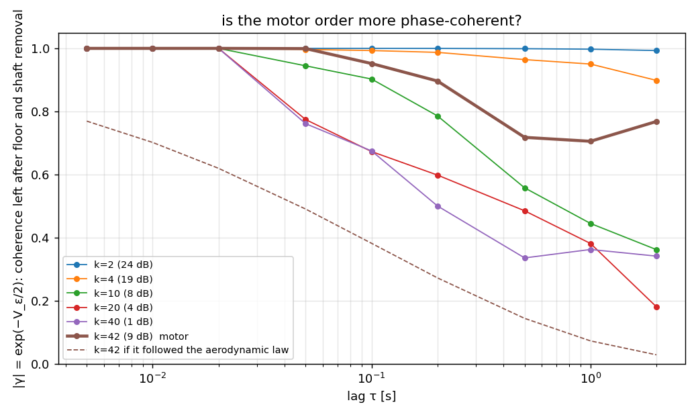

```{=html}
<style>.figure img{max-width:100%}</style>
```

**Question.** A rotor at 68 rev/s makes a comb of lines at $k \times 68$ Hz. If every line were a
harmonic of one and the same shaft angle, their phases would move in lockstep: whatever the shaft
does, order $k$ does $k$ times. The 12-recording study
(`results/noise_v2/decoherence/findings.md`) said they do not — each order carries phase noise of
its own. This document redoes that measurement in the simplest possible form, on **one recording,
one microphone**, so that every step is visible, and answers three questions that came up:

1. what is actually measured, step by step;
2. why the microphone's broadband noise does not fake the result;
3. whether the motor's own tones (orders 42, 63, 84) are more coherent than the propeller's.

Everything here is produced by `scripts/static_rig_scratch/one_rotor_coherence.py`; numbers are in
`results/noise_v2/decoherence/one_rotor/one_rotor.json`.

## The signal

DREGON bench recording `motor_Motor1_70`: one motor with its two-blade propeller, 30 s at 44.1 kHz,
8 microphones. Microphone 2 is used — it has the least power in 20–200 Hz relative to 1–4 kHz,
i.e. the least wind. The shaft rate, refined on the lines themselves, is 68.47 rev/s.

{#fig-spectrum}

## Step 1 — look at one line through a narrow window

For each order $k$ the recording is *demodulated*: multiplied by $e^{-i\,2\pi k f_0 t}$ and
low-passed to $\pm 0.4 f_0 = \pm 27$ Hz, i.e. half the harmonic spacing. The result is one
complex number per 5 ms,

$$z_k(t) = a_k(t)\, e^{i\phi_k(t)},$$

the line's instantaneous **amplitude** and **phase**. Nothing from the neighbouring orders can
enter the window. The phase of a perfectly steady line is constant; the phase of a line sitting
exactly on the $k$-th harmonic of a wandering shaft is $k\,\theta(t)$ with $\theta$ the shaft's
angle error.

{#fig-tracks}

## Step 2 — measure how far the phase moves in a lag τ

For a lag $\tau$ form the product $z_k(t+\tau)\, z_k^*(t)$. Its angle is the phase increment
$\Delta\phi_k(t;\tau)$, with no unwrapping needed. The statistic is the **circular variance**

$$V_k(\tau) = -2\ln\lvert\gamma\rvert,\qquad
\gamma = \frac{\sum_t z_k(t+\tau)\,z_k^*(t)}{\sum_t \lvert z_k(t+\tau)\rvert\,\lvert z_k(t)\rvert}.$$

For a small Gaussian increment this is exactly its variance in rad². Two properties matter:

- it cannot slip: a sample whose phasor has collapsed into the noise contributes little weight
  instead of a random turn — unlike `np.unwrap`, which on a line a few dB above the noise takes a
  wrong branch a few times per hundred samples and makes *every* variance grow linearly;
- it **saturates**: once the increment is uniformly random, $|\gamma|$ is only the noise of the
  average and $V$ sits near 3 rad². A point at the ceiling means "decorrelated", not a value.

## Step 3 — why the broadband noise does not fake it

This is the part that is easy to doubt. The microphone noise is in the window too, so even a
perfectly steady line gets a jittery phase. But the jitter it adds has one property the real
effect does not have: **it does not grow with the lag**. Two noise samples 50 ms apart are as
independent as two samples 500 ms apart, so the noise adds the same amount of phase variance at
every lag — a flat floor. A phase that genuinely moves (a random walk, or a slow fluctuation)
adds variance that *grows* with τ. @fig-sim shows both on a simulated line.

{#fig-sim}

So the procedure is: measure each order's SNR inside its window (line power over noise power),
simulate a steady line at that SNR in the same band-limited noise, read the floor with the same
estimator at the same lags, and subtract it. What is left is zero for a steady line and positive
and growing for a moving one. Two honest caveats:

- the floor is the floor of a *steady* line; a line whose amplitude fluctuates has a somewhat
  higher floor (the estimator weights by amplitude, and noise matters more when the line is
  momentarily weak). With amplitude fluctuations of ±40 % this is a factor ≈ 1.5 on the floor,
  i.e. up to a few tenths of a rad² at the weak high orders — it cannot produce a τ-dependence;
- the published study used the formula $2\ln(1 + 1/\mathrm{SNR})$ for the floor. Simulated with
  this estimator the true floor is about half of that at high SNR (the amplitude weighting halves
  the noise term). The published nets rest on a rendered control, not on the formula, so they are
  not affected; the first pass of this script was, and is corrected here.

## Step 4 — remove what the shaft does to every order

The shaft angle error $\theta(t)$ moves order $k$ by $k\theta$. It is estimated from the strong
low orders ($k \le 10$) of **all eight microphones**: the SNR-weighted least-squares solution of
$\phi_k = k\theta$ on the unwrapped low-order phases, which at 20 dB SNR do not slip. The orders
are split into three disjoint groups, each giving its own $\hat\theta$; their pairwise
disagreement measures the error $B$ of the combined estimate, and $k^2 B$ — what that error does
to order $k$ after de-rotation — is subtracted too. Then order $k$ is de-rotated,
$z_k \to z_k e^{-ik\hat\theta}$, and step 2 is repeated.

{#fig-lag}

What the shaft itself does: $\mathrm{Var}[\Delta\theta]$ = 6.4e-4 rad² at 50 ms and 1.5e-2 rad²
at 500 ms. Multiplied by $k^2$ that is 0.06 / 1.5 rad² at order 10 and 1.0 / 24 rad² at order
40: the shaft alone decorrelates order 40 within half a second, which is why the *raw* curves all
pile up at the ceiling. The question is what remains after it is taken out.

## Result — each order has phase motion of its own

{#fig-vk}

| k | SNR | net @ 50 ms | 12-rec law | net @ 500 ms | 12-rec law |
|---|---|---|---|---|---|
| 4 | 19 dB | 0.01 | 0.14 | 0.07 | 0.4 |
| 10 | 8 dB | 0.11 | 0.30 | 1.17 | 0.9 |
| 20 | 4 dB | 0.51 | 0.63 | 1.45 | 1.9 |
| 40 | 1 dB | 0.55 | 1.3 | ≥ 2.2 (ceiling) | 4.0 |
| **42 motor** | 9 dB | **0.00** | 1.4 | **0.66** | 4.2 |

: Independent per-order phase variance, rad², this recording and microphone, against the pooled law. {#tbl-net}

Order 10 at 500 ms carries 1.2 rad² — eight times its floor (0.14) and twenty times the shaft
leakage. The per-order term is real on a single microphone, and within a factor ≈ 2 of the pooled
law (lower at high $k$, where the ceiling caps what can be read).

What it looks like in the frequency domain:

![Baseband spectrum of each order (0 Hz = exactly $k$ × shaft rate) before (grey) and after (blue/orange) the shaft phase is removed. After removal every order shows a **needle** at 0 Hz — the part of the line that is phase-locked to the shaft — standing on a **pedestal** a few Hz wide, which is the per-order term. The pedestal grows with $k$ relative to the needle; at order 40 the needle is ~10 dB above it. The motor order 42 is the opposite: the shaft removal collapses a 10 Hz smear into a clean needle with a pedestal 20 dB down.](../../results/noise_v2/decoherence/one_rotor/line_shapes.png){#fig-shapes}

The needle surviving at orders 20–40 is the direct answer to "bounded or random walk?": a
random walk leaves no needle. The per-order phase process is bounded; what grows with $k$ is the
pedestal's share, i.e. how much of the line is *not* locked to the shaft.

{#fig-share}

## Is it amplitude modulation in disguise?

Unsteady blade loading certainly modulates the lines' amplitudes. Could that be what the phase
read picks up? Not by construction: if $z_k = a(t)e^{i\phi_0}$ with $a > 0$, every product
$z(t+\tau)z^*(t)$ is positive real, $|\gamma| = 1$, and the read is exactly zero at every lag,
however deep the modulation. Amplitude modulation can only reach the phase read through the noise
floor (a momentarily weak line is noisier), and that contribution is flat in τ.

The recording shows it directly:

{#fig-amp}

{#fig-pva}

So: at low orders the independent term is a small, isotropic wobble of the complex amplitude; at
high orders the phase wanders more than the amplitude does. Neither is amplitude modulation
masquerading as phase.

## The motor orders

The motor family on this drone sits at $k$ = 42, 63, 84 (@fig-spectrum). On microphone 2 only
order 42 is strong enough to read (9 dB; order 63 is at −2 dB, order 84 at −1 dB, and on no
microphone does 84 exceed 2.7 dB). Order 42 behaves unlike any aerodynamic order near it:

{#fig-motor}

At 50 ms its residual is at the floor (0.00 rad²); at 0.5–2 s it keeps $|\gamma| \approx 0.7$–0.8,
where order 40 has 0.34, order 20 has 0.48 and even order 10 has 0.56. The aerodynamic law would
put it at 0.15. Its amplitude is steady (@fig-amp) and its line is a clean needle once the shaft
is removed (@fig-shapes). The electromagnetic tone is locked to the shaft angle and does not
carry the aerodynamic unsteadiness. **Yes — phase coherence is much better at the motor orders.**

## What this means for the noise model

- The harmonics of the propeller do **not** move in lockstep. Beyond the shared shaft term, each
  order carries its own phase motion, independent across orders, growing with order: roughly
  0.1 rad² at order 10 and 0.5 rad² at order 20–40 over 50 ms, saturating towards full
  decorrelation over 0.5–2 s at orders ≥ 12.
- It is **bounded**, not a random walk: a needle locked to the shaft survives at every order up
  to 40. In model terms it is a per-order pedestal with a coherent core whose share falls with
  order — the `am`-type term — not an independent Wiener width per line. The width of the
  pedestal (a few Hz) is far below an STFT bin, so the training-stream front-ends never see it;
  phase-coherent tracking over > 100 ms does.
- It is not amplitude modulation: real AM is present (±50 % at order 4, slow) and leaves the
  phase read untouched; log-amplitude and phase fluctuations are comparable at low orders and
  phase-dominated above order 10.
- The motor family is a different source: shaft-locked, steady, with a pedestal ~20 dB down.
  A rig model that gives the motor lines the aerodynamic pedestal law over-decoheres them.
- Open: why the high orders' phases wander *more* than their amplitudes (a timing-like
  fluctuation that is nevertheless independent across orders), and the slight asymmetry of the
  high-order pedestals (their centroid sits 1–2 Hz above the harmonic at orders 20 and 40).

## Reproduce

```
PYTHONPATH=src .venv/bin/python scripts/static_rig_scratch/one_rotor_coherence.py
```

Reads the DREGON bench frames (`DREGON-frames`, split `motor`), writes the figures and
`one_rotor.json` to `results/noise_v2/decoherence/one_rotor/`. The 12-recording study is
`scripts/noise_v2_order_decoherence.py`; its findings and the controls it ran are in
`results/noise_v2/decoherence/findings.md`.
