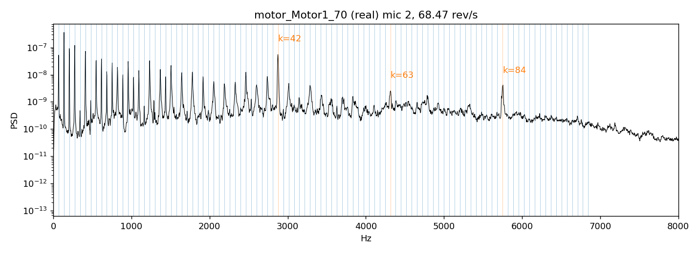
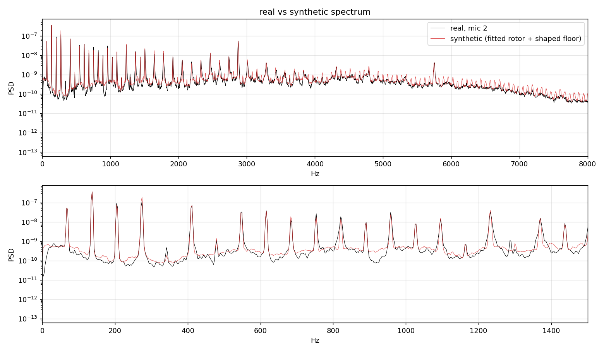
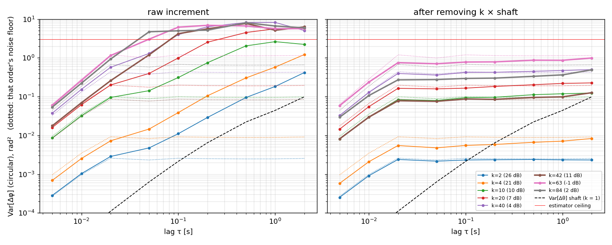
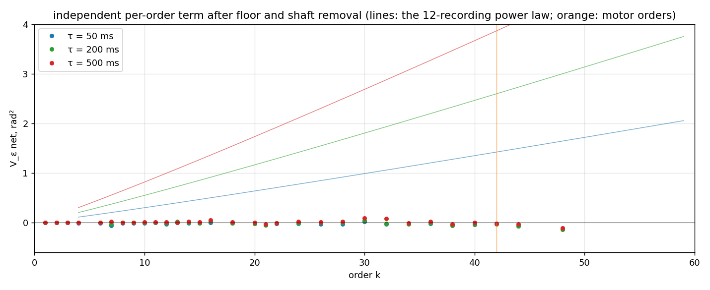
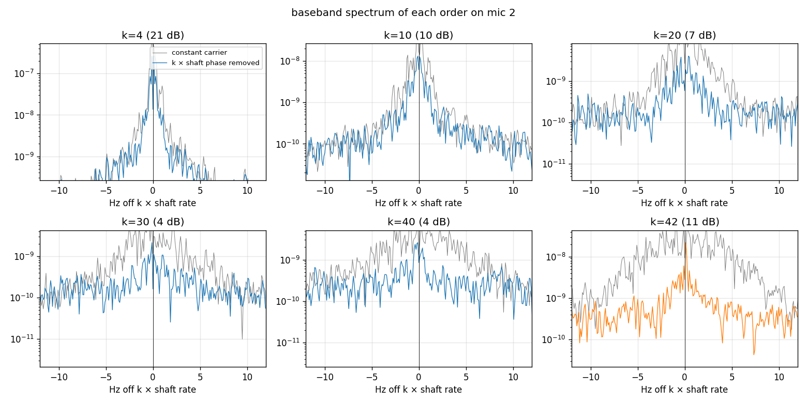

```{=html}
<style>.figure img{max-width:100%}</style>
```

**Question.** A rotor at 68 rev/s makes a comb of lines at $k \times 68$ Hz. If every line were a
harmonic of one and the same shaft angle, their phases would move in lockstep: whatever the shaft
does, order $k$ does $k$ times. The 12-recording study
(`results/noise_v2/decoherence/findings.md`) said they do not — each order carries phase noise of
its own. This document redoes that measurement in the simplest possible form, on **one recording,
one microphone**, so that every step is visible, and answers three questions that came up:

1. what is actually measured, step by step;
2. why the microphone's broadband noise does not fake the result;
3. whether the motor's own tones (orders 42, 63, 84) are more coherent than the propeller's.

Everything here is produced by `scripts/static_rig_scratch/one_rotor_coherence.py`; numbers are in
`results/noise_v2/decoherence/one_rotor/{real,synthetic}/one_rotor.json`.

## The signal

DREGON bench recording `motor_Motor1_70`: one motor with its two-blade propeller, 30 s at 44.1 kHz,
8 microphones. Microphone 2 is used — it has the least power in 20–200 Hz relative to 1–4 kHz,
i.e. the least wind. The shaft rate, refined on the lines themselves, is 68.47 rev/s.

{#fig-spectrum}

## Step 1 — look at one line through a narrow window

For each order $k$ the recording is *demodulated*: multiplied by $e^{-i\,2\pi k f_0 t}$ and
low-passed to $\pm 0.4 f_0 = \pm 27$ Hz, i.e. half the harmonic spacing. The result is one
complex number per 5 ms,

$$z_k(t) = a_k(t)\, e^{i\phi_k(t)},$$

the line's instantaneous **amplitude** and **phase**. Nothing from the neighbouring orders can
enter the window. The phase of a perfectly steady line is constant; the phase of a line sitting
exactly on the $k$-th harmonic of a wandering shaft is $k\,\theta(t)$ with $\theta$ the shaft's
angle error.

{#fig-tracks}

## Step 2 — measure how far the phase moves in a lag τ

For a lag $\tau$ form the product $z_k(t+\tau)\, z_k^*(t)$. Its angle is the phase increment
$\Delta\phi_k(t;\tau)$, with no unwrapping needed. The statistic is the **circular variance**

$$V_k(\tau) = -2\ln\lvert\gamma\rvert,\qquad
\gamma = \frac{\sum_t z_k(t+\tau)\,z_k^*(t)}{\sum_t \lvert z_k(t+\tau)\rvert\,\lvert z_k(t)\rvert}.$$

For a small Gaussian increment this is exactly its variance in rad². Two properties matter:

- it cannot slip: a sample whose phasor has collapsed into the noise contributes little weight
  instead of a random turn — unlike `np.unwrap`, which on a line a few dB above the noise takes a
  wrong branch a few times per hundred samples and makes *every* variance grow linearly;
- it **saturates**: once the increment is uniformly random, $|\gamma|$ is only the noise of the
  average and $V$ sits near 3 rad². A point at the ceiling means "decorrelated", not a value.

## Step 3 — why the broadband noise does not fake it

This is the part that is easy to doubt. The microphone noise is in the window too, so even a
perfectly steady line gets a jittery phase. But the jitter it adds has one property the real
effect does not have: **it does not grow with the lag**. Two noise samples 50 ms apart are as
independent as two samples 500 ms apart, so the noise adds the same amount of phase variance at
every lag — a flat floor. A phase that genuinely moves (a random walk, or a slow fluctuation)
adds variance that *grows* with τ. @fig-sim shows both on a simulated line.

{#fig-sim}

So the procedure is: measure each order's SNR inside its window (line power over noise power),
simulate a steady line at that SNR in the same band-limited noise, read the floor with the same
estimator at the same lags, and subtract it. What is left is zero for a steady line and positive
and growing for a moving one. Two honest caveats:

- the floor is the floor of a *steady* line; a line whose amplitude fluctuates has a somewhat
  higher floor (the estimator weights by amplitude, and noise matters more when the line is
  momentarily weak). With amplitude fluctuations of ±40 % this is a factor ≈ 1.5 on the floor,
  i.e. up to a few tenths of a rad² at the weak high orders — it cannot produce a τ-dependence;
- the published study used the formula $2\ln(1 + 1/\mathrm{SNR})$ for the floor. Simulated with
  this estimator the true floor is about half of that at high SNR (the amplitude weighting halves
  the noise term). The published nets rest on a rendered control, not on the formula, so they are
  not affected; the first pass of this script was, and is corrected here.

## Step 4 — remove what the shaft does to every order

The shaft angle error $\theta(t)$ moves order $k$ by $k\theta$. It is estimated from the strong
low orders ($k \le 10$) of **all eight microphones**: the SNR-weighted least-squares solution of
$\phi_k = k\theta$ on the unwrapped low-order phases, which at 20 dB SNR do not slip. The orders
are split into three disjoint groups, each giving its own $\hat\theta$; their pairwise
disagreement measures the error $B$ of the combined estimate, and $k^2 B$ — what that error does
to order $k$ after de-rotation — is subtracted too. Then order $k$ is de-rotated,
$z_k \to z_k e^{-ik\hat\theta}$, and step 2 is repeated.

{#fig-lag}

What the shaft itself does: $\mathrm{Var}[\Delta\theta]$ = 6.4e-4 rad² at 50 ms and 1.5e-2 rad²
at 500 ms. Multiplied by $k^2$ that is 0.06 / 1.5 rad² at order 10 and 1.0 / 24 rad² at order
40: the shaft alone decorrelates order 40 within half a second, which is why the *raw* curves all
pile up at the ceiling. The question is what remains after it is taken out.

## Result — each order has phase motion of its own

{#fig-vk}

| k | SNR | net @ 50 ms | 12-rec law | net @ 500 ms | 12-rec law |
|---|---|---|---|---|---|
| 4 | 19 dB | 0.01 | 0.14 | 0.07 | 0.4 |
| 10 | 8 dB | 0.11 | 0.30 | 1.17 | 0.9 |
| 20 | 4 dB | 0.51 | 0.63 | 1.45 | 1.9 |
| 40 | 1 dB | 0.55 | 1.3 | ≥ 2.2 (ceiling) | 4.0 |
| **42 motor** | 9 dB | **0.00** | 1.4 | **0.66** | 4.2 |

: Independent per-order phase variance, rad², this recording and microphone, against the pooled law. {#tbl-net}

Order 10 at 500 ms carries 1.2 rad² — eight times its floor (0.14) and twenty times the shaft
leakage. The per-order term is real on a single microphone, and within a factor ≈ 2 of the pooled
law (lower at high $k$, where the ceiling caps what can be read).

What it looks like in the frequency domain:

![Baseband spectrum of each order (0 Hz = exactly $k$ × shaft rate) before (grey) and after (blue/orange) the shaft phase is removed. After removal every order shows a **needle** at 0 Hz — the part of the line that is phase-locked to the shaft — standing on a **pedestal** a few Hz wide, which is the per-order term. The pedestal grows with $k$ relative to the needle; at order 40 the needle is ~10 dB above it. The motor order 42 is the opposite: the shaft removal collapses a 10 Hz smear into a clean needle with a pedestal 20 dB down.](../../results/noise_v2/decoherence/one_rotor/real/line_shapes.png){#fig-shapes}

The needle surviving at orders 20–40 is the direct answer to "bounded or random walk?": a
random walk leaves no needle. The per-order phase process is bounded; what grows with $k$ is the
pedestal's share, i.e. how much of the line is *not* locked to the shaft.

{#fig-share}

### Caveat — the demodulation band

Every order is demodulated with the same ±0.4 f₀ = ±27 Hz window: the widest band that cannot
see a neighbouring order, the same admitted noise and the same ~18 ms time resolution for every
$k$. It is fair for comparing orders at the same lag; it is not neutral for the high orders,
whose pedestal is wider than the window. Varying the band (floor re-simulated for each):

| band | k | in-band SNR | net @ 50 ms | @ 200 ms | @ 500 ms |
|---|---|---|---|---|---|
| ±14 Hz | 10 | 8.3 dB | 0.02 | 0.41 | 1.08 |
| ±27 Hz | 10 | 8.1 | 0.12 | 0.48 | 1.17 |
| ±48 Hz | 10 | 6.5 | 0.17 | 0.53 | 1.22 |
| ±14 Hz | 20 | 1.6 | — | 0.54 | 0.96 |
| ±27 Hz | 20 | 3.7 | 0.52 | 1.04 | 1.44 |
| ±48 Hz | 20 | 6.7 | 0.83 | 1.37 | 1.80 |
| ±27 Hz | 40 | 0.9 | 0.55 | 1.40 | 2.17 |
| ±48 Hz | 40 | 1.2 | 0.91 | 1.81 | 2.53 |
| ±27 Hz | 42 | 9.1 | 0.00 | 0.22 | 0.66 |
| ±48 Hz | 42 | 10.2 | 0.06 | 0.28 | 0.72 |

: The per-order term against the demodulation band. {#tbl-band}

Orders 10 and 42 do not care. Orders 20 and 40 keep collecting line power as the band widens
(the in-band SNR rises), and the per-order term rises with it: their pedestal extends beyond half
the harmonic spacing, i.e. it is merging into the continuum between the lines. The high-order
numbers in this document are therefore lower bounds, the coherent shares at high order upper
bounds; the direction of every conclusion is unchanged. The other $k$-dependent width, the shaft
smear, stays inside the band on this bench (±10 Hz at order 40); in flight it would not, and the
demodulation would have to follow the tracked carrier before filtering.

## Control — the same procedure on a rotor that has no per-order phase noise

If the procedure is sound, a signal in which every harmonic is an exact multiple of one shaft
angle must read zero after the shaft is removed. The single-rotor model fitted to this very
recording yesterday (`results/static_rig/single_rotor`: OU shaft speed from the width law,
σ_ν = 0.089 rev/s, λ = 12.4 /s; every order's power per microphone; the measured per-order
log-amplitude jitter, median σ² = 0.11, γ = 0.47 Hz, shared by the mics) is rendered for 30 s at
44.1 kHz, its lines level-matched to the recording (within 1 dB per mic), and a broadband floor
with the recording's own spectral shape per microphone is added (read in the valleys between
the lines: bins within ±0.45 spacing of a harmonic dropped, running 25th percentile of the
rest). It has the shaft wander, the
amplitude jitter and the coloured floor of the real signal — and **no** independent phase motion
of any order.

{#fig-synth-spec}



Same microphone, same analysis, same floor simulation:

{#fig-synth-lag}

| k | SNR real / synth | net @ 500 ms real | synth | net @ 2 s real | synth |
|---|---|---|---|---|---|
| 4 | 19 / 21 dB | 0.07 | −0.00 | 0.21 | −0.00 |
| 10 | 8 / 10 | 1.17 | 0.01 | 2.03 | 0.03 |
| 20 | 4 / 7 | 1.45 | 0.01 | 3.41 | 0.03 |
| 40 | 1 / 4 | 2.18 | −0.00 | 2.15 | 0.07 |
| 42 | 9 / 11 | 0.66 | −0.02 | 0.53 | 0.04 |

: Independent per-order term, real recording against the synthetic control at matched SNR. {#tbl-ctrl}

{#fig-synth-vk}

{#fig-synth-shapes}

The synthetic's amplitudes fluctuate as much as the real ones (CV of $|z_k|$ 0.71 / 0.55 / 0.46 at
k = 4 / 10 / 20 against 0.51 / 0.50 / 0.50 real) and its phase read is zero — the amplitude
jitter the model carries does not leak into the phase read. The synthetic reads at most 0.01 rad²
at 500 ms where the real recording reads 1.2–2.2, and 0.07 at 2 s at order 40 (the
shaft-estimate leakage, $k^2 B$, is at its largest there). The
difference is stark, and in the expected direction: the procedure does not manufacture
per-order phase noise from shaft wander, amplitude jitter or a coloured floor. What it finds on
the real recording is in the real recording.

## Bounded or unbounded? Two planted per-order phase processes

The needle in @fig-shapes says the per-order phase is bounded; a direct test is to plant each
kind into the synthetic rotor and read it with the same procedure. Two more renders, identical
to the control except for an independent phase $\psi_k(t)$ on every order:

- **unbounded**: a random walk, $\mathrm{Var}[\Delta\psi_k(\tau)] = 2D_k\tau$ with
  $D_k = 0.12\,k$ rad²/s — sized so that order 10 reads ≈ 1.2 rad² at 500 ms, as the real one does;
- **bounded**: a stationary OU phase of variance $\sigma_k^2 = 0.1\,k$ rad² and correlation time
  0.5 s, so $\mathrm{Var}[\Delta\psi_k(\tau)] = 2\sigma_k^2(1 - e^{-\tau/0.5})$ — the same
  1.2 rad² at order 10 and 500 ms, then saturating at 2 rad².

{#fig-bounded}

| k | τ | real | walk read | walk planted | bounded read | bounded planted |
|---|---|---|---|---|---|---|
| 4 | 0.5 s | 0.07 | 0.28 | 0.48 | 0.27 | 0.51 |
| 4 | 2 s | 0.21 | 2.17 | 1.92 | 0.77 | 0.79 |
| 10 | 0.2 s | 0.48 | 0.30 | 0.48 | 0.42 | 0.66 |
| 10 | 0.5 s | 1.17 | 0.85 | 1.20 | 0.86 | 1.26 |
| 10 | 1 s | 1.62 | ceiling | 2.40 | 1.58 | 1.73 |
| 10 | 2 s | 2.03 | ceiling | 4.80 | ceiling | 1.96 |
| 20 | 0.5 s | 1.44 | ceiling | 2.40 | ceiling | 2.53 |

: Reads of the two planted processes against the real recording, rad². {#tbl-planted}

Three things to take from it. The procedure *recovers* what is planted — at 0.6–0.8× of the
planted value at mid lags and ≈ 1× at long lags, which is the recovery ratio the 12-recording
controls reported — and it recovers the *shape*: the walk keeps doubling per doubling of τ
(order 4: 0.28 → 0.85 → 2.17 from 0.5 to 2 s), the bounded phase bends over (0.27 → 0.58 →
0.77). The real order 10 bends: 0.48 → 1.17 → 1.62 → 2.03 from 0.2 to 2 s (×2.4, ×1.4, ×1.25),
and sits on the bounded curve, not the walk. And in the frequency domain the planted walk leaves
**no needle** at any order ≥ 20 (`synthetic_wiener/line_shapes.png`), while the real recording
keeps one up to order 42.

What a 30 s record cannot rule out: a walk slow enough to stay under the bounded term over 2 s —
at order 10 that is $D \lesssim 0.05$ rad²/s, a line width of a few mHz. Order 4's small term
does grow from 1 to 2 s (0.10 → 0.21) and could be either a very slow walk or a bounded process
with a correlation time beyond 2 s. "Bounded" is therefore the reading on the 0.05–2 s range
where the data decide, plus the needles; it is not a proof for all time scales.

## Is it amplitude modulation in disguise?

Unsteady blade loading certainly modulates the lines' amplitudes. Could that be what the phase
read picks up? Not by construction: if $z_k = a(t)e^{i\phi_0}$ with $a > 0$, every product
$z(t+\tau)z^*(t)$ is positive real, $|\gamma| = 1$, and the read is exactly zero at every lag,
however deep the modulation. Amplitude modulation can only reach the phase read through the noise
floor (a momentarily weak line is noisier), and that contribution is flat in τ.

The recording shows it directly:

{#fig-amp}

{#fig-pva}

So: at low orders the independent term is a small, isotropic wobble of the complex amplitude; at
high orders the phase wanders more than the amplitude does. Neither is amplitude modulation
masquerading as phase.

## The motor orders

The motor family on this drone sits at $k$ = 42, 63, 84 (@fig-spectrum). On microphone 2 only
order 42 is strong enough to read (9 dB; order 63 is at −2 dB, order 84 at −1 dB, and on no
microphone does 84 exceed 2.7 dB). Order 42 behaves unlike any aerodynamic order near it:

{#fig-motor}

At 50 ms its residual is at the floor (0.00 rad²); at 0.5–2 s it keeps $|\gamma| \approx 0.7$–0.8,
where order 40 has 0.34, order 20 has 0.48 and even order 10 has 0.56. The aerodynamic law would
put it at 0.15. Its amplitude is steady (@fig-amp) and its line is a clean needle once the shaft
is removed (@fig-shapes). The electromagnetic tone is locked to the shaft angle and does not
carry the aerodynamic unsteadiness. **Yes — phase coherence is much better at the motor orders.**

## The same rotor physics in an anechoic chamber (AGH, SP Cup 2019)

Could the per-order term be the room? The DREGON bench stood in a room; the AGH team recorded a
single rotor of a 3-blade quad in an **anechoic chamber** with one reference microphone
(`SPCUP19-frames`, `AGH__ego-noise__single_rotors__4`, 77.7 rev/s, 12 s of steady run). One
microphone and a quieter blade family (−3 to +3 dB in-band) make it a coarser read: the shaft
is estimated from the strong orders 21 and 42 (7 and 6 dB) together with 1, 3, 9, and the floors
at 50 ms are as large as the signal, so the 50 ms column below is marginal and the 500 ms column
is the one to trust.

| k | SNR | raw − floor @ 50 ms | shaft $k^2 V$ @ 50 ms | net @ 50 ms | net @ 500 ms |
|---|---|---|---|---|---|
| 1 | 10 dB | 0.05 | 0.001 | 0.05 | 0.05 |
| 3 | 3 | 0.42 | 0.005 | 0.43 | 0.38 |
| 6 | −3 | 0.59 | 0.019 | 0.54 | 1.69 (ceiling) |
| 9 | 0 | 0.34 | 0.043 | 0.20 | 1.67 |
| 12 | 2 | 0.36 | 0.076 | 0.26 | 2.62 (ceiling) |
| 18 | 0 | 0.41 | 0.172 | 0.26 | 1.07 |
| 21 | 7 | 0.29 | 0.234 | (shaft reference) | |
| 42 | 6 | 1.18 | 0.935 | (shaft reference) | |

: AGH anechoic single rotor, rad². The two strongest orders define the shaft and are not read against it. {#tbl-agh}

The blade-pass family (3, 6, 9, 12, 18) carries 0.3–0.6 rad² at 50 ms beyond its floor where the
shaft would give ≤ 0.17, and 1–2.6 rad² at 500 ms — the same size as on the DREGON bench. The two
strong orders 21 and 42 are consistent with shaft wander alone: their raw reads beyond the floor
scale as $k^2$ (0.29 → 1.18, ratio 4.1 for a 4× in $k^2$), and the shaft phase they define
collapses their lines into needles exactly as the DREGON motor order did. Whether they are this
drone's motor family (21 = 7 × 3 blades) is not documented; what matters here is that lines of
the same rotor, in the same anechoic chamber, through the same microphone, split the same way:
some phase-locked to the shaft, the aerodynamic family not. No room is needed to produce the
term, and no room can explain why it skips orders.

## Why this happens — what rotor aeroacoustics says

The measurement says: one shaft term shared by all orders, plus a bounded, independent,
source-side phase process on each aerodynamic order whose share grows with order, absent on the
shaft-locked tones. That is what the aeroacoustic picture of a rotor at low advance ratio
predicts, and the ingredients are in the literature.

**The rigid-rotor baseline.** For a rigid propeller with $B$ blades in perfectly steady
rotation and steady blade loading, the far-field pressure is a periodic function of shaft angle,
$p(t) = \sum_k A_k\cos\big(kB\,\theta(t) + \phi_k\big)$: every harmonic rides the same
$\theta(t)$, the offsets $\phi_k$ are constants, and independent phase drift between harmonics
is impossible. The realistic form is
$$\Phi_k(t) = kB\,\Theta(t) + \phi_k + \eta_k(t),$$
with $\Theta$ the common shaft phase and $\eta_k$ a harmonic-dependent aerodynamic term. The
measurement above is a direct estimate of $\eta_k$: the shaft part is what $k\hat\theta$ removes,
and $\eta_k$ is what is left.

**1. Unsteady rotation is common-mode.** Small fluctuations of the rotational speed enter every
harmonic as $\delta\Phi_k = kB\,\delta\Theta$, so higher harmonics are proportionally more
sensitive, and even small speed fluctuations produce sidebands and extra tonal structure around
the BPF harmonics. Zhong et al. showed this for small rotors (rotational-speed fluctuations,
blade vibration and geometric asymmetry) [@zhong2020revisit; @zhong2023unsteady], and Zhu et al.
predicted and measured, with an encoder on the shaft, the tones a UAV propeller radiates when its
motor drives it in nearly sinusoidal unsteady rotation at 14× the shaft frequency
[@zhu2026unsteady]. In this document that term is the shaft OU — large (it alone decorrelates
order 40 within half a second) but shared, which is why removing $k\hat\theta$ takes the synthetic
rotor to its noise floor and leaves the real one with a residual. The residual is, by
construction, what unsteady rotation cannot explain.

**2. Stochastic unsteady loading is per-harmonic.** The flow through a static or hovering rotor is
not deterministic: inflow turbulence, blade boundary layers and separation, tip vortices, wake
recirculation and blade–wake interaction vary from revolution to revolution. Writing the blade
loading as $L(r,\psi,t) = \bar L(r,\psi) + L'(r,\psi,t)$, the steady part radiates the
phase-locked BPF tones and $L'$ radiates stochastic sound near the same frequencies. The
rotor-noise literature calls the result **haystacking**: broadened peaks at the BPF harmonics
produced by unsteady loading that is *correlated between neighbouring blades*. Alexander,
Devenport and Glegg attribute the haystacked peaks explicitly to correlated stochastic blade
loading, measured as blade-to-blade upwash coherence near the tips, and explain the mechanism
after Hanson: at low advance ratio the inflow stretches turbulent structures into long
filaments that are drawn into the rotor and cut many times by successive blades, so each eddy
produces a *train* of loading pulses at the blade-passing rate — a tone of finite duration —
and the width of the haystack is set by how many blades cut the same eddy
[@alexander2017haystacking; @hanson1974spectrum; @majumdar1998ingested]. Raposo and Azarpeyvand
show that Amiet's turbulence-ingestion theory, derived with blade-to-blade source correlation
kept, predicts the haystacking tones for open rotors [@raposo2024ingestion]. Hanson's original
model is a train of enveloped lift pulses with small random variations in pulse position and
amplitude [@hanson1974spectrum] — precisely a per-harmonic complex-amplitude fluctuation
around a coherent core.

Put together, the harmonic $k$ of the measured signal is the sum of the steady-loading tone
(locked to $kB\Theta$) and a haystack: a narrowband random process centred on the same
frequency whose bandwidth is the inverse lifetime of the correlated loading (a few Hz here, the
pedestals of @fig-shapes), whose power relative to the tone grows with harmonic order because
the steady loading's harmonics fall off faster than the stochastic loading's, and which is
independent from one harmonic to the next because different harmonics sample different details
of the pulse train. That is exactly a bounded, independent, source-side phase process with a
coherent core whose share falls with order. It is aerodynamic, so the electromagnetic tones of
the motor — locked to the rotor angle, with no loading pulse behind them — do not carry it,
and it does not need a room; the DREGON bench, the AGH anechoic chamber and the planted
synthetic controls agree.

What the literature does not settle and the data here add: the odd/even split (the
blade-difference family carries several times the phase noise of the blade-pass family, as the
difference of two nearly equal blade pulse trains would), the phase-dominated anisotropy above
order 10, and the slight upward centroid shift of the high-order haystacks. The reference
measurements above are from loading-dominated small rotors; drone-specific transfer functions
(scattering by the airframe, [@manamperi2025drtf]) and the state of propeller noise prediction
against experiment [@limapereira2026accuracy] bound what a model can be expected to reproduce.

## What this means for the noise model

- The harmonics of the propeller do **not** move in lockstep. Beyond the shared shaft term, each
  order carries its own phase motion, independent across orders, growing with order: roughly
  0.1 rad² at order 10 and 0.5 rad² at order 20–40 over 50 ms, saturating towards full
  decorrelation over 0.5–2 s at orders ≥ 12.
- It is **bounded** on the 0.05–2 s range the record resolves, not a random walk: the lag law
  bends where a planted walk keeps doubling (@fig-bounded), and a needle locked to the shaft
  survives at every order up to 42 where a planted walk leaves none. In model terms it is a per-order pedestal with a coherent core whose share falls with
  order — the `am`-type term — not an independent Wiener width per line. The width of the
  pedestal (a few Hz) is far below an STFT bin, so the training-stream front-ends never see it;
  phase-coherent tracking over > 100 ms does.
- It is not amplitude modulation: real AM is present (±50 % at order 4, slow) and leaves the
  phase read untouched; log-amplitude and phase fluctuations are comparable at low orders and
  phase-dominated above order 10.
- The motor family is a different source: shaft-locked, steady, with a pedestal ~20 dB down.
  A rig model that gives the motor lines the aerodynamic pedestal law over-decoheres them.
- It is not the room: the de-rotated phase does not track the instantaneous speed
  (R² ≤ 0.03 at every order, so a static room response crossed by the wandering line is out),
  the cross-order correlations are not the random-sign ±1 a shared speed excursion through
  order-specific group delays would give, and the same split between shaft-locked and
  aerodynamic orders appears in an anechoic chamber (AGH, above).
- Open: why the high orders' phases wander *more* than their amplitudes (a timing-like
  fluctuation that is nevertheless independent across orders), and the slight asymmetry of the
  high-order pedestals (their centroid sits 1–2 Hz above the harmonic at orders 20 and 40).

## Reproduce

```
PYTHONPATH=src .venv/bin/python scripts/static_rig_scratch/one_rotor_coherence.py
```

Reads the DREGON bench frames (`DREGON-frames`, split `motor`), writes the figures and
`one_rotor.json` to `results/noise_v2/decoherence/one_rotor/real/`. The 12-recording study is
`scripts/noise_v2_order_decoherence.py`; its findings and the controls it ran are in
`results/noise_v2/decoherence/findings.md`.

## References

::: {#refs}
:::
