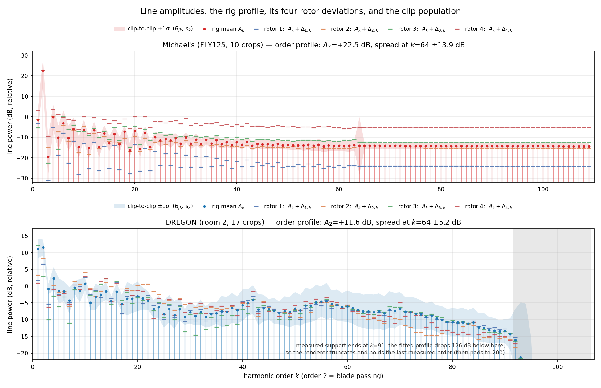
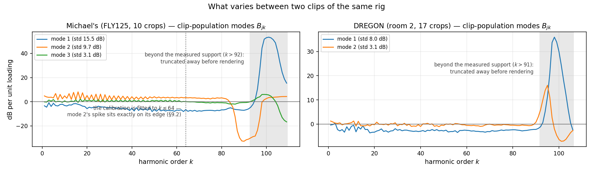
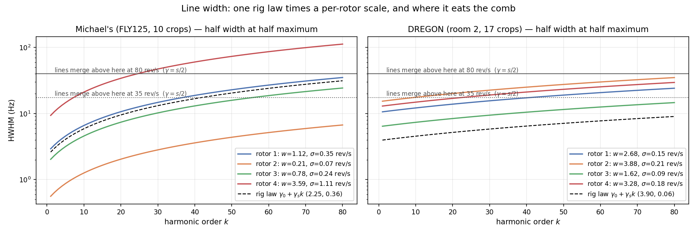
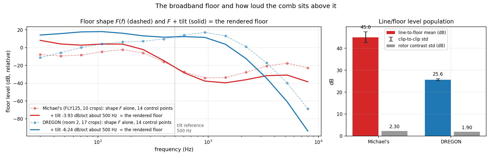
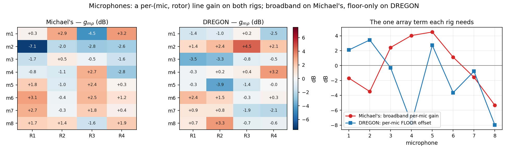
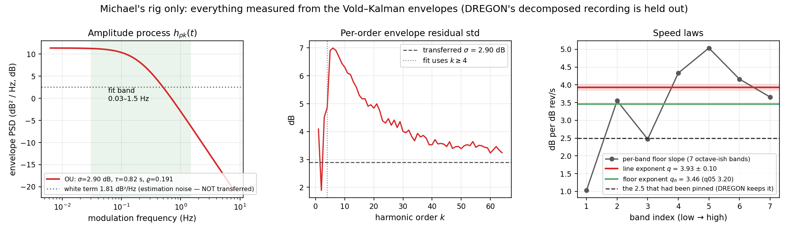
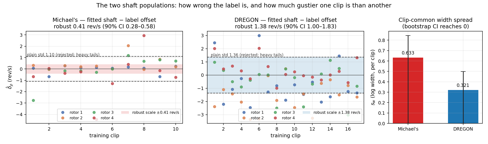
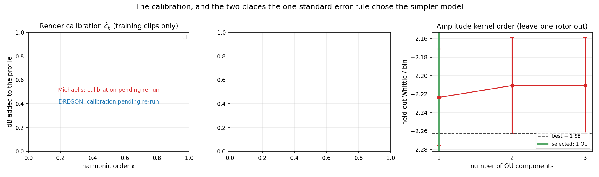
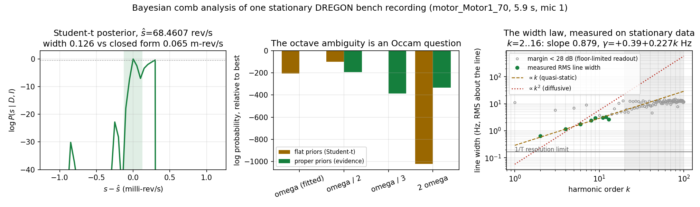
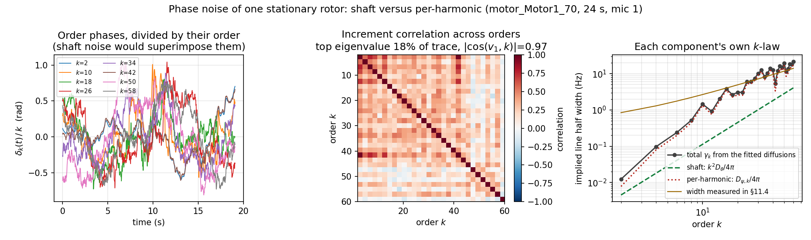

# Part I — The model

## 1. What one clip is

A clip is a multichannel recording of a rotorcraft together with its telemetry:

$$
\text{data} \;=\; \Big(\, x_m(t)\ \ m=1\dots M,\qquad r_\rho(t)\ \ \rho=1\dots R \,\Big),
\qquad t = 0,\dots,T-1 \ \text{at } f_s = 16\ \text{kHz}.
$$

$x_m$ is the pressure at microphone $m$ ($M=8$ on both rigs), $r_\rho$ is the
**labelled** rotational rate of rotor $\rho$ in rev/s ($R=4$). DREGON's labels
come from motor telemetry refined against the audio; Michael's from the flight
log. Both rigs carry two-blade propellers.

Everything below is a generative model for $x$ **given** $r$. That conditioning
is the whole point: a rev/s regressor is trained on $(x, r)$ pairs, so a
generator that gets $p(x \mid r)$ right supplies training data, and one that
gets it wrong supplies a task with the wrong answer key.

## 2. The signal decomposition

Write the recording as a rotor-locked tonal part plus everything else:

$$
x_m(t) \;=\; \underbrace{\sum_{\rho=1}^{R}\ \sum_{k=1}^{K}
      a_{\rho k}(t)\, g_{m\rho}\,\cos\!\big(k\,\phi_\rho(t) + \psi_{m\rho k}\big)}_{\text{the comb}}
   \;+\; \underbrace{n_m(t)}_{\text{broadband floor}} .
$$

Three objects need definition: the **shaft phase** $\phi_\rho$, the **line
amplitudes** $a_{\rho k}$, and the **floor** $n_m$. The static per-microphone
phases $\psi_{m\rho k}$ and gains $g_{m\rho}$ are the array's part.

### 2.1 The shaft is not the label

Harmonic $k$ of rotor $\rho$ rides the shaft, and the shaft is not what the
telemetry says. Let

$$
\boxed{\;s_\rho(t) \;=\; r_\rho(t) \;+\; \delta_\rho \;+\; \xi_\rho(t)\;}
\qquad
\phi_\rho(t) \;=\; 2\pi \!\int_0^t\! s_\rho(u)\,\mathrm{d}u ,
$$

with

* $\delta_\rho \sim \mathcal N(0,\sigma_{\text{off}}^2)$ — a **static label
  error**, drawn once per clip per rotor and constant inside it;
* $\xi_\rho$ — a zero-mean Ornstein–Uhlenbeck process, $\operatorname{std}
  \xi = \sigma_{\rho}$, correlation time $\tau_{\text{jit}}$: the shaft's own
  wander around its mean.

Both terms displace line $k$ by $k$ times as much, which is why they are
invisible at the blade-passing order and dominant at the top of the comb. The
label the generator *returns* is $r$, not $s$ — so a synthetic clip carries the
same answer-key error a real one does.

### 2.2 The line width follows from the shaft, not from a filter

This is the one derivation worth doing slowly, because the two rigs sit in
different regimes and that turns out to matter.

Over an analysis window of length $W$ (here $W = 2048/f_s = 128$ ms, Hann), the
instantaneous frequency of line $k$ is $k\,s_\rho(t)$, so its frequency
deviation is $k\xi_\rho(t)$ with standard deviation $k\sigma_\rho$. The
observed line shape is the Fourier transform of
$\mathbb E\,e^{i[\phi(t+u)-\phi(t)]}$, and the OU phase increment has variance

$$
\operatorname{Var}\big[\phi(t+u)-\phi(t)\big]
 \;=\; (2\pi k \sigma_\rho)^2 \cdot 2\tau_{\text{jit}}^2
       \Big(\tfrac{u}{\tau_{\text{jit}}} - 1 + e^{-u/\tau_{\text{jit}}}\Big).
$$

Two limits:

**Quasi-static** ($\tau_{\text{jit}} \gg W$). The offset is frozen inside a
window, the variance is $\approx (2\pi k\sigma_\rho u)^2/2$, and the line is a
**Gaussian** of half width at half maximum

$$
\boxed{\;\gamma_{\rho k} \;=\; \sqrt{2\ln 2}\; k\,\sigma_\rho \;\propto\; k\;}
$$

**Diffusive** ($\tau_{\text{jit}} \ll W$). The variance grows linearly,
$\approx 2 D u$ with $D = (2\pi k \sigma_\rho)^2 \tau_{\text{jit}}$, the
correlation decays as $e^{-Du}$, and the line is a **Lorentzian** of

$$
\boxed{\;\gamma_{\rho k} \;=\; 2\pi\,\tau_{\text{jit}}\,k^2\sigma_\rho^2 \;\propto\; k^2\;}
$$

So the *same* physical knob produces a width linear or quadratic in the
harmonic index depending on how $\tau_{\text{jit}}$ compares with the analysis
window. On top of either, each harmonic diffuses its own phase at
$q_{\text{pd}}k$ Hz (a small extra Lorentzian).

The spectral fit (§4.1) estimates an affine width law
$\gamma_{\rho k} = w_\rho(\gamma_0 + \gamma_{\text{slope}} k)$, with $w_\rho$ a
per-rotor scale. Matching that to the quasi-static law fixes

$$
\sigma_\rho \;=\; \frac{w_\rho\,\gamma_{\text{slope}}}{\sqrt{2\ln 2}} .
$$

The intercept $\gamma_0$ has no counterpart in the shaft mechanism — it is
dominated by window leakage, the amplitude modulation and residual carrier
motion — so it is **not** transferred. Remember this: the rendered lines are
narrower than the fitted law at low $k$ by construction.

### 2.3 The line amplitudes: a hierarchy plus a process

Work in decibels, because every effect here is multiplicative. For rotor
$\rho$, harmonic $k$, at time $t$:

$$
10\log_{10} a_{\rho k}^2(t)
\;=\;
\underbrace{A_k}_{\text{rig profile}}
+\underbrace{\Delta_{\rho k}}_{\text{rotor deviation}}
+\underbrace{\textstyle\sum_{j} z_{\rho j} B_{jk}}_{\text{clip population}}
+\underbrace{\varepsilon_{\rho k}}_{\text{per-order residual}}
+\underbrace{h_{\rho k}(t)}_{\text{amplitude process}}
+\underbrace{q\cdot 10\log_{10}\!\frac{s_\rho(t)}{s_{\text{ref}}}}_{\text{speed law}} .
$$

Term by term:

* $A_k$ — the rig's mean order profile. On a two-blade rotor the even orders
  dominate; $A_2$ is the blade-passing peak.
* $\Delta_{\rho k}$ — how rotor $\rho$ departs from it, with prior
  $\mathcal N(0, \sigma_\Delta^2)$, $\sigma_\Delta \approx 2.5$ dB.
* $B_{jk}$, $j = 1\dots J$ — a low-rank basis of *clip-to-clip* profile
  variation with loadings $z_{\rho j}\sim\mathcal N(0,1)$ drawn per clip. This
  is the population: two clips of the same rig do not have the same timbre.
* $\varepsilon_{\rho k}\sim\mathcal N(0, s_k^2)$ — what the basis does not
  capture, per order.
* $h_{\rho k}(t)$ — a stationary Gaussian process in time, split into a
  rotor-common and a per-line part by a coherence $\varrho$:
  $$
  h_{\rho k} = \sqrt{\varrho}\;c_\rho(t) + \sqrt{1-\varrho}\;p_{\rho k}(t),
  \qquad c,p \ \text{i.i.d. OU}(\sigma_{\text{amp}}, \tau_{\text{amp}}),
  $$
  so every line's marginal variance is $\sigma_{\text{amp}}^2$ whatever the
  mixing, and $\varrho$ controls whether a rotor's orders breathe together.
* $q$ — the **speed exponent**: line power grows as $s^{q}$. Aeroacoustics puts
  tonal rotor noise near the fourth power of tip speed.

### 2.4 The floor

The floor is filtered noise, independent per microphone, with a
time-varying power spectral density

$$
N_m(f,t) \;=\; 10^{\,\frac{1}{10}\left[\,F(f) \;+\; \beta\log_2\!\frac{f}{f_{\text{ref}}}
 \;+\; b(t) \;+\; u_m(f,t)\,\right]}
\cdot
\Big[\, \underbrace{\tfrac1R\textstyle\sum_\rho \big(s_\rho(t)/s_{\text{ref}}\big)^{q_{\text{fl}}}}_{\text{rotor-driven}}
 \;+\; \underbrace{c_{\text{stat}}}_{\text{recording chain}} \Big].
$$

$F$ is the rig's floor shape (a spline through fitted control points), $\beta$ a
tilt in dB/octave, $b$ a slow OU level drift, and $u_m$ a per-microphone
modulation of the low band only — DREGON's diaphragm flow noise, uncorrelated
across the array. The bracket is the reason a stopped-rotor clip is not
silence: $c_{\text{stat}}$ does not follow the rotors.

**Note the structure.** The line-to-floor ratio at fixed frequency scales as
$s^{\,q - q_{\text{fl}}}$. If the line and floor exponents are equal, the comb's
prominence is *speed-invariant by construction* — a fact we will need in Part
IV.

### 2.5 What is drawn once per clip

The generator is a hierarchy, and it matters at which level each quantity
lives:

| level | quantities | drawn |
|---|---|---|
| rig | $A_k$, $B_{jk}$, $s_k$, $\gamma_0$, $\gamma_{\text{slope}}$, $F$, $\beta$, $q$, $q_{\text{fl}}$, $c_{\text{stat}}$, $\sigma_{\text{amp}}$, $\tau_{\text{amp}}$, $\varrho$ | fixed by the fit |
| rotor | $\Delta_{\rho k}$, $w_\rho$, $g_{m\rho}$ | fixed by the fit |
| clip | $z_{\rho j}$, $\varepsilon_{\rho k}$, $\delta_\rho$, one lognormal width factor $e^{v}$, $v\sim\mathcal N(0,s_w^2)$, the floor level, the per-mic gains | resampled |
| frame | $h_{\rho k}(t)$, $\xi_\rho(t)$, $b(t)$, $u_m(t)$, the noise excitation | resampled |

The clip-level width factor multiplies **every** rotor's $\sigma_\rho$ by the
same amount: a real flight segment is gustier or calmer as a whole.

### 2.6 The whole model in one place

Everything above, assembled. The colour of a symbol says **what the data does
to it**, which is the only property that matters when reading a fitted value:

<span style="color:#157F3D;font-weight:600">green</span> — measured, and the
measurement survives a held-out check.
<span style="color:#9A6700;font-weight:600">amber</span> — fitted, but weakly
identified: the confidence interval is wide or reaches zero, or the estimate is
shrunk by its prior, or it leans on the one synthetic-likelihood step.
<span style="color:#B42318;font-weight:600">red</span> — **not** identified by
our data: an inherited hand-chosen value, kept because nothing measured it.
<span style="color:#0969DA;font-weight:600">blue</span> — a nuisance, integrated
out during fitting and redrawn by the generator; never a fitted number.

$$
\begin{aligned}
\textbf{array}\quad
x_m(t) &= \sum_{\rho=1}^{R}\sum_{k=1}^{K} a_{\rho k}(t)\;\textcolor{#157F3D}{g_{m\rho}}\,
   \cos\!\big(k\,\phi_\rho(t) + \textcolor{#B42318}{\psi_{m\rho k}}\big)
   \;+\; \textcolor{#157F3D}{G_m}\, n_m(t)
\\[6pt]
\textbf{shaft}\quad
\phi_\rho(t) &= 2\pi\!\int_0^t\! s_\rho(u)\,\mathrm du,
\qquad
s_\rho(t) = \underbrace{r_\rho(t)}_{\text{label (data)}}
  + \textcolor{#9A6700}{\delta_\rho} + \textcolor{#0969DA}{\xi_\rho(t)}
\\
\delta_\rho &\sim \mathcal N\!\big(0,\ \textcolor{#9A6700}{\sigma_{\text{off}}^2}\big),
\qquad
\textcolor{#0969DA}{\xi_\rho} \sim \operatorname{OU}\!\big(e^{\textcolor{#0969DA}{v}}\textcolor{#157F3D}{\sigma_\rho},\
   \textcolor{#B42318}{\tau_{\text{jit}}}\big),
\qquad
\textcolor{#0969DA}{v} \sim \mathcal N\!\big(0,\ \textcolor{#9A6700}{s_w^2}\big)
\\
\gamma_{\rho k} &=
\underbrace{\begin{cases}
  \sqrt{2\ln 2}\;k\,e^{\textcolor{#0969DA}{v}}\textcolor{#157F3D}{\sigma_\rho}, & \textcolor{#B42318}{\tau_{\text{jit}}} \gg W \\[2pt]
  2\pi\,\textcolor{#B42318}{\tau_{\text{jit}}}\,k^2 \big(e^{\textcolor{#0969DA}{v}}\textcolor{#157F3D}{\sigma_\rho}\big)^2, & \textcolor{#B42318}{\tau_{\text{jit}}} \ll W
\end{cases}}_{\text{regime set by }\textcolor{#B42318}{\tau_{\text{jit}}}\text{, not measured}}
\;+\;\textcolor{#B42318}{q_{\text{pd}}}\,k
\\[6pt]
\textbf{lines}\quad
10\log_{10} a_{\rho k}^2(t) &=
   \textcolor{#9A6700}{\bar\Lambda} + \textcolor{#0969DA}{\lambda} + \textcolor{#0969DA}{\pi_\rho}
 + \textcolor{#157F3D}{A_k} + \textcolor{#157F3D}{\Delta_{\rho k}}
 + \textstyle\sum_{j=1}^{J}\textcolor{#0969DA}{z_{\rho j}}\,\textcolor{#157F3D}{B_{jk}}
 + \textcolor{#0969DA}{\varepsilon_{\rho k}}
 + \textcolor{#0969DA}{h_{\rho k}(t)}
 + \textcolor{#157F3D}{q}\cdot 10\log_{10}\!\frac{s_\rho(t)}{s_{\text{ref}}}
\\
\textcolor{#0969DA}{\lambda} &\sim \mathcal N\!\big(0, \textcolor{#157F3D}{\sigma_\Lambda^2}\big),\quad
\textcolor{#0969DA}{\pi_\rho} \sim \mathcal N\!\big(0, \textcolor{#157F3D}{\sigma_{\text{ctr}}^2}\big),\quad
\textcolor{#0969DA}{\varepsilon_{\rho k}} \sim \mathcal N\!\big(0, \textcolor{#157F3D}{s_k^2}\big),\quad
\textcolor{#0969DA}{z_{\rho j}} \sim \mathcal N(0,1)
\\
\textcolor{#0969DA}{h_{\rho k}} &= \sqrt{\textcolor{#157F3D}{\varrho}}\;\textcolor{#0969DA}{c_\rho(t)}
 + \sqrt{1-\textcolor{#157F3D}{\varrho}}\;\textcolor{#0969DA}{p_{\rho k}(t)},
\qquad
\textcolor{#0969DA}{c},\textcolor{#0969DA}{p} \ \text{i.i.d.}\ \operatorname{OU}\!\big(\textcolor{#157F3D}{\sigma_{\text{amp}}},\textcolor{#157F3D}{\tau_{\text{amp}}}\big)
\\[6pt]
\textbf{floor}\quad
N_m(f,t) &= 10^{\frac{1}{10}\left[\,\textcolor{#157F3D}{F(f)} \;+\; \textcolor{#157F3D}{\beta}\log_2\frac{f}{f_{\text{ref}}}
  \;+\; \textcolor{#0969DA}{b(t)} \;+\; \textcolor{#0969DA}{\theta(t)}\log_2\frac{f}{f_{\text{ref}}}
  \;+\; \textcolor{#B42318}{u_m(f,t)}\,\right]}
  \Big[\tfrac1R\textstyle\sum_\rho\big(s_\rho(t)/s_{\text{ref}}\big)^{\textcolor{#9A6700}{q_{\text{fl}}}}
  + \textcolor{#9A6700}{c_{\text{stat}}}\Big]
\\
\textcolor{#0969DA}{b} &\sim \operatorname{OU}\!\big(\textcolor{#B42318}{\sigma_b}, \textcolor{#B42318}{\tau_b}\big),
\qquad
\textcolor{#0969DA}{\theta} \sim \operatorname{OU}\!\big(\textcolor{#B42318}{\sigma_\theta}, \textcolor{#B42318}{\tau_\theta}\big),
\qquad
n_m \ \text{white, shaped by } N_m
\end{aligned}
$$

Read the colours as a summary of the whole campaign: the **spectral shape** of
both rigs is measured (green), the **shaft's regime** is not (red), and every
quantity that had to be recovered from a *spread* rather than from a level sits
in between (amber).

#### Every symbol, and what it is worth

$M=8$ microphones, $R=4$ rotors, $K$ orders up to Nyquist, $W = 128$ ms
analysis window, $s_{\text{ref}} = 80$ rev/s, $f_{\text{ref}} = 500$ Hz.
Fitted values: Michael's rig = FLY125, 10 crops; DREGON = room 2, 17 crops.

| symbol | what it is | level | fitted by | Michael's | DREGON |
|---|---|---|---|---|---|
| <span style="color:#157F3D">$A_k$</span> | rig mean order profile (dB) | rig | §4.2b envelopes (M) / §4.1 Whittle (D), then §4.4 | 109 orders, $A_2=+22.5$ | 91 measured of 106, $A_2=+11.6$ |
| <span style="color:#157F3D">$\Delta_{\rho k}$</span> | how one rotor departs from $A_k$ | rotor | §4.1 | $-13.4\dots+11.3$ dB | $-20.3\dots+5.2$ dB |
| <span style="color:#157F3D">$B_{jk}$</span> | clip-population profile modes | rig | §4.2b rank + §4.4 rank | $J=3$, mode stds 15.0 / 9.6 / 3.7 dB | $J=2$ |
| <span style="color:#157F3D">$s_k$</span> | per-order residual spread | rig | §4.2b | 0.001–5.16 dB (median 1.48) | — (not separable without envelopes) |
| <span style="color:#9A6700">$\bar\Lambda$</span> | mean line-to-floor level (dB) | rig | §4.1 + §4.4 level shift | 45.0 (of which $+10.6$ is calibration) | 25.6 ($+1.4$) |
| <span style="color:#157F3D">$\sigma_\Lambda$</span> | clip-to-clip level spread | rig | §4.1 | 2.48 dB | 0.49 dB |
| <span style="color:#157F3D">$\sigma_{\text{ctr}}$</span> | rotor-to-rotor level spread | rig | §4.1 | 2.30 dB | 1.90 dB |
| <span style="color:#157F3D">$\sigma_{\text{amp}}$, $\tau_{\text{amp}}$, $\varrho$</span> | amplitude process | rig | §4.2c–d | 2.90 dB, 0.82 s, 0.191 | <span style="color:#B42318">inherited [3.0,4.5] dB, [0.3,0.8] s, [0,0.1]</span> |
| <span style="color:#157F3D">$q$</span> | line speed exponent | rig | §4.2a | $3.93\pm0.10$ | <span style="color:#B42318">2.5 (family default)</span> |
| <span style="color:#9A6700">$q_{\text{fl}}$</span> | floor speed exponent | rig | §4.2e | 3.46 ($q_{05}$ 3.20, upper unidentified) | <span style="color:#B42318">2.5</span> |
| <span style="color:#9A6700">$c_{\text{stat}}$</span> | speed-independent floor | rig | §4.2e | $\approx 0$ | $2.5\times10^{-3}$ |
| <span style="color:#157F3D">$F(f)$</span> | floor shape, 14 control points | rig | §4.1 | $-34\dots+9$ dB | $-69\dots+24$ dB |
| <span style="color:#157F3D">$\beta$</span> | floor tilt | rig | §4.1 | $-3.93$ dB/oct | $-6.24$ dB/oct |
| <span style="color:#157F3D">$\gamma_0,\ \gamma_{\text{slope}}$</span> | affine width law | rig | §4.1 | 2.21 Hz, 0.573 Hz/order | 3.33 Hz, 0.336 Hz/order |
| <span style="color:#157F3D">$\sigma_\rho = w_\rho\gamma_{\text{slope}}/\sqrt{2\ln2}$</span> | per-rotor shaft jitter | rotor | §4.1 ($w_\rho$) | 0.68, 0.14, 0.50, 1.58 rev/s | 0.52, 0.80, 0.49, 0.48 rev/s |
| <span style="color:#157F3D">$g_{m\rho}$</span> | per-(mic, rotor) line gain | rotor | §4.1 | $8\times4$, $-7.1\dots+3.2$ dB | $8\times4$, $-3.9\dots+4.5$ dB |
| <span style="color:#157F3D">$G_m$</span> | the one extra array term | mic | §4.1 | broadband gain $-5.3\dots+4.5$ dB | floor offset $-8.0\dots+3.4$ dB |
| <span style="color:#9A6700">$\sigma_{\text{off}}$</span> | static label error | rig | §4.3 | 0.409 rev/s (CI 0.28–0.58) | 1.379 (1.00–1.83) |
| <span style="color:#9A6700">$s_w$</span> | clip-common width spread | rig | §4.3 | 0.633 (CI reaches 0) | 0.321 (reaches 0) |
| <span style="color:#B42318">$\tau_{\text{jit}}$</span> | shaft correlation time — **sets the width regime** | rig | nothing | inherited [3, 8] ms (diffusive, $k^2$) | inherited [0.10, 0.25] s (quasi-static, $k$) |
| <span style="color:#B42318">$q_{\text{pd}}$</span> | per-harmonic phase diffusion | rig | nothing | [0, 0.02] Hz/order | [0.02, 0.05] |
| <span style="color:#B42318">$\psi_{m\rho k}$</span> | static per-mic line phase | rotor | nothing (drawn uniform) | physics, not fitted | physics, not fitted |
| <span style="color:#B42318">$\sigma_b,\tau_b,\sigma_\theta,\tau_\theta$</span> | floor level and tilt drift | rig | nothing | [1,2] dB, [1,4] s, [0,0.5], — | same inherited ranges |
| <span style="color:#B42318">$u_m$</span> | per-mic low-band modulation | mic | nothing | not used | inherited [2.5,4.0] dB, corner 400–600 Hz |
| <span style="color:#0969DA">$\lambda,\pi_\rho,z_{\rho j},\varepsilon_{\rho k},\delta_\rho,v$</span> | clip draws | clip | integrated out | — | — |
| <span style="color:#0969DA">$h_{\rho k},\xi_\rho,b,\theta,n_m$</span> | frame draws | frame | integrated out | — | — |

Three renderer settings are **not** model parameters and carry no
identifiability claim: the tone-bank size (80 harmonics drawn, profile padded
to 200), the profile truncation at measured support, and `render_reuse` (how
many training samples share one synthesized clip). They affect cost and
coverage, not the distribution's shape.

# Part II — The estimation

## 3. The principle: fit the marginal, never the maximum

Split the unknowns into **parameters** $\theta$ (rig- and rotor-level, shared by
every clip) and **nuisances** $\eta$ (everything drawn per clip or per frame:
GP knots, loadings, drifts, carrier corrections). The quantity we fit is the
prior-predictive likelihood

$$
\boxed{\;p(I \mid \theta) \;=\; \int p(I \mid \theta, \eta)\; p(\eta \mid \theta)\,\mathrm{d}\eta\;}
$$

and **not** $\max_\eta p(I \mid \theta,\eta)$. The distinction is not
pedantry: a model with a wider nuisance prior can always be made to fit any
single clip better by choosing $\eta$, so profiling over $\eta$ rewards
*sloppiness* and systematically prefers over-flexible populations. The original
preset failure of this campaign was exactly that error.

Three consequences we hold to throughout:

1. **Held-out data never touches a fit.** Calibration and selection use
   training recordings only (Michael's FLY125, DREGON room 2). FLY124 and
   DREGON room 1 are held out; FLY103/FLY108 are untouched, reserved.
2. **Every complexity choice uses the one-standard-error rule.** With 10–17
   clips, adjacent ranks or kernel orders differ by less than one fold standard
   error; taking the argmax spends every allowed degree of freedom on noise.
   We take the simplest model within one SE of the best held-out score.
3. **Thresholds are preregistered**, from a false-rejection calibration, not
   chosen after seeing results.

## 4. Four instruments, four likelihoods

No single dataset identifies all of $\theta$. We use four, each answering what
it can and staying silent otherwise.

### 4.1 The Whittle rig fit — floor, widths, microphones, profile

**Data.** The Hann periodogram $I_m(t,f)$ of every training clip of a rig
(2048/512).

**Observation model.** For a locally stationary Gaussian signal the
periodogram ordinates are independent exponentials with mean the true spectrum,
so with model spectrum $\mathcal M$

$$
-\log p(I\mid\theta,\eta) \;\stackrel{c}{=}\;
\sum_{m,t,f} \left[\frac{I_m(t,f)}{\mathcal M_m(t,f)} + \log \mathcal M_m(t,f)\right]
\qquad\text{(Whittle)} ,
$$

$$
\mathcal M_m(t,f) \;=\; N_m(f,t)
\;+\; \sum_\rho g_{m\rho}\sum_k P_{\rho k}(t)\,
L\big(f - k\,s_\rho(t);\ \gamma_{\rho k}\big),
$$

with $L$ the line shape of §2.2 (Gaussian won this comparison) and $P_{\rho k}$
the line power of §2.3.

**What is integrated out.** The GP knots of $h$, the floor level and tilt
drifts, the per-clip per-rotor levels, the profile loadings $z$, and a smooth
per-rotor carrier correction $\hat\delta_\rho(t)$ with prior std 0.3 rev/s. The
integral is done variationally with an importance-weighted bound (16 samples),
which is a *lower* bound on $\log p(I\mid\theta)$ — so improvements in it are
not artefacts of a looser bound.

**What is point-estimated** (MAP under the priors above): the rig and rotor
rows of the table in §2.5.

**Selection.** A ladder of tied-parameter structures (M1…M6) and profile ranks
(P0…P3) scored by held-out importance-weighted NLL per periodogram cell on a
*different recording*, with the one-SE rule.

**What it cannot do.** Identify the speed exponents. Each clip carries its own
level $\ell_{\rho}$ with a weak prior, so the between-clip level differences
that carry the speed information are absorbed; only the within-clip speed
excursion of a 4 s crop is left. Fitted on DREGON's 17 training crops it
returns $q = -1.29$, $q_{\text{fl}} = -0.08$ — line power *falling* with speed,
which no rotor does. Per-clip fits scatter from $-0.2$ to $6.4$. The exponents
must come from somewhere else.

### 4.2 The decomposed envelopes — profile hierarchy, dynamics, speed laws

**Data.** A coupled Vold–Kalman decomposition of one *continuous* recording
(178 s), which solves

$$
\min_{\{a_{\rho k}\}} \ \Big\| x - \textstyle\sum_{\rho k}\Re\big[a_{\rho k}e^{ik\hat\phi_\rho}\big]\Big\|^2
 \;+\; \lambda_{k}\sum_{\rho k}\big\|\nabla^2 a_{\rho k}\big\|^2 ,
$$

a penalized least squares — i.e. the MAP of the envelopes under a Gaussian
residual and a second-difference bandwidth prior, with the per-track passband
matched to the measured linewidth ($\text{bw} \approx k$ Hz at order $k$). It
returns $a_{\rho k}(t)$ at 100 Hz, a validity mask, and the residual
$x - \sum \Re[\,\cdot\,]$ — which is exactly what the model calls the floor.

This is the only instrument that sees one rotor's one harmonic in isolation
against a known carrier, so it is where the profile hierarchy and the dynamics
are identifiable.

**(a) Speed law.** With $y_{\rho k t} = 10\log_{10}\overline{|a_{\rho kt}|^2}$
and $\chi_{\rho t} = 10\log_{10} r_{\rho t}$, regress

$$
y_{\rho k t} \;=\; \alpha_{\rho k} \;+\; q\,\chi_{\rho t} \;+\; e_{\rho k t}
$$

with a **free intercept per $(\rho,k)$** — so $q$ is identified by the *whole
flight envelope* of one continuous recording rather than by 4 s crops. The
standard error is clustered on time blocks longer than the residual's
correlation time (estimated in (c), then the SE recomputed), because treating
frames as independent understates it by more than an order of magnitude.
Result on FLY125: $q = 3.93 \pm 0.10$, against the 2.5 that had been pinned.
The planted control returns 4.40 for a true 4.10 with the same SE, so read this
as $\approx 3.9 \pm 0.3$: a 180 s record contains few independent speed
excursions.

**(b) Profile hierarchy.** Cut the recording into 4 s chunks, average
$|a|^2$ over microphones and time inside a chunk, convert to dB, subtract the
reference order. Fit $\mu_k + \Delta_{\rho k} + \sum_j z_{\rho j}B_{jk} +
\varepsilon_{\rho k}$ by factor analysis, choosing $J$ by held-out
`score_samples` with the rotors of a chunk averaged first (they share the
flight state) and then the one-SE rule. On FLY125 the argmax is $J=6$; one SE
gives $J=1$ ($-1.7361 \pm 0.0653$ versus $-1.8001$). An independent
training-only criterion agrees — rendered on FLY125, $J=1$ has standardized
margin RMSE 1.890 against $J=6$'s 2.427.

**(c) Amplitude dynamics.** Take the regression residual $e_{\rho k t}$ as a
stationary series and fit its spectral density by Whittle on Hann periodograms:

$$
S(f) \;=\; \sum_{j=1}^{n} \frac{2\sigma_j^2\tau_j}{1+(2\pi f\tau_j)^2} \;+\; w ,
$$

a sum of OU densities plus a white term $w$ that absorbs envelope estimation
noise and is **not** transferred. Two restrictions keep this honest: the band
is limited to $0.03$–$1.5$ Hz for orders $k \ge 4$, which the decomposition's
own passband ($\approx k$ Hz) passes untouched — nothing faster is measurable
from envelopes and the fit does not pretend otherwise; and $\tau_j$ is capped
at $L/2\pi$ for segment length $L$, because a corner below that is not in the
data and leaving it free lets the optimizer buy in-band fit by extrapolating an
unmeasured tail (on the planted control, inflating the variance by 40%).

Cross-validation is **leave-one-rotor-out**: the kernel is a rig-level
population and each rotor carries its own common component, so a held-out rotor
is independent in a way a held-out slice of time is not (and, through $c_\rho$,
a held-out order is not either).

| arm | held-out Whittle / bin | SE |
|---|---:|---:|
| 1 OU + white | −2.2237 | 0.0524 |
| 2 OU + white | −2.2108 | 0.0517 |
| 3 OU + white | −2.2109 | 0.0518 |

The second component buys 0.013 nats against a fold SE of 0.052, so one-SE
keeps **one**: $\sigma_{\text{amp}} = 2.90$ dB, $\tau_{\text{amp}} = 0.82$ s.
The planted control recovers a genuine two-component mixture (total std 4.80
against a true 4.69, coherences 0.324/0.055 against 0.30/0.05), so the negative
result is the data's, not the instrument's.

**(d) Coherence.** With variance share $\varrho$ shared by all orders of a
rotor, the spectrum of the order-average obeys
$S_{\bar e} = \varrho S + (1-\varrho)S/K$, which inverts to a
frequency-resolved $\varrho(f)$; least squares against the fitted component
densities (weighted by each component's share of the density, so the white term
carries no coherence) gives one $\varrho$ per component. Result: 0.191.

**(e) Floor law.** From the decomposition residual, band powers
$y_{bt}$ in seven octave-ish bands, fitted jointly

$$
y_{bt} \;=\; \alpha_b + 10\log_{10}\!\Big[(s_t/s_{\text{ref}})^{q_{\text{fl}}} + c_{\text{stat}}\Big] + e_{bt},
$$

with a moving-block bootstrap for uncertainty. Result: $q_{\text{fl}} = 3.46$
(bootstrap $q_{05}$ 3.20; the upper tail is unidentified because
$q_{\text{fl}}$ and $c_{\text{stat}}$ trade along a ridge), $c_{\text{stat}}
\approx 0$. Per-band slopes run 1.0–5.0, which is real heterogeneity a single
exponent cannot carry.

### 4.3 The per-clip posteriors — the shaft populations

Two population parameters are read off the *spread* of quantities the per-clip
fits already estimate.

**Static label error.** The clip-mean of the fitted carrier correction,
$\hat\delta_\rho = \overline{\hat\delta_\rho(t)}$, is an estimate of §2.1's
$\delta_\rho$. Its scale is taken **robustly**, $\hat\sigma_{\text{off}} =
\operatorname{med}|\hat\delta| / 0.6745$: the per-rotor estimates are
heavy-tailed for a measurable reason — a rotor whose lines are wide has a
poorly localized carrier, and exactly those rotors carry the $\pm3$–4 rev/s
outliers — so a plain standard deviation would measure the estimator's failure
mode. Michael's 0.41 rev/s (90% CI 0.28–0.58; the plain std is 1.10), DREGON's
1.38 (1.00–1.83). Both are posterior means under a zero-centred prior, hence
*shrunk*: the transfer understates the label error. Independent corroboration:
the blind tracking campaign's final PIT-MAE is 1.14 rev/s on FLY124 cruise and
3.21 on the DREGON ramp.

**Width population.** After removing each rotor's own median, the fitted
$\log\gamma_{\text{slope}}$ carries a **common mode across a clip's four
rotors**. Independent per-rotor estimation noise of variance $v$ contributes
$v/R$ to the clip-mean variance and $v(R-1)/R$ to the rotor residual, so

$$
\hat s_w^2 \;=\; \operatorname{Var}\big[\overline{\log\gamma}_{\text{clip}}\big]
 \;-\; \frac{\operatorname{Var}\big[\log\gamma - \overline{\log\gamma}_{\text{clip}}\big]}{R-1}
$$

removes it under the most conservative assumption available — that *all*
rotor-level scatter is noise. What survives cannot be produced by independent
noise: four rotors moving together is a property of the flight. Michael's 0.633,
DREGON's 0.321 (both bootstrap intervals reach 0 at 5%, with 10 and 17 clips).

### 4.4 The synthetic-likelihood calibration — the one place we fit to a statistic

Even with everything above, the *rendered* order profile can carry a systematic
error the spectral fit cannot see (it lives in the renderer's discretization,
truncation and normalization, not in the model's algebra). One correction is
estimated for it, on training clips only.

Let $T_k$ be the per-order median line-to-local-floor margin measured
identically on real audio and on a matched render driven by the same
trajectories, and $d_k = T^{\text{real}}_k - T^{\text{syn}}_k$ with per-order
variance $v_k$. Fit a level shift anchored at the reference order plus a smooth
correction:

$$
\hat c \;=\; \arg\min_c \ \sum_k \frac{(d_k - \ell - c_k)^2}{v_k}
 \;+\; \lambda \big\| \nabla^2 c \big\|^2 ,
\qquad \ell = d_{k_{\text{ref}}},\ c_{k_{\text{ref}}}=0 ,
$$

with $\lambda$ chosen by 5-fold cross-validation over clips, and a residual
covariance rank (Ledoit–Wolf, real minus synthetic) chosen by one-SE. This is a
Gaussian synthetic likelihood: the statistic is a summary, so this step is the
weakest link in the chain and is deliberately used **once**. Two measured facts
constrain how:

* $\lambda$ must stay at the CV minimum. A one-SE rule here selects the
  smoothest correction, which is effectively level-only, and a level shift
  without its shape correction is *worse than no calibration*: standardized
  RMSE 1.89 (none), 2.43 (level-only), 0.026 (CV-chosen).
* It must not be iterated. A second round on an already-calibrated render
  drives the training statistic to 0.39 and moves every held-out axis
  backwards.

## 5. The gate — a check, never a target

Held-out recording, matched trajectories, four draws per clip, three
preregistered criteria: predictive 90% **coverage** $\ge 0.80$, median curve
IQR **RMSE** $\le 1.0$, and a two-sample **classifier** on the margin features
with bootstrap upper AUC $< 0.80$ (the limit calibrated from real-versus-real
splits: 0.70 falsely rejects 44.5%, 0.80 rejects 4%). The classifier is
forbidden on DREGON, where wind gusts make it a trivial domain detector.

Current state of the presets rendered below:

| rig | AUC | AUC 95% upper | coverage | curve RMSE |
|---|---:|---:|---:|---:|
| Michael's | 0.754 | 0.897 | 0.854 | 0.587 |
| DREGON | — | — | 0.737 | 1.541 |

Coverage and the curve bar pass; the classifier bar does not.

# Part III — The fitted rigs, parameter by parameter

Every figure below is built by
`docs/explainers/rig-model-listening/params.py` directly from the two accepted
summaries, so nothing here can drift from what the renderer uses. Colours of
§2.6 apply: what you see is measured unless the caption says otherwise.

## 6. The line amplitudes

The profile is the largest object in the model — one number per order, per
rotor, plus a population — and it is the one the ear notices first.

{width=100%}

Stem height is the rig mean $A_k$; the four dashes at each order are that
order's four rotors, $A_k + \Delta_{\rho k}$; the band is the clip-to-clip
$\pm1\sigma$ that $B_{jk}$ and $s_k$ produce together. Three things to see:

* **Both rigs peak at the blade-passing order** ($k=2$: $+22.5$ dB on
  Michael's, $+11.6$ on DREGON) and both keep a two-blade even/odd alternation
  for the first ~20 orders. Michael's is far more sharply peaked, DREGON far
  flatter — audible as a hum versus a broadband whirr.
* **Michael's rotors are strongly unequal at every order.** Median over the
  measured support, the four deviations are $(-9.8,\ -1.0,\ +1.8,\ +9.1)$ dB —
  a 18.9 dB spread between the quietest and loudest rotor, held across the whole
  comb. DREGON's four rotors agree to $0.3$ dB. That is one rig with a damaged
  or differently mounted propeller and one with four matched ones.
* **DREGON's profile stops being a measurement at $k=91$.** Above it the fit
  has no likelihood term (those orders sit above the fit band on every frame),
  the mean collapses by 126 dB into the prior, and the renderer therefore
  truncates and holds the last measured order. At 80 rev/s that boundary is
  7.3 kHz — the whole 6–8 kHz band, which is exactly where §9.1 finds DREGON's
  worst discrepancy.

{width=100%}

The population modes say *what changes between two clips of the same rig*.
Michael's mode 1 is a near-flat $\pm2$ dB whole-comb level term — a clip is
globally brighter or duller. Its mode 2 is the pathology of §9.2: a narrow
spike of $-13.7$ dB per unit loading sitting exactly at order 64, the edge of
the calibration band, which is a symmetric Gaussian answer to a one-sided
reality (most clips show no line there; a few show a strong one).

## 7. Widths, floor, array, dynamics, shaft

### 7.1 The width law is the model's weakest link

{width=100%}

One affine rig law $\gamma_0 + \gamma_{\text{slope}}k$ times a per-rotor scale
$w_\rho$ (dashed = the rig law, solid = the four rotors). The horizontal lines
mark $\gamma = s/2$, where a line's half width equals half the comb spacing and
the comb stops being a comb. Michael's spread across rotors is more than
tenfold ($w = 0.28\dots3.24$); DREGON's is tight ($1.67\dots2.80$) but sits
higher, so **DREGON crosses the merge line at $k\approx45$ while Michael's
rotor 2 never crosses it at all**. Note this is the *quasi-static* reading of
the law; Michael's renderer actually runs the diffusive branch, where the same
$\sigma$ spread is squared (§9.2).

### 7.2 The floor

{width=100%}

The two rigs have genuinely different noise: DREGON's floor peaks near 1 kHz
and falls off a cliff (tilt $-6.24$ dB/oct), Michael's is flatter and much
quieter relative to its lines. And that ratio is the striking number — the comb
sits **45 dB** above Michael's floor against **25.6 dB** on DREGON, with the
clip-to-clip spread five times larger on Michael's (2.48 versus 0.49 dB). One
rig is a tonal source in quiet air; the other is a tonal source inside its own
broadband roar.

### 7.3 The array

{width=100%}

$g_{m\rho}$ is a full $8\times4$ matrix on both rigs — a microphone hears the
four rotors at genuinely different levels, which is the geometry the array
actually has, and the spread ($\pm7$ dB on Michael's) is larger than any
free-field distance ratio would give. Beyond it each rig needs exactly *one*
more array term, and a different one: Michael's a broadband per-microphone gain
(a channel-gain mismatch), DREGON a per-microphone **floor** offset (diaphragm
flow noise that does not scale with the lines). Adding the other term to either
rig lost on held-out likelihood.

### 7.4 Dynamics and the speed laws — Michael's rig only

{width=100%}

Left: the one OU component the leave-one-rotor-out check kept, and the white
term that is deliberately *not* transferred (it is envelope estimation noise,
not physics). Middle: the per-order residual spread the process has to
represent — 7 dB at $k\approx6$ falling to 3.2 dB at $k=64$, against the single
transferred $\sigma_{\text{amp}} = 2.90$ dB, so the fitted process is a
deliberate under-statement at low orders. Right: the speed laws, and the reason
they matter — $q = 3.93$ against $q_{\text{fl}} = 3.46$ leaves the comb
$+0.5$ dB/dB of prominence growth with speed, whereas DREGON's inherited
$q = q_{\text{fl}} = 2.5$ leaves exactly **zero** (§9.1 iii). The seven
per-band floor slopes run 1.0 to 5.0, which is real heterogeneity that one
exponent cannot carry.

### 7.5 The two shaft populations

{width=100%}

Each dot is one training clip's fitted shaft-minus-label offset for one rotor.
The heavy tails are visible and they are not symmetric noise: the $\pm3$ rev/s
outliers belong to the rotors whose lines are widest, i.e. whose carrier is
worst localized, which is why the scale is taken robustly (shaded) rather than
as a standard deviation (dashed). DREGON's label is genuinely three times worse
than Michael's — 1.38 against 0.41 rev/s — and both estimates are shrunk by a
zero-centred prior, so both understate. Right: the clip-common width factor,
the "this segment was gustier" term, whose bootstrap interval reaches zero on
both rigs; it is kept because four rotors moving together cannot be produced by
independent per-rotor noise, but it is the weakest number in the model.

### 7.6 The calibration, and where the one-SE rule bit

{width=100%}

Left: the render calibration $\hat c_k$ of §4.4 — DREGON needs $-2$ to $-5$ dB
across the comb, Michael's a much larger $-10$ dB with a strong low-order
ripple, on top of level shifts of $+1.4$ and $+10.6$ dB. A correction this
large is a warning, not a triumph: it is the part of the profile the spectral
likelihood could not see. Middle and right: the two places the
one-standard-error rule chose a simpler model than the argmax — profile rank
1 instead of 6, and one amplitude timescale instead of two. In both cases the
error bars overlap the maximum, so the argmax would have been noise-fitting.

# Part IV — Listen, look, and diagnose

## 8. What is compared {.unnumbered}

Every row is one real clip (one microphone, level-matched) and **three**
synthetic renders on *that clip's own rotor-speed trajectories*:

1. **Fitted preset** — the model of Part I with the parameters of Part II,
   rendered through `raw_predictive.population_ranges`, the same transfer the
   gate uses.
2. **Pre-fit rig preset** — `conf/online_mix/rig_fm_5050.yaml`: the same model
   structure with ranges chosen by hand. The campaign's starting point.
3. **Old family** — `StochasticRanges()` defaults with filtered-noise lines
   (no tone bank at all), what the first synthetic-only regressors trained on.

Spectrograms are 2048/512 Hann, 0–8 kHz, one colour scale per row (70 dB).
These are *random draws*, not fits to the clip: only the trajectories are
shared.

```{python}
#| output: asis
import json
from pathlib import Path

here = Path("rig-model-listening")
index = json.loads((here / "index.json").read_text())
ARMS = (
    ("real", "real recording"),
    ("fit", "fitted preset"),
    ("rig", "pre-fit rig preset"),
    ("old", "old family"),
)
for rig, title in (("dregon", "DREGON"), ("michaels", "Michael's rig")):
    print(f"\n## {title}\n")
    for e in [x for x in index if x["rig"] == rig]:
        slug = e["slug"]
        print(f"\n### {e['clip']} — {e['label']} ({e['dur']} s)\n")
        print(f"{{width=100%}}\n")
        print('<table style="width:100%"><tr>')
        for name, label in ARMS:
            if not (here / f"{slug}_{name}.wav").exists():
                continue
            print(
                f'<td style="text-align:center"><b>{label}</b><br>'
                f'<audio controls preload="none" src="{here.name}/{slug}_{name}.wav"></audio></td>'
            )
        print("</tr></table>\n")
```

## 9. Why the two rigs fail in opposite directions

The discrepancy is not impressionistic. Measuring line **prominence** on the
assets above — the median over frames of (95th percentile − median) of the
power inside a band, in dB, which is high when a band contains sparse strong
lines and low when it is a continuum. The table is computed by `build.py` on
the very files the players above play, so it cannot drift away from them:

```{python}
#| output: asis
print("| rig | clip | arm | " + " | ".join(
    f"{int(lo) // 1000}–{int(hi) // 1000} kHz" for lo, hi in index[0]["prominence_bands"]
) + " |")
print("|---|---|---|" + "---:|" * len(index[0]["prominence_bands"]))
for e in index:
    for arm in ("real", "fit"):
        cells = " | ".join(f"{v:.2f}" for v in e["prominence"][arm])
        rig = "DREGON" if e["rig"] == "dregon" else "Michael's"
        print(f"| {rig} | {e['label']} | {arm} | {cells} |")
```

Two opposite failures. **DREGON's rendered comb is slightly too prominent in
the mid band and slightly too weak at the top**, where the real recording's
high lines *strengthen* with speed; **Michael's rendered comb is far too
prominent above 4 kHz**, where the real recording is a continuum at 6–8 dB on
every clip. Both are smaller than they were before the 2026-09 audit below,
and one of the two explanations this section used to give was wrong.


### 9.1 The audit: the width the fit reported was its own floor

This section used to blame DREGON's missing high comb on the width law. That
explanation was wrong, and the thing that caught it was not a statistic but a
**round trip**: render a clip from the family, hand the audio and the speed
labels to the fitting machinery, and compare what comes back with what went in.

On a comb of **pure tones** — amplitudes frozen, no shaft wander, no line
diffusion, planted half width exactly zero — the fit returned

| planted $\gamma$ at $k=8$ | fitted, before | fitted, after |
|---|---:|---:|
| 0 Hz (pure tones) | 4.69 / 25.2 / 70.5 Hz | 0.35 / 1.79 / 2.27 Hz |
| 1.5–3.1 Hz (diverse arm) | 4.69 Hz (all clips) | 4.29 / 4.43 / 7.53 Hz |

The repeated 4.688 Hz is the tell: it is $0.6 \times 16000/2048$, the width
**floor** (`gamma_min_bins`). Nothing narrower than 4.69 Hz could be expressed
at $n_\text{fft}=2048$, while the bench resolves real lines at 0.14 Hz at
order 4 and 1.87 Hz at order 32 (§7.3). Worse, the floor **double-counted the
analysis window**: the model is already convolved with the Hann power response,
so the window's broadening was supplied twice and the second copy was
mandatory. The correct treatment of a sub-bin line is the exact bin integral,
not a floor on its width.

The rest of the excess was real but knowable. A rotor changing speed at
$\dot s$ sweeps order $k$ across $k\dot s$ hertz within one window, and a
linear sweep of total width $W$ has half width $W/2$, so

$$\gamma_{\text{chirp}} = \frac{1}{2}\,k\,\frac{|\dot s|}{\Delta f}$$

which is 5 Hz at order 8 on a 10 rev/s² ramp — the size of the mystery. §12
proves rate drift and line width are *exactly* degenerate inside one window, so
the part that is known from the labels must enter as a covariate with no free
parameter. It now does.

Everything below this line was refitted with both corrections.

### 9.2 DREGON: the width slope collapses, and what remains is flat in $k$

With the floor removed and the chirp charged to the labels, DREGON's fitted
width law drops fivefold and lands within an order of magnitude of the bench
instead of fifteen times above it:

| | slope (Hz/order) | $\gamma(k{=}2)$ | $\gamma(k{=}8)$ | $\gamma(k{=}64)$ |
|---|---:|---:|---:|---:|
| DREGON, censored fit | 0.336 | 7.05 | 10.60 | 43.77 |
| DREGON, corrected fit | **0.064** | 12.00 | 13.15 | 23.84 |
| Michael's, censored fit | 0.573 | 4.69 | 8.25 | 47.21 |
| Michael's, corrected fit | **0.364** | 2.82 | 4.90 | 24.24 |
| bench, single motor | 0.023 | 0.28 | 0.42 | 1.69 |

Held-out likelihood barely moved (DREGON $-1.7837 \to -1.7798$ nats/cell) and
training got slightly *worse* ($-1.9727 \to -1.9428$), which is what must
happen when a free parameter is replaced by a known covariate.

What survives is the interesting part. It is nearly **independent of $k$**: 12
Hz at order 2 rising only to 24 Hz at order 64. A shaft offset cannot do that,
because it smears order $k$ by $k\sigma$; a flat-in-$k$ broadening is the
signature of **amplitude modulation**, which puts sidebands at the same offset
on every order. That is the $\gamma_{\text{AM}}$ term of the decomposition in
§13.5, and it says the renderer has the mechanism backwards: it buys flight
broadening with a wide shaft, where the data wants fast AM on a narrow one.

### 9.3 Michael's: the exported profile centre was not a measurement

Michael's failure had a different cause, and looking at a picture found it
where the likelihood could not. The first render from the corrected fit put a
bright band at 6–8 kHz over a dark low band — nothing like the recording — and
measured against the real clip it was **+54 dB** too hot in the top band.

The fit was fine. A clip's profile is

$$A_{c,r,k} = \mu_k + \delta_{r,k} + (Bz_c)_k + \ell_c$$

and the likelihood sees only the sum, so $\mu$ is identified only up to the
span of the mode basis plus constants. Measured on the same data fitted twice,
every per-clip profile reproduced to half a dB while $\mu$ disagreed with **its
own clips** by 13 dB at order 8 and 25 dB at order 90 — and flipped sign
between the two fits. The export used $\mu$.

| order | clips (median) | $\mu$, fit 1 | $\mu$, fit 2 |
|---:|---:|---:|---:|
| 8 | +6.9 / +7.4 | −6.0 | +1.2 |
| 32 | +7.2 / +7.1 | −11.0 | +1.4 |
| 90 | −25.6 / −25.7 | −14.3 | −0.5 |

The population that the gate scores is over **clips**, so the centre is taken
there: $\mu^\*_k = \operatorname{med}_{c,r} A_{c,r,k}$, with the per-rotor
deviation and the clip-to-clip residual measured around it, and the basis left
alone because its columns are directions and carry no centre. Michael's top
band went from +54.4 dB to +6.4 dB, and its mean band error from 13.8 dB to
4.3 dB.

The same fix moved **DREGON the wrong way** (4.1 → 7.4 dB, uniformly hot
through 700 Hz–7 kHz), and that is not a reason to revert it. DREGON's
clip-median profile is flat at $\approx+7$ dB from order 8 to 32 where $\mu$
rolled off to −6…−11 dB, and that band is exactly where §6.2's marginal
information says DREGON's lines sit **6.4 dB below the floor**. A flat line
profile fits the data there because the lines are invisible and the floor
carries the spectrum; it renders badly because the renderer then puts real
energy into invisible lines. The remaining work is to export an unmeasured
order as *under the floor*, keyed off the identifiability boundary, rather than
as a point estimate — and not by tuning against the same check that would
validate it.

### 9.4 What the round trip says the fit cannot measure at all

The same planted control that caught the width floor also reports an
**amplitude drift of 2.3–3.7 dB where the planted value is exactly zero**,
against a prior standard deviation of 3.0 dB. The drift readout is therefore
not an estimator: it is returning prior-scale noise fitting, because the model
carries one drift process per (rotor, order) and a MAP estimate will spend that
capacity on the periodogram's own $\chi^2$ fluctuation. Any claim resting on
the fitted `h_db` — including the 2.90 dB amplitude standard deviation quoted
in §7.6 — is the same size as this null and needs a capacity-matched
reparameterisation (one shared process per rotor plus a per-order residual,
which is what the renderer actually implements) before it can be believed.

### 9.5 A cue neither rig's render carries

Every real recording has a black band above ~7.9 kHz — the anti-alias filter of
the recording chain. No render reproduces it; the synthetic spectra run to
Nyquist. It is a trivially learnable domain cue sitting in every synthetic clip
of every arm above, and it costs one low-pass to remove.


# Part V — Two derivations from first principles

Part II fitted the rig with four instruments and stated their likelihoods.
This part does something narrower and more careful: it takes the *simplest*
case the project owns — DREGON's single-motor bench recordings, one rotor,
stationary, 25–45 s at 44.1 kHz, five commanded speeds each — and derives the
estimator from probability theory alone, in the manner of Bretthorst's
*Bayesian Spectrum Analysis and Parameter Estimation* (Springer Lecture Notes
in Statistics 48, 1988). Nothing is quoted without deriving it, and every
result is checked numerically on `motor_Motor1_70`.

Why bother, when §4.1 already has a Whittle likelihood? Because the Whittle
fit answers a question about a *moving* carrier in flight, and pays for it
with a nuisance-heavy variational bound. Here nothing moves. The posterior is
available in closed form, and closed form tells us three things the flight fit
cannot: what the exact sufficient statistic for the profile is, how accurately
a comb pins its own fundamental, and why a harmonic-sum score prefers the
wrong answer unless the amplitude priors are proper.

**Notation** follows Bretthorst throughout: $N$ data $d_i$ sampled uniformly;
$m$ model functions $G_j(t;\{\omega\})$ with amplitudes $B_j$; the matrix
$g_{jk}=\sum_i G_j(t_i)G_k(t_i)$; its normalised eigenvectors $e_{kj}$ and
eigenvalues $\lambda_k$; the orthonormal model functions
$H_j=\lambda_j^{-1/2}\sum_k e_{jk}G_k$ with amplitudes $A_j$; the projections
$h_j=\sum_i d_iH_j(t_i)$; and the two mean squares
$\overline{d^2}=N^{-1}\sum_i d_i^2$, $\overline{h^2}=m^{-1}\sum_j h_j^2$.

## 10. The amplitude profile, given the fundamental

### 10.1 The model and its likelihood

One rotor, one microphone, a constant shaft rate $s$ (rev/s), so
$\omega = 2\pi s/f_s$ radians per sample. Take the time origin at the centre
of the record, $t_i = i$ for $i=-T\dots T$ with $N = 2T+1$; this is not
cosmetic, it is what makes the odd sums vanish below. The comb of $K$ orders
with unknown amplitudes and phases is *linear* in $2K$ unknowns once we write
each line in quadrature:

$$
d_i \;=\; \sum_{k=1}^{K}\Big[\,\alpha_k\cos(k\omega t_i) + \beta_k\sin(k\omega t_i)\Big] \;+\; e_i ,
$$

which is Bretthorst's general model (3.1) with $m=2K$, $B_{2k-1}=\alpha_k$,
$B_{2k}=\beta_k$, and model functions $G_{2k-1}=\cos k\omega t$,
$G_{2k}=\sin k\omega t$. Assign the noise $e_i$ independent Gaussians of
unknown variance $\sigma^2$ — the maximum-entropy choice given only a
second-moment constraint, and the one that makes any *other* structure in the
residual show up as a failure of the model rather than be absorbed silently.
The likelihood is then

$$
L(\{B\},\omega,\sigma) \;\propto\; \sigma^{-N}\exp\left\{-\frac{N\,Q}{2\sigma^2}\right\},
\qquad
Q \;=\; \overline{d^2} - \frac{2}{N}\sum_{j=1}^{m}B_j\sum_{i}d_iG_j(t_i) + \frac{1}{N}\sum_{j,k}g_{jk}B_jB_k .
$$

### 10.2 Why the comb is (almost) already orthogonal

The quadratic term does not factor unless $g_{jk}$ is diagonal, so compute it.
With the centred origin, and using $2\cos a\cos b = \cos(a-b)+\cos(a+b)$,

$$
g_{2k-1,2l-1} \;=\; \sum_{i=-T}^{T}\cos(k\omega t_i)\cos(l\omega t_i)
\;=\; \tfrac12\Big[\mathcal D\big((k-l)\omega\big) + \mathcal D\big((k+l)\omega\big)\Big],
\qquad
\mathcal D(x) \;\equiv\; \sum_{i=-T}^{T}\cos(x t_i) \;=\; \frac{\sin(Nx/2)}{\sin(x/2)} .
$$

$\mathcal D$ is the Dirichlet kernel: $\mathcal D(0)=N$, and
$\mathcal D(x)=0$ whenever $Nx/2$ is a multiple of $\pi$. Two consequences.

* **Diagonal.** $k=l$ gives $g = \tfrac12[N + \mathcal D(2k\omega)] \approx N/2$
  as long as $2k\omega$ is not a small multiple of $2\pi/N$ — i.e. as long as
  the line is not at DC or at Nyquist.
* **Off-diagonal.** $k\ne l$ gives terms $\mathcal D((k\pm l)\omega)/2$, and
  $|k\pm l|\ge 1$, so the argument is at least $\omega$. Since
  $|\mathcal D(x)| \le 1/|\sin(x/2)|$, the off-diagonal elements are bounded by
  $1/(2\sin(\omega/2)) \approx f_s/(2\pi s)$ — a *constant*, while the
  diagonal grows as $N/2$. The sine–cosine cross-block vanishes identically by
  parity: $\sum_i \cos(k\omega t_i)\sin(l\omega t_i) = 0$ for a symmetric grid.

So $g_{jk} = (N/2)\,\delta_{jk} + O(f_s/s)$, and the *relative* off-diagonal
size is $O(f_s/(\pi s N))$. On the bench recording ($f_s = 44100$, $s=68.5$,
$N = 2^{18}$) that is $8\times10^{-4}$. We may take

$$
\lambda_j = \frac{N}{2},
\qquad
H_{2k-1}(t) = \sqrt{\tfrac{2}{N}}\cos k\omega t,
\qquad
H_{2k}(t) = \sqrt{\tfrac{2}{N}}\sin k\omega t ,
$$

with the caveat recorded rather than hidden: for a *short* record or a *slow*
rotor the eigenproblem must be solved, exactly as Bretthorst does for two
close frequencies in his §6.3, and the correction is the Dirichlet overlap
$\mathcal D((k\pm l)\omega)/N$ above.

The projections are then the discrete Fourier transform evaluated **on the
comb**, and nowhere else:

$$
h_{2k-1} = \sqrt{\tfrac{2}{N}}\sum_i d_i\cos(k\omega t_i) = \sqrt{\tfrac{2}{N}}\,\Re D(k\omega),
\qquad
h_{2k} = -\sqrt{\tfrac{2}{N}}\,\Im D(k\omega),
\qquad
h_{2k-1}^2 + h_{2k}^2 = \frac{2}{N}\big|D(k\omega)\big|^2 .
$$

That last identity is the first result worth stating plainly: **the sufficient
statistic for the whole profile is the periodogram sampled at the comb
frequencies.** Not a filter bank, not a decomposition — the periodogram, read
at $K$ points.

### 10.3 Marginalising the amplitudes and the noise

Insert the orthonormal parametrisation into the likelihood. The quadratic form
collapses and the joint likelihood factors over amplitudes (Bretthorst 3.12):

$$
L(\{A\},\omega,\sigma) \;\propto\; \sigma^{-N}
\exp\left\{-\frac{1}{2\sigma^2}\Big[N\overline{d^2} - 2\sum_j A_jh_j + \sum_j A_j^2\Big]\right\}
\;=\;\sigma^{-N}\exp\left\{-\frac{N\overline{d^2}-\sum_jh_j^2}{2\sigma^2}\right\}
\prod_{j=1}^{m}\exp\left\{-\frac{(A_j-h_j)^2}{2\sigma^2}\right\} .
$$

Every amplitude appears in exactly one factor, a Gaussian centred on its own
projection with width $\sigma$. Three things follow immediately, each by a one
-line integral.

**The profile estimate.** With a uniform prior on $A_j$ (we know the sign and
scale of nothing a priori), $\langle A_j\rangle = h_j$ — Bretthorst (4.1) —
and the posterior covariance is $\langle A_jA_k\rangle - \langle
A_j\rangle\langle A_k\rangle = \sigma^2\delta_{jk}$, his (4.4). Transforming
back with (3.10) and $\lambda=N/2$,

$$
\boxed{\;\hat\alpha_k = \sqrt{\tfrac{2}{N}}\,h_{2k-1} = \frac{2}{N}\Re D(k\omega),
\qquad
\hat\beta_k = \frac{2}{N}\,\big(\!-\Im D(k\omega)\big),
\qquad
\operatorname{Var} = \frac{2\sigma^2}{N}\;}
$$

**The order power, unbiased.** The profile of Part I is a *power* per order,
$P_k=\alpha_k^2+\beta_k^2$. Its naive estimate $\hat\alpha_k^2+\hat\beta_k^2$
is biased, because each projection carries noise of variance $\sigma^2$:

$$
\mathbb E\big[h_{2k-1}^2+h_{2k}^2\big] \;=\; \frac{N}{2}P_k + 2\sigma^2
\qquad\Longrightarrow\qquad
\boxed{\;\hat P_k \;=\; \frac{2}{N}\left(\frac{2}{N}\big|D(k\omega)\big|^2 - 2\sigma^2\right)\;}
$$

This is the "subtract the local floor" step that every practitioner performs
by instinct; here it is a bias correction with a derived size, $2\sigma^2$ per
order, which matters exactly where the line is weak — at the top of the comb.

**The noise variance.** Integrating $\sigma$ out with the Jeffreys prior
$1/\sigma$ and taking the second moment gives Bretthorst (4.7),

$$
\langle\sigma^2\rangle \;=\; \frac{N\overline{d^2} - m\overline{h^2}}{N-m-2}
\;=\;\frac{1}{N-m-2}\left[\sum_i d_i^2 - \sum_{j=1}^m h_j^2\right] ,
$$

which is the residual energy per remaining degree of freedom — the comb's
energy removed, the $-m-2$ accounting for the $m$ amplitudes we fitted and the
two moments we took. Note what this *is*: an estimate of the broadband floor
of §2.4, measured on the same data, with no extra machinery.

### 10.4 Phase noise: from one coherent amplitude to a band of them

Everything above assumed the line is coherent over the whole record. It is
not. §2.1 has the shaft wandering, $s(t) = s + \xi(t)$, so order $k$ carries
the phase error $k\theta(t)$ with $\theta(t)=2\pi\int\xi$. The model is no
longer linear in the unknowns, and the objection usually raised against the
Vold–Kalman prior — that its second-difference penalty acts on the *complex*
envelope, so a rotating envelope is punished exactly like a wobbling amplitude
— applies to the periodogram in the same measure: any estimator that assumes
coherence over $T$ seconds must lose whatever the phase moved in $T$ seconds.

The quick way — the one this section takes — is to cut the record into $S$
blocks of $N_b$ samples, chosen short enough that $k\theta$ is constant within
a block. It is a crutch in two respects, and §13 replaces it: it carries only
the shaft term, and it leaves the block length unspecified. Read it as an
order-of-magnitude argument whose conclusions §13.3 derives properly. Inside block $b$ the model is
again linear, with *its own* amplitudes:

$$
d_i^{(b)} \;=\; \sum_k\Big[\alpha_{kb}\cos(k\omega t_i)+\beta_{kb}\sin(k\omega t_i)\Big] + e_i,
\qquad i\in\text{block }b .
$$

The blocks share $\omega$ and $\sigma$ but nothing else — that is precisely
the statement "the phase is unknown and unrelated from block to block". The
likelihood is the product over blocks, each of the factored form of §10.3, so
marginalising all $2KS$ amplitudes with uniform priors and $\sigma$ with
Jeffreys gives Bretthorst (3.17) with $m = 2KS$ and $\overline{h^2}$ the mean
over *all* blocks and orders:

$$
P(\omega\mid D,I) \;\propto\;
\left[1-\frac{m\,\overline{h^2}}{N\,\overline{d^2}}\right]^{\frac{m-N}{2}},
\qquad
m\,\overline{h^2} \;=\; \sum_{b=1}^{S}\sum_{k=1}^{K}\frac{2}{N_b}\big|D_b(k\omega)\big|^2 .
$$

The sufficient statistic has become the **incoherently averaged** periodogram
— the sum of block periodograms, not the periodogram of the sum. And the
per-order power estimate inherits the same form,

$$
\hat P_k \;=\; \frac{2}{N_b}\left(\frac{1}{S}\sum_{b}\frac{2}{N_b}\big|D_b(k\omega)\big|^2 - 2\sigma^2\right),
\qquad
\frac{\operatorname{Var}\hat P_k}{P_k^2} \;\approx\; \frac{1}{S}\left(1+\frac{2\sigma^2}{(N_b/2)P_k}\right)^2 ,
$$

the second expression being the usual $\chi^2_{2S}$ behaviour of an
$S$-fold-averaged power.

**The block length is not a free knob.** Two errors fight. Too long, and the
phase wanders inside a block: the coherent sum loses the fraction of the line
that has drifted outside the block's resolution $1/T_b$, which for a line of
half width $\gamma_k$ costs a factor $\approx (1+\gamma_kT_b)^{-1}$. Too
short, and we pay $2K$ amplitudes per block against a fixed $N$: the exponent
$(m-N)/2$ in the Student-t is an Occam penalty, and the variance of $\hat P_k$
grows as $1/S = N_b/N$. Setting the derivative of the log posterior to zero
gives the balance at

$$
\boxed{\;T_b \;\approx\; \frac{1}{\gamma_k}\;}
$$

— one coherence time per block, and, because $\gamma_k$ grows with $k$
(§2.2), **a different optimal window per order**: long windows for the
fundamental, short ones for the top of the comb. That is a derived
prescription, and it is the thing my first pass at this measurement got wrong
by peak-picking a fixed $\pm2$ bins for every order.

Equivalently, and this is worth seeing: in the limit $S\to\infty$ with the
phase process stationary, the block sum converges to the Whittle likelihood of
§4.1 with a *line shape* rather than a line,

$$
-\log p(D\mid\theta) \;\stackrel{c}{=}\; \sum_f\left[\frac{I(f)}{\mathcal S(f)}+\log\mathcal S(f)\right],
\qquad
\mathcal S(f) \;=\; \sum_k P_k\,L\big(f-k\omega;\gamma_k\big) + \sigma^2 ,
$$

and setting $\partial/\partial P_k = 0$ in the well-separated, high-SNR limit
gives the maximum-likelihood order power as the **band integral**

$$
\hat P_k \;=\; \sum_{f\,\in\,\text{line }k}\big[I(f)-\sigma^2\big] ,
$$

which is the same answer the block derivation gave, and which is *not* the
peak value. So the two routes agree, as they must: the coherent-block picture
and the stationary-Gaussian picture are the same marginalisation done in two
orders.

### 10.5 What this costs in practice

Measured on `motor_Motor1_70` (5.94 s, mic 1, $\hat s = 68.4607$ rev/s),
band-integrated minus peak-picked line power:

| order range | $k\le 8$ | 9–32 | 33–64 | 65–100 |
|---|---:|---:|---:|---:|
| band integral − peak, dB | **+3.3** | **+7.4** | **+7.8** | **+6.2** |

Peak-picking throws away 3 dB at the bottom of the comb and 6–8 dB above it —
a profile *shape* error of 4–5 dB across the comb, which is the same order as
the entire calibration correction of §4.4. The derivation does not merely
tidy the estimator; it changes the answer.

## 11. The fundamental, given nothing but "a comb"

Now forget that we know the rate. We assume only: one comb of $K$ orders,
stationary amplitudes, stationary rate, Gaussian noise of unknown variance.
What does probability theory say about $s$?

### 11.1 The posterior, and why it is the harmonic sum

Nothing changes in §10.1–10.3 except that $\omega$ is now a parameter rather
than a given. The amplitudes and $\sigma$ are nuisances; marginalise them
exactly as before. With $\sigma$ *known* we get Bretthorst (3.16),

$$
P(\omega\mid D,\sigma,I) \;\propto\; \exp\left\{\frac{m\,\overline{h^2}}{2\sigma^2}\right\}
\;=\; \exp\left\{\frac{1}{\sigma^2}\sum_{k=1}^{K}\frac{\big|D(k\omega)\big|^2}{N}\right\},
$$

and with $\sigma$ unknown, his (3.17),

$$
\boxed{\;P(\omega\mid D,I) \;\propto\;
\left[1-\frac{1}{N\overline{d^2}}\sum_{k=1}^{K}\frac{2\big|D(k\omega)\big|^2}{N}\right]^{\frac{2K-N}{2}}\;}
$$

Read the first form: the log posterior for the shaft rate is the **sum of the
periodogram over the comb**, divided by the noise power. The harmonic-sum
score that every order-tracking paper uses as a heuristic is the exact
Bayesian answer for this model — but only with $\sigma$ known and only with
flat amplitude priors, and §11.3 shows both caveats have teeth.

### 11.2 How accurately does a comb know its own fundamental?

Expand $m\overline{h^2}$ about its maximum. For data whose true content is the
comb $\hat\alpha_k,\hat\beta_k$ at rate $\hat\omega$, the projection of the
data onto a *trial* comb at $\omega$ is, by §10.2,

$$
h_{2k-1}(\omega) \;\approx\; \sqrt{\tfrac{N}{2}}\;\hat\alpha_k\;\frac{\mathcal D\big(k(\omega-\hat\omega)\big)}{N},
$$

and the Dirichlet kernel near zero is, expanding
$\sin x = x - x^3/6$ twice,

$$
\frac{\mathcal D(x)}{N} \;=\; \frac{\sin(Nx/2)}{N\sin(x/2)} \;=\; 1-\frac{N^2x^2}{24}+O(x^4) .
$$

Squaring and summing over the two quadratures,

$$
m\,\overline{h^2}(\omega) \;=\; \frac{N}{2}\sum_k a_k^2\left[1-\frac{N^2k^2(\omega-\hat\omega)^2}{12}\right],
\qquad a_k^2 \equiv \hat\alpha_k^2+\hat\beta_k^2 ,
$$

so that, with $\delta=\omega-\hat\omega$,

$$
\log P(\omega\mid D,\sigma,I) \;=\; \text{const} \;-\; \frac{N^3\delta^2}{48\,\sigma^2}\sum_k k^2a_k^2 .
$$

The posterior is Gaussian in the rate with

$$
\boxed{\;\operatorname{Var}(\omega) \;=\; \frac{24\,\sigma^2}{N^3\sum_{k}k^2a_k^2}\;}
\qquad\Longleftrightarrow\qquad
\sigma_s \;=\; \frac{f_s}{2\pi}\sqrt{\frac{24\,\sigma^2}{N^3\sum_kk^2a_k^2}}\ \ \text{rev/s} .
$$

Three readings, and the third is the useful one.

1. For a single sinusoid ($K=1$) this is the classical
   $\operatorname{Var}(\omega)=24\sigma^2/(N^3a^2)$ — the $T^{-3/2}$ law,
   recovered as a special case.
2. The weight is $k^2$. **The top of the comb, not the fundamental,
   determines the rate.** An order at $k=64$ contributes 4096 times what the
   fundamental does at equal amplitude. This is the formal version of the
   "capture radius" remark in §2.2: a rate error $\delta s$ displaces order
   $k$ by $k\,\delta s$ Hz, so the high orders are the long lever arm.
3. Therefore *anything that destroys the high orders destroys the rate
   estimate* — which is exactly what phase noise does, since $\gamma_k$ grows
   with $k$ until the line is wider than its own spacing. Replacing $N$ by the
   coherent length $N_{\text{eff}} = \min(N, f_s/\gamma_k)$ per order gives the
   floor: no amount of extra record length improves the estimate once every
   informative order has decohered. This is the mechanism behind the label
   error of §4.3 — 0.41 rev/s on Michael's rig, 1.38 on DREGON — and it says
   the errors are not sensor sloppiness but an information limit.

**Check.** On `motor_Motor1_70`, $N=2^{18}$, the closed form predicts
$\sigma_s = 6.5\times10^{-5}$ rev/s; the measured curvature of the actual
Student-t posterior gives $1.26\times10^{-4}$ rev/s. A factor 1.9, in the
expected direction: the derivation assumed white noise and perfectly coherent
lines, and the recording has a coloured floor and lines of finite width. Both
say the same thing — a stationary bench recording pins the shaft rate to
$\sim10^{-4}$ rev/s, four orders of magnitude better than the flight labels,
which is why these recordings can serve as ground truth at all.

### 11.3 The octave trap, and why flat priors walk into it

Here is the failure I actually hit. Grid-searching the harmonic sum on these
recordings returned 24.5 rev/s for a rotor turning at 49.0, and 22.8 for one
at 68.5 — subharmonics, every time. The Bayesian formulation explains it and
fixes it.

Compare two models of the same data: $M_1$, a comb at $\omega$ with $K$
orders; $M_2$, a comb at $\omega/2$ with $2K$ orders (same frequency span).
$M_2$ contains $M_1$ — every line of $M_1$ is an even-numbered line of $M_2$ —
so $M_2$ can never fit worse. With flat priors, the Student-t exponent
$(m-N)/2$ is the *only* thing standing against the extra parameters, and it is
weak: measured on the bench recording,

| model | $m$ | flat-prior $\log P$ (3.17) | proper-prior $\log$ evidence |
|---|---:|---:|---:|
| $\omega = 68.4607$ rev/s | 200 | 53037.3 | **36361.7** |
| $\omega/2 = 34.2303$ | 400 | 53141.4 | 36169.4 |
| $\omega/3 = 22.8202$ | 600 | **53242.1** | 35975.2 |
| $2\omega = 136.9213$ | 100 | 52219.4 | 36027.5 |

The flat-prior posterior prefers $\omega/3$ — it will always prefer the
finest comb offered, because unused amplitudes cost it nothing. This is not a
bug in the code; it is Bretthorst's warning about improper priors in his
Chapter 5, arriving on schedule.

The cure is to say what we actually know: a line's amplitude is not uniform on
$(-\infty,\infty)$, it has a scale. Assign each orthonormal amplitude a proper
Gaussian prior $\mathcal N(0,\delta^2)$ and marginalise:

$$
\int\!\mathrm dA_j\;\frac{e^{-A_j^2/2\delta^2}}{\sqrt{2\pi\delta^2}}\;
e^{-(A_j^2-2A_jh_j)/2\sigma^2}
\;=\;
\sqrt{\frac{\sigma^2}{\sigma^2+\delta^2}}\;
\exp\left\{\frac{h_j^2\,\delta^2}{2\sigma^2(\sigma^2+\delta^2)}\right\},
$$

so that

$$
\boxed{\;\log p(D\mid\omega,M) \;=\;
\underbrace{-\frac{m}{2}\log\!\left(1+\frac{\delta^2}{\sigma^2}\right)}_{\text{Occam factor}}
\;+\;\underbrace{\frac{\delta^2}{2\sigma^2(\sigma^2+\delta^2)}\sum_{j=1}^{m}h_j^2}_{\text{fit}}\;}
$$

Every amplitude now costs $\tfrac12\log(1+\delta^2/\sigma^2)$ whether the data
want it or not — at the bench recording's per-line signal-to-noise that is
about 3.5 nats each — and an order whose line is absent contributes nothing to
the fit term. The $\omega/2$ model pays $200$ extra Occam factors to explain
$200$ empty bins, and loses by $192$ nats; $\omega/3$ loses by $386$. The
right-hand column of the table above is that calculation. **The octave
ambiguity is not a likelihood question, it is a model-selection question**, and
the median-margin heuristic I patched in earlier is a crude estimator of
exactly this quantity.

There is a physical corollary. A two-blade propeller genuinely suppresses odd
orders — on these recordings the odd-order margins are 6–21 dB below the even
ones — so a comb at the *blade-passing* rate $2s$ is a defensible model of the
same data with half the parameters. The table's last row is that comparison:
$2\omega$ loses by 334 nats, i.e. the odd orders are weak but not absent, and
probability theory can tell the difference. Had they been truly absent, the
shaft rate would be unidentifiable from a spectrum alone — a fact worth
knowing before building an estimator that assumes otherwise.

### 11.4 The width law, measured where nothing moves

The same machinery yields a diagnostic that flight data cannot give cleanly.
The second moment of the floor-subtracted excess about each line measures the
line's width, and on a stationary recording every broadening mechanism except
phase noise is absent. On `motor_Motor1_70`, over the orders whose peak margin
exceeds 28 dB (below that the moment is floor-dominated):

$$
\gamma_k \;\approx\; 0.39 + 0.227\,k\ \text{Hz},
\qquad
\text{log--log slope } 0.88\ (k=2\dots16),
$$

which is **linear in $k$**, not quadratic: the quasi-static branch of §2.2,
with implied shaft jitter $\sigma_\rho = 0.227/\sqrt{2\ln2} = 0.19$ rev/s.
Above $k\approx24$ the readout saturates against its own window and the floor,
so the slope is fitted below that and the rest is displayed only.

{width=100%}

This is independent evidence on the question §9.3 leaves open — the likelihood
comparison reported there preferred $k^1$ on both rigs but could not license
a renderer regime, because it measured the *total* width including a nuisance
intercept with no counterpart in the generator. Here there is no flight, no tracking error, no aggregation over
mics: one rotor, stationary, and the width grows like $k$. The honest next step
is not another moment but the derivation's own recommendation — fit $\gamma_k$
as a *parameter* of the line shape, which is Bretthorst's §6.2 (a frequency
with Lorentzian decay) applied per order, and which the block formulation of
§10.4 already contains.

## 12. Both at once

Can we estimate the profile and the fundamental jointly? Yes, and the answer
is more definite than "run an optimiser": the problem *factorises*, and it
factorises because the model is linear in the amplitudes for any fixed rate.

### 12.1 The exact factorisation

Write the joint posterior over everything:

$$
p\big(\omega,\{A\},\sigma\mid D,I\big)
\;=\;
\underbrace{p\big(\omega\mid D,I\big)}_{\text{§11.1, marginal}}
\;\cdot\;
\underbrace{p\big(\{A\},\sigma \mid \omega, D, I\big)}_{\text{§10.3, conditional}} .
$$

Both factors are known in closed form: the first is the Student-t of §11.1,
the second is a product of independent Gaussians centred on $h_j(\omega)$
times an inverse-gamma for $\sigma^2$. So the joint estimate is a *two-line
algorithm*, not an iteration:

1. evaluate $\sum_k|D(k\omega)|^2$ on a rate grid, take the posterior of
   §11.1 — with proper amplitude priors if the octave is in play (§11.3);
2. at the resulting $\hat\omega$ (or, if the peak is broad, by averaging over
   the grid with the posterior as weight), read off
   $\hat P_k$ and $\langle\sigma^2\rangle$ from §10.3.

Step 2 conditioned on step 1 is *exact*, not an approximation, because the
conditional is available analytically. The only approximation is replacing
$\int\mathrm d\omega\,p(\omega\mid D)\,\hat P_k(\omega)$ by
$\hat P_k(\hat\omega)$, and §11.2 bounds the error: the posterior width is
$10^{-4}$ rev/s, over which $\hat P_k$ varies by
$\partial\hat P_k/\partial s\cdot\sigma_s$, negligible for $k\lesssim 10^3$.
Bretthorst makes the same argument in his §4.1: when the data are plentiful,
$P(\{\omega\}\mid D,I)$ is so nearly a delta function that the amplitudes may
be read at its maximum.

### 12.2 Where it stops being that easy

Three couplings break the clean factorisation, and each one is a live issue in
this project rather than a technicality.

**(a) The profile prior feeds back into the rate.** §11.1 assumed flat
amplitude priors, which is why its statistic weights every order equally.
With a *known* profile — which is what Part III fitted — the sufficient
statistic becomes a matched filter in order space. Repeating §11.2 with
$\mathcal N(0,\delta_k^2)$ priors, the log posterior gains the weight
$\delta_k^2/(\sigma^2+\delta_k^2)$ per order, so

$$
\log P(\omega\mid D) \;\simeq\; \sum_k w_k\,\frac{|D(k\omega)|^2}{N\sigma^2},
\qquad
w_k = \frac{\delta_k^2}{\sigma^2+\delta_k^2}\,,
$$

and the *accuracy* becomes $\operatorname{Var}(\omega)^{-1} \propto
N^3\sum_k k^2w_ka_k^2$ — orders that the profile says should be loud get their
$k^2$ leverage, orders it says are absent are down-weighted instead of
contributing noise. This is the principled version of "track the strong
harmonics", and it is what the project's blind-tracking stack does by hand.

**(b) Rate drift and line width are the same thing to second order.** Over
one window a slow linear drift $s(t) = s + \dot s t$ spreads order $k$'s
energy over $k\dot sT$ Hz; phase noise spreads it over $\gamma_k$. In the
Gaussian likelihood of §10.4 both enter *only* through $\mathcal S(f)$, so
within a single window they are strictly degenerate: no statistic of the
second-order spectrum can separate them. What breaks the degeneracy is
structure across orders and across windows —

* a drift is *coherent* across orders (all lines move the same way in
  order-normalised units) while diffusion is not;
* a drift's spread grows linearly in $k$ *and* in $T$, a quasi-static jitter's
  linearly in $k$ and not at all in $T$, a diffusive one's as $k^2$.

So the resolution requires exactly the joint, multi-order, multi-window model
that §2.1 writes down — which is the formal reason §9.3's tension cannot be
settled inside one analysis window, and the reason the bench recordings
(stationary by construction, $\dot s \equiv 0$) are the right place to
measure $\gamma_k$.

**(c) With $\gamma_k$ unknown, the factorisation becomes conditional, not
exact.** The full joint is now over
$\big(\omega,\{P_k\},\{\gamma_k\},\sigma\big)$; $P_k$ and $\gamma_k$ enter
$\mathcal S(f)$ multiplicatively-and-shape-wise, so neither marginalises in
closed form. But the structure remains benign: given $\{\gamma_k\}$ the
problem is §10.4 (linear, closed form); given $\{P_k\}$ the widths separate
per order (each is a one-dimensional line-shape fit on its own band, because
the lines are well separated when $\gamma_k \ll s/2$). Alternating the two is
block-wise exact, and it is exactly the alternation a magnitude-only
smoothness penalty would require in the envelope formulation (where it is
non-convex, being bilinear in magnitude and phase) — with the difference that
here each block is a *marginalisation* rather than a maximisation, so the
sloppiness warned against in §3 does not creep back in.

### 12.3 The recipe this licenses for the bench recordings

Put §10–§12 together and the estimator for DREGON's 20 single-motor
recordings is fully specified, with no tuned constants:

1. **Rate.** Maximise the proper-prior evidence of §11.3 over a rate grid,
   with $K$ set by $f_{\max}$; the Occam factor kills the octaves. Accuracy
   $\sim10^{-4}$ rev/s (§11.2), so the rate is effectively exact for
   everything downstream.
2. **Width.** Per order, fit $\gamma_k$ on its own band (Bretthorst §6.2
   applied per line); this both tests the $k^1$ vs $k^2$ law on stationary
   data and sets the per-order coherent window $T_b\approx1/\gamma_k$
   (§10.4).
3. **Profile.** Band-integrate with the floor bias correction of §10.3 over
   $S=T/T_b$ blocks; report $\hat P_k$ with its $\chi^2_{2S}$ interval.
4. **Speed law.** Regress $\log\hat P_k$ on $\log s$ across the five
   commanded speeds, per order and per rotor — the quantity §4.1 declared
   unidentifiable from 4 s flight crops and which DREGON currently inherits as
   $q=q_{\text{fl}}=2.5$ (§9.1 iii).
5. **Rotor deviations.** The four motors give $\Delta_{\rho k}$ directly, on a
   bench where they are not confounded by flight state.

What it cannot give is transferable *levels*: a motor on a bench has no
inflow, a different loading and a different room, so the absolute
line-to-floor ratio $\bar\Lambda$ and the floor shape $F(f)$ stay flight
quantities. Shape, width law, speed exponent and rotor spread transfer;
loudness does not.

## 13. Phase noise done properly

§10.4 disposed of phase noise by cutting the record into blocks short enough
that the phase stands still inside one. That is a crutch, and it has two
holes. It contains only the *shaft* term, when §2.1's model has a
per-harmonic term as well; and it leaves the block length unspecified, which
is fatal precisely where it matters — if the high harmonics decohere in
milliseconds, is the answer milliseconds? This chapter removes both holes by
marginalising the phase process **exactly** instead of assuming it away.

### 13.1 Two phase terms, and what one line can and cannot see

Order $k$ of one rotor carries the phase error

$$
\delta_k(t) \;=\; \underbrace{k\,\theta(t)}_{\text{shaft}} \;+\; \underbrace{\psi_k(t)}_{\text{per-harmonic}} ,
$$

with $\theta$ the shaft's own wander — one process, entering order $k$
multiplied by $k$, because $k$ turns of phase per turn of shaft — and $\psi_k$
whatever that harmonic does on its own: blade-to-blade differences, unsteady
loading over one blade passage, a source that is not rigidly locked to the
shaft. Take both zero-mean Gaussian with stationary increments, $\psi_k$
mutually independent and independent of $\theta$.

The observed contribution of order $k$ at one microphone is

$$
x_k(t) \;=\; \Re\Big[\,a_k\, e^{\,i\left(k\omega t + \delta_k(t)\right)}\Big] .
$$

**One line sees only the sum.** Its autocovariance is
$R_k(\tau)=\mathbb E\,x_k(t)x_k(t+\tau)$, and with the amplitude fixed,

$$
R_k(\tau) \;=\; \frac{P_k}{2}\,\Re\Big\{e^{\,ik\omega\tau}\;
\mathbb E\,e^{\,i\left[\delta_k(t+\tau)-\delta_k(t)\right]}\Big\} .
$$

For a Gaussian increment, the expectation is the characteristic function
evaluated at 1 — an *exact* identity, not an expansion:

$$
\boxed{\;\mathbb E\,e^{\,i\Delta\delta_k(\tau)} \;=\;
\exp\!\left\{-\tfrac12 V_k(\tau)\right\},
\qquad
V_k(\tau) \;\equiv\; \operatorname{Var}\big[\delta_k(t+\tau)-\delta_k(t)\big]
\;=\; k^2V_\theta(\tau) + V_{\psi_k}(\tau) . \;}
$$

Only the combination $k^2V_\theta+V_{\psi_k}$ enters. **No statistic of a
single line can separate the shaft from its own harmonic's noise** — the
separation must come from the way the two scale with $k$, or from correlations
*between* lines. §13.4 does both.

### 13.2 Marginalising the phase exactly: the line shape *is* a characteristic function

Here is the point the blocking argument obscured. Once the phase has been
marginalised, the signal is no longer a sinusoid with unknown parameters — it
is a **stationary Gaussian process with a known parametric covariance**:

$$
R(\tau) \;=\; \sum_{k=1}^{K}\frac{P_k}{2}\cos(k\omega\tau)\,
e^{-\frac12 V_k(\tau)} \;+\; \sigma^2\delta_{\tau0} ,
$$

so the likelihood of the whole record is a single Gaussian,
$-2\log p = \log\det\Sigma + d^{\!\top}\Sigma^{-1}d$, with
$\Sigma_{ij}=R(t_i-t_j)$. There are no nuisance amplitudes left to
integrate — the marginalisation over the phase *did that*, converting $2K$
unknown amplitudes and one unknown phase trajectory into $K$ powers and the
handful of parameters inside $V$. Diagonalising $\Sigma$ in the Fourier basis
(exact as $N\to\infty$, the Whittle approximation at finite $N$) gives

$$
\mathcal S(f) \;=\; \sum_k \frac{P_k}{4}\Big[\mathcal L_k(f-k s) + \mathcal L_k(f+k s)\Big] + \sigma^2,
\qquad
\mathcal L_k(\nu) \;=\; \int e^{-\frac12V_k(\tau)}e^{-2\pi i\nu\tau}\,\mathrm d\tau .
$$

**The line shape is the Fourier transform of the characteristic function of the
phase increment.** That single sentence contains §2.2's two regimes as special
cases, and it tells us exactly what to fit.

* **Wiener phase** (a random walk, no restoring force):
  $V_k(\tau)=D_k|\tau|$ with $D_k = k^2D_\theta + D_{\psi_k}$. Then
  $e^{-D_k|\tau|/2}$ transforms to a **Lorentzian** of half width
  $$\gamma_k \;=\; \frac{D_k}{4\pi}\ \text{Hz} .$$
* **Ornstein–Uhlenbeck phase** with variance $\varsigma^2$ and time $\tau_c$:
  $V(\tau)=2\varsigma^2\big(1-e^{-|\tau|/\tau_c}\big)$. For
  $|\tau|\ll\tau_c$ this is $\approx \varsigma^2\tau^2/\tau_c^2$, whose
  transform is a **Gaussian** of half width
  $\sqrt{2\ln2}\,\varsigma/(2\pi\tau_c)$ — the quasi-static branch, and with
  $\varsigma = 2\pi k\sigma_s\tau_c$ it reproduces §2.2's
  $\gamma=\sqrt{2\ln2}\,k\sigma_s$ exactly. For $|\tau|\gg\tau_c$ the
  exponential saturates at $e^{-\varsigma^2}$, leaving a **delta plus a
  pedestal**: a coherent carrier of relative power $e^{-\varsigma^2}$ sitting
  in a broad skirt. The general case is the transform of
  $\exp\{-\varsigma^2(1-e^{-|\tau|/\tau_c})\}$, whose series expansion
  $e^{-\varsigma^2}\sum_n \varsigma^{2n}/n!\cdot\mathcal L(n/\tau_c)$ is a sum
  of Lorentzians of widths $n/(2\pi\tau_c)$ — the Voigt-like interpolation.

So the "is it $k^1$ or $k^2$" question of §9.3 was mis-posed. The exponent is
not a modelling choice; it is a **consequence** of which regime $V$ is in over
the analysis window, and of how much of $V$ is shaft versus per-harmonic. Fit
$V$ and the exponent is an output.

### 13.3 What phase noise actually costs, and why the block length is a red herring

Now the question the blocking argument could not answer. Take the Wiener case
for concreteness and ask what happens to a *coherent* estimate over a window
of length $T_b$. The expected periodogram at the line is

$$
\mathbb E\big|D_b(k\omega)\big|^2
\;=\;\frac{N_b}{2}P_k\,G_k(T_b) + 2\sigma^2 ,
\qquad
G_k(T_b) \;=\; \frac{1}{T_b^2}\int_0^{T_b}\!\!\int_0^{T_b} e^{-\frac12V_k(t-t')}\,\mathrm dt\,\mathrm dt' .
$$

Reduce the double integral by substituting $u=t-t'$ (the integrand depends
only on the difference, so the area element is $2(T_b-u)$):

$$
G_k(T_b) \;=\; \frac{2}{T_b}\int_0^{T_b}\Big(1-\frac{u}{T_b}\Big)e^{-\frac12V_k(u)}\,\mathrm du
\;\;\xrightarrow[\text{Wiener}]{}\;\;
G_k \;=\; \frac{2\big(x-1+e^{-x}\big)}{x^2},
\qquad x \equiv \tfrac12 D_kT_b = 2\pi\gamma_kT_b .
$$

$G$ is the **coherence loss**: $G\to1$ as $x\to0$ (nothing lost), $G\to2/x$
for $x\gg1$ (the coherent sum saturates — extra window length buys nothing).
Three consequences, and they dispose of the question.

1. **The bias is computable, so the block length is not a bias question.**
   Divide by $G_k(T_b)$ and the estimator
   $\hat P_k = \big[\overline{|D_b|^2}-2\sigma^2\big]\cdot 2/(N_bG_k)$ is
   unbiased for *any* $T_b$, once $\gamma_k$ is known — and $\gamma_k$ is a
   parameter of the same likelihood, so it is estimated jointly, not assumed.
2. **The variance has a floor that no block choice can beat.** With $S=T/T_b$
   blocks, the relative variance of the corrected estimator is
   $\approx S^{-1}\big(1+2\sigma^2/[\tfrac{N_b}{2}P_kG_k]\big)^2$. In the
   strong-line limit the bracket is 1 and the variance is $T_b/T$: shorter
   blocks are better, until $x\lesssim1$ makes $G\approx1$ and the per-block
   SNR starts falling as $T_b$. The optimum sits at
   $$\boxed{\;T_b^{\text{opt}} \;\approx\; \frac{1}{2\pi\gamma_k}\;}$$
   — one *coherence* time, not one arbitrary "short" time — and the relative
   variance there is $\approx 2\pi\gamma_kT$. This is exactly the number the
   exact likelihood gives without any blocks: the Fisher information for
   $P_k$ from $\mathcal S(f)$, in the well-separated strong-line limit, is
   $$
   I(P_k) \;=\; \sum_f\frac{\big(\partial\mathcal S/\partial P_k\big)^2}{\mathcal S(f)^2}
   \;\approx\; \frac{N_{\text{line}}}{P_k^2},
   \qquad N_{\text{line}} \approx 2\gamma_kT ,
   $$
   i.e. the line carries **$2\gamma_kT$ independent numbers**, not one. That
   is the whole cost of phase noise: not a bias, but the replacement of one
   coherent measurement by $2\gamma_kT$ noisy ones. A 24 s bench record at
   $\gamma=12$ Hz gives $\approx600$ — plenty. The same line in a 4 s flight
   crop gives 96, and at the top of the comb where $\gamma$ is a fraction of a
   Hz, it gives a handful.
3. **The real breakdown is not decoherence but merging.** Everything above
   assumed the lines are separable. They stop being separable when
   $\gamma_k\gtrsim s/2$, at which point the comb has become a continuum and
   the *profile itself* is unidentifiable — no estimator, block-based or
   likelihood-based, can recover per-order powers that the data no longer
   distinguish. With the widths measured below, that limit is
   $$
   k^\star \;=\; \sqrt{\frac{2\pi s}{D_\theta+D_\psi/k^2}} \;\approx\; 150
   $$
   on this rotor, comfortably above the order 100 where its margins vanish
   anyway. That is why the bench recordings are usable at all — and it is the
   test the flight renderer fails at $k=80$ (§9.1 i).

So: **do not block.** Fit $\{P_k\}$ and $\{\gamma_k\}$ in the exact likelihood
of §13.2. Blocking remains legitimate as a *nonparametric* readout — no line
shape committed — provided the $G_k$ correction is applied and the block
length is set to the coherence time rather than guessed.

### 13.4 Separating shaft from per-harmonic: a rank-one plus a diagonal

§13.1 showed one line cannot do it. Two lines can, because the shaft term is
*shared*. Demodulate each strong order to its complex envelope (a rectangular
band, no smoothness prior anywhere), take the phase, and form increments over
a lag $\tau$. Their covariance across orders is

$$
C_{kl}(\tau) \;=\; \operatorname{Cov}\big[\Delta\delta_k,\Delta\delta_l\big]
\;=\; \underbrace{k\,l\;V_\theta(\tau)}_{\text{rank one}}
\;+\; \underbrace{\delta_{kl}\,V_{\psi_k}(\tau)}_{\text{diagonal}}
\;+\; \underbrace{\delta_{kl}\,w_k}_{\text{additive noise}} .
$$

Three structural facts make this a *measurement* rather than a fit.

* **Rank one plus diagonal is identifiable** for $K\ge3$ orders — the
  off-diagonal entries determine $V_\theta$ alone (the diagonal cannot reach
  them), after which the diagonal gives each $V_{\psi_k}$.
* **The shaft's eigenvector is predicted, not fitted.** If the rank-one part is
  the shaft, its eigenvector must be proportional to $\mathbf k=(k_1,\dots)$.
  That is a falsifiable prediction; a rank-one component pointing anywhere
  else is not a shaft.
* **Additive noise is separated by its lag dependence.** Noise inside the
  demodulation band produces a phase jitter that is *white*, so its
  contribution $w_k$ is the same at every lag, while a phase random walk grows
  as $V(\tau)=D\tau$. Fitting $C(\tau) = a + D\tau$ over a range of lags
  discards the former and keeps the latter — the same white-term separation
  §4.2c applies to the amplitude envelopes.

**Measured** on `motor_Motor1_70` (23.8 s, mic 1, even orders 2–60, band
$4\gamma_k$ wide, lags 10–450 ms):

| quantity | value |
|---|---|
| shaft diffusion $D_\theta$ | $1.42\times10^{-2}$ rad²/s (white intercept $-2\times10^{-4}$, i.e. none) |
| per-harmonic diffusion $D_{\psi_k}$, median | $84.5$ rad²/s |
| **$k$-exponent of $D_{\psi_k}$** | $\mathbf{2.01}$ |
| shaft share of the total diffusion | 0.37 at $k=2$, 0.08–0.19 for $k=8\dots60$ |
| crossover order (shaft = per-harmonic) | $k\approx77$ |
| top eigenvalue of $C$ | 18% of the trace |
| $|\cos(\mathbf v_1,\mathbf k)|$ | **0.97** |
| implied $\sigma_s$ if the shaft term is read quasi-statically | 0.028 rev/s |
| implied $\gamma_k$ (shaft + per-harmonic) | 0.01 Hz at $k=2$, 0.5 at $k=8$, 3.8 at 16, 12.7 at 32, 21.7 at 60 |

{width=100%}

Read those rows together, because they say something the model does not
currently contain.

1. **The rank-one shaft component is real and correctly identified** — its
   eigenvector is aligned with $\mathbf k$ to $\cos=0.97$, exactly as
   predicted — **but it is not dominant.** It carries 18% of the phase-noise
   variance; the per-harmonic terms carry the rest at every order below 77.
   The left panel of the figure shows this directly: the order phases divided
   by their order do drift together (correlations 0.2–0.5), but they are not
   the same curve.
2. **The per-harmonic diffusion itself scales as $k^{2.01}$.** That is the
   signature of a *frequency* jitter, $\delta f_k = k\,\delta s_k$ — but with
   a $\delta s_k$ that is only 18% common across orders. In plain terms: even
   a single rotor at a fixed throttle does not have one instantaneous rate.
   Each harmonic sees its own slightly different rate, presumably because
   blade-passage unsteadiness is not phase-locked across the blade cycle.
3. **§2.1's model has this backwards.** The renderer carries a large shaft
   jitter ($\sigma_\rho = 0.5$–$1.6$ rev/s) and a token per-harmonic
   diffusion (`phase_diffusion_hz_per_order` $= 0.02$–$0.05$ Hz/order,
   *linear* in $k$). The measurement says the split is roughly 1:5 the other
   way, and that the per-harmonic term scales as $k^2$, not $k$. A shaft term
   forced to carry all of the broadening over-broadens *coherently* — every
   order of a rotor moves together, which is what makes DREGON's rendered
   high comb collapse into a continuum (§9.1 i) — whereas the same width
   delivered per-harmonic leaves each line broad but independent, which is
   what the real recording shows.

### 13.5 Why this also explains the $k^1$ versus $k^2$ mess

Put §11.4 and §13.4 side by side. The *width* measured from the periodogram
grows like $k^{0.88}$; the *phase diffusion* measured from the envelopes grows
like $k^{2.0}$. Both are right, and their reconciliation is the missing piece.

At $k=2$ the phase noise implies $\gamma=0.01$ Hz while the measured line width
is 0.65 Hz — the low orders are **not** broadened by phase noise at all.
Something else broadens them, and the same recording says what: the demodulated
amplitudes have a relative standard deviation of $-6.0$ dB, i.e. 50% amplitude
modulation, which puts sidebands around every line with a width set by the
modulation's own bandwidth and *independent of $k$*. So

$$
\gamma_k \;\approx\; \underbrace{\gamma_{\text{AM}}}_{\text{flat in }k}
\;+\;\underbrace{\frac{k^2\big(D_\theta + c\big)}{4\pi}}_{\text{phase, }\propto k^2} ,
$$

and fitting a single power $\gamma\propto k^p$ to a sum of a constant and a
quadratic returns an intermediate exponent over any finite order range —
$p\approx0.9$ over $k=2\dots16$ here, and $p\approx0.9$ was exactly the median
the Whittle width-exponent fit returned in §4.1's variant comparison. **The
$k^1$ law that won on held-out likelihood is not a mechanism; it is the
best single-power fit to a two-mechanism width.** That is why the exponent
test could not license a renderer regime, and §9.3's "unresolved tension" is
resolved: both regimes are present, in different order ranges, from different
physical causes.

The corrections this implies for Part I are specific:

* $\gamma_k$ needs *two* additive terms — a $k$-independent one from the
  amplitude process (which the renderer already owns, and which should
  therefore not be duplicated by shaft jitter) and a $k^2$ one from phase
  diffusion;
* the phase diffusion should be **mostly per-harmonic** (coherence $\approx0.2$
  measured, against the renderer's implicit 1.0), which decouples the high
  orders instead of sweeping them together;
* with the $k^2$ term calibrated to the *high*-order widths rather than to the
  total, DREGON's transferred jitter drops by roughly the ratio it currently
  over-broadens by, and the merge order moves from $k\approx45$ (§7.1) out
  past 100.

Everything in this list is a measurement on 24 s of one stationary bench
recording, on one rotor of one rig; the same instrument applied to the other
19 recordings would give it per rotor and per speed, which is the natural
companion to the profile programme of §12.3.
