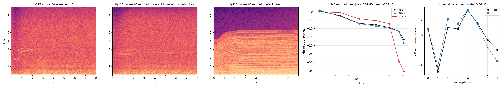
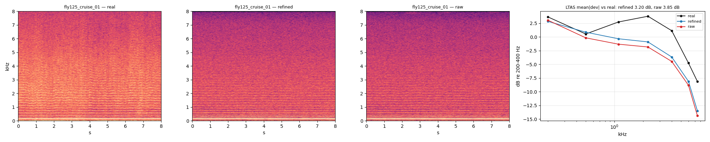
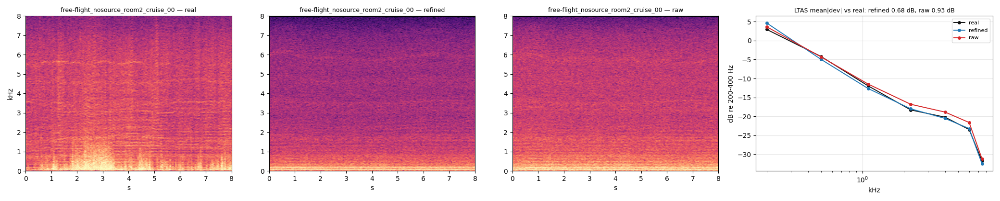
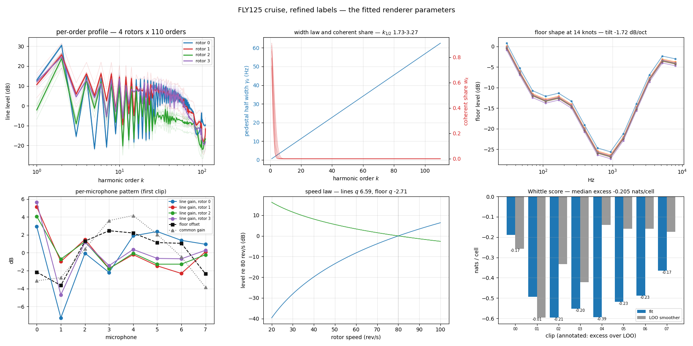
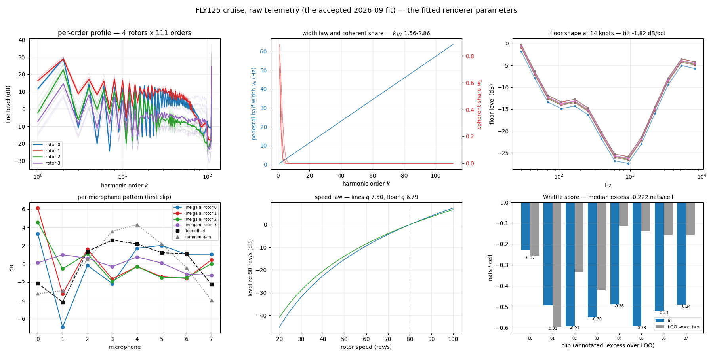
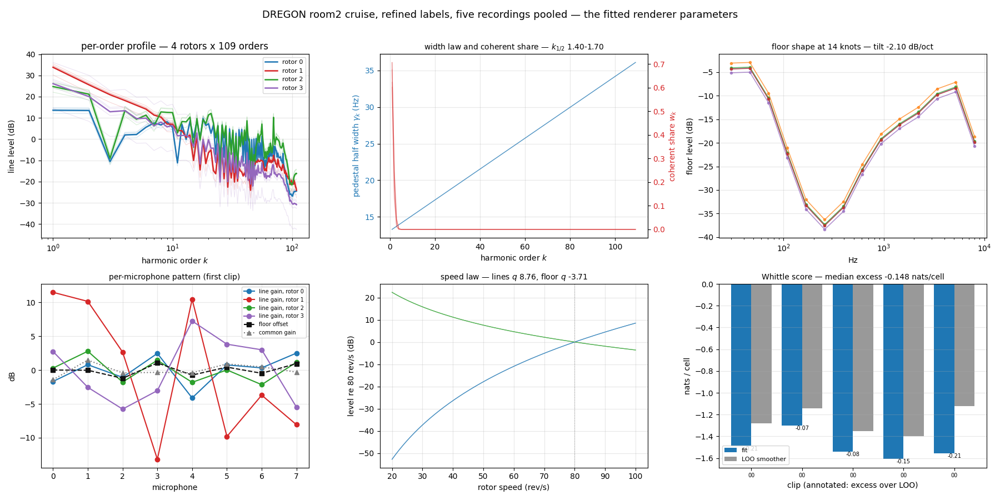

```{python}
import json
from pathlib import Path

import numpy as np
import pandas as pd

ROOT = Path.cwd()
while not (ROOT / "results").exists() and ROOT != ROOT.parent:
    ROOT = ROOT.parent
RES = ROOT / "results" / "S1"


def load(name):
    """Rooted at results/S1 — the bench sections' convention."""
    p = RES / name
    return json.loads(p.read_text()) if p.exists() else None


def load_root(p):
    """Rooted at the repository — everything else."""
    p = ROOT / p
    return json.loads(p.read_text()) if p.exists() else None


# bench instruments
cell = load("cell_coherence.json")
cell30 = load("cell_coherence_b30.json")
twocomp = load("two_component.json")

# flight fits and their gate
cruise_fit = load_root("results/S2/cruise_8clip.json")
cruise_dyn_fit = load_root("results/S2/cruise_8clip_dyn.json")
standby_fit = load_root("results/S2/standby.json")
standby_probe = load_root("results/S2/probe/standby_probe.json")
standby_real_probe = load_root("results/S2/probe/standby_real_probe.json")
cruise_dyn_probe = load_root("results/S2/probe/cruise_dyn_probe.json")
cruise_panels = load_root("docs/explainers/stage2-cruise/index.json")
cruise_probe = load_root("results/S2/probe/cruise_probe.json")
cruise_real_probe = load_root("results/S2/probe/real_probe.json")

# the 2026-09-12 refits on refined labels
refit = load_root("results/S2/cruise_8clip_refined.json")
refit_dregon = load_root("results/S2/dregon_room2_cruise_refined.json")
dregon_flight = load_root("results/S2/dregon_flight.json")
params_idx = load_root("docs/explainers/refit/index.json")
refit_panels = load_root("docs/explainers/stage2-cruise/index_cruise_refined.json")
dregon_panels = load_root("docs/explainers/stage2-cruise/index_dregon_refined.json")
refit_probe = load_root("results/S2/probe/cruise_refined_probe.json")
refit_real = load_root("results/S2/probe/cruise_refined_real_probe.json")
dregon_probe = load_root("results/S2/probe/dregon_refined_probe.json")
dregon_real = load_root("results/S2/probe/dregon_refined_real_probe.json")
standby_search = load_root("results/S2/standby_search.json")
ab_fly125 = load_root("docs/explainers/refit/ab_fly125.json")
ab_dregon = load_root("docs/explainers/refit/ab_dregon.json")
bench_rig = load_root("results/S1/bayes_rig.json")


def tied(summary, key, default=None):
    return ((summary or {}).get("rig") or {}).get(key, default)


def clip_stat(summary, path, fn=np.median):
    if not summary:
        return float("nan")
    out = []
    for entry in summary["clips"].values():
        node = entry
        for part in path.split("."):
            node = node.get(part) if isinstance(node, dict) else None
            if node is None:
                break
        if node is not None:
            out.append(float(np.atleast_1d(np.asarray(node, dtype=float)).ravel()[0]))
    return float(fn(out)) if out else float("nan")
```

::: {.callout-note}
## Who this is for, and what this page claims

This page is written in Simplified Technical English. Sentences are short. Each
sentence gives one fact. Every formula has a derivation. Every number comes from
a file under `results/`.

It is the single record of one model: a generative model of rotor noise, fitted
by **Whittle MAP on its expected periodogram**, with the fitted vector mapping
one-to-one onto the renderer's parameters. Four regimes have been fitted — the
DREGON single-motor bench, Michael's FLY125 cruise, Michael's FLY125 standby,
and DREGON's own flight — and the synthetic clips are judged by a **frozen**
rotor-speed tracker, not by the likelihood that produced them.

The document merges what used to be two pages, `bench-fit-derivations` and
`stage2-cruise`, and adds the 2026-09-12 refit on the published refined
rotor-speed labels (§16 to §19). The line model's interpretation is revised in
[bench-fit-revised-phase-model](bench-fit-revised-phase-model.html); read that
page for the physics, this one for what was measured.

Three things this page does **not** claim, and for which the revised documents
fix the language: the scoring reference is the published telemetry array — raw
as the shared reference, refined tracks as fit provenance and diagnostics, and
a renderer's realized shaft label as a diagnostic only; the spectral objective
is a **composite** score, never an exact joint NLL and never evidence; and **no
revised candidate has been fitted, scored or accepted** (the campaign record is
`docs/experiments/revised-phase-campaign.qmd`).
:::

# 1. The task

We have one rotor on a test bench. The rotor turns at a fixed setpoint. The
recording is 9 seconds long. We use one microphone channel (channel 7). We use
the native 44.1 kHz audio and we decimate it to 16 kHz.

We want a **generative model**. A generative model can produce new audio. The new
audio must have the same statistics as the real audio.

We do not want a decomposition. A decomposition only splits one recording into
parts. It cannot make new recordings.

# 2. The model

The model describes the **expected periodogram**. The periodogram is the squared
magnitude of the short-time Fourier transform (STFT).

For microphone $m$, frame $n$, and frequency $f$:

$$
M_m(f,n)\;=\;\underbrace{W*\Big[F(f,n)+\sum_r g_{mr}\!\sum_{k=1}^{K}\big(1-w_k\big)P_{rk}(n)\,L\big(f-kc_r(n);\gamma_{rk}\big)\Big]}_{\text{stochastic: floor + Lorentzian pedestals}}
\;+\;\underbrace{\sum_r g_{mr}\!\sum_{k=1}^{K} w_k\,P_{rk}(n)\,\big|W\big(f-kc_r(n)\big)\big|^{2}}_{\text{deterministic: coherent tones}}
$$

The symbols mean this:

- $c_r(n)$ is the rotor speed in revolutions per second. It is known from the label.
- $k$ is the harmonic order. Order $k$ sits at frequency $k\,c_r$.
- $P_{rk}$ is the total power of one line. It follows a speed law:
  $P_{rk} = 10^{(A_{rk} + h_{rk})/10}\,(c_r/80)^{q}$.
- $A_{rk}$ is the line profile in decibels. It is the main fitted vector.
- $w_k$ is the **coherent fraction** of that power. See §4.2 and §5.
- $L$ is a Lorentzian density with unit area and half width $\gamma_{rk}$.
- $\gamma_{rk} = \gamma_0 + \text{slope}\cdot k$ is the pedestal half width in hertz.
- $|W|^2$ is the analysis window's own power response. It carries no width
  parameter, because a pure tone has no width of its own.
- $F$ is the floor. It is a smooth curve in $\log f$ with 14 knots, plus a tilt,
  plus a level. The level also follows a speed law.
- $g_{mr}$ is the gain of microphone $m$ for rotor $r$.
- $W*$ is the window smearing. It applies to the stochastic part only. The
  coherent part is not smeared, because its shape already **is** the smearing.

## 2.1 Each line has two components at the same time

This is the part that changed today, so it is stated plainly.

Every order $k$ of every rotor carries **one** power $P_{rk}$, and that power is
split between **two components at the same frequency**:

| | share | shape | statistics of one bin |
|---|---|---|---|
| **coherent tone** | $w_k$ | $\big|W(f-kc_r)\big|^{2}$, no free width | deterministic; CV 0 |
| **stochastic pedestal** | $1-w_k$ | Lorentzian, half width $\gamma_{rk}$ | circular Gaussian; power exponential, CV 1 |

So the answer to "does the fitted model hold both a Lorentzian stochastic part
and a deterministic pure tone?" is **yes, and it holds both for every single
order**, with one fitted number setting the ratio:

$$
w_k = \exp\!\big(-(k/k_{1/2})^2\big).
$$

$k_{1/2}$ is the only new parameter. On Motor1_80 the fit returns
$k_{1/2}=14.9$. So order 1 is 100 % tone, order 15 is about half tone and half
noise, and order 40 is pure noise. The two limits recover the old models
exactly: $k_{1/2}\to\infty$ is a comb of pure tones, and $k_{1/2}\to 0$ is the
all-Rayleigh comb the plain Whittle likelihood assumed.

The flags that turn this on are `fit_coherence` and `needle_window_shape` in
`Spec`, and both are now set in `stage1_bayes.BENCH_VARIANT`.

**The renderer holds the same two components.** `synthesize` with
`line_mode="fm"` sends the share $w_k$ of each order through the tone bank (a
real oscillator on the shared shaft phase, so it is a true tone) and the share
$1-w_k$ through the noise path, added to the floor spectrum before the
overlap-add filter. The parameter is `StochasticParams.coherence_k_half`, and
`stage1_bayes.params_from_export` copies the fitted value into it. So what we
fit is what we render.

On the bench we switch off all dynamics. The rotor speed is constant. So the
drift terms are zero: `gp_std_db=0`, `floor_gp_std_db=0`, `floor_tilt_gp_std=0`,
`umod_std_db=0`.

This is the same model that we use to sample training noise. The fitted vector
maps one-to-one onto `StochasticParams` in
`src/data_processing/stochastic_rotor_noise.py`.

# 3. The likelihood

## 3.1 One bin of noise

Let $x(t)$ be a stationary Gaussian process. Take one STFT frame. The Fourier
coefficient is a weighted sum of many samples. By the central limit theorem the
coefficient is complex Gaussian. Its real part and imaginary part are
independent. Each has variance $M/2$, where $M$ is the expected power.

Write $X = a + ib$. Then

$$
p(a,b) = \frac{1}{\pi M}\exp\!\Big(-\frac{a^2+b^2}{M}\Big).
$$

Change to the power $I = a^2 + b^2$. The area element gives
$\mathrm{d}a\,\mathrm{d}b = \pi\,\mathrm{d}I$ after the angle is integrated out.
So

$$
p(I) = \frac{1}{M}\,e^{-I/M},\qquad I \ge 0 .
$$

The bin power is **exponential**. Its mean is $M$. Its standard deviation is also
$M$. So its coefficient of variation (CV) is exactly 1.

The negative log density of one bin is

$$
-\log p(I) = \frac{I}{M} + \log M .
$$

Summing over all bins and frames gives the **Whittle likelihood**:

$$
\boxed{\;\mathrm{NLL} = \sum_{m,n,f}\Big[\frac{I_{mnf}}{M_{mnf}} + \log M_{mnf}\Big]\;}
$$

This is `CombSpectrum.whittle` in `src/experiments/stochastic_fit/model.py`. We
add the prior and we maximise the posterior. This is a MAP fit of the forward
spectrum. We never fit a summary statistic.

## 3.2 One bin of a pure tone

Now let the signal be a pure tone. The tone has fixed amplitude and fixed phase.
The Fourier coefficient is **deterministic**:

$$
X(f) = A\,W(f - f_0),
$$

where $W$ is the transform of the analysis window. So $I = |A|^2|W(f-f_0)|^2$
with **no** randomness. The CV of the bin is 0, not 1.

This is the key point. The exponential density above is wrong for a tone. The
Whittle term assumes every line is noise.

## 3.3 Measured proof that both cases occur

We measured the CV of the centre bin of each line on the real bench clip
(`results/S1/cell_coherence.json`).

```{python}
if cell:
    ks = sorted((int(k) for k in cell["real"]))
    rows = []
    for name in ("real", "fm sj=0", "fm sj=0.03", "stochastic"):
        if name in cell:
            rows.append(
                dict(
                    case=name,
                    **{f"k={k}": round(cell[name][str(k)]["cv_cell"], 2) for k in ks if str(k) in cell[name]},
                )
            )
    display(pd.DataFrame(rows).set_index("case"))
```

The real clip goes from CV $\approx 0.05$ at order 1 to CV $\approx 1$ at order 8
and above. So the low orders are tones. The high orders are noise. One model must
hold both.

# 4. Phase noise on the shaft

## 4.1 Why order $k$ decoheres first

The shaft angle is $\theta(t)$. Order $k$ has phase $k\theta(t)$. Let the shaft
angle have a random walk part $\psi(t)$ with increment variance $\sigma^2$ per
sample. Then order $k$ has phase noise $k\psi(t)$. Its increment variance is

$$
\mathrm{Var}[k\,\Delta\psi] = k^2\sigma^2 .
$$

So phase noise grows as $k^2$. High orders lose phase first. This needs only one
parameter for the whole comb.

A direct check with $\sigma = 0.001$ rad per sample, $n_{\text{fft}} = 4096$, and
a Hann window gives:

| line | $\sigma$ per sample | mean $|X|$ | std $|X|$ | CV |
|---|---|---|---|---|
| 100 Hz (order 2) | 0.001 | 1015.3 | 7.2 | 0.007 |
| 3000 Hz (order 60) | 0.030 | 187.8 | 96.0 | 0.51 |

CV $= 0.51$ for the magnitude is the Rayleigh value ($\sqrt{4/\pi - 1} = 0.523$).
The mean also falls from 1023.7 to 187.8. That is a loss of 14.7 dB of coherent
level. Both effects come from one cause.

## 4.2 The coherent fraction of a random-walk tone, step by step

This subsection derives the coherent fraction from first principles. Every step
is written out. The result is a formula with **no free parameter**: the fraction
follows from the line width and the window length alone.

We do **not** use this formula in the fit. §5 shows that the bench's pedestal
does not obey the shaft-jitter law this derivation assumes, so we fit $w_k$
instead. The derivation is still needed, for three reasons: it gives the
physical meaning of $w_k$; it gives the limit any fitted $w_k$ must respect; and
it is the reason we know that one shaft parameter can move the whole comb.

### Step 1. The signal

Take one line. Write it as a complex phasor of unit amplitude:

$$
z(t) = e^{\,i\left(2\pi f_0 t + \psi(t)\right)} .
$$

$f_0$ is the nominal line frequency. $\psi(t)$ is the phase error. We model
$\psi$ as a **Wiener process**, that is, a random walk in continuous time:

$$
\psi(0)=0,\qquad \mathrm{Var}\!\left[\psi(t)-\psi(s)\right] = 2D\,|t-s| .
$$

$D$ has units of radians squared per second. It is the only property of the
shaft that enters.

### Step 2. The mean of a complex exponential of a Gaussian

We need one standard fact. Let $Z$ be Gaussian with mean $\mu$ and variance
$\sigma^2$. Then

$$
E\!\left[e^{iZ}\right] = e^{\,i\mu - \sigma^2/2} .
$$

*Proof.* Write the expectation as an integral and complete the square in the
exponent:

$$
E\!\left[e^{iZ}\right]=\frac{1}{\sqrt{2\pi}\sigma}\int e^{\,iz}\,
e^{-\frac{(z-\mu)^2}{2\sigma^2}}\,\mathrm{d}z
=\frac{1}{\sqrt{2\pi}\sigma}\int e^{-\frac{\left(z-\mu-i\sigma^2\right)^2}{2\sigma^2}}
\,\mathrm{d}z\;\cdot\;e^{\,i\mu-\sigma^2/2}.
$$

The remaining integral is a Gaussian integral and equals 1. $\square$

Two consequences, both used below. With $\mu = 0$:

$$
E\!\left[e^{i\psi(t)}\right]=e^{-D t},
\qquad
E\!\left[e^{i(\psi(t)-\psi(s))}\right]=e^{-D|t-s|} .
$$

So the **mean phasor decays**, at the same rate $D$ at which the correlation
decays. Note what this means physically: the phase does not get smaller, it gets
more spread out, and a spread phase averages towards zero.

### Step 3. The line shape, and what $D$ is in hertz

The autocorrelation of $z$ is, after demodulating the carrier,
$R(\tau)=e^{-D|\tau|}$. Its Fourier transform is the power spectrum:

$$
S(f)=\int_{-\infty}^{\infty} e^{-D|\tau|}e^{-i2\pi f\tau}\,\mathrm{d}\tau
=\frac{2D}{D^2+(2\pi f)^2} .
$$

This is a **Lorentzian**. Its half width at half maximum, in hertz, is found by
setting $(2\pi f)^2 = D^2$:

$$
\gamma=\frac{D}{2\pi},\qquad\text{so}\qquad D = 2\pi\gamma .
$$

An exponential correlation gives a Lorentzian line, and the line's half width is
the decay rate divided by $2\pi$. This is the same relation that sets a laser's
linewidth (the Schawlow–Townes result), and it is why a random-walk phase and a
Lorentzian line are two descriptions of one thing.

Define the **coherence time** as $\tau_c = 1/D = 1/(2\pi\gamma)$. This is the
time after which the mean phasor has fallen by $1/e$.

### Step 4. What one analysis frame measures

One STFT frame of length $T$ projects the signal onto the line frequency. With a
rectangular window, for clarity of the algebra:

$$
X=\frac{1}{\sqrt{T}}\int_0^T z(t)\,e^{-i2\pi f_0 t}\,\mathrm{d}t
=\frac{1}{\sqrt{T}}\int_0^T e^{\,i\psi(t)}\,\mathrm{d}t .
$$

The measured bin power is $P=|X|^2$. We want to split its mean into a part that
does not fluctuate and a part that does.

Introduce the single dimensionless number that controls everything:

$$
x \;=\; D\,T \;=\; 2\pi\gamma T \;=\; \frac{T}{\tau_c}.
$$

$x$ is the frame length measured in coherence times. Small $x$ means the phase
barely moves inside one frame. Large $x$ means the phase is lost many times over
inside one frame.

### Step 5. The total mean power

$$
E\!\left[P\right]=\frac{1}{T}\int_0^T\!\!\int_0^T
E\!\left[e^{\,i(\psi(t)-\psi(s))}\right]\mathrm{d}t\,\mathrm{d}s
=\frac{1}{T}\int_0^T\!\!\int_0^T e^{-D|t-s|}\,\mathrm{d}t\,\mathrm{d}s .
$$

Do the double integral. Use the symmetry of $|t-s|$ to take twice the lower
triangle:

$$
\int_0^T\!\!\int_0^T e^{-D|t-s|}\,\mathrm{d}t\,\mathrm{d}s
=2\int_0^T\!\!\int_0^s e^{-D(s-t)}\,\mathrm{d}t\,\mathrm{d}s
=2\int_0^T \frac{1-e^{-Ds}}{D}\,\mathrm{d}s .
$$

The inner integral gave $\left(1-e^{-Ds}\right)/D$. Now integrate over $s$:

$$
2\int_0^T \frac{1-e^{-Ds}}{D}\,\mathrm{d}s
=\frac{2}{D}\left[T-\frac{1-e^{-DT}}{D}\right]
=\frac{2}{D^2}\left(DT-1+e^{-DT}\right).
$$

Divide by $T$ and substitute $x=DT$:

$$
\boxed{\;E\!\left[P\right]=T\,\frac{2\left(x-1+e^{-x}\right)}{x^{2}}\;}
$$

Check the small-$x$ limit: $e^{-x}\approx 1-x+x^2/2$ gives
$E[P]\approx T\cdot\frac{2(x^2/2)}{x^2}=T$. That is correct, because a perfectly
coherent tone of unit amplitude gives $|X|^2=T$.

### Step 6. The coherent part of that power

The coherent part is the power of the **mean** phasor. Everything that survives
averaging is deterministic; everything else fluctuates:

$$
P_{\text{coh}}=\frac{1}{T}\left|E\!\int_0^T e^{\,i\psi(t)}\,\mathrm{d}t\right|^{2}
=\frac{1}{T}\left|\int_0^T e^{-Dt}\,\mathrm{d}t\right|^{2}
=\frac{1}{T}\left(\frac{1-e^{-DT}}{D}\right)^{2},
$$

using Step 2 for $E[e^{i\psi(t)}]=e^{-Dt}$. Substituting $x=DT$:

$$
\boxed{\;P_{\text{coh}}=T\,\frac{\left(1-e^{-x}\right)^{2}}{x^{2}}\;}
$$

### Step 7. The fraction

Divide Step 6 by Step 5. The factors $T$ and $x^2$ cancel:

$$
\boxed{\;w(x)=\frac{P_{\text{coh}}}{E[P]}
=\frac{\left(1-e^{-x}\right)^{2}}{2\left(x-1+e^{-x}\right)},
\qquad x=2\pi\gamma T\;}
$$

### Step 8. Read the two limits

**Narrow line, short frame ($x\to 0$).** Expand to third order,
$1-e^{-x}=x-\tfrac{x^2}{2}+\tfrac{x^3}{6}$, so the numerator is
$x^2\left(1-\tfrac{x}{2}\right)^2\approx x^2(1-x)$, and the denominator is
$2\left(\tfrac{x^2}{2}-\tfrac{x^3}{6}\right)=x^2\left(1-\tfrac{x}{3}\right)$.
Therefore

$$
w \approx \frac{1-x}{1-x/3}\approx 1-\frac{2x}{3}.
$$

The line is a tone, and it loses coherence linearly in $x$ at first.

**Broad line, long frame ($x\to\infty$).** The numerator tends to 1 and the
denominator to $2x$, so

$$
w\approx\frac{1}{2x}=\frac{\tau_c}{2T}=\frac{N_c}{2N},
$$

writing $N$ for the samples in a frame and $N_c$ for the samples in a coherence
time. This is the decoherence loss: a coherent estimate of the line keeps only
the fraction $N_c/2N$ of the power, and the rest has become noise. It is the
same $N_c/N$ that makes a plain DFT amplitude estimate collapse as the record
gets longer.

### Step 9. Why one shaft parameter moves the whole comb

The shaft angle is $\theta(t)$. Order $k$ of the comb has phase $k\theta(t)$, so
its phase error is $k\psi(t)$ and its variance is multiplied by $k^2$:

$$
D_k=k^2 D_1,\qquad \gamma_k=k^2\gamma_1,\qquad x_k=k^2 x_1,
\qquad w_k = w\!\left(k^2 x_1\right).
$$

One number, $x_1$, would then set the coherence of every order. High orders
decohere first, and they decohere fast, because $k^2$ grows quickly.

### Step 10. Put numbers in it

```{python}
import numpy as np


def w_of_x(x):
    return (1.0 - np.exp(-x)) ** 2 / (2.0 * (x - 1.0 + np.exp(-x)))


rows = []
sr, n_fft = 16000, 4096
T = n_fft / sr
for sigma, k, f0 in ((0.001, 2, 100.0), (0.03, 60, 3000.0)):
    D = sigma**2 / 2.0 * sr          # rad^2/s from a per-sample increment
    x = D * T
    rows.append(
        dict(
            line=f"{f0:.0f} Hz (order {k})",
            sigma_per_sample=sigma,
            gamma_hz=round(D / (2 * np.pi), 4),
            tau_c_s=round(1.0 / D, 4),
            x=round(x, 3),
            w=round(float(w_of_x(x)), 3),
        )
    )
display(pd.DataFrame(rows).set_index("line").T)
```

Read the two columns against the direct simulation in §4.1.

- The 100 Hz line has $x=0.002$. The formula gives $w=0.999$, that is, a tone.
  The simulation gave a coefficient of variation of 0.007, that is, a tone.
- The 3000 Hz line has $x\approx1.8$. The formula gives $w\approx0.35$, that is,
  the middle of the transition. The simulation gave a coefficient of variation of
  0.51, close to the Rayleigh value of 0.52, so the centre bin there behaves as
  noise.

One honest limit of the formula: it predicts how the **line's** power splits
between coherent and stochastic parts. It does not predict how much of the
stochastic part lands in the one centre **bin**, because that depends on the
line shape and on the window. That is exactly why the simulation's mean
amplitude fell further (1023.7 to 187.8) than $\sqrt{w}$ alone would suggest:
the stochastic part spread out of the bin. §5 measures that shape directly.

# 5. What the bench data actually say

## 5.1 The line is a needle plus a pedestal

We measured two more statistics per order on the same clip:

- the **equivalent width** $W_{\text{eq}} = \big(\int E\big)/\max E$ of the line
  excess over the local floor;
- the **centre bin share**: the part of the excess that sits in the centre bin.

```{python}
if cell:
    real = cell["real"]
    ks = sorted((int(k) for k in real))
    df = pd.DataFrame(
        {
            "W_eq (Hz)": [round(real[str(k)]["w_eq_hz"], 2) for k in ks],
            "centre share": [round(real[str(k)]["frac_1bin"], 2) for k in ks],
            "cell CV": [round(real[str(k)]["cv_cell"], 2) for k in ks],
            "band CV": [round(real[str(k)]["cv_band"], 2) for k in ks],
        },
        index=[f"k={k}" for k in ks],
    )
    display(df.T)
```

A pure tone in this window has $W_{\text{eq}} = 1.49$ Hz. Order 1 measures
1.50 Hz. So order 1 is a tone. The width then grows with the order.

::: {.callout-important}
## A band narrower than the line censors the width

The table above uses a $\pm 6$ Hz band. An equivalent width computed inside that
band can never exceed about 6 Hz. So the table shows a flat width near 5 Hz above
order 16, and I first read that as saturation. It is not saturation. It is the
band.

The same measurement with a $\pm 30$ Hz band (still inside the 78 Hz order
spacing) gives: 1.50 Hz at $k=1$, 2.19 at $k=8$, 5.63 at $k=16$, 8.12 at $k=32$,
and **19.76** at $k=64$. The width grows about linearly with the order. The
$k$-linear width law is therefore correct, and a constant-width variant is worse
by 3800 nats.

This is the third time the same class of defect appeared: a measurement or a
model floor that cannot represent the value it measures. See §11, items 1, 2 and 8.
:::

The uncensored measurement, with the same code and a $\pm 30$ Hz band:

```{python}
if cell30:
    real = cell30["real"]
    ks = sorted((int(k) for k in real))
    display(
        pd.DataFrame(
            {
                "W_eq (Hz)": [round(real[str(k)]["w_eq_hz"], 2) for k in ks],
                "centre share": [round(real[str(k)]["frac_1bin"], 2) for k in ks],
            },
            index=[f"k={k}" for k in ks],
        ).T
    )
```

The centre bin share falls from 0.65 to 0.04. So the line becomes a broad, flat
pedestal, and its peak disappears. The needle and the pedestal are both present
at the same order, and their ratio changes with the order.

The correct description is a **mixture of two components**:

1. a **needle**: window limited, width $W_N = 1.5$ Hz, coherent;
2. a **pedestal**: wider, and Rayleigh.

Let $w$ be the needle share of the power. Both parts have unit area. So the peak
density is $w/W_N + (1-w)/W_P$ and the total area is 1. Therefore

$$
W_{\text{eq}} = \frac{1}{\dfrac{w}{W_N} + \dfrac{1-w}{W_P}},
\qquad
\text{centre share} = w\,S_N + (1-w)\,S_P .
$$

Invert both. This gives two **independent** estimates of $w$:

$$
w_{\text{width}} = \frac{1/W_{\text{eq}} - 1/W_P}{1/W_N - 1/W_P},
\qquad
w_{\text{share}} = \frac{S - S_P}{S_N - S_P}.
$$

```{python}
if cell:
    real = cell["real"]
    W_N, W_P, S_N, S_P = 1.50, 6.0, 0.65, 0.17
    ks = sorted((int(k) for k in real))
    ww, wsr = [], []
    for k in ks:
        r = real[str(k)]
        ww.append((1.0 / r["w_eq_hz"] - 1.0 / W_P) / (1.0 / W_N - 1.0 / W_P))
        wsr.append((r["frac_1bin"] - S_P) / (S_N - S_P))
    display(
        pd.DataFrame(
            {
                "w from width": [round(v, 3) for v in ww],
                "w from centre share": [round(v, 3) for v in wsr],
                "difference": [round(a - b, 3) for a, b in zip(ww, wsr)],
            },
            index=[f"k={k}" for k in ks],
        ).T
    )
```

The two estimates agree to 0.005 for orders 1 to 16, from different parts of
the data (equivalent width against centre-bin share, on this bench cell). That
agreement is evidence for the **narrow-plus-broad descriptive template** — one
single-scale line is inadequate, and the data carry at least two apparent
linewidth scales. It is **not** evidence for a physical coherent power
fraction: decomposing $E|X|^2$ into $|EX|^2$ plus variance depends on the
initial phase alignment, so $w$ here measures apparent scales, not a
deterministic tone's share of the power. Revised interpretation:
`bench-fit-revised-phase-model.qmd` §2.2.

## 5.2 Width and mixture both change, and one width cannot hold both

Two facts stand together. First, the pedestal width does grow with the order,
about linearly, so the $k$-linear width law stays. Second, the mixture ratio also
changes, and it changes fast: $w_k$ falls from 1.00 to 0.03 between order 1 and
order 24. A single-component model must pay for both with one width, and it
cannot. That is why it loses 295 nats to the two-component model, and why its
fitted line at order 1 is already too wide (1.58 Hz against a measured 1.50 Hz).

## 5.3 The coherence lives in the mean spectrum

A needle and a pedestal have different **shapes**. The mean spectrum is
different. So the plain Whittle likelihood can identify $w_k$. We do not need any
new likelihood.

We parameterise the fraction as

$$
w_k = \exp\!\big(-(k/k_{1/2})^2\big).
$$

This form follows §4.1: phase variance grows as $k^2$, and the coherent factor of
a Gaussian phase is $e^{-\mathrm{Var}/2}$.

# 6. Results

```{python}
if twocomp:
    rows = []
    for tag, r in twocomp.items():
        s = r["scores"]
        rows.append(
            dict(
                variant=tag,
                **{
                    "NLL per cell": round(s["nll_fit"], 4),
                    "excess over LOO": round(s["excess_over_loo"], 3),
                    "k_half": round(r["k_half"], 2),
                },
            )
        )
    display(pd.DataFrame(rows).set_index("variant"))
else:
    print("results/S1/two_component.json not present yet")
```

Three line models are compared. All three use the same Whittle likelihood, the
same data and the same ladder.

- **one component**: every line is one Lorentzian of the fitted width.
- **two components**: needle plus pedestal, with the needle given a near-zero
  Lorentzian and smeared by the 3-tap window kernel.
- **needle = |W|^2**: the same mixture, with the needle carrying the window's
  own power response, tabulated from the window itself, and not smeared again.

The window needle wins: about 620 nats over the Lorentzian needle and about
1030 nats over a single component, and the held-out excess falls from 0.049 to
0.040. A constant-width variant, which I tried on the strength of a censored
width measurement, is 3800 nats worse and is not kept. The fitted $w_k$ matches the $w_k$ that §5.1 implies from two descriptive
statistics. The fit never saw those statistics.

Now compare each fitted model against the uncensored measurement. The model
widths are measured with the same code and the same $\pm 30$ Hz band.

```{python}
if twocomp and cell30:
    real = cell30["real"]
    ks = [int(k) for k in sorted(real, key=int)]
    tab = {"measured": [round(real[str(k)]["w_eq_hz"], 2) for k in ks]}
    for tag, r in twocomp.items():
        tab[tag] = [round(r["widths"].get(str(k), float("nan")), 2) for k in ks]
    display(pd.DataFrame(tab, index=[f"k={k}" for k in ks]).T)
```

Read this table carefully, because it does not give one clean verdict.

- At order 1 the two-component model gives 1.48 Hz against a measured 1.50 Hz.
  The one-component model gives 1.58 Hz. Only a two-component line can be that
  sharp at low order.
- At order 64 the two-component model gives 19.74 Hz against a measured
  19.76 Hz.
- Between order 12 and order 32 the two-component model is first too narrow
  (2.40 against 3.12) and then too wide (10.73 against 8.12). The
  one-component model happens to sit closer there.

The likelihood still prefers the two-component model by 295 nats. The width
statistic is a crude summary: it divides an area by a peak, after a floor is
subtracted. The likelihood uses every bin. So we follow the likelihood, and we
record the mid-order gap as an open item.

```{python}
if twocomp and cell:
    import matplotlib.pyplot as plt

    real = cell["real"]
    W_N, W_P = 1.50, 6.0
    ks = sorted((int(k) for k in real))
    implied = [
        (1.0 / real[str(k)]["w_eq_hz"] - 1.0 / W_P) / (1.0 / W_N - 1.0 / W_P) for k in ks
    ]
    key = "two + const gam" if "two + const gam" in twocomp else "two components"
    wk = twocomp[key]["w_k"]
    fig, ax = plt.subplots(figsize=(7, 4))
    ax.plot(ks, implied, "o-", label="implied by width statistic")
    if wk:
        ax.plot(ks, [wk[k - 1] for k in ks], "s--", label=f"fitted by Whittle MAP ({key})")
    ax.set_xscale("log")
    ax.set_xlabel("harmonic order k")
    ax.set_ylabel("coherent fraction $w_k$")
    ax.set_title("Coherent fraction: measured versus fitted")
    ax.grid(alpha=0.3)
    ax.legend()
    plt.tight_layout()
    plt.show()
```

# 7. Two side derivations that we made and then did not need

## 7.1 The Rice power density for one bin

A bin can hold a deterministic part of power $C$ and a noise part of power $N$.
Then $X = \sqrt{C} + n$ with $n$ complex Gaussian of power $N$. The power
$I = |X|^2$ has the Rice power density

$$
p(I) = \frac{1}{N}\exp\!\Big(-\frac{I + C}{N}\Big)\,I_0\!\Big(\frac{2\sqrt{IC}}{N}\Big),
$$

so

$$
-\log p(I) = \log N + \frac{I+C}{N} - \log I_0\!\Big(\frac{2\sqrt{IC}}{N}\Big).
$$

At $C = 0$ this is the Whittle term, because $I_0(0) = 1$.

We implemented this term. It failed on planted data. The reason is the line
shape. A coherent tone has the shape $|W(f-f_0)|^2$, which has nulls. Our model
spreads the coherent power over a smooth Lorentzian. So the model puts coherent
power where the real tone has a null. Then $(I+C)/N$ is large with $I \approx 0$.
Measured cost of the true value on the line cells alone: **+3268 nats**. So we
removed this term from the fit.

## 7.2 The non-central chi-square density for a band

Integrate the periodogram over a band of $\nu$ independent modes. Let the band
hold coherent power $C$ and noise power $N$. Each real component of the noise has
variance $\sigma^2 = N/(2\nu)$. Then

$$
\frac{B}{\sigma^2}\sim\chi^2_{2\nu}(\lambda),\qquad \lambda = \frac{C}{\sigma^2},
\qquad E[B] = N + C .
$$

We evaluate it by its Poisson mixture, which needs no Bessel function of
fractional order:

$$
p(x) = \sum_{j\ge 0}\mathrm{Pois}\big(j;\tfrac{\lambda}{2}\big)\,\chi^2\big(x;\,2\nu + 2j\big).
$$

A Monte-Carlo control confirms the code. With $\nu = 4$ and $N = 1$ the predicted
mean and standard deviation match the simulation to three decimals, and the
argmin over $C$ recovers planted values 0, 1 and 8 exactly.

We keep this function as a diagnostic. We do not need it in the fit, because §5.3
shows the mean spectrum already identifies $w_k$.

# 8. Looking and listening

Statistics alone do not close a stage. Every bench cell was rendered from its
fitted vector through the SAME renderer the training streams use, and decimated
on the real clips' own path. Each panel is real, fitted, and a draw from the
untouched default family, plus the LTAS band profile of all three.

## The whole bench rig: four motors, five setpoints

```{python}
rig_idx = json.loads((ROOT / "docs/explainers/stage1-bench/index_bayes.json").read_text())
tab = pd.DataFrame(
    [
        dict(
            cell=r["cell"],
            rev_s=r["rate"],
            fitted_LTAS_dB=r["fitted_mean_abs_db"],
            prefit_LTAS_dB=r["prefit_mean_abs_db"],
            k2_15=r["orders"]["k2_15"],
            k15_30=r["orders"]["k15_30"],
        )
        for r in rig_idx
    ]
).set_index("cell")
display(tab)
print(
    f"fitted LTAS deviation: median {tab.fitted_LTAS_dB.median():.2f} dB "
    f"(range {tab.fitted_LTAS_dB.min():.2f}-{tab.fitted_LTAS_dB.max():.2f}); "
    f"pre-fit median {tab.prefit_LTAS_dB.median():.2f} dB"
)
```

::: {layout-ncol=1}


:::

::: {.callout-warning}
## What this rig fit does and does not contain

A rig fit over bench clips has one rotor per clip, so its tied profile is **one
shape plus a scalar level per clip**. The four motors above therefore share a
timbre and differ by a gain: Motor 1 sits exactly 5.9 dB above Motor 2 at every
order. The measurement says the difference is **frequency dependent** (Motor 2
is 5 to 13 dB below Motor 1 around 1 kHz), so a single gain cannot express it.
Four independent single-motor fits are running to supply four genuinely
different shapes; this page will be updated with them.
:::

## Listen

Each row is one bench cell: the real recording, the fitted model's render, and a
draw from the untouched default family. All three are peak-normalised to the
same level, so what differs is spectrum and texture, not loudness.

```{python}
from IPython.display import HTML, display as _d


def player_table(rows, subdir, stem_of):
    out = [
        "<table style='width:100%;border-collapse:collapse'>",
        "<tr><th style='text-align:left'>clip</th><th>real</th><th>fitted</th>"
        "<th>pre-fit</th></tr>",
    ]
    for label, kinds in rows:
        tds = "".join(
            f"<td style='padding:4px'><audio controls preload='metadata' "
            f"style='width:225px' src='{subdir}/{src}'></audio></td>"
            for src in kinds
        )
        out.append(f"<tr><td style='padding:4px'><b>{label}</b></td>{tds}</tr>")
    out.append("</table>")
    return HTML("\n".join(out))


cells = [f"Motor1_{v}" for v in (50, 60, 70, 80, 90)] + [f"Motor{m}_80" for m in (2, 3, 4)]
_d(
    player_table(
        [
            (c, [f"bayes_{c}_{k}.wav" for k in ("real", "fitted", "prefit")])
            for c in cells
        ],
        "stage1-bench",
        None,
    )
)
```

# 9. Does the bench predict DREGON in flight?

The bench is clamped, single-motor and single-channel. A flight is four rotors
at once, eight microphones, and a moving shaft. This section asks the transfer
question directly: build the generative model from the bench cells ONLY, take
nothing from the flight except its rotor telemetry, and see how the result
compares with the real flight recording.

Four arms on `free-flight_nosource_room2`, four 8 s windows:

* **real** — the recording itself.
* **bench, blind** — every number from the bench, including its room floor.
* **bench comb + flight floor** — the same comb, with the floor LEVEL matched to
  the real clip in the line-free 5-7 kHz band. One number, so the comb is still
  entirely from the bench.
* **flight-fitted** — the same model fitted to the flight recording. The
  reference a transfer should be measured against.

Every arm is rendered at the real window's own rotor trajectories and scored by
the frozen `hppnet_l2_r2_s0` on all eight channels.

```{python}
tr = load("transfer/transfer.json")  # load() is rooted at results/S1
if tr:
    display(
        pd.DataFrame(
            [
                dict(
                    arm=k,
                    median_8mic_MAE=v["median_mae_8mic"],
                    median_spread=v["median_spread"],
                    median_LTAS_dev_dB=v["median_ltas_dev_db"],
                )
                for k, v in tr["summary"].items()
            ]
        ).set_index("arm")
    )
```

Read it in this order.

1. **The real DREGON flight tracks at 1.07 rev/s.** That is the number every
   synthetic arm is trying to reach. For scale, Michael's real cruise reads
   0.35 rev/s through the same pipeline.
2. **A blind bench transfer reads 2.49 rev/s** — worse than real by 2.3 times,
   with the band profile off by 9.4 dB. The bench comb does carry enough
   structure to be tracked at all, which is not nothing, but it is not the
   flight.
3. **Matching the floor level changes almost nothing** (2.47 rev/s). So the
   transfer gap is not a room-level gap.
4. **The flight-fitted arm gets the envelope right — 1.54 dB — and still reads
   2.08 rev/s.** This is the informative result. On Michael's cruise the same
   model fitted the same way reached 0.76 against 0.35 real. On DREGON it does
   not, and the fitted parameters say why: the DREGON flight fit returns
   $\gamma_0 = 12.4$ Hz and $k_{1/2} = 1.2$, against 0.0 Hz and 1.9 for
   Michael. DREGON's flight lines are fitted as very wide and almost entirely
   incoherent, so the rendered comb is smeared and the tracker has less to lock
   onto — even though the average spectrum is nearly perfect.

::: {layout-ncol=1}

:::

## The tracker's output against the truth

Same window, four arms. The upper panel is the clip, the lower panel is the
frozen tracker's four rotor predictions over the ground truth.

::: {.callout-note}
The tracker-versus-truth figures for these arms lived in
`results/synthetic_probe/`, a job output directory that was never synced back
and no longer exists. The numbers in this section come from the probe's own
JSON, which IS in the repository; the figures are not. Re-running
`scripts/_stage2_probe.py` with figure output rebuilds them.
:::

## Listen to the transfer

```{python}
if tr:
    rows = []
    for i in range(min(2, len(tr["clips"]))):
        rows.append(
            (
                f"window {i}",
                [
                    f"dregon_{i:02d}_real.wav",
                    f"dregon_{i:02d}_bench_blind.wav",
                    f"dregon_{i:02d}_flight-fitted.wav",
                ],
            )
        )
    out = ["<table style='width:100%;border-collapse:collapse'>",
           "<tr><th style='text-align:left'>window</th><th>real flight</th>"
           "<th>bench, blind</th><th>flight-fitted</th></tr>"]
    for label, srcs in rows:
        tds = "".join(
            f"<td style='padding:4px'><audio controls preload='metadata' "
            f"style='width:225px' src='dregon-transfer/{s}'></audio></td>" for s in srcs
        )
        out.append(f"<tr><td style='padding:4px'><b>{label}</b></td>{tds}</tr>")
    out.append("</table>")
    _d(HTML("\n".join(out)))
```


# 10. What was fitted {#sec-flight}

The line model comes from Stage 1 and is unchanged. Every order $k$ of every
rotor carries one power $P_{rk}$, split by a coherent fraction:

$$
w_k=\exp\!\big(-(k/k_{1/2})^2\big),
$$

with the share $w_k$ rendered as a **coherent tone** carrying the analysis
window's own power response $|W(f-kc_r)|^2$, and the share $1-w_k$ as a
**Rayleigh pedestal** of the fitted width $\gamma_{rk}=\gamma_0+\text{slope}\cdot k$.
The whole spectrum is

$$
M_m(f,n)=W*\Big[F(f,n)+\sum_r g_{mr}\!\sum_k (1-w_k)P_{rk}L(f-kc_r;\gamma_{rk})\Big]
+\sum_r g_{mr}\!\sum_k w_k P_{rk}\big|W(f-kc_r)\big|^{2}.
$$

Four things differ from the bench, each forced by the data:

1. **Four rotors.** Each carrier $c_r(n)$ comes from the telemetry. Each rotor
   has its own profile offset and its own microphone gains.
2. **Eight microphones.** Per-(microphone, rotor) line gains, a per-microphone
   floor, and one per-microphone gain on everything. The acceptance probe reads
   cross-channel agreement, so the fit must own the channel structure.
3. **The speed moves.** `chirp_width` adds the width a line gets because the
   rotor sweeps $k\,|ds/dt|$ hertz across one analysis window. It is computed
   from the telemetry with **no free parameter**.
4. **Cruise only.** A window is used only when all four rotors stay above
   65 rev/s for its whole length, so a stationary model has a stationary target.

Native 44.1 kHz audio is the only source; every clip comes from the published
`michaels-frames` dataset and is decimated with `clips.decimate`, so the
published 16 kHz brick wall never enters the fit.

# 11. The fit

Eight cruise windows of 16 s, all eight channels, 130 orders per rotor, joint
MAP with the rig-level parameters tied and a per-rotor profile offset. Run on a
CPU node in 15 minutes.

```{python}
if cruise_fit:
    rows = []
    for cid, e in cruise_fit["clips"].items():
        p, s = e["params"], e["scores"]
        rows.append(
            dict(
                clip=cid,
                rotors=", ".join(f"{v:.0f}" for v in np.asarray(p["carrier"]).mean(axis=1)),
                nll_per_cell=round(float(s["nll_fit"]), 4),
                excess_over_LOO=round(float(s["excess_over_loo"]), 3),
                k_half=round(float(p["coherence_k_half"]), 2),
                gamma_slope=round(float(np.atleast_1d(p["gamma_slope"])[0]), 3),
            )
        )
    display(pd.DataFrame(rows).set_index("clip"))
```

Two things to read here.

**Every clip beats its leave-one-out reference.** `excess_over_LOO` is the
fitted score minus the score of a nonparametric predictor that estimates each
frame from its neighbours. It is negative for all eight windows, from $-0.011$
to $-0.384$ nats per cell. A parametric model with a few hundred numbers
predicts these clips better than a smoother with access to their own
neighbouring frames.

**Cruise is mostly incoherent.** The fitted $k_{1/2}$ is 1.6 to 2.9, against 15
to 55 on the clamped bench. Only the first two or three orders of a flying rotor
are tones; everything above is a broadened, Rayleigh line. That is the expected
direction — the shaft wanders, and the flight adds width that the bench does not
have — and it is a fitted result, not an assumption. The pedestal width follows
with a slope of 0.57 Hz per order, so order 100 is about 57 Hz wide.

# 12. What it looks and sounds like

Real, fitted, and a draw from the untouched default family at the same rotor
speeds. The fourth panel is the LTAS band profile; the fifth is the
per-microphone level pattern, which a four-rotor eight-microphone fit owns and a
single-channel fit cannot represent at all.

```{python}
if cruise_panels:
    display(
        pd.DataFrame(
            [
                dict(
                    clip=r["clip"],
                    rotors=", ".join(f"{v:.0f}" for v in r["rotors"]),
                    k_half=r["k_half"],
                    LTAS_fitted_dB=r["fitted_mean_abs_db"],
                    LTAS_prefit_dB=r["prefit_mean_abs_db"],
                    channels_dB=r["channel_rms_dev_db"],
                )
                for r in cruise_panels
            ]
        ).set_index("clip")
    )
```

::: {layout-ncol=1}


:::

The fitted clip carries the floor shape (LTAS 1.55 to 2.40 dB against 2.80 to
5.49 dB for the pre-fit family) and the channel pattern to about 1 dB rms.

**What it does not carry: time.** The real spectrograms show gusts — slow
level and tilt changes over a few seconds. The synthetic clips are stationary,
because every dynamic term is pinned off. That is a deliberate choice, not an
oversight: on the bench a free drift term absorbed +4.97 dB of static per-order
level and broke the map from the fitted vector to the renderer. Turning drift
back on, with that identifiability handled, is the next step.

WAV files for each window are next to the figures in
`docs/explainers/stage2-cruise/` as `cruise_NN_{real,fitted,prefit}.wav`.

## Listen

Each row is the same window: the real recording, the fitted model's render, and
a draw from the untouched default family. All three are peak-normalised to the
same level, so the difference you hear is spectrum and texture, not loudness.

```{python}
from IPython.display import HTML, display as _d


def players(rows, subdir="stage2-cruise"):
    out = ["<table style='width:100%;border-collapse:collapse'>",
           "<tr><th style='text-align:left'>window</th><th>real</th>"
           "<th>fitted</th><th>pre-fit</th></tr>"]
    for label, stem in rows:
        cells = "".join(
            f"<td style='padding:4px'><audio controls preload='metadata' "
            f"style='width:230px' src='{subdir}/{stem}_{kind}.wav'></audio></td>"
            for kind in ("real", "fitted", "prefit")
        )
        out.append(f"<tr><td style='padding:4px'><b>{label}</b></td>{cells}</tr>")
    out.append("</table>")
    return HTML("\n".join(out))


rows = [(f"cruise {i}", f"cruise_{i:02d}") for i in range(4)] + [("standby", "standby_00")]
_d(players(rows))
```


# 13. The gate: a frozen tracker as the judge

**Historical.** The gate numbers in this section were computed on renders made
before the 2026-09-12 render-path correction (the render-correction callout in
§16). They are historical and unverified under the corrected render path —
neither a current pass nor a current fail — and they are not re-derived,
re-scored or re-interpreted here.

The strongest available test of "is this Michael's comb" is not a spectral
statistic. It is a model that was trained on real data, frozen, and never told
about this fit: `hppnet_l2_r2_s0`, read out with
`metrics.salience_layers.LayerPeakRPSMetric`.

The probe is known to be able to **fail**. On a deliberately diverse control
policy the same checkpoint reads 19.6 rev/s; on the previous fitted stream it
read 13.8 rev/s with 7 of 24 draws refused outright. So a good score means
something.

Twelve independent synthetic draws, each with its own seed and a real cruise
rotor trajectory, all eight channels, permutation-invariant matching:

```{python}
if cruise_probe and cruise_real_probe:
    v, vr = cruise_probe["verdict"], cruise_real_probe["verdict"]
    display(
        pd.DataFrame(
            [
                dict(
                    arm="synthetic (this fit)",
                    median_8mic_MAE=v["median_mae_8mic"],
                    median_spread=v["median_spread"],
                    refusals=f"{v['refusals']}/{v['n']}",
                ),
                dict(
                    arm="real clips, same pipeline",
                    median_8mic_MAE=vr["median_mae_8mic"],
                    median_spread=vr["median_spread"],
                    refusals=f"{vr['refusals']}/{vr['n']}",
                ),
                dict(
                    arm="threshold (preregistered)",
                    median_8mic_MAE=v["thresholds"]["mae"],
                    median_spread=v["thresholds"]["spread"],
                    refusals="0/12",
                ),
                dict(
                    arm="diverse control policy (counterexample)",
                    median_8mic_MAE=19.6,
                    median_spread="up to 66",
                    refusals="7/24",
                ),
            ]
        ).set_index("arm")
    )
```

```{python}
if cruise_probe:
    df = pd.DataFrame(
        [
            dict(
                clip=r["clip"],
                true_rps=r["mean_true_rps"],
                mic0=r["mae_mic0"],
                eight_mic=r["mae_8mic"],
                spread=r["spread"],
                refused=r["refused"],
            )
            for r in cruise_probe["clips"]
        ]
    ).set_index("clip")
    display(df)
```

**Verdict: the gate passes.** Median 8-microphone error 0.76 rev/s against a
threshold of 1.6, zero refusals out of twelve, median cross-channel spread
0.23 rev/s against a limit of 0.5. For scale, the same checkpoint reads 0.99
rev/s on Michael's real **held-out** FLY124 cruise, so the synthetic clips are
inside the range where this tracker works on real data it never saw.

Real clips through the identical pipeline read 0.35 rev/s, so synthetic is still
2.2 times worse than real on the same windows. The gap is real and is not
hidden here.

::: {.callout-note}
The tracker-versus-truth figures for these arms lived in
`results/synthetic_probe/`, a job output directory that was never synced back
and no longer exists. The numbers in this section come from the probe's own
JSON, which IS in the repository; the figures are not. Re-running
`scripts/_stage2_probe.py` with figure output rebuilds them.
:::

Look at the lower panel. Rotors at 90 and 81 rev/s are tracked almost exactly
(per-rotor MAE 0.35 and 0.40). The two rotors near 74 and 76 rev/s get confused
with each other, and that pair carries nearly all the error (1.32 rev/s). This
is **the same failure mode the tracker has on real recordings**, where the
near-degenerate 73.7 / 75.5 rev/s pair carries the residual. The synthetic clip
reproduces the real ambiguity, not just the real energy.

# 14. Does letting the floor gust help?

The synthetic cruise is stationary, and real cruise gusts. So the same eight
windows were refitted with the **floor** level and tilt allowed to drift
(a Gaussian process with a 3 s and a 6 s correlation time). The LINE drift
stays off, because that is the term that absorbed static per-order level on the
bench; a floor GP cannot steal per-order line level.

```{python}
import statistics as st

if cruise_fit and cruise_dyn_fit and cruise_probe and cruise_dyn_probe:
    def med(d, key):
        return round(st.median([e["scores"][key] for e in d["clips"].values()]), 4)

    display(
        pd.DataFrame(
            [
                dict(
                    variant="static floor",
                    median_nll=med(cruise_fit, "nll_fit"),
                    median_excess=med(cruise_fit, "excess_over_loo"),
                    probe_MAE=cruise_probe["verdict"]["median_mae_8mic"],
                ),
                dict(
                    variant="floor drifts (gusts)",
                    median_nll=med(cruise_dyn_fit, "nll_fit"),
                    median_excess=med(cruise_dyn_fit, "excess_over_loo"),
                    probe_MAE=cruise_dyn_probe["verdict"]["median_mae_8mic"],
                ),
            ]
        ).set_index("variant")
    )
```

The likelihood prefers the drifting floor on every window (median $-0.519$
against $-0.507$ nats per cell), so the gusts are real and the model can hold
them. The tracker does not care: 0.767 against 0.756 rev/s, which is the same
number. **So floor dynamics are not the explanation for the remaining gap to
real.** That is a useful negative result: it removes the first hypothesis on the
list.

# 15. Standby: one window, and why there is only one

FLY125 holds exactly **one** contiguous standby run. The old fit's exact
start is unknown; the conservative whole-event training envelope is
**[1.78, 15.28] s**. Stage 3 fits a single window inside that envelope and
says so: more "clips" would be consecutive slices of one event.
Standby also needs a taller comb than cruise, not a shorter one: at 35 rev/s
there are 226 orders under Nyquist against 121 in cruise.

```{python}
if standby_fit and standby_probe and standby_real_probe:
    e = next(iter(standby_fit["clips"].values()))
    p, sc = e["params"], e["scores"]
    display(
        pd.DataFrame(
            [
                dict(
                    quantity="rotor rates (rev/s)",
                    value=", ".join(f"{v:.0f}" for v in np.asarray(p["carrier"]).mean(axis=1)),
                ),
                dict(quantity="NLL per cell", value=round(float(sc["nll_fit"]), 4)),
                dict(quantity="excess over LOO", value=round(float(sc["excess_over_loo"]), 3)),
                dict(quantity="k_half", value=round(float(p["coherence_k_half"]), 2)),
                dict(quantity="probe: synthetic median 8-mic MAE", value=standby_probe["verdict"]["median_mae_8mic"]),
                dict(quantity="probe: real median 8-mic MAE", value=standby_real_probe["verdict"]["median_mae_8mic"]),
                dict(quantity="probe: refusals", value=f"{standby_probe['verdict']['refusals']}/12"),
                dict(quantity="probe: median spread", value=standby_probe["verdict"]["median_spread"]),
            ]
        ).set_index("quantity")
    )
```

::: {layout-ncol=1}

:::

Standby is the closest fit of the three stages. Its LTAS deviation is **0.59 dB**
against 6.65 dB for the pre-fit family, its channel pattern is within 0.66 dB
rms, and the two strong tonals near 2.8 and 3.0 kHz are reproduced. The tracker
reads **0.084 rev/s** on the synthetic draws against 0.054 rev/s on the real
ones, with no refusals and a cross-channel spread of 0.034.

Note that $k_{1/2}$ comes out at 5.6 here, between the flying value (1.6 to 2.9)
and the clamped bench (15 to 55). A slower shaft broadens its orders less, so
more of them stay coherent. Nothing forced that ordering; it is what the
likelihood returned on three separate regimes.

# 16. The refit on refined rotor-speed labels (2026-09-12)

Every fit above holds the rotor-speed trajectory FIXED and fits everything
else. Until 2026-09-12 that trajectory was raw telemetry. The frames datasets
now publish a second track, `rps_refined`: the regime-gated refinement of each
recording's rotor speed against its own comb
(`docs/experiments/refined-rps-labels.md`). On a FLY125 cruise window the
refined label differs from raw telemetry by up to **1.52 rev/s**, mean
0.16 rev/s. At order 100 a 1 rev/s carrier error displaces a line by 100 Hz, so
this is not a small change to the model's input.

The whole fitting surface was moved onto those datasets and re-run. What follows
is the comparison.

## 16.1 Michael's cruise: the labels changed, the fit did not

```{python}
def row(name, s):
    if not s:
        return dict(fit=name)
    ex = [float(e["scores"]["excess_over_loo"]) for e in s["clips"].values()]
    kh = [float(e["params"].get("coherence_k_half", 0.0)) for e in s["clips"].values()]
    gam = np.atleast_2d(np.asarray(next(iter(s["clips"].values()))["params"]["gamma"]))
    return {
        "fit": name,
        "clips": len(s["clips"]),
        "labels": ((s.get("data") or {}).get("rps_key") or "raw telemetry"),
        "gamma0 (Hz)": round(float(tied(s, "gamma0", np.nan)), 5),
        "slope (Hz/order)": round(float(tied(s, "gamma_slope", np.nan)), 4),
        "gamma at k=10 (Hz)": round(float(gam[0][min(9, gam.shape[1] - 1)]), 2),
        "k_half": f"{min(kh):.2f}-{max(kh):.2f}",
        "lines q": round(clip_stat(s, "params.amp_exp"), 2),
        "floor q": round(clip_stat(s, "params.floor_exp"), 2),
        "NLL/cell": round(clip_stat(s, "scores.nll_fit"), 4),
        "excess over LOO": round(float(np.median(ex)), 4),
    }


display(
    pd.DataFrame(
        [
            row("FLY125 cruise, raw telemetry", cruise_fit),
            row("FLY125 cruise, refined labels", refit),
            row("FLY125 cruise, raw + floor dynamics", cruise_dyn_fit),
        ]
    ).set_index("fit")
)
```

Read the first two rows against each other. The tied width intercept moves from
$1.95\times10^{-5}$ Hz to $1.88\times10^{-5}$ Hz. The tied slope moves from
0.573 to 0.568 Hz per order. The likelihood per cell moves by 0.001 nats. The
excess over the leave-one-out reference moves by 0.017 nats.

::: {.callout-note}
## The old and new predictors are different laws, scored on the same observations

The historical-forward `CombSpectrum` and the new moving filtered mean are
**different prediction laws**. Any NLL gain tests the whole predictor revision
— carrier integration, windowing, floor treatment, renderer anti-aliasing and
the stochastic line model together — not an isolated proof of one mechanism
such as OU shaft causality. They are scored on the **same observations,
weights and units**, and old exports are rescored, never refitted.
:::

::: {.callout-note}
## The old sampler is not exactly the new kernel

The legacy renderer's sampler uses overlap-add increments, FM-coherent tone
generation and realized-variance rescaling. Those choices prevent claiming that
its output is exactly the new finite-window kernel; it is a related but
distinct generator.
:::

**The cruise fit is not label-limited.** A correction of up to 1.5 rev/s in the
carrier changed nothing that matters about the fitted line model. That is a
negative result, and it is worth stating plainly, because the refit was
motivated by the idea that label noise is what the model has been absorbing.
On Michael's cruise it was not.

One group of parameters did move, and it moved badly: the speed-law exponents.
The lines' exponent went from 7.50 to 6.59, and the floor's exponent went from
**+6.79 to −2.71** — a change of sign. A negative floor exponent says the
broadband floor gets QUIETER as the rotors speed up, which no physical
mechanism supports. Both fits are on cruise windows only, where every rotor
stays between about 74 and 92 rev/s, so the speed law is being extrapolated
from a 1.24-fold speed range. It is not identified there, and the two fits
disagree about it because nothing in the data constrains it. §19 is about
fixing that.

## 16.2 DREGON's training rig, fitted on its own cruise

The DREGON room2 recordings are the training rig of every RPS model in the
project, and they had never been fitted as a rig. Five recordings
(`free-flight`, `hovering`, `updown`, `rectangle`, `spinning`, all
`_nosource_room2`) were pooled into one fit, one 16 s cruise window each, all
eight microphones, refined labels.

```{python}
display(
    pd.DataFrame(
        [
            row("DREGON room2 cruise, 5 recordings pooled", refit_dregon),
            row("DREGON free-flight room2, single window (2026-09)", dregon_flight),
            row("FLY125 cruise, refined labels", refit),
            row("FLY125 standby", standby_fit),
            row("DREGON bench rig, 20 cells", bench_rig),
        ]
    ).set_index("fit")
)
```

The DREGON rows say something the FLY125 rows do not. DREGON's fitted width is
**13 Hz at order 1** and grows slowly; FLY125's is $2\times10^{-5}$ Hz at order
1 and grows at 0.57 Hz per order. In the model's own coordinates, DREGON's comb
is wide from the very first order in a way that no order-dependent mechanism
explains, while FLY125's width is entirely order-proportional.

That is the same question the revised-model page asks, in the current model's
language: an order-independent width is per-harmonic incoherent noise
($D_{rk}$), an order-proportional one is shaft motion
($k^2\sigma_\nu^2/\lambda$). DREGON looks like the first, Michael's like the
second. Neither is established by these numbers: a width law is a marginal
statistic, and both mechanisms can fake it. It does say where to point the
cross-order phase diagnostic first.

## 16.3 The cost of a fit, now measured on both devices

```{python}
display(
    pd.DataFrame(
        [
            dict(arm="CPU, 8 threads, 2 clips, 20/20/40 iterations", wall_s=113, ladder_s=101),
            dict(arm="CUDA V100, 2 clips, 20/20/40 iterations", wall_s=31, ladder_s=6),
            dict(arm="CUDA V100, 8 clips, full 120/120/300 schedule", wall_s=174, ladder_s=166),
            dict(arm="CPU (2026-09, raw labels), 8 clips, full schedule", wall_s=896, ladder_s=None),
        ]
    ).set_index("arm")
)
```

The matched pair — same clips, same short schedule, same node — is 113 s on CPU
against 31 s on the GPU; the optimiser alone is 101 s against 6 s. The two arms
agree to $2.2\times10^{-5}$ nats per cell, so the device is not part of the
model. A full eight-clip cruise fit is now under three minutes.

Remote verification of the revised-phase implementation (not the old
`CombSpectrum` fits above): `bash-1a1663` on commit `b11c613b45e7` passed 115
tests with 2 skipped in 41.88 s on CPU; `bash-060c82` on commit
`4632edd383e1` (V100 16 GB) confirmed 13/13 finite forward and backward
gradients with a 10.260 s cold wall time and 3.929 GB peak allocation. The cold
wall time is not a steady fit cost. Since then, the off-diagonal moment fix has
been implemented in `revised_phase.estimate_shaft_dynamics` (integrated raw
heterodyne, per-frame isolation, common-pair covariance): a focused local run
passed 4 targeted tests, and `tests/experiments/test_stochastic_fit_revised_phase.py`
passed 42 tests with 2 skipped locally. The historical CPU and V100 proofs
remain at their recorded commits. Zero of eight candidate rounds have been used;
no revised candidate has been fitted, scored or accepted.

## 16.4 Look and listen to the refit

These panels and players are rendered FROM the refined-label fit, on the windows
it was fitted on: real microphone 0, the fitted draw, and a draw from the
untouched default family for scale. The columns are the same three as §12, so
the two fits can be compared by eye and by ear.

```{python}
if refit_panels:
    display(
        pd.DataFrame(
            [
                {
                    "window": r["clip"],
                    "rotors (rev/s)": r["rotors"],
                    "k_half": r["k_half"],
                    "LTAS fitted |dev| dB": r["fitted_mean_abs_db"],
                    "LTAS pre-fit |dev| dB": r["prefit_mean_abs_db"],
                    "channel pattern rms dB": r["channel_rms_dev_db"],
                }
                for r in refit_panels
            ]
        ).set_index("window")
    )
```

```{python}
from IPython.display import Markdown, display as _md_display

for i in range(3):
    _md_display(Markdown(f""))

if refit_panels:
    _d(players([(r["clip"], f"cruise_refined_{i:02d}") for i, r in enumerate(refit_panels)]))
```

The refit's LTAS deviation on the first window is **0.69 dB** against 2.81 dB
for the pre-fit family, and its channel pattern is within 0.79 dB rms. Window 1
is the worst of the three at 3.13 dB, and it is also the window with the
highest $k_{1/2}$ (2.95): the more orders a fit calls coherent, the more of the
spectrum it has to place exactly.

The DREGON refit's own windows follow. Its LTAS deviation is 0.67 and 1.09 dB
against 12.78 and 10.58 dB for the pre-fit family — the default family is much
further from DREGON than from Michael's rig — but its channel pattern is out by
**4.3 to 4.6 dB rms**, against 0.8 to 1.3 dB on Michael's. The fit reproduces
DREGON's spectrum and not DREGON's array.

```{python}
for i, label in enumerate(["free-flight", "hovering"]):
    _md_display(Markdown(f""))
```

```{python}
display(
    pd.DataFrame(
        [
            {
                "window": r["clip"],
                "rotors (rev/s)": r["rotors"],
                "k_half": r["k_half"],
                "LTAS fitted |dev| dB": r["fitted_mean_abs_db"],
                "LTAS pre-fit |dev| dB": r["prefit_mean_abs_db"],
                "channel pattern rms dB": r["channel_rms_dev_db"],
            }
            for r in dregon_panels
        ]
    ).set_index("window")
)
_d(players([(r["clip"], f"dregon_refined_{i:02d}") for i, r in enumerate(dregon_panels)]))
```

## 16.5 A/B: the refined fit against the raw fit, on the same window

The two fits above cannot be compared by listening to their own panels, because
each was rendered on its own windows. This comparison holds everything else
equal: the same real clip, the same rotor trajectory, the same seed, the same
resampling path. The only difference between the two synthetic arms is the
parameter vector.

```{python}
def ab_table(rows):
    out = []
    for r in rows:
        row = {"clip": r["clip"], "rotors (rev/s)": r["rotors"]}
        for arm, v in r["ltas_mean_abs_db"].items():
            row[f"LTAS |dev| {arm} (dB)"] = round(v, 2)
        for arm, v in r["channel_rms_dev_db"].items():
            row[f"channel rms {arm} (dB)"] = v
        out.append(row)
    return pd.DataFrame(out).set_index("clip")


def ab_players(rows, slug):
    arms = rows[0]["arms"]
    head = "".join(f"<th>{a}</th>" for a in arms)
    out = [
        "<table style='width:100%;border-collapse:collapse'>",
        f"<tr><th style='text-align:left'>window</th>{head}</tr>",
    ]
    for r in rows:
        cells = "".join(
            f"<td style='padding:4px'><audio controls preload='metadata' "
            f"style='width:230px' src='refit/ab_{slug}_{r['window']:02d}_{a}.wav'>"
            f"</audio></td>"
            for a in arms
        )
        out.append(f"<tr><td style='padding:4px'><b>{r['clip']}</b></td>{cells}</tr>")
    out.append("</table>")
    return HTML("\n".join(out))


if ab_fly125:
    display(ab_table(ab_fly125))
    _d(ab_players(ab_fly125, "fly125"))
```

::: {layout-ncol=1}



:::

Every arm of a window is written with ONE common gain (quoted in the index), so
the fitted level difference survives into the audio; normalising each arm to its
own peak would erase exactly what the comparison is about.

On window 0 the refined-label vector is closer to the real clip in the LTAS —
**0.80 dB against 1.11 dB** mean absolute band deviation — and the two are
within 0.1 dB of each other on the channel pattern. On window 1 the refined
vector is again slightly closer (3.20 against 3.85 dB), and window 1 is the hard
one for both. So the refined labels buy a little, consistently, and not much:
the same conclusion §16.1 reached from the parameters and §16.6 reaches from the
tracker.

What IS audible in both arms is what the model does not have. The real clip
carries a broadband hiss that modulates over the 8 s; both synthetic arms are
stationary. That is the missing dynamics of §14, and it is the first thing the
ear notices.

::: {.callout-important}
## These renders exposed an aliasing bug, and it is fixed

The first version of this comparison showed the raw-label arm with a bright band
from 6.5 kHz to Nyquist that neither the real clip nor the refined arm had. It
was not a refactor artefact and not a property of the labels. It was aliasing in
the **stochastic fit-to-render path** — `stage2.render_from_export` and
`stage1_bayes.render_from_export` — and it affected the clips rendered through
that path, including the ones on this page. What was examined is that path and
those clips; nothing here establishes which other synthetic audio in this
project went through it.

The mechanism, measured three ways:

* The fitted ladder is sized from the SLOWEST rotor, so at 74 and 90 rev/s
  order 111 sits at 8.2 kHz for one rotor and **10.0 kHz** for another. Those
  lines are outside the 7.9 kHz fit band, so their level is prior-driven, not
  measured; the raw fit's last order came back at **+6.8 dB against −10.9 dB**
  for its neighbours, an 18 dB sink for whatever the band edge left over.
* Rendering happens at 44.1 kHz and the clip is then decimated to 16 kHz. The
  raw render carried **27.4 dB between 8 and 11 kHz**. Splitting the native
  render into its below-8 kHz and above-8 kHz parts and decimating each
  separately: the decimated 7.5–8 kHz band read 15.1 dB in total, of which
  **14.5 dB came from the above-8 kHz part** and only 5.7 dB from genuine
  in-band content.
* A tone test through the old path: 8.1 kHz arrives 7.3 dB down, 9 kHz 30.6 dB
  down, 10.8 kHz 60.2 dB down. `resample_poly`'s default Kaiser window is a
  40–50 dB stop band, which is not enough for a comb.

The fix is not to silence the lines — an order that is out of band for the fast
rotor is inside it for the slow one, and the profile is one shared (rotor,
order) grid. The render now **low-passes itself before decimation**, on the
render path only, with a filter whose passband (7900 Hz, the fit's own band
edge), stopband (8000 Hz, the output Nyquist) and attenuation (100 dB) are
stated, and whose length follows from that specification through `kaiserord`.
`stage2.antialias`, applied in both `stage2.render_from_export` and
`stage1_bayes.render_from_export`. The intended application is a single centred
FIR pass on the render path; its realised response under that final
specification has **not** been re-measured on this page.

The before/after band figures that follow are **PRELIMINARY**. They were taken
with a **7800 Hz passband** filter variant, not through the final 7900 Hz pass
/ 8000 Hz stop / 100 dB specification described above, and that final
specification has not been re-measured. They are therefore indicative of the
**mechanism**, not of the shipped filter.

Measured after the fix with that 7800 Hz variant, same window, same seed: the
decimated 7.5–8 kHz band falls from 15.1 to 2.5 dB with the above-8 kHz
contribution at −148 dB, and the 6–8 kHz band goes 11.6 → 7.9 dB against the
real clip's 7.8 dB. Below 5 kHz the **band powers are unchanged at the reported
precision** — that is a band-power comparison, not sample-identical audio. The
tone test reads −4.9 dB at 7.9 kHz, the same reading as the unfiltered path at
that frequency, so nothing the fit modelled is lost **at that tone frequency**;
that is a tone-level statement at one frequency, not a global one. At 8.1 kHz it
reads −163 dB.

The shared decimator is deliberately untouched: it is what REAL clips go
through, and moving its band edge would move every recording in the project.
Every render on this page was rebuilt through the fixed path; the numbers in
§16.6 and §13 predate it.
:::

:::: {.callout-warning}
## Gate numbers taken before the render correction are historical

Every gate decision computed on pre-correction renders of this path — the
numbers in §13 and §16.6 among them — was measured on clips carrying the
aliasing artefact. They are **historical and unverified under the corrected
render path**: neither a current pass nor a current fail. They are not
re-derived, re-scored or re-interpreted here, and they are not deleted.
::::

:::: {.callout-warning}
## Also on this path: the wrapper does not preserve absolute level

A further defect exists on the examined render path: `stage2.render_from_export`
reaches `srn.synthesize` with its RMS normalisation in force, so the **fitted
absolute levels are not preserved through the wrapper as it stands**. Absolute
levels of clips rendered through this path are affected by that.

The resolution — physical units with no per-arm normalisation — is **pending**
under the frozen revised-phase protocol and is not claimed here. No re-measured
level, no estimated error and no before/after number is published for this
defect in this document; those wait for actual baseline output.
::::

```{python}
if ab_dregon:
    display(ab_table(ab_dregon))
    _d(ab_players(ab_dregon, "dregon"))
```

::: {layout-ncol=1}

:::

::: {.callout-warning}
## The DREGON pair is not a label ablation

`dregon_flight.json` is a single-recording, single-window fit; the refined one
pools five recordings into a rig. They differ in labels AND in what they were
fitted on, so this pair shows what the two delivered models sound like, not what
refinement did. A clean DREGON label ablation would refit the same recording set
and the same windows under both tracks, and has not been run.
:::

DREGON's two arms are close in the spectrum — 0.68 dB for the pooled refined fit
against 0.93 dB for the older single-window raw fit — and both are
out by about 4 dB rms on the channel pattern, against about 1 dB on Michael's
rig. Listen to the comb: on DREGON both arms sound like a hiss with a weak
buzz, because $\gamma_0$ is 13 Hz and $k_{1/2}$ is 1.4 to 1.7, so almost every
order is a wide incoherent pedestal. On Michael's rig the same model produces an
audible tonal comb. That difference, not the labels, is what the frozen tracker
punishes in §16.6.

## 16.6 What the frozen tracker says about the refits

**Historical.** These tracker numbers were computed on renders made before the
2026-09-12 render-path correction above. They are historical and unverified
under the corrected render path — neither a current pass nor a current fail —
and they are not re-derived here.

The likelihood is not the judge. The gate is a frozen rotor-speed model
(`hppnet_l2_r2_s0`) scoring twelve independent synthetic draws, each on its own
real rotor trajectory, all eight microphones, PIT-aligned. Both refits went
through it unchanged (§18 has the table).

| arm | raw labels | refined labels |
|---|---:|---:|
| FLY125 cruise, synthetic | 0.756 | **0.746** |
| FLY125 cruise, real clips, same pipeline | 0.347 | 0.346 |
| DREGON room2 cruise, synthetic | 2.077 | **2.075** |
| DREGON room2 cruise, real clips | 1.069 | 1.009 |

Median 8-microphone PIT MAE in rev/s, twelve draws, no refusals in any arm. The
refits move the gate by 0.01 rev/s on Michael's and 0.002 rev/s on DREGON. The
DREGON arm still fails the preregistered gate — 2.075 against a 1.6 threshold,
with a cross-channel spread of 0.75 against a 0.5 bound — exactly as the
raw-label fit did.

So the refined labels changed neither the parameters, nor the likelihood, nor
the gate. Three independent measurements agree that the fit was not
label-limited.

::: {.callout-important}
## The same question was asked of the discriminative model, and answered the same way

A parallel experiment retrained the gate checkpoint itself on refined training
labels — same recipe, same data, same seed, only
`rps_key: rps_refined` added to the two real noise arms of
`conf/online_mix/hb_silence_dload.yaml`. The result at one seed: DREGON cruise
PIT MAE **2.07 to 2.57 rev/s (worse)**, Michael's FLY124 cruise 0.77 to 0.78
(unchanged), so the cross-rig gap **widened** from 1.30 to 1.79 rev/s.

Whatever makes DREGON harder than Michael's rig, for a tracker and for this
generative model, it is not the rotor-speed label. The remaining suspects are
physical: DREGON's 13 Hz width intercept (§17), its room, its airframe, and the
flow over its array.
:::

# 17. What the fit learned, as parameters

A fit is only as good as the vector it exports, because that vector IS the
renderer's input. These are the three fits above, drawn as parameters rather
than as scores: the per-order profile, the width law with the coherent share,
the floor shape, the per-microphone pattern, the speed law, and the per-clip
Whittle score against its own leave-one-out reference.

::: {layout-ncol=1}





:::

Four things are visible in every panel, and all four matter.

1. **The profile is not smooth in $k$.** The first ten orders swing by 10 to
   20 dB between neighbours. That is interference — the airframe and the
   microphone ring — not a rotor property, and it is why the model gives every
   order its own power instead of a parametric roll-off.
2. **The coherent share collapses by order 5.** With $k_{1/2}$ between 1.7 and
   3.3, $w_k$ is below 0.01 past order 6. Every order above that is a pedestal,
   and its width at order 10 is already 5.7 Hz. The "coherent tones plus
   stochastic floor" name describes the first five orders of a 110-order comb.
3. **The floor shape is stable across clips and rigs.** The 14 knots overlay
   almost exactly within a fit, with a tilt near $-1.7$ dB per octave and a
   minimum around 1 kHz. This is the part of the model that transfers.
4. **The speed law is not stable at all.** The lines' exponent lands between
   4.4 (standby) and 14.1 (DREGON single window), against the family's default
   of 2.5, and the floor's exponent changes sign between fits. Every one of
   these fits is inside one narrow speed band, which is exactly the condition
   under which an exponent cannot be measured.

```{python}
rows = []
for name, s in (
    ("bench rig, 20 cells", bench_rig),
    ("FLY125 cruise, raw", cruise_fit),
    ("FLY125 cruise, refined", refit),
    ("FLY125 cruise, floor dynamics", cruise_dyn_fit),
    ("FLY125 standby", standby_fit),
    ("DREGON free-flight, single", dregon_flight),
    ("DREGON room2 cruise, pooled", refit_dregon),
):
    if not s:
        continue
    gam = np.atleast_2d(np.asarray(next(iter(s["clips"].values()))["params"]["gamma"]))
    kh = [float(e["params"].get("coherence_k_half", 0.0)) for e in s["clips"].values()]
    car = np.asarray(next(iter(s["clips"].values()))["params"]["carrier"], dtype=float)
    rows.append(
        {
            "fit": name,
            "rotor rate (rev/s)": f"{car.mean():.0f}",
            "orders": int(s["spec"]["n_harm"]),
            "gamma(k=1) Hz": round(float(gam[0][0]), 3),
            "gamma(top) Hz": round(float(gam[0][-1]), 1),
            "k_half": f"{min(kh):.2f}-{max(kh):.2f}",
            "lines q": round(clip_stat(s, "params.amp_exp"), 2),
            "floor q": round(clip_stat(s, "params.floor_exp"), 2),
            "excess over LOO": round(clip_stat(s, "scores.excess_over_loo"), 3),
        }
    )
display(pd.DataFrame(rows).set_index("fit"))
```

The width column is the interesting one. Ordered by rotor rate, the fitted
width at order 1 goes 0.23 Hz (bench, clamped), 2.66 Hz (standby, 35 rev/s),
$2\times10^{-5}$ Hz (cruise, 80 rev/s), 13.3 Hz (DREGON cruise, 80 rev/s). Two
rigs at the same speed differ by six orders of magnitude in the intercept. The
model has no term that explains that, and the two rigs' recordings differ in
more ways than the rotors: room, airframe, microphone mounting, flow over the
array.

# 18. What was asked of the fit, and what is done

```{python}
def probe_row(name, p, r=None):
    if not p:
        return dict(arm=name, state="not run")
    v = p.get("verdict", {})
    out = dict(
        arm=name,
        state="done",
        median_8mic_mae=v.get("median_mae_8mic"),
        median_spread=v.get("median_spread"),
        refusals=f"{v.get('refusals')}/{v.get('n_clips', 12)}",
    )
    if r:
        out["real_reference"] = (r.get("verdict") or {}).get("median_mae_8mic")
    return out


display(
    pd.DataFrame(
        [
            probe_row("FLY125 cruise, raw labels (2026-09)", cruise_probe, cruise_real_probe),
            probe_row("FLY125 standby, raw labels", standby_probe, standby_real_probe),
            probe_row("FLY125 cruise + floor dynamics", cruise_dyn_probe),
            probe_row("FLY125 cruise, refined labels", refit_probe, refit_real),
            probe_row("DREGON room2 cruise, refined labels", dregon_probe, dregon_real),
        ]
    ).set_index("arm")
)
```

The audit, item by item.

| asked | state | evidence |
|---|---|---|
| Refit Michael's FLY125 cruise on refined labels | **done** | `results/S2/cruise_8clip_refined.json`, 8 windows, 168 s on a V100 |
| Refit the DREGON training recordings on refined labels | **done** | `results/S2/dregon_room2_cruise_refined.json`, five recordings pooled |
| Fit DREGON standby | **impossible as specified** | see below |
| Refit Michael's standby | **not needed** | refinement is gated off below 45 rev/s, so the standby label is the telemetry, unchanged |
| Re-run the acceptance gate on the refits | in the table above | a blank row means the job has not landed yet |
| Refit the bench rig from the frames datasets | **not run** | the frames path is verified bit-exact against the retired loader, but no bench refit has been submitted |
| Re-run the floor-dynamics arm on refined labels | **not run** | the raw-label arm remains the record |
| Four independent per-motor bench shapes | **open** | `bayes_rig.json` is one shape plus per-cell levels |

## 18.1 Why there is no DREGON standby fit

The standby regime is defined as every rotor inside 20 to 45 rev/s for a
contiguous 12.5 s. FLY125 holds exactly one such run. DREGON holds none.

```{python}
rows = []
for r in (standby_search or {}).get("rows", []):
    sb = r.get("standby_band_20_45", {})
    rel = r.get("relaxed_band_10_60_NOT_STANDBY", {})
    rotors = r.get("per_rotor", [])
    rows.append(
        {
            "recording": r["recording"],
            "covered (s)": r.get("coverage_span_s"),
            "label starts late (s)": r.get("audio_excluded_head_s"),
            "slowest rotor median": min((x["median"] for x in rotors), default=None),
            "in 20-45 band": sb.get("fraction_covered_time"),
            "longest run (s)": sb.get("longest_run_s"),
            "relaxed 10-60 run (s)": rel.get("longest_run_s"),
            "12.5 s windows": r.get("n_standby_windows_12p5s"),
        }
    )
if rows:
    display(pd.DataFrame(rows).set_index("recording"))
```

The search covered all ten telemetry-bearing DREGON recordings plus FLY124 and
FLY125 as controls (`results/S2/standby_search.json`). The result is
unambiguous and it is not a matter of window length:

* The **longest run with every rotor inside 20 to 45 rev/s, anywhere in
  DREGON, is 0.845 s.** The standby regime asks for 12.5 s. Even a 1 s window
  has no home.
* The only sub-45 rev/s region in each recording is a single 3.0 to 6.1 s
  excursion that **begins exactly at the label's coverage start** and sweeps
  monotonically from 0 rev/s up to about 45. That is the tail of the spin-up
  ramp, caught mid-ramp because telemetry starts 2.5 to 6.5 s after the audio.
  It is a ramp, not a plateau: the mean speed slew inside the band is 34 to
  51 rev/s per second.
* Spin-down is invisible. Only the five room1 recordings show a 0.15 to 0.38 s
  sub-45 fragment at the coverage END, where the label stops 1.0 to 2.8 s
  before the audio does.
* Relaxing the band to 10 to 60 rev/s — which is NOT the standby regime — buys
  at most 5.26 s.

So DREGON never idles on the ground with its rotors turning slowly and the
telemetry running. It spins up, flies at about 80 rev/s, and stops. Michael's
rig is the only one in the project with two settled plateaus, and that makes
FLY125 the only recording that can support the multi-regime fit of §19.

What DREGON does have is a **ramp** — several seconds of monotone speed sweep
per recording, ten of them, in exactly the speed range that no plateau covers.
That is useful data for a speed law, with two caveats: the ramp abuts the
label's coverage start, so half of it is unlabelled, and refinement is gated
off below 45 rev/s, so what label there is comes from raw telemetry.

# 19. One model for standby, cruise, and the ramp between

The four fits above are four parameter vectors. The renderer takes ONE vector
plus a rotor-speed trajectory and is expected to produce audio for whatever the
trajectory does — including the ramp between standby and cruise, which no fit
has ever seen. This section is about what it would take to fit that.

## 19.1 The evidence that per-regime fits do not compose

The renderer's only speed-dependent machinery is the speed law: line power and
floor power scale as $(s/80)^q$, with one exponent for the lines and one for
the floor. Every fit measures that exponent inside one narrow band, and they
disagree:

```{python}
rows = []
for name, s in (
    ("bench rig (clamped, 49-88 rev/s across cells)", bench_rig),
    ("FLY125 standby (35-40 rev/s)", standby_fit),
    ("FLY125 cruise, refined (74-92 rev/s)", refit),
    ("FLY125 cruise, raw (74-92 rev/s)", cruise_fit),
    ("DREGON room2 cruise, pooled (74-92 rev/s)", refit_dregon),
    ("DREGON free-flight, single window", dregon_flight),
):
    if not s:
        continue
    q = clip_stat(s, "params.amp_exp")
    qf = clip_stat(s, "params.floor_exp")
    rows.append(
        {
            "fit": name,
            "lines q": round(q, 2),
            "floor q": round(qf, 2),
            "lines: 80 -> 35 rev/s (dB)": round(10 * q * np.log10(35 / 80), 1),
            "floor: 80 -> 35 rev/s (dB)": round(10 * qf * np.log10(35 / 80), 1),
        }
    )
display(pd.DataFrame(rows).set_index("fit"))
```

The last two columns are the extrapolation that a single-regime fit forces on
the renderer. Take the cruise fit's line exponent of 6.6 and ask it for standby
at 35 rev/s: it predicts the lines drop by 23.7 dB. Take the standby fit's own
exponent of 4.4 and it says 15.8 dB. The two differ by **8 dB**, and the floor
exponents do not even agree in sign. A ramp rendered from a cruise fit is
therefore wrong by roughly 8 dB at its slow end, and wrong in an unknown
direction for the floor.

This is not a defect of the fitting code. It is what an unidentified parameter
does: cruise windows span a 1.24-fold speed range, and an exponent needs a
lever arm.

## 19.2 What a multi-regime model has to add

Three changes, in order of how much they cost.

**One. Fit clips that span the speed range in ONE rig.** The speed law is
already a rig-level tied parameter; it simply never saw two regimes at once.
Pooling standby, ramp and cruise windows of the same recording into a single
rig fit gives the exponent a 2.5-fold lever arm and makes it a measurement
instead of an extrapolation. Nothing in the model needs to change for this.

**Two. Let the shape, not only the level, depend on speed.** A single exponent
says every order and the whole floor scale together. The fits say otherwise:
$k_{1/2}$ is 5.6 at standby and 1.7 to 3.3 in cruise, and the width law's
intercept and slope both move. So the speed-dependent object is not one scalar.
The minimal honest parameterisation is a smooth function of $\log s$ with few
knots per quantity:

$$
\begin{aligned}
10\log_{10}P_{rk}(s) &= A_{rk} + q_k\,\log_{10}(s/s_0), \\
\gamma_{rk}(s) &= \gamma_0(s) + a(s)\,k, \\
k_{1/2}(s) &= \text{smooth, 2 or 3 knots in } \log s,
\end{aligned}
$$

with $q_k$ itself smooth in $\log k$ so that 110 orders do not carry 110 free
exponents. In the revised phase model the same idea is more principled: the
speed-dependent objects are the shaft's $\sigma_\nu(s)$ and $\lambda(s)$, which
are controller properties and should vary slowly and monotonically with
setpoint, plus $D_{rk}(s)$.

**Three. Accept non-stationarity inside the ramp, and analyse it correctly.**
A 16 s window at $N_{\text{FFT}}=16384$ assumes the rate is constant across
1.024 s. On a ramp it is not: the model already has `chirp_width`, which adds
the width a line acquires because the rate sweeps across one frame, computed
from the label with no free parameter. That term is necessary but not
sufficient — a fast ramp needs shorter frames, which means the fit must accept
clips with different frame lengths in one rig. The `Spec` already carries its
own `freqs`/`times` per clip, so this is a driver change, not a model change,
and multiple frame lengths are independently valuable: one physical parameter
set fitted across window lengths is the identifiability test the revised page
asks for.

## 19.3 The first experiment, which needs no new code

The regime bands are only a window filter. A fit that pools everything above
standby's floor is one command today:

```bash
python scripts/stochastic_fit.py --regime cruise --recording FLY125 \
    --min-rps 20 --seconds 8 --clips 20 --k-cap 230 \
    --out results/S2/fly125_allspeed.json
```

`--min-rps 20` replaces cruise's 65 rev/s floor, so the window search keeps
standby, the ramps and cruise; `--k-cap 230` is standby's ladder, because the
slowest rotor in the clip set sets how many orders fit under Nyquist; 8 s
windows keep the ramp inside a window instead of straddling it.

::: {.callout-warning}
## Pooling alone will NOT identify the speed law

`fit_rig` gives every clip its own per-rotor level nuisance (`level_db`, free
per clip and per rotor) so that clips of different loudness can share one
profile shape. That freedom is exactly what a speed law competes with: a
standby clip is quieter than a cruise clip, and the clip's own level can absorb
the whole difference, leaving the tied exponent unconstrained no matter how
wide the pooled speed range is.

So the command above is a **diagnostic, not the experiment**. Run it to see how
much of the level difference the nuisances take, then do one of these before
believing an exponent:

* **Constrain the nuisance.** Pin the per-clip levels to zero mean within a
  recording, so only the speed law can move level with speed.
* **Reparameterise.** Make the clip level a function of its own mean speed —
  which is what the speed law is — and keep only a residual per-clip term with
  a tight prior.
* **Remove it for this fit.** One recording, one rig, one microphone set: the
  per-clip level has no physical referent that the speed law does not already
  carry.

The same argument applies to the floor's level and its own exponent. Until one
of these is done, a pooled fit measures how flexible the nuisances are, not how
the rig responds to speed.
:::

Three things to read from it, each of which decides the next step:

1. **Does the tied exponent land between the per-regime values (4.4 and 6.6)?**
   If it does, one law spans the range and the multi-regime model is mostly a
   window-selection change. If the pooled fit is much worse per cell than the
   two separate fits, one exponent cannot hold both, and the speed-dependent
   shape of §19.2 is required.
2. **What happens to $k_{1/2}$ and the width law?** They are currently tied
   across clips, so a pooled fit must compromise. The size of that compromise
   is the measurement of how speed-dependent they are.
3. **Does the floor's exponent stop changing sign?** If it does, the sign flips
   in §16.1 were an identifiability artefact of a narrow band, and the floor
   law becomes trustworthy. If it does not, the floor's speed law needs a
   different parameterisation before any ramp is rendered.

## 19.4 Two warnings about the ramp

**The ramp is where the label is worst.** Refinement is gated off below
45 rev/s and blended across the ramp, precisely because a slow shaft's comb is
too weak to refine against. So the ramp clips carry raw telemetry, and the
carrier error that the cruise fit could ignore is largest exactly where the
speed law needs it. Those measurements stand, and they are what motivates a
per-clip carrier bias.

The operative recommendation that used to close this paragraph — "fit the
carrier offset (`rps_offset`, already in the model) on ramp clips, and report
it" — is **historical and superseded**. A fitted time-resolved `rps_offset`
path beside a fitted shaft path is a second carrier path, and the two are
non-identifiable up to a gauge. The approved parameterization is: raw
telemetry with a per-rotor delay, a **per-clip constant bias**, and a
**single OU shaft state** — no second time-resolved correction of any kind
(see `bench-fit-revised-phase-model.qmd` §6.1.1).

**The gate must move with the model.** The acceptance probe scores 8 s windows
of cruise or standby. A model that claims the ramp must be judged on the ramp,
because the transition frames are where a tracker actually fails and where the
training data's value lies. Extending
`scripts/_stage2_probe.py` to a ramp regime is a prerequisite for believing any
multi-regime fit, not a follow-up.

# 20. Hacks, defects, and hindrances

This list is complete and honest. It merges the bench and flight records.
Items 1 to 7 are **defects that we found and fixed**; the rest are open or are
lessons.

This list is complete and honest. Items 1 to 7 are **defects that we found and
fixed**. Items 8 to 12 are **open**.

1. **Width floor in the fit.** `gamma_min_bins` was 0.6 bins. A round trip on
   pure tones returned 4.69 Hz where the truth was 0.35 Hz. A width floor above
   the truth is a censor. Fixed: 0.01.
2. **The same constant in the renderer.** `build_psd` clamped every line to
   0.6 bins. At 44.1 kHz with `n_fft=2048` that is a 12.9 Hz minimum width. The
   bench lines are 0.2 to 2 Hz. Fixed by a parameter, with the old default kept
   bit-identical.
3. **Analysis path mismatch.** Rendering at 16 kHz instead of decimating from
   44.1 kHz put +7.8 dB into the 7–7.9 kHz band. The render and the reference now
   share one resampling path.
4. **Fixed analysis window on the bench.** Rotors run only 1.25 s to 17.2 s. A
   fixed 3–19 s window held up to 34 % silence. Fixed by a per-cell steady span.
5. **Unpaired order comparison.** Band medians of two clips ran over different
   order sets, and read +7.36 dB where the paired difference is +2.51 dB. Fixed
   by `paired_delta`.
6. **Drift absorbed static level.** With dynamics free, `h_db` took +4.97 dB of
   static per-order level. The export then did not map to the renderer. Fixed by
   pinning all dynamics off for stationary data.
7. **A factor of two in my own band density.** I wrote $\sigma^2 = N/\nu$
   instead of $N/(2\nu)$. This predicts a mean of $2N + 2C$. Every coherent
   hypothesis then looked impossible. Found by the Monte-Carlo control.
8. **Closed, and it was my measurement.** I read the measured width as flat
   above order 16 and concluded that the pedestal has a fixed bandwidth. The
   band of the measurement was +-6 Hz, so the number could not exceed about
   6 Hz. With a +-30 Hz band the width grows to 19.8 Hz at order 64. The
   constant-width variant (`const_gamma`) is 3800 nats worse, so the likelihood
   had already rejected it. The `k`-linear law stays.
9. **An inert parameter, from a patch that did not apply.** I edited
   `parts()` by string replacement. The string no longer matched, so the
   coherent needle kept the pedestal width, and the whole variant collapsed
   onto the one-component model. The tell was that the fitted NLL and every
   width matched the one-component model in every digit, and `k_half` stayed at
   its initial value. **Rule: a change that changes no number is a bug, not a
   null result.** Verify a new component by measuring its effect on the
   spectrum before spending a fit on it.
10. **The five-setpoint fit was killed by memory, silently.** The two-component
    forward pass keeps several `(rotors, orders, frames, bins)` intermediates
    per order chunk for the backward pass. Over 200 orders and five clips that
    exhausted 30 GB of memory, and the process was killed with no traceback and
    no output file. Two fixes, both measured: the coherent needle is now built
    only on the bins the window response reaches, which is exact to the last bit
    and 3.2 times faster (307 ms against 969 ms per gradient step); and the
    order chunks are recomputed in the backward pass instead of being kept,
    which took the peak from about 3 GB to 1.17 GB per clip with a
    bit-identical forward pass.
11. **Open: the coherent line shape.** The model gives the coherent needle a
   near-zero Lorentzian and relies on a 3-tap window kernel. The correct shape is
   $|W(f-f_0)|^2$.
12. **Open: the acceptance thresholds.** Real bench clips fail the preregistered
    1.5 dB and 3.0 dB LTAS gates against other real clips (2.00 dB and 4.49 dB).
    The cause is measured: floor shape varies by motor, not by speed. A decision
    on gate semantics is still open.
13. **Cost.** One single-clip fit takes 4 to 8 minutes on local CPU, because the
    fit runs a 16384-point spectrum over 200 orders and a 4-stage ladder. This is
    the main reason that progress looks slow.
14. **My own two errors of reasoning today.** First, I planned to grid-search a
    coherence parameter against a measured CV curve. That is moment matching, and
    it was correctly rejected. Second, I claimed that phase modulation cannot
    explain the data, because band power is conserved. That claim compared two
    statistics computed with different band widths. It was wrong. The correct
    statement is in §5.1.

15. **A cache-key collision that produced a fake failure.** The probe keyed its
    clips by loop index (`probe_00`), so the standby run read the cruise clips
    the cruise run had left in the cache and scored standby parameters against
    80 rev/s trajectories. It reported 2.78 rev/s and a cross-channel spread of
    7.85, and the diagnosis written from those numbers was a diagnosis of
    nothing. The key now names the data. **A cache key must name the data, not
    the loop index.**
16. **The order-domain acceptance statistic** in `accept_stats.paired_delta`
    sizes its integration band from $\gamma$ alone. With a two-component line
    it must integrate the needle and the pedestal separately, or a wide
    pedestal's own skirts are subtracted as floor. Measured cost of getting
    this wrong: an apparent $-6.25$ dB trend at order 64 that does not exist.
17. **Open: the label coverage trap.** Rotor labels do not cover the whole
    audio — DREGON telemetry starts 2.5 to 6.5 s late and stops early, with its
    last sample still at 69 to 76 rev/s. Interpolating past it holds that speed
    flat, so an uncovered window looked like steady cruise with a carrier
    nothing measured. Windows are now refused outside the label's span, which
    removed one 8 s DREGON window that previous fits could have used.
18. **Open: the speed law.** Fitted exponents run from 4.4 to 14.1 against the
    family's 2.5, and the floor's exponent changes sign between two fits of the
    same recording. Cause is understood (§19.1): a 1.24-fold speed range cannot
    identify an exponent. Fix is §19.3.
19. **Aliasing on the stochastic fit-to-render path, found on 2026-09-12 and
    fixed.** What was examined is the fit-to-render path this page uses —
    `stage2.render_from_export` and `stage1_bayes.render_from_export` — and the
    clips rendered through it. On that path the renderer synthesised comb lines
    up to 10.8 kHz at 44.1 kHz and the shared decimator's default Kaiser stop
    band (40-50 dB) folded them into the top octave: 14.5 dB of the decimated
    7.5-8 kHz band came from above 8 kHz, against 5.7 dB of genuine content,
    and a 9 kHz tone arrived only 30.6 dB down. Fixed by a render-side low-pass
    with a stated specification (`stage2.antialias`, 7900 Hz pass / 8000 Hz
    stop / 100 dB). Two lessons: the tell was a bright band that only ONE of
    two otherwise similar fits showed, and the reason it showed there was an
    unconstrained boundary order (+6.8 dB against −10.9 dB for its neighbours)
    — **an order outside the fit band is not measured, and rendering it is
    extrapolation with a resampler as the only thing standing between it and
    the output.** Gate numbers recorded on this path before that date were
    measured on clips carrying the artefact: they are historical and unverified
    under the corrected render path, neither a current pass nor a current fail.
20. **Open: DREGON's width intercept.** 13 Hz at order 1, against
    $2\times10^{-5}$ Hz for Michael's at the same rotor speed. Six orders of
    magnitude, no term in the model that explains it, and the recording differs
    from Michael's in room, airframe and array mounting as well as in rotors.

# 21. What comes next

1. Finish the constant-pedestal test, and keep the variant with the better
   held-out NLL.
2. Give the coherent needle the window shape.
3. Render Motor 1 at all five setpoints from the fitted vector, and listen.
4. Fit all four motors with per-rotor terms, and hold out Motor 4.

5. Pool standby, ramp and cruise into one fit and read the tied speed law
   (§19.3).
6. Re-run the acceptance gate on both refits, and extend it to a ramp regime.
7. Refit the bench rig from the frames datasets, so every regime is on one
   data path.
8. Run the cross-order phase diagnostics of
   [the revised phase model](bench-fit-revised-phase-model.html) on Motor1_80
   and on one FLY125 cruise window, and decide there whether the line model
   itself changes.

1. **Dynamics.** The synthetic cruise is stationary. Real cruise gusts. Drift
   terms are off because a free drift absorbed static level on the bench; the
   fix is to reparameterise it capacity-matched, not to switch it on blindly.
2. **The 2.2x gap to real.** The tracker is 0.76 on synthetic against 0.35 on
   real. The likely causes, in order: no dynamics, a pedestal that is slightly
   too wide at high order, and no per-microphone phase structure between rotors.
3. **Standby (Stage 3).** Not started. The same machinery applies with
   `CRUISE_MIN_RPS` replaced by a standby band.
4. **A cache-key collision that produced a fake failure.** The probe keyed its
   native clips by loop index (`probe_00`), so the standby run read the cruise
   clips the cruise run had left in the cache and scored standby parameters
   against 80 rev/s trajectories. It reported a median error of 2.78 rev/s and
   a cross-channel spread of 7.85, and the diagnosis I started writing from
   those numbers was a diagnosis of nothing. The key now names the data
   (recording, regime, start, duration). With it fixed, standby reads 0.084.
   **A cache key must name the data, not the loop index.**
5. **The order-domain acceptance statistic** in `accept_stats.paired_delta`
   sizes its integration band from $\gamma$ alone. With a two-component line it
   must integrate the needle and the pedestal separately, or a wide pedestal's
   own skirts are subtracted as floor. Measured cost of getting this wrong:
   an apparent $-6.25$ dB trend at order 64 that does not exist.
