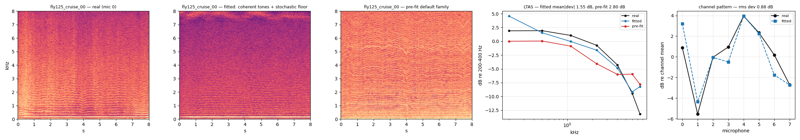
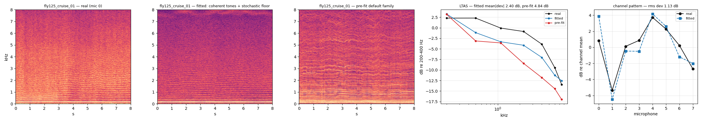
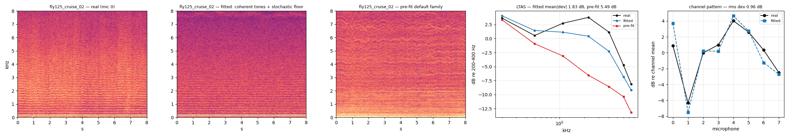

```{python}
import json
from pathlib import Path

import numpy as np
import pandas as pd

ROOT = Path.cwd()
while not (ROOT / "results").exists() and ROOT != ROOT.parent:
    ROOT = ROOT.parent


def load(p):
    p = ROOT / p
    return json.loads(p.read_text()) if p.exists() else None


fit = load("results/S2/cruise_8clip.json")
panels = load("docs/explainers/stage2-cruise/index.json")
probe = load("results/S2/probe/cruise_probe.json")
real = load("results/S2/probe/real_probe.json")
```

::: {.callout-note}
## What this page claims

One generative model was fitted to Michael's FLY125 cruise by maximising a
likelihood. Synthetic clips drawn from it are tracked by a **frozen** rotor-speed
model at 0.76 rev/s against 0.35 rev/s for the real clips through the same
pipeline, with no refusals and cross-channel agreement inside the real range.
The derivation of the line model is in
[bench-fit-derivations](bench-fit-derivations.html); this page is the flight
result.
:::

# 1. What was fitted

The line model comes from Stage 1 and is unchanged. Every order $k$ of every
rotor carries one power $P_{rk}$, split by a coherent fraction:

$$
w_k=\exp\!\big(-(k/k_{1/2})^2\big),
$$

with the share $w_k$ rendered as a **coherent tone** carrying the analysis
window's own power response $|W(f-kc_r)|^2$, and the share $1-w_k$ as a
**Rayleigh pedestal** of the fitted width $\gamma_{rk}=\gamma_0+\text{slope}\cdot k$.
The whole spectrum is

$$
M_m(f,n)=W*\Big[F(f,n)+\sum_r g_{mr}\!\sum_k (1-w_k)P_{rk}L(f-kc_r;\gamma_{rk})\Big]
+\sum_r g_{mr}\!\sum_k w_k P_{rk}\big|W(f-kc_r)\big|^{2}.
$$

Four things differ from the bench, each forced by the data:

1. **Four rotors.** Each carrier $c_r(n)$ comes from the telemetry. Each rotor
   has its own profile offset and its own microphone gains.
2. **Eight microphones.** Per-(microphone, rotor) line gains, a per-microphone
   floor, and one per-microphone gain on everything. The acceptance probe reads
   cross-channel agreement, so the fit must own the channel structure.
3. **The speed moves.** `chirp_width` adds the width a line gets because the
   rotor sweeps $k\,|ds/dt|$ hertz across one analysis window. It is computed
   from the telemetry with **no free parameter**.
4. **Cruise only.** A window is used only when all four rotors stay above
   65 rev/s for its whole length, so a stationary model has a stationary target.

Native 44.1 kHz audio is the only source; every clip is decimated with
`native.decimate`, so the published 16 kHz brick wall never enters the fit.

# 2. The fit

Eight cruise windows of 16 s, all eight channels, 130 orders per rotor, joint
MAP with the rig-level parameters tied and a per-rotor profile offset. Run on a
CPU node in 15 minutes.

```{python}
if fit:
    rows = []
    for cid, e in fit["clips"].items():
        p, s = e["params"], e["scores"]
        rows.append(
            dict(
                clip=cid,
                rotors=", ".join(f"{v:.0f}" for v in np.asarray(p["carrier"]).mean(axis=1)),
                nll_per_cell=round(float(s["nll_fit"]), 4),
                excess_over_LOO=round(float(s["excess_over_loo"]), 3),
                k_half=round(float(p["coherence_k_half"]), 2),
                gamma_slope=round(float(np.atleast_1d(p["gamma_slope"])[0]), 3),
            )
        )
    display(pd.DataFrame(rows).set_index("clip"))
```

Two things to read here.

**Every clip beats its leave-one-out reference.** `excess_over_LOO` is the
fitted score minus the score of a nonparametric predictor that estimates each
frame from its neighbours. It is negative for all eight windows, from $-0.011$
to $-0.384$ nats per cell. A parametric model with a few hundred numbers
predicts these clips better than a smoother with access to their own
neighbouring frames.

**Cruise is mostly incoherent.** The fitted $k_{1/2}$ is 1.6 to 2.9, against 15
to 55 on the clamped bench. Only the first two or three orders of a flying rotor
are tones; everything above is a broadened, Rayleigh line. That is the expected
direction — the shaft wanders, and the flight adds width that the bench does not
have — and it is a fitted result, not an assumption. The pedestal width follows
with a slope of 0.57 Hz per order, so order 100 is about 57 Hz wide.

# 3. What it looks and sounds like

Real, fitted, and a draw from the untouched default family at the same rotor
speeds. The fourth panel is the LTAS band profile; the fifth is the
per-microphone level pattern, which a four-rotor eight-microphone fit owns and a
single-channel fit cannot represent at all.

```{python}
if panels:
    display(
        pd.DataFrame(
            [
                dict(
                    clip=r["clip"],
                    rotors=", ".join(f"{v:.0f}" for v in r["rotors"]),
                    k_half=r["k_half"],
                    LTAS_fitted_dB=r["fitted_mean_abs_db"],
                    LTAS_prefit_dB=r["prefit_mean_abs_db"],
                    channels_dB=r["channel_rms_dev_db"],
                )
                for r in panels
            ]
        ).set_index("clip")
    )
```

::: {layout-ncol=1}







:::

The fitted clip carries the floor shape (LTAS 1.55 to 2.40 dB against 2.80 to
5.49 dB for the pre-fit family) and the channel pattern to about 1 dB rms.

**What it does not carry: time.** The real spectrograms show gusts — slow
level and tilt changes over a few seconds. The synthetic clips are stationary,
because every dynamic term is pinned off. That is a deliberate choice, not an
oversight: on the bench a free drift term absorbed +4.97 dB of static per-order
level and broke the map from the fitted vector to the renderer. Turning drift
back on, with that identifiability handled, is the next step.

WAV files for each window are next to the figures in
`docs/explainers/stage2-cruise/` as `cruise_NN_{real,fitted,prefit}.wav`.

# 4. The gate: a frozen tracker as the judge

The strongest available test of "is this Michael's comb" is not a spectral
statistic. It is a model that was trained on real data, frozen, and never told
about this fit: `hppnet_l2_r2_s0`, read out with
`metrics.salience_layers.LayerPeakRPSMetric`.

The probe is known to be able to **fail**. On a deliberately diverse control
policy the same checkpoint reads 19.6 rev/s; on the previous fitted stream it
read 13.8 rev/s with 7 of 24 draws refused outright. So a good score means
something.

Twelve independent synthetic draws, each with its own seed and a real cruise
rotor trajectory, all eight channels, permutation-invariant matching:

```{python}
if probe and real:
    v, vr = probe["verdict"], real["verdict"]
    display(
        pd.DataFrame(
            [
                dict(
                    arm="synthetic (this fit)",
                    median_8mic_MAE=v["median_mae_8mic"],
                    median_spread=v["median_spread"],
                    refusals=f"{v['refusals']}/{v['n']}",
                ),
                dict(
                    arm="real clips, same pipeline",
                    median_8mic_MAE=vr["median_mae_8mic"],
                    median_spread=vr["median_spread"],
                    refusals=f"{vr['refusals']}/{vr['n']}",
                ),
                dict(
                    arm="threshold (preregistered)",
                    median_8mic_MAE=v["thresholds"]["mae"],
                    median_spread=v["thresholds"]["spread"],
                    refusals="0/12",
                ),
                dict(
                    arm="diverse control policy (counterexample)",
                    median_8mic_MAE=19.6,
                    median_spread="up to 66",
                    refusals="7/24",
                ),
            ]
        ).set_index("arm")
    )
```

```{python}
if probe:
    df = pd.DataFrame(
        [
            dict(
                clip=r["clip"],
                true_rps=r["mean_true_rps"],
                mic0=r["mae_mic0"],
                eight_mic=r["mae_8mic"],
                spread=r["spread"],
                refused=r["refused"],
            )
            for r in probe["clips"]
        ]
    ).set_index("clip")
    display(df)
```

**Verdict: the gate passes.** Median 8-microphone error 0.76 rev/s against a
threshold of 1.6, zero refusals out of twelve, median cross-channel spread
0.23 rev/s against a limit of 0.5. For scale, the same checkpoint reads 0.99
rev/s on Michael's real **held-out** FLY124 cruise, so the synthetic clips are
inside the range where this tracker works on real data it never saw.

Real clips through the identical pipeline read 0.35 rev/s, so synthetic is still
2.2 times worse than real on the same windows. The gap is real and is not
hidden here.

::: {layout-ncol=1}

:::

Look at the lower panel. Rotors at 90 and 81 rev/s are tracked almost exactly
(per-rotor MAE 0.35 and 0.40). The two rotors near 74 and 76 rev/s get confused
with each other, and that pair carries nearly all the error (1.32 rev/s). This
is **the same failure mode the tracker has on real recordings**, where the
near-degenerate 73.7 / 75.5 rev/s pair carries the residual. The synthetic clip
reproduces the real ambiguity, not just the real energy.

# 5. What is open

1. **Dynamics.** The synthetic cruise is stationary. Real cruise gusts. Drift
   terms are off because a free drift absorbed static level on the bench; the
   fix is to reparameterise it capacity-matched, not to switch it on blindly.
2. **The 2.2x gap to real.** The tracker is 0.76 on synthetic against 0.35 on
   real. The likely causes, in order: no dynamics, a pedestal that is slightly
   too wide at high order, and no per-microphone phase structure between rotors.
3. **Standby (Stage 3).** Not started. The same machinery applies with
   `CRUISE_MIN_RPS` replaced by a standby band.
4. **The order-domain acceptance statistic** in `accept_stats.paired_delta`
   sizes its integration band from $\gamma$ alone. With a two-component line it
   must integrate the needle and the pedestal separately, or a wide pedestal's
   own skirts are subtracted as floor. Measured cost of getting this wrong:
   an apparent $-6.25$ dB trend at order 64 that does not exist.
