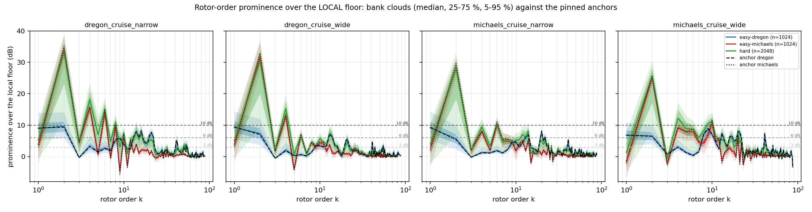
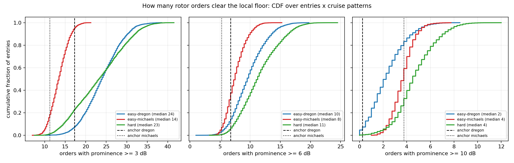
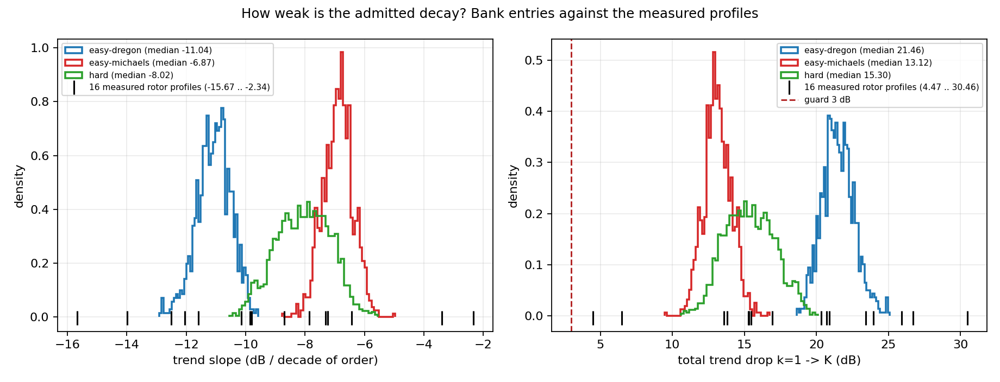

# Bank tonality: how far do the rotor orders stand over the local floor?

**What this is.** `scripts/noise_v2_tonality_audit.py` measures, for every entry of both published `noise-v2-bank/1` banks (`dload:noise-v2-banks/noise_v2_{easy,hard}_n2048.json`), how many rotor orders are identifiable over the floor around them, and how weak the trend decay the `trend_falls` guard admits actually is. It changes no bank, no guard and no prior. Machine-readable: `audit.json` — every number below is read from it. Figures: `prominence_ladder.png`, `visible_orders.png`, `decay.png`.

## 1. The estimator, and what its floor contains

Round 4's estimator (`results/noise_v2/rounds/round4/legacy_truth/anatomy.md` § "MEASURED on the render: prominence over the local floor"), applied to the noise-free EXPECTED periodogram instead of a render:

* **peak** = the largest `P_tot` bin within +-1 bin of `k f_r`;
* **local floor** = the MEDIAN of `P_tot` over the two-sided 0.45-0.70 `fbar` annulus around `k f_r`, excluding +-1 bin around every rotor's `k-1 / k / k+1` lines;
* **prominence** = `10 log10(peak / floor)`, in dB, per microphone and per rotor.

The grid is the model's own flight front end (2048-point rFFT at 16 kHz, **7.8125 Hz per bin**), because that is the front end the fits live on and the arms train on. R4 measured on 8192-point renders (1.95 Hz per bin); the two are not interchangeable.

The floor this reads is the AGGREGATE local floor: the broadband floor PLUS whatever the four combs put between this rotor's orders. That is not a rounding error. Measured on the comb-off expectation (`profile_db = -300 dB`, verified bin-for-bin against the full-order comb-off model: max |diff| 0 dB over 1025 bins), the comb raises the spectrum even at the bins farthest from any line by

| pattern | payload | bins used | min dist (bins) | pedestal median (dB) | p95 | max |
| --- | --- | ---: | ---: | ---: | ---: | ---: |
| `dregon_cruise_narrow` | `dregon` anchor | 367 | 2 | 8.45 | 18.62 | 27.70 |
| `dregon_cruise_wide` | `dregon` anchor | 263 | 2 | 8.84 | 19.06 | 27.36 |
| `michaels_cruise_narrow` | `dregon` anchor | 261 | 2 | 8.76 | 18.50 | 24.18 |
| `michaels_cruise_wide` | `dregon` anchor | 261 | 2 | 7.71 | 18.40 | 23.26 |
| `michaels_standby_narrow` | `michaels_standby` anchor | 14 | 2 | 8.31 | 27.29 | 31.70 |
| `michaels_standby_wide` | `michaels_standby` anchor | 13 | 2 | 3.89 | 27.24 | 31.52 |

So a line that stands 20 dB over the BROADBAND floor stands only ~11 dB over the floor a separator actually sees around it. Both readings are reported: `prom_*` against the local floor (the headline, and what the counts use) and `prom_bb_k*` against the comb-free broadband floor at the same bin, at the named orders only — `prom_bb` is NOT counted over orders because at high `k` the peak bin holds the other orders' merged skirts and the statistic saturates at the pedestal.

## 2. The carrier patterns

Four rotors at ONE speed pile every rotor's order on one bin and overstate visibility, so the probe uses the per-rotor mean carriers of REAL windows (`rig_sampler._real_window_specs`). Per family the NARROWEST- and WIDEST-spread window is taken, which brackets how much of a rotor's local floor is its neighbours' lines:

| pattern | support | per-rotor rev/s | mean | spread |
| --- | --- | --- | ---: | ---: |
| `dregon_cruise_narrow` | `flight_dregon_spinning_nosource_room2@1511905206.978+8_motors_command` | 83.3, 78.5, 81.6, 81.6 | 81.25 | 4.88 |
| `dregon_cruise_wide` | `flight_dregon_rectangle_nosource_room2@1511905731.953+8_motors_command` | 85.8, 76.4, 82.7, 79.7 | 81.15 | 9.41 |
| `michaels_cruise_narrow` | `flight_michaels_FLY125@48.000+8_rps_refined` | 89.4, 75.0, 81.3, 77.4 | 80.80 | 14.40 |
| `michaels_cruise_wide` | `flight_michaels_FLY125@128.000+8_rps_refined` | 91.6, 74.2, 81.8, 73.9 | 80.39 | 17.70 |
| `michaels_standby_narrow` | `flight_michaels_FLY125@10.000+4_rps_refined` | 31.0, 34.5, 40.1, 36.5 | 35.55 | 9.16 |
| `michaels_standby_wide` | `flight_michaels_FLY125@2.000+4_rps_refined` | 28.9, 33.0, 38.3, 34.1 | 33.60 | 9.41 |

Orders run `k = 1..K`, `K` = the payload's profile length capped by `spectrum.k_max_for_carrier` at the pattern's FASTEST rotor. At standby the estimator is under strain and says so: 35 rev/s puts the orders 4.6 bins apart, the 0.45-0.70 `fbar` annulus is 2-4 bins wide and the neighbour exclusion empties it, so the audit falls back to the unexcluded annulus and COUNTS the orders where it had to (`n_fallback_orders`).

## 3. The references

| payload | pattern | k=1 | k=2 | k=4 | k=8 | k=16 | >=3 dB | >=6 dB | >=10 dB | highest >=6 | trend crosses at |
| --- | --- | ---: | ---: | ---: | ---: | ---: | ---: | ---: | ---: | ---: | ---: |
| `dregon` | `dregon_cruise_narrow` | +9.07 | +9.39 | +3.18 | +5.39 | +8.48 | 23.2 | 9.5 | 2.0 | 37.0 | 89 |
| `dregon` | `dregon_cruise_wide` | +9.48 | +7.01 | +1.88 | +1.39 | +3.13 | 17.2 | 6.8 | 0.2 | 38.0 | 89 |
| `dregon` | `michaels_cruise_narrow` | +9.34 | +5.39 | +1.23 | +2.10 | +2.31 | 20.8 | 7.8 | 0.8 | 39.5 | 89 |
| `dregon` | `michaels_cruise_wide` | +6.81 | +6.47 | +2.98 | +7.40 | +6.40 | 24.5 | 12.2 | 3.2 | 45.0 | 88 |
| `michaels` | `dregon_cruise_narrow` | +2.97 | +35.04 | +15.84 | +10.17 | +2.06 | 11.2 | 5.2 | 4.0 | 14.2 | 71 |
| `michaels` | `dregon_cruise_wide` | +3.01 | +32.86 | +13.19 | +4.70 | +1.77 | 14.8 | 6.5 | 3.8 | 15.2 | 74 |
| `michaels` | `michaels_cruise_narrow` | +2.01 | +29.59 | +8.11 | +5.41 | +1.67 | 15.0 | 8.0 | 4.2 | 19.5 | 73 |
| `michaels` | `michaels_cruise_wide` | -2.22 | +25.73 | +9.05 | +4.62 | +3.10 | 17.0 | 8.2 | 3.8 | 20.0 | 70 |
| `michaels_standby` | `michaels_standby_narrow` | +9.05 | +11.50 | +1.40 | +0.69 | +1.82 | 8.5 | 4.2 | 2.8 | 86.0 | 127 |
| `michaels_standby` | `michaels_standby_wide` | +14.83 | +7.01 | +2.13 | +2.25 | +2.05 | 11.5 | 3.8 | 1.5 | 84.8 | 129 |

**Calibration note, not a comparison.** R4 measured the REAL DREGON audio at **k=1 +5.77 dB, k=2 +2.08 dB, and nothing identifiable from k>=9** (mean over the three scored windows of `anatomy.md`'s table). Those numbers are NOT directly comparable with the table above: they are an 8192-point measurement of recorded audio, whose shaft wander, four-rotor speed spread and finite-window averaging smear every line, against a noise-free 2048-point expectation at a CONSTANT carrier here. The expectation is the tonality the sampler PUT in the payload; the render is that minus whatever the trajectory smears out.

## 4. (a) Per bank and half: the quantiles

Pooled over each group's entries x the four cruise patterns.

**prom_k1**

| group | n | 5 % | 25 % | 50 % | 75 % | 95 % |
| --- | ---: | ---: | ---: | ---: | ---: | ---: |
| easy-dregon | 4096 | +4.72 | +6.86 | +8.58 | +10.47 | +13.76 |
| easy-michaels | 4096 | -4.64 | -0.47 | +2.30 | +5.08 | +9.11 |
| hard | 8192 | -2.80 | +1.23 | +4.00 | +6.70 | +10.54 |
| hard-t0 | 924 | +3.84 | +6.31 | +8.00 | +9.81 | +12.58 |
| hard-t1 | 784 | +2.34 | +5.05 | +7.09 | +9.30 | +11.83 |
| hard-t2 | 740 | +0.34 | +3.33 | +5.31 | +7.64 | +11.17 |
| hard-t3 | 852 | -1.40 | +1.68 | +3.87 | +6.03 | +9.04 |
| hard-t4 | 784 | -2.51 | +0.86 | +3.16 | +5.44 | +8.45 |
| hard-t5 | 788 | -3.24 | +0.11 | +2.43 | +4.66 | +7.58 |
| hard-t6 | 764 | -3.69 | -0.13 | +2.27 | +4.67 | +7.79 |
| hard-t7 | 856 | -4.15 | -0.14 | +2.34 | +4.54 | +7.83 |
| hard-t8 | 768 | -4.20 | -0.22 | +2.44 | +4.93 | +9.26 |
| hard-t9 | 932 | -4.59 | -0.39 | +2.20 | +5.14 | +8.83 |

**prom_k2**

| group | n | 5 % | 25 % | 50 % | 75 % | 95 % |
| --- | ---: | ---: | ---: | ---: | ---: | ---: |
| easy-dregon | 4096 | +3.37 | +5.48 | +7.14 | +9.15 | +12.42 |
| easy-michaels | 4096 | +23.42 | +26.07 | +29.27 | +32.80 | +36.81 |
| hard | 8192 | +8.81 | +19.74 | +28.22 | +32.35 | +37.31 |
| hard-t0 | 924 | +4.65 | +7.30 | +9.48 | +11.79 | +15.23 |
| hard-t1 | 784 | +9.61 | +12.53 | +14.92 | +17.43 | +21.02 |
| hard-t2 | 740 | +14.93 | +17.33 | +19.75 | +22.49 | +26.15 |
| hard-t3 | 852 | +19.29 | +22.61 | +25.13 | +27.79 | +31.29 |
| hard-t4 | 784 | +24.41 | +27.24 | +29.61 | +32.26 | +35.75 |
| hard-t5 | 788 | +28.02 | +30.06 | +32.24 | +35.01 | +37.86 |
| hard-t6 | 764 | +28.31 | +30.56 | +33.11 | +36.26 | +39.04 |
| hard-t7 | 856 | +26.93 | +29.59 | +32.42 | +35.63 | +38.77 |
| hard-t8 | 768 | +25.45 | +28.17 | +31.02 | +34.02 | +38.25 |
| hard-t9 | 932 | +24.06 | +26.93 | +29.97 | +33.39 | +37.20 |

**count_ge6**

| group | n | 5 % | 25 % | 50 % | 75 % | 95 % |
| --- | ---: | ---: | ---: | ---: | ---: | ---: |
| easy-dregon | 4096 | 5.8 | 7.8 | 9.5 | 11.8 | 14.6 |
| easy-michaels | 4096 | 5.2 | 6.2 | 7.5 | 8.8 | 10.8 |
| hard | 8192 | 6.8 | 9.0 | 11.2 | 13.8 | 17.5 |
| hard-t0 | 924 | 6.8 | 8.8 | 10.8 | 13.1 | 16.5 |
| hard-t1 | 784 | 8.2 | 10.8 | 13.5 | 15.8 | 18.8 |
| hard-t2 | 740 | 9.5 | 11.9 | 14.5 | 16.5 | 19.5 |
| hard-t3 | 852 | 9.5 | 11.8 | 14.2 | 16.8 | 18.8 |
| hard-t4 | 784 | 9.5 | 11.2 | 13.5 | 15.8 | 17.5 |
| hard-t5 | 788 | 8.6 | 10.5 | 12.0 | 13.8 | 15.8 |
| hard-t6 | 764 | 7.8 | 9.5 | 11.0 | 12.5 | 14.2 |
| hard-t7 | 856 | 6.8 | 8.0 | 9.5 | 11.0 | 13.2 |
| hard-t8 | 768 | 6.2 | 7.2 | 8.5 | 10.2 | 12.2 |
| hard-t9 | 932 | 5.5 | 6.8 | 7.8 | 9.2 | 11.2 |

**highest_ge6**

| group | n | 5 % | 25 % | 50 % | 75 % | 95 % |
| --- | ---: | ---: | ---: | ---: | ---: | ---: |
| easy-dregon | 4096 | 30.0 | 40.0 | 49.2 | 56.0 | 66.8 |
| easy-michaels | 4096 | 11.9 | 15.8 | 20.5 | 25.5 | 31.0 |
| hard | 8192 | 15.8 | 22.2 | 30.5 | 49.8 | 62.1 |
| hard-t0 | 924 | 32.1 | 42.8 | 51.8 | 57.8 | 66.0 |
| hard-t1 | 784 | 28.6 | 44.2 | 52.2 | 57.8 | 66.2 |
| hard-t2 | 740 | 25.0 | 40.5 | 51.2 | 56.0 | 66.0 |
| hard-t3 | 852 | 20.0 | 34.4 | 45.0 | 52.2 | 63.2 |
| hard-t4 | 784 | 20.0 | 25.2 | 37.5 | 47.1 | 53.2 |
| hard-t5 | 788 | 17.2 | 21.0 | 25.5 | 36.9 | 51.8 |
| hard-t6 | 764 | 16.2 | 20.0 | 23.8 | 29.5 | 39.9 |
| hard-t7 | 856 | 15.2 | 17.8 | 22.2 | 26.6 | 32.8 |
| hard-t8 | 768 | 14.2 | 17.2 | 22.2 | 26.5 | 32.7 |
| hard-t9 | 932 | 13.2 | 16.8 | 22.0 | 26.5 | 31.2 |

**slope_db_dec**

| group | n | 5 % | 25 % | 50 % | 75 % | 95 % |
| --- | ---: | ---: | ---: | ---: | ---: | ---: |
| easy-dregon | 1024 | -12.03 | -11.42 | -11.04 | -10.69 | -10.17 |
| easy-michaels | 1024 | -7.70 | -7.23 | -6.87 | -6.56 | -6.08 |
| hard | 2048 | -9.62 | -8.71 | -8.02 | -7.38 | -6.67 |
| hard-t0 | 231 | -10.03 | -9.63 | -9.18 | -8.84 | -8.33 |
| hard-t1 | 196 | -9.89 | -9.29 | -8.86 | -8.51 | -8.00 |
| hard-t2 | 185 | -9.66 | -9.02 | -8.68 | -8.29 | -7.71 |
| hard-t3 | 213 | -9.28 | -8.76 | -8.34 | -8.00 | -7.37 |
| hard-t4 | 196 | -9.11 | -8.55 | -8.17 | -7.86 | -7.38 |
| hard-t5 | 197 | -8.77 | -8.32 | -7.88 | -7.54 | -7.02 |
| hard-t6 | 191 | -8.59 | -7.98 | -7.62 | -7.24 | -6.85 |
| hard-t7 | 214 | -8.19 | -7.76 | -7.46 | -7.07 | -6.63 |
| hard-t8 | 192 | -8.12 | -7.66 | -7.26 | -6.91 | -6.37 |
| hard-t9 | 233 | -7.89 | -7.40 | -7.01 | -6.66 | -6.05 |

## 5. (b) How many entries are LESS tonal than the least tonal anchor?

Each anchor is summarised by the MEDIAN of that statistic over its four cruise patterns and the bar is the LOWER of the two anchors — the least tonal real rig. The fraction counts entry x cruise-pattern pairs strictly under the bar (for `trend_cross_order` too, where a smaller order is the less tonal one).

| statistic | dregon | michaels | bar | easy-dregon | easy-michaels | hard |
| --- | ---: | ---: | ---: | ---: | ---: | ---: |
| prom_k1 | 9.21 | 2.49 | 2.49 | 0.2 % | 51.5 % | 35.9 % |
| prom_k2 | 6.74 | 31.22 | 6.74 | 43.7 % | 0.0 % | 2.3 % |
| prom_k4 | 2.43 | 11.12 | 2.43 | 48.7 % | 0.0 % | 2.4 % |
| prom_k8 | 3.75 | 5.05 | 3.75 | 53.3 % | 20.5 % | 12.4 % |
| prom_k16 | 4.77 | 1.92 | 1.92 | 10.1 % | 47.8 % | 13.9 % |
| prom_bb_k1 | 7.07 | 28.90 | 7.07 | 55.9 % | 0.0 % | 13.1 % |
| prom_bb_k2 | 8.26 | 77.37 | 8.26 | 45.1 % | 0.0 % | 2.1 % |
| count_ge3 | 22.00 | 14.88 | 14.88 | 1.8 % | 71.8 % | 11.2 % |
| count_ge6 | 8.62 | 7.25 | 7.25 | 17.1 % | 43.9 % | 8.2 % |
| count_ge10 | 1.38 | 3.88 | 1.38 | 29.5 % | 0.2 % | 2.4 % |
| highest_ge3 | 65.62 | 31.12 | 31.12 | 0.0 % | 31.2 % | 4.5 % |
| highest_ge6 | 38.75 | 17.38 | 17.38 | 0.7 % | 34.0 % | 10.2 % |
| highest_ge10 | 21.50 | 9.00 | 9.00 | 24.9 % | 36.8 % | 13.7 % |
| trend_cross_order | 89.00 | 72.12 | 72.12 | 0.0 % | 37.5 % | 8.0 % |

## 6. (c) How many entries carry fewer than 4 / 8 / 16 visible orders?

All three prominence bars are reported because none of them is established: 3 dB is about where a line stops being separable from its own floor estimate, 10 dB is a line no tracker can miss, 6 dB sits between them.

| threshold | group | median count | < 4 | < 8 | < 16 |
| --- | --- | ---: | ---: | ---: | ---: |
| >= 3 dB | easy-dregon | 24.0 | 0.0 % | 0.0 % | 3.2 % |
| >= 3 dB | easy-michaels | 13.5 | 0.0 % | 0.1 % | 84.4 % |
| >= 3 dB | hard | 23.2 | 0.0 % | 0.0 % | 15.4 % |
| >= 6 dB | easy-dregon | 9.5 | 0.5 % | 27.2 % | 97.9 % |
| >= 6 dB | easy-michaels | 7.5 | 0.1 % | 60.8 % | 100.0 % |
| >= 6 dB | hard | 11.2 | 0.0 % | 14.4 % | 87.8 % |
| >= 10 dB | easy-dregon | 2.2 | 83.3 % | 100.0 % | 100.0 % |
| >= 10 dB | easy-michaels | 3.8 | 59.3 % | 100.0 % | 100.0 % |
| >= 10 dB | hard | 4.5 | 32.6 % | 95.2 % | 100.0 % |

## 7. (d) The standby payloads on standby patterns

Only the entries that carry a standby payload, measured on that payload at the two standby patterns (`michaels_standby_narrow`, `michaels_standby_wide`).

| group | entries | k=1 | k=2 | count >=6 dB | highest >=6 dB | slope dB/dec |
| --- | ---: | ---: | ---: | ---: | ---: | ---: |
| easy-michaels | 1024 | +11.27 | +8.26 | 4.0 | 85.2 | -7.68 |
| hard | 1028 | +11.54 | +8.22 | 4.0 | 85.0 | -7.69 |

## 8. (e) Which drawn coordinate makes an entry weakly tonal?

Spearman rho between an entry's `count_ge6` (mean over the four cruise patterns) and each coordinate. `level_db`, `ltas_level_db` and `t` come from the entry's own `provenance` block; `rotor_gain_db`, `slope_db_dec`, `trend_drop_db`, `floor_mean_db` and `gain_minus_floor_db` (the comb-over-floor offset) are the REALISED values read off the payload — the bank keeps `level_db` and `t` but not the rest of the `drawn` block. `all` pools both banks, so it mostly measures which RIG an entry is; `hard-within-t` is the mean of the ten per-decile rhos, which holds the path position fixed and is the only column that isolates the perturbation's own effect on the hard bank.

| coordinate | easy-dregon (n=1024) | easy-michaels (n=1024) | hard (n=2048) | hard-within-t (n=2048) | all (n=4096) |
| --- | ---: | ---: | ---: | ---: | ---: |
| `level_db` | +0.056 | -0.067 | +0.025 | -0.018 | +0.032 |
| `floor_mean_db` | +0.055 | -0.066 | -0.131 | -0.021 | -0.137 |
| `rotor_gain_db` | +0.088 | -0.068 | -0.257 | +0.003 | -0.252 |
| `slope_db_dec` | -0.137 | -0.038 | -0.526 | -0.053 | -0.393 |
| `gain_minus_floor_db` | +0.163 | +0.013 | -0.469 | +0.109 | -0.359 |
| `trend_drop_db` | +0.137 | +0.038 | +0.526 | +0.053 | +0.393 |
| `ltas_level_db` | -0.041 | -0.047 | +0.006 | -0.015 | -0.011 |
| `t` | — | — | -0.630 | -0.116 | -0.630 |

## 9. The decay the guard admits

The 16 MEASURED v2 rotor profiles (2 cruise rigs x 4 rotors, Michael's standby x 4, 4 bench motors) have trend slopes -15.67 .. -2.34 dB/decade (median -9.25) and total drops 4.47 .. 30.46 dB (median 18.63). The `trend_falls` guard admits anything dropping 3 dB or more.

| group | n | slope 5 % | slope 25 % | slope 50 % | slope 75 % | slope 95 % |
| --- | ---: | ---: | ---: | ---: | ---: | ---: |
| easy-dregon | 1024 | -12.03 | -11.42 | -11.04 | -10.69 | -10.17 |
| easy-michaels | 1024 | -7.70 | -7.23 | -6.87 | -6.56 | -6.08 |
| hard | 2048 | -9.62 | -8.71 | -8.02 | -7.38 | -6.67 |

| group | n | drop 5 % | drop 25 % | drop 50 % | drop 75 % | drop 95 % |
| --- | ---: | ---: | ---: | ---: | ---: | ---: |
| easy-dregon | 1024 | 19.77 | 20.79 | 21.46 | 22.20 | 23.39 |
| easy-michaels | 1024 | 11.61 | 12.53 | 13.12 | 13.81 | 14.70 |
| hard | 2048 | 12.73 | 14.08 | 15.30 | 16.62 | 18.36 |

## 10. Verdict

At the 6 dB bar the median entry carries 9.5 orders (easy-dregon), 7.5 orders (easy-michaels) and 11.2 (hard), out of the 81-88 modelled; at 3 dB the medians are 18.8 (easy, pooled) and 23.2 (hard), at 10 dB 3.0 and 4.5. Fewer than FOUR orders clear 6 dB in 0.3 % of easy and 0.0 % of hard entry-patterns, fewer than eight in 44.0 % and 14.4 %, and at the 10 dB bar fewer than four in 71.3 % and 32.6 %. Against the least tonal PINNED anchor (7.25 orders over 6 dB, michaels), 30.5 % of easy and 8.2 % of hard entry-patterns are less tonal than the real rigs the bank was drawn around — i.e. the banks do NOT merely reproduce the anchors' tonality, they extend well below it. The largest single Spearman rho against `count_ge6` over all 4096 entries is `t` (-0.630), but that is the rig identity speaking: on the hard bank `t` moves every coordinate at once. Holding the path position fixed (mean of the ten per-decile rhos) the ordering is `rotor_gain_db` +0.003, `floor_mean_db` -0.021 and their difference `gain_minus_floor_db` +0.109, led by `gain_minus_floor_db` (+0.109); on the easy bank's DREGON half, where no path coordinate exists at all, the same ordering holds and is just as weak (`gain_minus_floor_db` +0.163, `rotor_gain_db` +0.088, `floor_mean_db` +0.055). The driver is NEITHER on its own: with the rig held fixed every one of these coordinates has |rho| under 0.15, so what a bank entry's tonality really tracks is which RIG it is — and within one anchor's neighbourhood no single drawn coordinate explains much, so a tonality REJECTION guard would bite where a prior on any one of these coordinates would not.
