## What the noise is

{width="94%"}

::: {.notes}
Two real drones, microphone 0, cruise. Both pictures show the same two things: a comb of
horizontal lines, and a broadband floor under it. The lines move when the rotors change speed.
:::

## The model, in one figure

{width="84%"}

::: {.small}
Each rotor makes a comb of lines at multiples of its shaft rate. A broadband floor sits under the comb.
The lines follow the telemetry, so the comb moves with the flight.
:::

::: {.notes}
The fitted quantities, in the order they act: line power per rotor and order, the line width law,
the coherent share per order, the floor shape on control frequencies, and the floor tilt.
:::

## The speed law

{width="72%"}

$$\Delta L \;=\; p \cdot 10 \log_{10}\!\left(n / n_0\right), \qquad n_0 = 80\ \text{rev/s}$$

::: {.small}
The comb level follows a power law in rotor speed. The fitted exponents are
$p = 7.50$ for Michael cruise, 4.40 for Michael standby and 8.76 for DREGON cruise.
Standby runs at 34.6 rev/s. The measured step from standby to cruise is 14.4 dB.
:::

## How the fit works

:::: {.columns}
::: {.column width="32%"}
**1. Bench**

One motor. Constant speed. Six setpoints from 50 to 90 rev/s. This fixes the line shape and the width law.
:::
::: {.column width="32%"}
**2. Michael's rig**

Four rotors. Cruise clips and a standby clip. Rotor speeds come from the telemetry, so the comb is driven, not assumed.
:::
::: {.column width="32%"}
**3. DREGON**

The same model family, refitted on flight audio. The bench fit is carried over as the starting point.
:::
::::

::: {.small}
Each clip is fitted on its own by MAP with a Whittle likelihood. Within one rig the fits are then tied:
the line power per order, the width law, the coherent share, the floor shape and tilt, and both speed
exponents are shared by every clip of that rig. Only three things move per clip: the per-rotor gain,
the floor level, and the coherence half-order.
:::

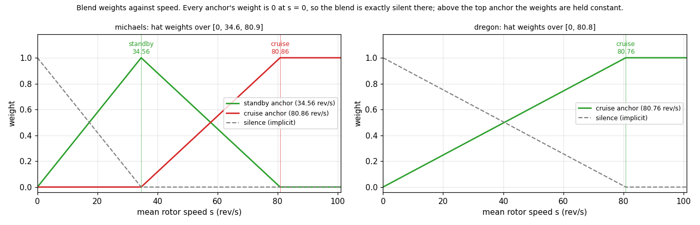{width="56%"}

::: {.small}
A rig with several clips keeps one fit per operating point. At playback the fits are blended by mean
rotor speed, and the blend is exactly silent at zero speed.
:::

## Bench: one motor, constant speed

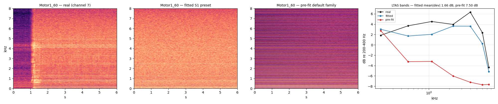{width="82%"}

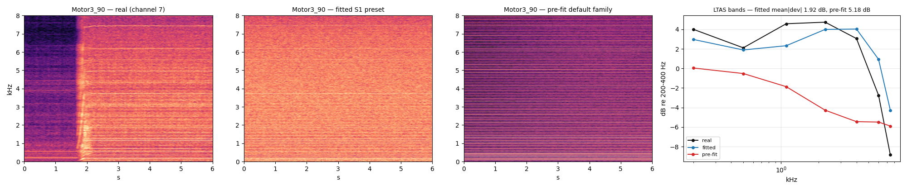{width="82%"}

::: {.small}
Motor 1 at 58.8 rev/s on top, motor 3 at 88.5 rev/s below. Band error after the fit is 1.66 dB and
1.92 dB. The default family, before fitting, is 7.5 dB and 5.2 dB off.
:::

::: {.content-visible when-format="revealjs"}
```{=html}
<div class="audio-row">
<span><b>real</b> <audio controls preload="none" src="../../../docs/explainers/stage1-bench/Motor1_60_real.wav"></audio></span>
<span><b>fitted</b> <audio controls preload="none" src="../../../docs/explainers/stage1-bench/Motor1_60_fitted.wav"></audio></span>
<span><b>pre-fit</b> <audio controls preload="none" src="../../../docs/explainers/stage1-bench/Motor1_60_prefit.wav"></audio></span>
</div>
```
:::

::: {.content-visible when-format="beamer"}
::: {.tiny}
*Audio (real / fitted / pre-fit) plays in the HTML deck.*
:::
:::

## Michael's rig: cruise and standby

{width="86%"}

{width="86%"}

::: {.small}
Cruise on top, standby below. Four rotors, speeds from the telemetry. Band error after the fit is
1.71 dB at cruise and 0.59 dB at standby. The channel pattern across the eight microphones agrees
to 0.83 dB.
:::

::: {.content-visible when-format="revealjs"}
```{=html}
<div class="audio-row">
<span><b>real</b> <audio controls preload="none" src="../../../docs/explainers/stage2-cruise/cruise_00_real.wav"></audio></span>
<span><b>fitted</b> <audio controls preload="none" src="../../../docs/explainers/stage2-cruise/cruise_00_fitted.wav"></audio></span>
<span><b>pre-fit</b> <audio controls preload="none" src="../../../docs/explainers/stage2-cruise/cruise_00_prefit.wav"></audio></span>
</div>
```
:::

::: {.content-visible when-format="beamer"}
::: {.tiny}
*Audio (real / fitted / pre-fit) plays in the HTML deck.*
:::
:::

## Michael's rig: the whole flight

:::: {.columns}
::: {.column width="70%"}
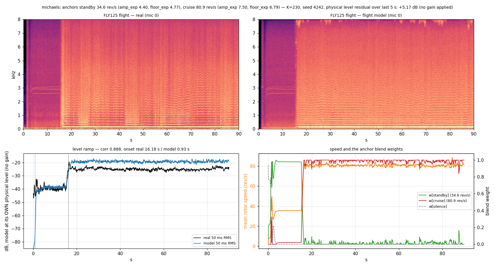{width="100%"}
:::
::: {.column width="28%"}
::: {.small}
90 s of FLY125. The model is driven by the telemetry alone. Nothing is fitted to this window.

Two anchors are blended by rotor speed: standby at 34.6 rev/s and cruise at 80.9 rev/s.

The level ramp tracks the real one at correlation 0.89. No gain is applied, and the level sits 5.17 dB high.
:::

::: {.content-visible when-format="revealjs"}
```{=html}
<div class="audio-row">
<span><b>real</b> <audio controls preload="none" src="../../../docs/explainers/flight-startup/flight_michaels_real.wav"></audio></span>
<span><b>model</b> <audio controls preload="none" src="../../../docs/explainers/flight-startup/flight_michaels_model.wav"></audio></span>
</div>
```
:::

::: {.content-visible when-format="beamer"}
::: {.tiny}
*Audio (real / model, 90 s each) plays in the HTML deck.*
:::
:::
:::
::::

## DREGON: the same family, refitted

{width="92%"}

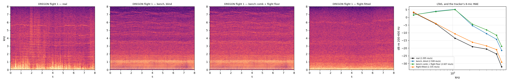{width="92%"}

::: {.small}
The bench fit transferred blind is 9.4 dB off in the spectrum. Refitting the flight clips brings that to 1.5 dB.
Keeping the bench comb and taking only the flight floor does not help.
:::

::: {.content-visible when-format="revealjs"}
```{=html}
<div class="audio-row">
<span><b>real</b> <audio controls preload="none" src="../../../docs/explainers/dregon-transfer/dregon_00_real.wav"></audio></span>
<span><b>flight&nbsp;refit</b> <audio controls preload="none" src="../../../docs/explainers/dregon-transfer/dregon_00_flight-fitted.wav"></audio></span>
<span><b>bench&nbsp;blind</b> <audio controls preload="none" src="../../../docs/explainers/dregon-transfer/dregon_00_bench_blind.wav"></audio></span>
</div>
```
:::

::: {.content-visible when-format="beamer"}
::: {.tiny}
*Audio (real / flight refit / bench blind) plays in the HTML deck.*
:::
:::

## Where the model is right, and where it is wrong

{width="80%"}

::: {.small}
Above 300 Hz the level is right to about 1.8 dB, and no gain was fitted to make that happen.
Between 50 and 200 Hz the first rotor orders are far too loud, by 9 to 22 dB.
The error is in the lines, not in the floor: between the lines the model agrees to about 1 dB.
:::

## Michael's rig: samples around the fit

:::: {.columns}
::: {.column width="49%"}
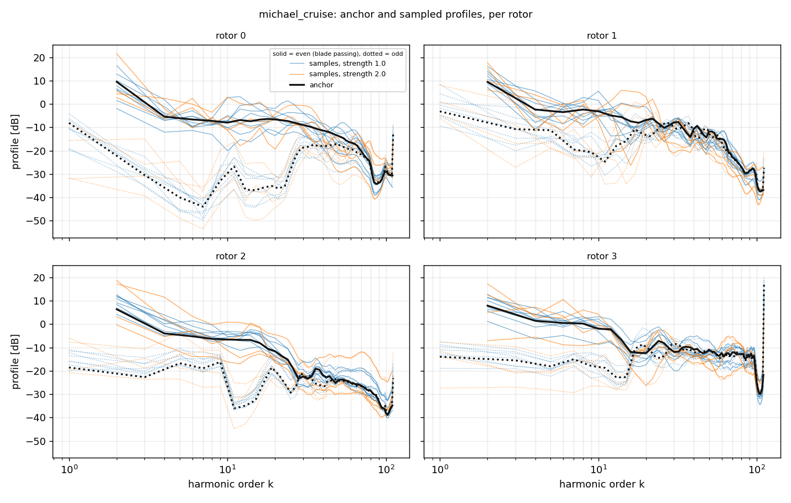{width="100%"}
:::
::: {.column width="49%"}
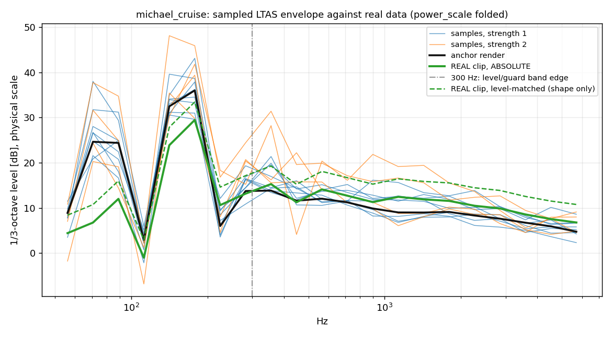{width="100%"}
:::
::::

::: {.small}
Twelve draws: eight at the measured width, four at twice that width. The widths come from the
measured clip-to-clip spread of the fits, not from a guess. A guard rejects any draw that strays
further than twice the real drone-to-drone difference. None of the eight was rejected.
:::

## Michael's rig: how the samples sound

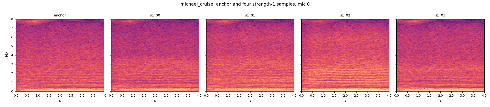{width="100%" fig-align="center"}

::: {.small}
Anchor plus four draws. Their rendered spectra move 1.7 to 4.8 dB rms away from the anchor.
They still sound like the same drone.
:::

::: {.content-visible when-format="revealjs"}
```{=html}
<div class="audio-row wide">
<span><b>anchor</b> <audio controls preload="none" src="../../../docs/explainers/rig-sampler/michael_cruise_anchor.wav"></audio></span>
<span><b>s1_00</b> <audio controls preload="none" src="../../../docs/explainers/rig-sampler/michael_cruise_s1_00.wav"></audio></span>
<span><b>s1_01</b> <audio controls preload="none" src="../../../docs/explainers/rig-sampler/michael_cruise_s1_01.wav"></audio></span>
<span><b>s1_02</b> <audio controls preload="none" src="../../../docs/explainers/rig-sampler/michael_cruise_s1_02.wav"></audio></span>
<span><b>s1_03</b> <audio controls preload="none" src="../../../docs/explainers/rig-sampler/michael_cruise_s1_03.wav"></audio></span>
</div>
```
:::

::: {.content-visible when-format="beamer"}
::: {.tiny}
*Audio (the anchor and all four draws) plays in the HTML deck.*
:::
:::

## DREGON: samples around the fit

:::: {.columns}
::: {.column width="49%"}
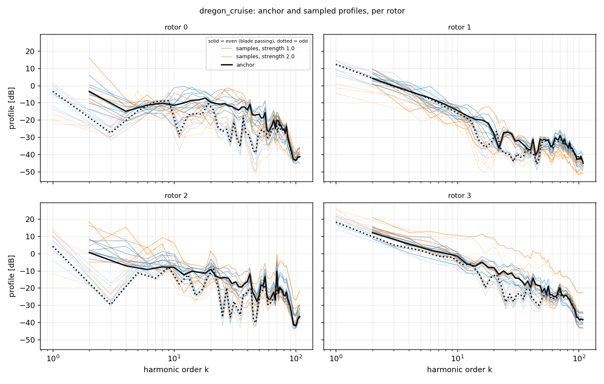{width="100%"}
:::
::: {.column width="49%"}
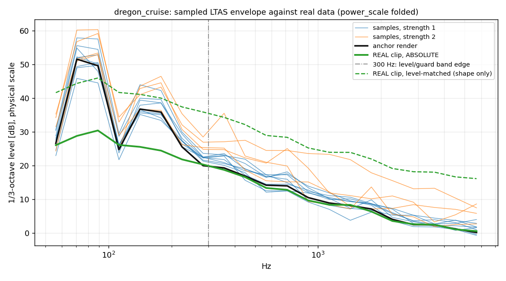{width="100%"}
:::
::::

::: {.small}
The same widths applied to the DREGON fit. This neighbourhood is tighter: 1.3 to 4.0 dB rms
away from the anchor.
:::

## DREGON: how the samples sound

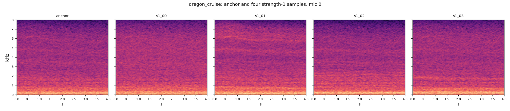{width="100%" fig-align="center"}

::: {.small}
Anchor plus four draws from the DREGON fit. Each draw moves the rotor gains, the comb slope and the
floor. The rig still sounds like DREGON.
:::

::: {.content-visible when-format="revealjs"}
```{=html}
<div class="audio-row wide">
<span><b>anchor</b> <audio controls preload="none" src="../../../docs/explainers/rig-sampler/dregon_cruise_anchor.wav"></audio></span>
<span><b>s1_00</b> <audio controls preload="none" src="../../../docs/explainers/rig-sampler/dregon_cruise_s1_00.wav"></audio></span>
<span><b>s1_01</b> <audio controls preload="none" src="../../../docs/explainers/rig-sampler/dregon_cruise_s1_01.wav"></audio></span>
<span><b>s1_02</b> <audio controls preload="none" src="../../../docs/explainers/rig-sampler/dregon_cruise_s1_02.wav"></audio></span>
<span><b>s1_03</b> <audio controls preload="none" src="../../../docs/explainers/rig-sampler/dregon_cruise_s1_03.wav"></audio></span>
</div>
```
:::

::: {.content-visible when-format="beamer"}
::: {.tiny}
*Audio (the anchor and all four draws) plays in the HTML deck.*
:::
:::

## What "hard" means

{width="100%"}

::: {.small}
Easy draws sit close to one real rig. Hard draws sit anywhere between the two rigs, at mixing
coordinate $t$.
:::

## Samples from the hard cloud

{width="58%"}

:::: {.columns}
::: {.column width="34%"}
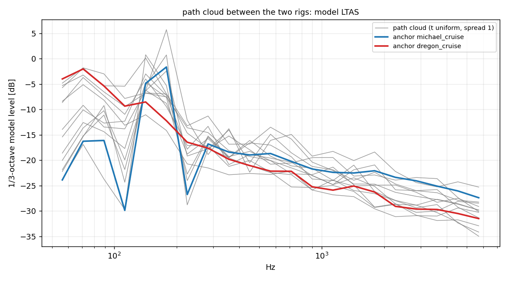{width="100%"}
:::
::: {.column width="62%"}
::: {.small}
The comb trend slope spans -28.6 to -7.9 dB per decade across the twelve path draws.
The two real rigs average -13 and -22 dB per decade.
:::

::: {.content-visible when-format="revealjs"}
```{=html}
<div class="audio-row">
<span><b>t = 0.03</b> <audio controls preload="none" src="../../../docs/explainers/rig-sampler/path_t0p03.wav"></audio></span>
<span><b>t = 0.34</b> <audio controls preload="none" src="../../../docs/explainers/rig-sampler/path_t0p34.wav"></audio></span>
<span><b>t = 0.61</b> <audio controls preload="none" src="../../../docs/explainers/rig-sampler/path_t0p61.wav"></audio></span>
<span><b>t = 0.99</b> <audio controls preload="none" src="../../../docs/explainers/rig-sampler/path_t0p99.wav"></audio></span>
</div>
```
:::

::: {.content-visible when-format="beamer"}
::: {.tiny}
*Audio at $t = 0.03,\ 0.34,\ 0.61,\ 0.99$ plays in the HTML deck.*
:::
:::
:::
::::

## Pending: easy arm {.smaller}

::: {.pending}
[**PENDING**]{.tag} &nbsp; **`rig-easy-dce43e`** — `rig_easy_scv2_unified`, SimpleConv v2, vast A100. Running now; no numbers yet.

Will report: best `real_overall` MAE, and `real_r1` / `real_r2` / `real_r3` MAE.
:::

**Reference rows that already exist**

| Run | Split | MAE (rev/s) |
|:--|:--|--:|
| `rig_fitted_scv2_unified` | best `real_r3` | 9.97 |
| `real_r4_scv2_unified` (trained on real) | best | 2.99 |
| HPPNet L2, historical | all-split PIT | 2.27 |

::: {.small}
The question this arm answers: does training on jittered copies of the two fitted rigs beat training on the fits themselves?
:::

## Pending: hard arm {.smaller}

::: {.pending}
[**PENDING**]{.tag} &nbsp; **`rig-hard-1b2f06`** — `rig_hard_scv2_unified`, SimpleConv v2, vast A100. Running now; no numbers yet.

Will report: best `real_overall` MAE, and `real_r1` / `real_r2` / `real_r3` MAE.
:::

**Reference rows that already exist**

| Run | Split | MAE (rev/s) |
|:--|:--|--:|
| `rig_fitted_scv2_unified` | best `real_r3` | 9.97 |
| `real_r4_scv2_unified` (trained on real) | best | 2.99 |
| HPPNet L2, historical | all-split PIT | 2.27 |

::: {.small}
The question this arm answers: does the wide path cloud of the previous slide generalise better to the real rigs than the narrow clouds do?
:::

## Pending: salience arm {.smaller}

::: {.pending}
[**PENDING**]{.tag} &nbsp; **`rig-easy-hppnet-l2-4fa419`** — `rig_easy_hppnet_l2_unified`, HPPNet L2 salience head, vast A100. Running now; no numbers yet.

Will report: best `real_overall` MAE, and `real_r1` / `real_r2` / `real_r3` MAE.
:::

**Reference rows that already exist**

| Run | Split | MAE (rev/s) |
|:--|:--|--:|
| `rig_fitted_scv2_unified` | best `real_r3` | 9.97 |
| `real_r4_scv2_unified` (trained on real) | best | 2.99 |
| HPPNet L2, historical | all-split PIT | 2.27 |

::: {.small}
The question this arm answers: does the salience head keep its 2.27 advantage when it is trained on synthetic rigs instead of real flights?
:::
